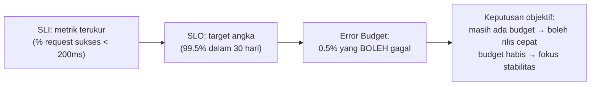

## TL;DR

"Sistem ini harus reliable" adalah kalimat yang terdengar jelas tapi tidak bisa diukur atau disepakati siapa pun secara konkret. **SLI (Service Level Indicator)** adalah metrik terukur yang benar-benar mewakili pengalaman pengguna — misalnya proporsi request yang berhasil dalam 200ms. **SLO (Service Level Objective)** adalah target angka untuk SLI itu yang disepakati sebagai standar "cukup baik" — misalnya "99.5% request berhasil dalam 200ms, diukur dalam jendela 30 hari". SLI dan SLO bersama-sama mengubah kata sifat samar ("reliable", "cepat") menjadi angka yang bisa diukur, dipantau, dan — yang paling penting — dipakai sebagai dasar keputusan objektif tentang kapan harus memperlambat fitur baru dan fokus ke stabilitas, dan kapan boleh terus mengejar kecepatan rilis.

## The Problem

Manajemen salah satu dari 13 aplikasi meminta tim "membuat sistem ini lebih reliable" setelah menerima beberapa keluhan pengguna soal downtime. Tim setuju dan mulai bekerja — tapi setiap orang punya interpretasi berbeda soal apa artinya "reliable" di sini. Sebagian fokus mengurangi downtime total, sebagian fokus mempercepat waktu respons, sebagian menambah redundansi infrastruktur yang mahal tapi belum tentu menjawab keluhan spesifik yang diterima. Tiga bulan kemudian, manajemen bertanya "apakah sistem ini sudah lebih reliable sekarang?" — dan tidak ada satu jawaban jelas, karena tidak pernah ada definisi terukur soal apa yang sebenarnya sedang dikejar sejak awal.

Masalah kedua yang lebih halus: tanpa target yang jelas, tim tidak tahu kapan **berhenti** berinvestasi di reliability dan kembali fokus ke fitur baru. Mengejar "lebih reliable" tanpa batas adalah pengejaran tanpa akhir yang bisa menyerap sumber daya tak terbatas — sementara di titik tertentu, investasi tambahan untuk reliability memberi manfaat yang makin kecil dibanding biaya yang makin besar, dan tanpa target eksplisit, tidak ada cara objektif menentukan titik itu.

## Intuition

Cara paling mudah memahaminya: SLI adalah **termometer**, SLO adalah **suhu target yang disepakati**. "Ruangan ini harus nyaman" adalah kalimat yang tidak bisa diukur atau disepakati semua orang — satu orang menganggap nyaman di 22°C, orang lain di 26°C. "Suhu ruangan harus di antara 22-24°C" (SLO), diukur dari termometer yang benar-benar dipasang (SLI), adalah pernyataan yang bisa diverifikasi objektif — siapa pun bisa melihat termometer dan tahu persis apakah target itu terpenuhi atau tidak, tanpa perdebatan soal perasaan subjektif "nyaman".

Analogi ini bocor pada soal siapa yang menentukan target. Suhu ruangan nyaman relatif personal dan sulit disepakati bersama secara objektif. SLO idealnya **bukan** angka yang ditentukan sepihak oleh tim engineering berdasarkan apa yang terasa dicapai — SLO yang baik disepakati bersama pemangku kepentingan bisnis, mencerminkan tingkat yang benar-benar dibutuhkan pengguna, bukan sekadar "yang paling mudah dicapai tim" atau sebaliknya "sekeras mungkin tanpa mempertimbangkan biayanya".

## How It Works


SLO yang ditetapkan di bawah 100% (jarang ada sistem yang menargetkan 100% sempurna) secara implisit mendefinisikan **error budget** — porsi kegagalan yang secara sadar diterima sebagai wajar. Error budget ini yang jadi dasar keputusan objektif: selama budget masih tersisa, tim boleh mengambil risiko lebih (merilis fitur baru lebih cepat, bereksperimen); begitu budget hampir habis, prioritas bergeser ke stabilitas sampai budget pulih kembali di jendela pengukuran berikutnya.

Perbedaan penting dari sekadar "monitoring biasa": SLI dan SLO dipilih dari sudut pandang **pengguna**, bukan dari sudut pandang teknis internal. "CPU di bawah 80%" bukan SLI yang baik (pengguna tidak peduli angka CPU) — "proporsi request yang berhasil dan cukup cepat" adalah SLI yang baik, karena langsung mencerminkan apa yang benar-benar dirasakan pengguna saat memakai sistem.

## Under The Hood

Memilih SLI yang tepat butuh berpikir dari perjalanan pengguna, bukan dari metrik yang kebetulan mudah diukur. Untuk sistem legal-services, SLI yang relevan mungkin bukan "uptime server" secara umum, tapi lebih spesifik: "proporsi pengajuan permohonan yang berhasil diproses dalam waktu yang wajar" — metrik yang benar-benar mencerminkan apakah tugas yang ingin diselesaikan pengguna (mengajukan permohonan) berhasil, bukan sekadar apakah server merespons apa pun.

Jendela pengukuran (30 hari adalah pilihan umum, tapi bukan aturan mutlak) memengaruhi seberapa cepat error budget pulih dan seberapa sensitif SLO terhadap insiden tunggal — jendela pendek membuat satu insiden besar berdampak besar pada persentase SLO dalam periode itu tapi cepat pulih; jendela panjang meredam dampak insiden tunggal tapi butuh waktu lebih lama untuk "melupakan" insiden lama dari perhitungan. Tidak ada jendela yang benar secara universal — pilihannya bergantung ritme rilis dan operasional organisasi.

## In Go

```go
package slo

import "time"

// SLIWindow menghitung SLI (proporsi sukses) dalam jendela waktu
// tertentu — bahan baku untuk mengevaluasi apakah SLO terpenuhi.
type SLIWindow struct {
	TotalRequests   int64
	SuccessRequests int64
	WindowStart     time.Time
	WindowDuration  time.Duration
}

func (w SLIWindow) CurrentSLI() float64 {
	if w.TotalRequests == 0 {
		return 1.0
	}
	return float64(w.SuccessRequests) / float64(w.TotalRequests)
}

// ErrorBudget menghitung sisa "jatah gagal" berdasarkan SLO yang
// disepakati — inilah angka yang jadi dasar keputusan objektif
// "masih boleh ambil risiko" atau "harus fokus stabilitas dulu".
type ErrorBudget struct {
	SLOTarget float64 // misalnya 0.995 untuk SLO 99.5%
}

func (b ErrorBudget) Remaining(current SLIWindow) float64 {
	allowedFailureRate := 1 - b.SLOTarget
	actualFailureRate := 1 - current.CurrentSLI()

	if actualFailureRate >= allowedFailureRate {
		return 0 // budget habis
	}
	return (allowedFailureRate - actualFailureRate) / allowedFailureRate
}

func (b ErrorBudget) IsExhausted(current SLIWindow) bool {
	return b.Remaining(current) <= 0
}
```

## In His Stack

Untuk 13 aplikasi, SLO paling bernilai dimulai dari satu-dua aplikasi paling kritis (yang menangani proses hukum aktif, bukan seluruhnya sekaligus), dengan SLI yang benar-benar dipilih dari perjalanan pengguna spesifik aplikasi itu — bukan menyalin angka SLO generik dari industri tanpa mempertimbangkan konteks. Menyepakati SLO bersama pemangku kepentingan non-teknis (bukan ditentukan sepihak oleh tim engineering) penting justru karena SLO yang baik menjawab pertanyaan bisnis "seberapa reliable yang benar-benar dibutuhkan", bukan sekadar "seberapa reliable yang bisa dicapai tim dengan sumber daya sekarang".

## Trade-offs and When Not To Use It

Menetapkan dan memantau SLO butuh instrumentasi yang matang (SLI harus benar-benar terukur akurat) dan proses organisasi untuk menyepakati target bersama pemangku kepentingan — investasi yang tidak sepadan untuk sistem eksperimental atau internal kecil yang konsekuensi downtime-nya rendah. SLO bernilai jelas untuk sistem production yang dipakai luas, di mana keputusan trade-off antara kecepatan rilis dan stabilitas butuh dasar objektif, bukan perdebatan subjektif setiap kali insiden terjadi.

## Common Mistakes

> [!warning] Jebakan
> Memilih SLI berdasarkan metrik teknis yang mudah diukur (CPU, memori) alih-alih metrik yang benar-benar mencerminkan pengalaman pengguna — SLO yang dibangun di atas SLI yang salah bisa terpenuhi sempurna sementara pengguna tetap mengalami masalah nyata.

> [!warning] Jebakan
> Menetapkan SLO 100% (tanpa toleransi kegagalan sama sekali) — secara implisit menghilangkan error budget, memaksa tim menghindari risiko apa pun (termasuk rilis fitur baru) demi menjaga angka yang secara realistis nyaris mustahil dipertahankan selamanya.

> [!warning] Jebakan
> Menetapkan SLO sepihak oleh tim engineering tanpa melibatkan pemangku kepentingan bisnis — SLO yang tidak disepakati bersama kehilangan fungsinya sebagai dasar keputusan objektif, karena pihak lain tidak merasa terikat pada angka yang tidak pernah mereka setujui.

## Exercises

1. Jelaskan perbedaan SLI dan SLO, dan bagaimana keduanya bersama-sama menghasilkan error budget.
2. Kenapa SLI sebaiknya dipilih dari sudut pandang pengguna, bukan dari metrik teknis internal?
3. Kenapa SLO 100% (tanpa toleransi kegagalan) justru bermasalah, bukan ideal?
4. Desain terbuka: manajemen salah satu dari 13 aplikasimu meminta sistem "lebih reliable" setelah menerima keluhan pengguna soal pengajuan permohonan yang sering gagal atau lambat. Rancang SLI dan SLO konkret untuk aplikasi ini, termasuk bagaimana kamu akan menyepakatinya dengan manajemen dan bagaimana error budget yang dihasilkan akan memengaruhi keputusan rilis fitur baru ke depan.

> [!success]- Kunci jawaban
> **1.** SLI adalah metrik terukur yang mewakili pengalaman pengguna (misalnya proporsi request sukses dalam waktu tertentu). SLO adalah target angka untuk SLI itu yang disepakati sebagai standar cukup baik. Selisih antara SLO dan 100% adalah error budget — porsi kegagalan yang secara sadar diterima sebagai wajar dalam jendela pengukuran yang disepakati.
> **4.** SLI: proporsi pengajuan permohonan yang berhasil diproses (bukan gagal karena error sistem) dalam waktu wajar (misalnya di bawah 5 detik dari klik submit sampai konfirmasi diterima), diukur dari log/metrik alur pengajuan permohonan spesifik, bukan uptime server secara umum. SLO: disepakati lewat diskusi dengan manajemen berdasarkan data historis (berapa proporsi keberhasilan yang sudah tercapai sekarang, dan seberapa realistis peningkatan yang diminta) — misalnya menyepakati target 99% berhasil dalam waktu wajar, diukur dalam jendela 30 hari. Error budget yang dihasilkan (1%) jadi dasar keputusan: selama budget masih tersisa dalam periode berjalan, tim boleh melanjutkan rilis fitur baru dengan ritme normal; begitu budget mendekati habis (insiden yang mengonsumsi banyak error budget dalam waktu singkat), tim dan manajemen sepakat memprioritaskan perbaikan stabilitas sebelum melanjutkan fitur baru — keputusan yang didasarkan angka objektif, bukan perdebatan subjektif setiap kali insiden terjadi.

## Self-Check

- Apa perbedaan SLI dan SLO?
- Apa itu error budget, dan bagaimana ia dihasilkan dari SLO?
- Kenapa SLI sebaiknya mencerminkan pengalaman pengguna, bukan metrik teknis internal?
- Kenapa SLO sebaiknya disepakati bersama pemangku kepentingan bisnis, bukan ditentukan sepihak tim engineering?

## Connected Notes

- [[Alerts That Do Not Cause Fatigue]] — alert yang paling bernilai dipicu berdasarkan pelanggaran SLO, bukan sembarang metrik teknis, dibahas di note sebelumnya.
- [[Metrics - The RED and USE Methods]] — SLI sering diturunkan langsung dari metrik RED (error rate, latency) yang dibahas lebih awal di klaster ini.
- [[../60 Distributed Systems/_Overview|Distributed Systems Overview]] — error budget dan SLO adalah fondasi langsung untuk reliability engineering senior (error budget policy, incident command) yang dibahas lebih dalam di domain itu.
- [[../90 Architecture and Design/Managing Technical Debt Explicitly|Managing Technical Debt Explicitly]] — error budget adalah salah satu cara paling objektif menyeimbangkan kecepatan fitur baru dan investasi stabilitas.
- [[../94 Case Studies/_Overview|Case Studies Overview]] — banyak skenario kegagalan sistem di case study domain itu bisa dianalisis lewat kacamata SLI/SLO yang dibahas di note ini.

## Further Reading

- Materi umum industri mengenai Site Reliability Engineering (SRE), khususnya konsep SLI, SLO, dan error budget yang dipopulerkan luas dalam literatur SRE.

## Catatan Saya

*Tulis di sini apakah salah satu dari 13 aplikasimu punya SLO yang benar-benar disepakati dengan manajemen, atau "reliable" masih jadi kata sifat samar yang belum pernah diukur.*
