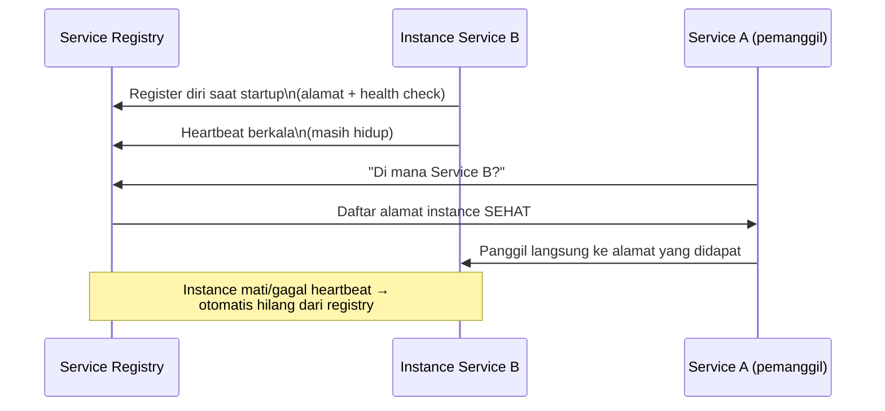

## TL;DR

Service discovery adalah mekanisme yang menjawab pertanyaan "di alamat mana service B berjalan **sekarang**?" tanpa jawaban itu di-hardcode di kode service A — penting karena di lingkungan container modern, alamat IP sebuah instance service berubah setiap kali instance itu diganti (deploy baru, restart, autoscaling menambah atau mengurangi replika). Service di [[Kubernetes Core Concepts - Pods, Deployments, Services, Ingress]] adalah satu bentuk service discovery (lewat DNS internal cluster dan label selector); di luar Kubernetes, atau untuk kebutuhan yang lebih kaya (kesehatan instance, metadata tambahan), tool khusus seperti Consul mengambil peran yang sama.

## The Problem

Sebuah aplikasi memanggil service pembayaran internal lewat alamat IP yang di-hardcode di file konfigurasi: `10.0.4.17:8080`. Ini bekerja baik-baik saja sampai suatu hari tim infrastruktur melakukan migrasi VM, dan instance service pembayaran itu dipindahkan ke mesin baru dengan IP berbeda. Semua aplikasi yang men-hardcode IP lama langsung gagal terhubung — bukan karena service pembayaran itu sendiri bermasalah (ia berjalan sempurna di alamat barunya), tapi karena tidak ada satu pun mekanisme yang memberi tahu pemanggilnya bahwa alamatnya sudah berubah.

Masalah ini menjadi jauh lebih parah begitu jumlah instance sebuah service lebih dari satu (untuk load balancing atau redundansi) dan berubah-ubah secara dinamis (autoscaling menambah/mengurangi instance mengikuti beban) — IP mana pun yang di-hardcode akan segera menjadi usang, dan tidak ada cara realistis memperbarui konfigurasi setiap aplikasi pemanggil secara manual setiap kali topologi service berubah, yang di lingkungan container modern bisa terjadi berkali-kali sehari.

## Intuition

Cara paling mudah memahaminya: service discovery seperti **direktori telepon yang selalu diperbarui otomatis**, dibanding menghafal nomor telepon orang tertentu. Kamu tidak menghafal "nomor telepon dokter gigi adalah 021-xxx" — kamu mencari "dokter gigi" di direktori, dan direktori itu memberi nomor yang **berlaku sekarang**, meski dokter gigi itu sudah pindah praktik tiga kali dalam setahun terakhir. Yang kamu hafal adalah **nama layanannya**, bukan alamat fisiknya yang bisa berubah kapan saja.

Analogi ini bocor pada soal seberapa sering direktori itu perlu diperbarui dan seberapa cepat perubahannya harus terlihat. Direktori telepon fisik diperbarui berbulan-bulan sekali dan itu wajar. Service discovery di lingkungan container harus mencerminkan perubahan topologi **dalam hitungan detik** — instance yang baru saja mati harus segera hilang dari direktori, atau pemanggil akan terus mencoba menghubungi alamat yang sudah tidak ada.

## How It Works


Dua bagian yang saling menopang: **registration** (instance memberi tahu registry bahwa ia ada dan sehat) dan **discovery** (pemanggil bertanya ke registry, bukan menyimpan alamat statis sendiri). Kalau salah satu bagian ini hilang — instance tidak pernah registrasi, atau pemanggil tetap men-hardcode alamat — seluruh manfaat service discovery hilang, kembali ke masalah "The Problem".

Di Kubernetes, pola ini terjadi otomatis lewat kombinasi Service dan DNS internal cluster: memanggil `payment-service.namespace.svc.cluster.local` menyelesaikan nama itu ke alamat Service (yang stabil), dan Service itu sendiri secara internal melacak Pod mana yang sehat lewat label selector dan readiness probe — pemanggil tidak pernah perlu tahu IP Pod individual sama sekali.

## Under The Hood

Ada dua model utama service discovery. **Client-side discovery**: pemanggil sendiri yang query registry dan memilih instance mana yang dipanggil (butuh library klien yang tahu cara bicara dengan registry, dan logika load balancing ada di sisi pemanggil). **Server-side discovery**: pemanggil memanggil satu alamat stabil (seperti Service Kubernetes), dan komponen di baliknyalah (proxy, load balancer) yang tahu cara meneruskan ke instance yang tepat — pemanggil tidak perlu tahu apa pun tentang registry sama sekali. Kubernetes Service memakai pola server-side; Consul mendukung keduanya tergantung bagaimana ia diintegrasikan.

Detail yang sering luput: registry harus punya cara mendeteksi instance yang mati **tanpa** menunggu instance itu memberi tahu secara eksplisit (instance yang crash tidak sempat bilang "saya mati") — inilah kenapa heartbeat berkala dan health check aktif dari registry sama pentingnya dengan registrasi awal. Instance yang berhenti mengirim heartbeat, atau gagal health check berturut-turut, dianggap mati dan dihapus dari daftar yang diberikan ke pemanggil, meski instance itu sendiri tidak pernah "mendaftarkan diri keluar" secara eksplisit.

## In Go

```go
package discovery

import (
	"context"
	"fmt"
)

// Instance merepresentasikan satu instance service yang terdaftar.
type Instance struct {
	Address string
	Healthy bool
}

// Registry adalah interface generik — implementasi nyata bisa
// berupa client Consul, atau (di Kubernetes) sesederhana resolusi
// DNS bawaan yang sudah otomatis mengarah ke Service.
type Registry interface {
	Lookup(ctx context.Context, serviceName string) ([]Instance, error)
}

// CallService TIDAK PERNAH menyimpan alamat statis — setiap
// pemanggilan mencari ulang alamat TERKINI, memastikan instance
// yang sudah mati atau baru dibuat selalu tercermin akurat.
func CallService(ctx context.Context, reg Registry, serviceName string) (string, error) {
	instances, err := reg.Lookup(ctx, serviceName)
	if err != nil {
		return "", fmt.Errorf("discovery: lookup %s: %w", serviceName, err)
	}

	for _, inst := range instances {
		if inst.Healthy {
			return inst.Address, nil // strategi load balancing sederhana: pilih yang pertama sehat
		}
	}
	return "", fmt.Errorf("discovery: tidak ada instance sehat untuk %s", serviceName)
}
```

## In His Stack

Untuk service yang seluruhnya berjalan di dalam satu cluster Kubernetes, DNS internal dan Service sudah cukup — tidak perlu tool service discovery terpisah seperti Consul. Consul (lihat [[../92 Tools/Consul|Consul]]) jadi relevan begitu topologinya lebih rumit: service yang berjalan **di luar** Kubernetes (VM legacy yang belum bermigrasi) tapi perlu ditemukan oleh service yang **sudah** di Kubernetes, atau sebaliknya — situasi transisi yang realistis untuk 13 aplikasi yang bermigrasi bertahap, bukan sekaligus.

## Trade-offs and When Not To Use It

Untuk sistem kecil dengan jumlah service yang sedikit dan topologi yang jarang berubah, service discovery penuh (registry terpisah, heartbeat, health check aktif) adalah kompleksitas yang tidak sepadan — konfigurasi statis yang diperbarui manual sesekali sudah cukup dan lebih mudah dipahami. Service discovery bernilai jelas begitu jumlah instance dan frekuensi perubahan topologi (deploy, autoscaling, migrasi) sudah melampaui kemampuan manusia memperbarui konfigurasi statis secara manual dan tepat waktu.

## Common Mistakes

> [!warning] Jebakan
> Meng-hardcode alamat IP atau hostname service internal di konfigurasi, alih-alih memakai nama service yang di-resolve lewat mekanisme discovery — persis kesalahan di "The Problem", yang membuat setiap perubahan topologi jadi insiden manual.

> [!warning] Jebakan
> Mengandalkan registrasi eksplisit instance yang mati untuk menghapus dirinya dari registry, tanpa heartbeat atau health check aktif — instance yang crash tidak sempat "keluar" secara sopan, dan tanpa deteksi aktif, registry akan terus menawarkan alamat yang sudah tidak hidup ke pemanggil.

> [!warning] Jebakan
> Melakukan caching hasil lookup service discovery terlalu lama di sisi pemanggil — cache yang tidak pernah kedaluwarsa membuat pemanggil tetap memakai alamat lama meski registry sudah tahu instance itu sudah tidak sehat.

## Exercises

1. Jelaskan dua bagian yang saling menopang dalam service discovery: registration dan discovery.
2. Apa perbedaan client-side discovery dan server-side discovery?
3. Kenapa registry butuh heartbeat atau health check aktif, tidak bisa hanya mengandalkan instance mendaftarkan diri keluar saat mati?
4. Desain terbuka: 13 aplikasimu sedang dalam masa transisi — sebagian sudah berjalan di Kubernetes, sebagian masih di VM lama, dan keduanya kadang perlu saling memanggil selama masa migrasi bertahap ini. Rancang strategi service discovery yang menjembatani kedua lingkungan ini tanpa memaksa migrasi seluruhnya sekaligus.

> [!success]- Kunci jawaban
> **1.** Registration adalah instance memberi tahu registry bahwa dirinya ada dan sehat, biasanya saat startup plus heartbeat berkala. Discovery adalah pemanggil bertanya ke registry untuk mendapat alamat instance yang sehat saat ini, alih-alih menyimpan alamat statis sendiri. Keduanya harus ada bersamaan — registry tanpa registration tidak tahu apa-apa, dan pemanggil yang tidak melakukan discovery tetap rentan memakai alamat usang.
> **4.** Pasang registry terpusat (Consul) yang bisa diakses baik dari VM lama maupun dari cluster Kubernetes. Untuk service di VM lama: pasang agent Consul di setiap VM yang melakukan registrasi otomatis. Untuk service di Kubernetes: integrasikan Consul dengan cluster (lewat Consul Connect atau sinkronisasi dengan Service Kubernetes) supaya Pod juga terdaftar ke registry yang sama. Selama masa transisi, service di kedua sisi melakukan lookup ke Consul yang sama untuk saling menemukan, alih-alih hardcode alamat — begitu sebuah aplikasi selesai bermigrasi penuh ke Kubernetes, ia bisa beralih memakai DNS internal Kubernetes untuk pemanggilan sesama service di cluster, sambil tetap memakai Consul untuk memanggil (atau dipanggil) service yang masih di VM lama, sampai migrasi keseluruhan selesai.

## Self-Check

- Apa dua bagian yang saling menopang dalam service discovery?
- Apa perbedaan client-side dan server-side discovery?
- Kenapa heartbeat/health check aktif dibutuhkan, bukan hanya registrasi awal?
- Kapan service discovery penuh adalah overhead yang tidak sepadan?

## Connected Notes

- [[Kubernetes Core Concepts - Pods, Deployments, Services, Ingress]] — Service dan DNS internal cluster adalah bentuk service discovery bawaan Kubernetes.
- [[Kubernetes Config, Secrets, Probes, and Autoscaling]] — readiness probe di note itu adalah salah satu sinyal yang dipakai menentukan instance mana yang "sehat" dan layak ditawarkan lewat service discovery.
- [[../80 Security/Zero Trust|Zero Trust]] — service discovery menjawab "di mana", bukan "apakah boleh" — otorisasi tetap butuh lapisan verifikasi terpisah yang dibahas di note itu.
- [[The Three Pillars of Observability]] — kelanjutan langsung: begitu topologi service dinamis dan sulit dilacak manual, observability jadi kebutuhan untuk memahami apa yang sebenarnya terjadi di dalamnya.
- [[../92 Tools/Consul|Consul]] — tool konkret yang mengimplementasikan service discovery yang dibahas di note ini, di luar mekanisme bawaan Kubernetes.

## Further Reading

- Dokumentasi resmi Kubernetes bagian "DNS for Services and Pods", dan dokumentasi resmi Consul bagian "Service Discovery".

## Catatan Saya

*Tulis di sini apakah ada alamat IP service internal yang masih di-hardcode di salah satu dari 13 aplikasimu, dan risiko konkret kalau topologinya berubah.*
