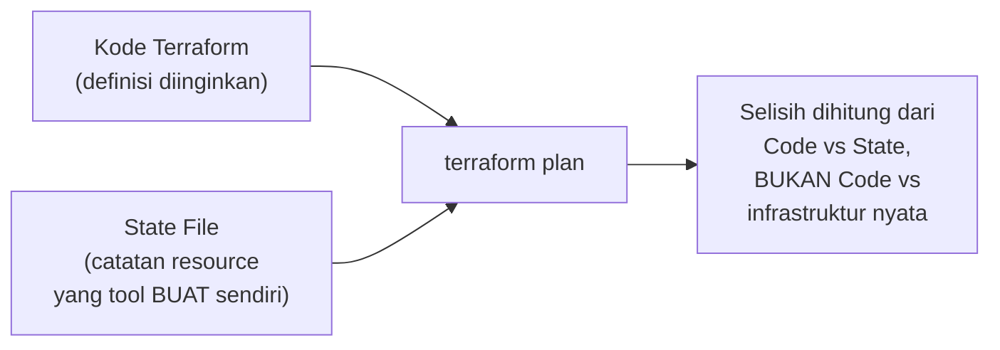

## TL;DR

Tool declarative seperti Terraform butuh cara mengetahui resource mana yang sudah ia buat sebelumnya, supaya bisa menghitung selisih dengan definisi terbaru — jawabannya adalah **state file**, catatan yang memetakan definisi di kode ke resource nyata yang ada di infrastruktur (ID VM tertentu, ID subnet tertentu). **Drift** terjadi ketika keadaan nyata infrastruktur menyimpang dari apa yang tercatat di state file — biasanya karena seseorang mengubah resource itu secara manual di luar tool, tanpa lewat definisi kode. Drift berbahaya justru karena reconciliation (lihat [[Desired-State Reconciliation]]) menghitung selisih berdasarkan **state file**, bukan berdasarkan pemeriksaan langsung ke infrastruktur nyata setiap saat — kalau state file sendiri sudah tidak akurat, seluruh perhitungan selisihnya ikut salah.

## The Problem

Sebuah tim memakai Terraform untuk mengelola infrastruktur cloud 13 aplikasi. Suatu hari, seorang engineer yang terburu-buru menyelesaikan insiden production menambah rule firewall langsung lewat console cloud (bukan lewat kode Terraform), untuk membuka akses darurat yang dibutuhkan segera. Insiden selesai, dan rule itu terlupakan — tidak pernah ditambahkan ke kode Terraform.

Dua minggu kemudian, seseorang lain menjalankan `terraform apply` untuk perubahan yang sama sekali tidak berkaitan (menambah satu instance baru). Terraform, yang tidak tahu apa-apa tentang rule firewall darurat itu (karena rule itu tidak pernah tercatat di state file-nya), menghitung ulang seluruh konfigurasi firewall berdasarkan definisi kode yang ada — dan menghapus rule darurat itu tanpa peringatan, karena dari sudut pandang Terraform, rule yang tidak ada di kode berarti rule yang seharusnya tidak ada. Akses darurat yang masih dibutuhkan tim lain hilang begitu saja, di waktu yang tidak terduga, oleh perubahan yang niatnya sama sekali tidak berkaitan.

## Intuition

Cara paling mudah memahaminya: state file seperti **peta harta karun yang digambar sendiri oleh tool ini** — setiap kali tool ini membuat sesuatu, ia mencatat lokasi persisnya di peta itu. Masalah muncul kalau ada orang lain yang menggali dan memindahkan harta karun itu tanpa memberi tahu pembuat peta — peta itu sekarang menyimpan lokasi yang **salah**, tapi peta itu sendiri tidak tahu dirinya sudah salah, dan siapa pun yang mempercayainya sepenuhnya untuk operasi berikutnya akan mengambil keputusan berdasarkan informasi yang sudah usang.

Analogi ini bocor pada soal siapa yang bisa memperbaikinya. Peta harta karun fisik yang salah tetap salah sampai digambar ulang manual. State file infrastruktur modern punya mekanisme (`terraform refresh` dan sejenisnya) untuk **membaca ulang keadaan nyata** dan memperbarui state file supaya cocok kembali — bukan menunggu manusia menyadari dan menggambar ulang manual dari nol, meski proses "menggambar ulang" otomatis ini juga tidak bebas risiko, seperti dibahas di bawah.

## How It Works


Titik krusial ada di diagram ini: `plan` menghitung selisih antara kode dan **state file**, bukan antara kode dan infrastruktur nyata secara langsung. Kalau state file akurat, ini setara dengan membandingkan kode dan kenyataan. Kalau state file sudah drift dari kenyataan (karena perubahan manual di luar tool), selisih yang dihitung menjadi tidak akurat — dan eksekusi berdasarkan selisih yang salah itu bisa menghapus atau mengubah sesuatu yang sebenarnya tidak seharusnya disentuh.

Drift punya dua arah yang sama-sama berbahaya: **infrastruktur yang berubah manual tanpa tercatat di kode** (kasus di "The Problem"), dan **kode yang berubah tapi belum pernah di-`apply`** (definisi baru yang sudah ditulis dan di-commit, tapi belum pernah dijalankan, sehingga infrastruktur nyata masih memakai definisi lama). Keduanya sama-sama berarti kode dan kenyataan tidak lagi mencerminkan satu sama lain — sumber kebenaran yang seharusnya tunggal jadi bercabang dua.

## Under The Hood

Perintah seperti `terraform refresh` mengatasi drift dengan cara membaca ulang keadaan nyata dari provider infrastruktur (API cloud) dan memperbarui state file supaya cocok — tapi ini **hanya memperbaiki state file**, tidak memperbaiki selisih antara kode dan kenyataan. Kalau rule firewall darurat di "The Problem" itu di-refresh ke dalam state file tanpa juga ditambahkan ke **kode**, `apply` berikutnya akan tetap menghapusnya, karena kode tetap tidak menyebutkan rule itu — refresh hanya membuat Terraform "sadar" rule itu ada sekarang, bukan membuatnya "setuju" rule itu boleh tetap ada.

Praktik yang mencegah drift terjadi sejak awal lebih murah dibanding mendeteksi dan memperbaikinya belakangan: **melarang perubahan manual sama sekali** ke resource yang dikelola tool declarative (lewat kontrol akses yang membatasi siapa yang bisa mengubah infrastruktur langsung lewat console, memaksa semua perubahan lewat kode dan pipeline yang sama seperti [[CI-CD Pipelines]]) adalah pendekatan yang jauh lebih andal dibanding mengandalkan disiplin manusia mengingat untuk selalu menyinkronkan perubahan manual ke kode.

## In Go

```go
package driftcheck

import (
	"context"
	"fmt"
)

// Resource merepresentasikan satu resource, baik yang tercatat di
// state file maupun yang benar-benar ada di infrastruktur nyata.
type Resource struct {
	ID         string
	Attributes map[string]string
}

// DetectDrift membandingkan catatan state file dengan keadaan NYATA
// yang dibaca langsung dari provider — mensimulasikan apa yang
// dilakukan `terraform plan -refresh-only`.
func DetectDrift(ctx context.Context, stateRecord, actualState Resource) []string {
	var drifted []string

	for key, stateVal := range stateRecord.Attributes {
		actualVal, exists := actualState.Attributes[key]
		if !exists {
			drifted = append(drifted, fmt.Sprintf("%s: ada di state, TIDAK ADA di infrastruktur nyata", key))
			continue
		}
		if actualVal != stateVal {
			drifted = append(drifted, fmt.Sprintf("%s: state=%q, nyata=%q", key, stateVal, actualVal))
		}
	}

	for key := range actualState.Attributes {
		if _, exists := stateRecord.Attributes[key]; !exists {
			drifted = append(drifted, fmt.Sprintf("%s: ADA di infrastruktur nyata, tidak tercatat di state", key))
		}
	}

	return drifted
}
```

## In His Stack

Untuk 13 aplikasi yang infrastrukturnya mulai dikelola Terraform, kebiasaan lama "perbaiki cepat lewat console saat insiden" adalah sumber drift paling umum dan paling berbahaya — bukan karena perubahan darurat itu salah dilakukan (kadang memang harus cepat, tidak ada waktu menunggu pipeline), tapi karena perubahan darurat itu **jarang dibawa balik ke kode** setelah insiden selesai. Praktik yang realistis: setiap perubahan darurat manual dicatat eksplisit (di tiket insiden, di channel komunikasi tim) sebagai item tindak lanjut wajib "bawa perubahan ini ke kode Terraform", bukan dianggap selesai begitu insiden mereda.

## Trade-offs and When Not To Use It

State file menambah satu lapisan yang harus dikelola dan diamankan sendiri — state file yang hilang (tidak di-backup, tersimpan hanya di laptop satu orang) berarti tool declarative kehilangan seluruh ingatannya tentang resource yang pernah ia buat, dan pemulihannya butuh usaha manual yang signifikan (impor ulang resource satu per satu). Untuk infrastruktur yang sangat kecil dan jarang berubah (satu-dua resource sederhana), overhead mengelola state file dengan benar (remote state, locking untuk mencegah dua orang menjalankan `apply` bersamaan) bisa terasa berlebihan — tapi begitu jumlah resource dan jumlah orang yang mengelolanya bertambah, disiplin ini menjadi jauh lebih murah dibanding biaya insiden akibat state yang rusak atau konflik.

## Common Mistakes

> [!warning] Jebakan
> Mengubah resource yang dikelola tool declarative secara manual lewat console, dengan asumsi "nanti akan disinkronkan ke kode" — perubahan itu sering terlupakan, dan `apply` berikutnya akan menghapusnya tanpa peringatan karena kode tidak pernah tahu perubahan itu ada.

> [!warning] Jebakan
> Menyimpan state file secara lokal (di laptop satu orang) alih-alih di penyimpanan bersama (remote state) — state file yang hilang berarti kehilangan seluruh pemetaan antara kode dan resource nyata, dan pemulihannya jauh lebih mahal dibanding mencegahnya sejak awal.

> [!warning] Jebakan
> Menjalankan `refresh` untuk menyinkronkan state file dengan kenyataan, lalu menganggap masalah selesai tanpa juga memperbarui kode — refresh hanya membuat Terraform "sadar" akan perubahan manual, bukan "menyetujuinya"; `apply` berikutnya tetap akan menutup selisih itu sesuai kode, yang berarti menghapus perubahan manual yang belum ditambahkan ke kode.

## Exercises

1. Jelaskan kenapa selisih yang dihitung tool declarative bergantung pada state file, bukan pemeriksaan langsung ke infrastruktur nyata setiap saat.
2. Sebutkan dua arah drift yang bisa terjadi, dan kenapa keduanya sama-sama bermasalah.
3. Kenapa menjalankan `refresh` saja tidak cukup untuk benar-benar menyelesaikan drift?
4. Desain terbuka: tim kamu baru menyadari ada beberapa resource cloud (subnet, security group) yang dibuat manual bertahun-tahun lalu, sebelum Terraform dipakai, dan sekarang ingin membawa seluruh infrastruktur di bawah pengelolaan Terraform tanpa menghancurkan resource yang sudah berjalan production. Rancang langkah-langkahnya.

> [!success]- Kunci jawaban
> **1.** Membandingkan kode langsung dengan infrastruktur nyata setiap kali `plan`/`apply` dijalankan akan sangat lambat dan mahal (memanggil API provider untuk setiap resource, setiap kali). State file berfungsi sebagai cache lokal dari keadaan yang **tool ini sendiri ketahui** — jauh lebih cepat dibaca, tapi mengorbankan akurasi kalau ada perubahan di luar tool yang tidak tercatat di sana.
> **4.** (1) Untuk setiap resource yang sudah ada tapi belum dikelola Terraform, tulis dulu definisi kodenya yang **mendeskripsikan persis** konfigurasi resource itu sekarang (bukan konfigurasi yang diinginkan berubah — ini langkah "mengadopsi", bukan "mengubah"); (2) gunakan perintah impor (`terraform import` atau sejenisnya) untuk menautkan resource nyata itu ke dalam state file, tanpa membuat ulang atau mengubah apa pun di infrastruktur; (3) jalankan `plan` setelah impor dan pastikan hasilnya "tidak ada perubahan" — kalau plan menunjukkan Terraform ingin mengubah sesuatu, berarti definisi kode di langkah 1 belum persis cocok dengan konfigurasi nyata, dan harus diperbaiki dulu sebelum lanjut; (4) baru setelah seluruh resource lama teradopsi dengan aman (plan bersih, tidak ada perubahan tak terduga), perubahan konfigurasi berikutnya bisa mulai dilakukan lewat kode seperti biasa.

## Self-Check

- Kenapa tool declarative menghitung selisih dari state file, bukan langsung dari infrastruktur nyata?
- Sebutkan dua arah drift yang mungkin terjadi.
- Kenapa `refresh` saja tidak cukup menyelesaikan drift sepenuhnya?
- Apa risiko menyimpan state file hanya secara lokal?

## Connected Notes

- [[Desired-State Reconciliation]] — state file adalah catatan yang dipakai reconciliation loop untuk menghitung selisih antara desired state dan current state.
- [[Declarative vs Imperative Infrastructure]] — drift adalah risiko khas pendekatan declarative yang tidak muncul dengan cara yang sama pada pendekatan imperative murni.
- [[CI-CD Pipelines]] — memaksa seluruh perubahan infrastruktur lewat pipeline (bukan console manual) adalah pencegahan drift yang paling efektif.
- [[Immutable Infrastructure vs Configuration Management]] — kelanjutan langsung: filosofi yang menghindari drift dengan cara berbeda, mengganti seluruh resource alih-alih memperbaikinya di tempat.
- [[../92 Tools/Terraform|Terraform]] — tool konkret yang mengimplementasikan state file dan mekanisme deteksi drift yang dibahas di note ini.

## Further Reading

- Dokumentasi resmi Terraform bagian "State" dan "Import" — sumber kebenaran untuk detail mekanisme state file dan cara mengadopsi resource yang sudah ada.

## Catatan Saya

*Tulis di sini kalau kamu pernah menemukan drift di infrastruktur pekerjaanmu, bagaimana kamu menemukannya, dan apa yang menyebabkannya.*
