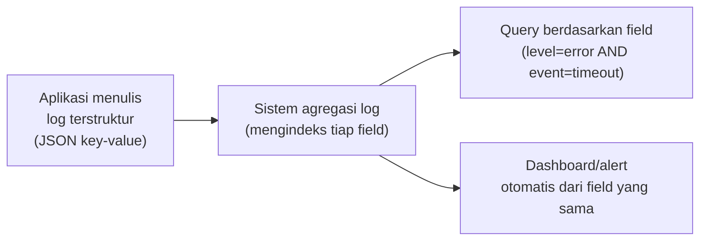

## TL;DR

Structured logging berarti menulis log sebagai data berbentuk key-value (biasanya JSON), bukan kalimat bebas — `level=error msg="gagal koneksi database" user_id=123 latency_ms=450` alih-alih `"Error: gagal koneksi database untuk user 123 setelah 450ms"`. Bentuk pertama bisa di-query, difilter, dan diagregasi oleh mesin secara langsung; bentuk kedua hanya bisa dibaca manusia satu per satu atau dicari lewat pencarian teks yang rapuh. Log level (`debug`, `info`, `warn`, `error`) memberi cara memfilter volume log berdasarkan urgensi, dan memilih level yang tepat untuk setiap baris log adalah keputusan yang lebih penting dari yang terlihat — level yang salah bisa membanjiri sistem log dengan noise, atau menyembunyikan sinyal penting di tengah banjir log level rendah.

## The Problem

Sebuah tim ingin tahu berapa banyak request yang gagal karena timeout ke API partner dalam sejam terakhir, untuk menjawab pertanyaan dari partner yang komplain layanannya "sering tidak direspons". Log aplikasi mereka berbentuk kalimat bebas: `"Gagal memanggil partner API, timeout setelah 30 detik untuk request ID abc123"`. Untuk menjawab pertanyaan ini, seseorang harus menulis regex pencarian teks yang mencocokkan variasi kalimat serupa (yang, ternyata, ditulis sedikit berbeda-beda oleh developer berbeda di titik kode berbeda — beberapa bilang "gagal memanggil", beberapa "request ke partner gagal", beberapa lupa mencantumkan kata "timeout" sama sekali), lalu menghitung manual dari hasil pencarian yang tidak lengkap itu.

Kalau log itu ditulis terstruktur sejak awal — `level=error event=partner_api_timeout partner=xyz duration_ms=30000` — pertanyaan yang sama dijawab dalam hitungan detik lewat query sederhana yang memfilter `event=partner_api_timeout` dan menghitung barisnya, tanpa bergantung pada konsistensi kalimat yang ditulis manusia berbeda-beda di titik kode berbeda-beda.

## Intuition

Cara paling mudah memahaminya: log kalimat bebas seperti **catatan harian yang ditulis bebas di buku tulis** — bisa dibaca manusia dengan mudah satu per satu, tapi mencari "berapa kali saya menyebut kata X bulan lalu" berarti membaca ulang seluruh buku. Log terstruktur seperti **entri di spreadsheet dengan kolom tetap** — setiap baris punya field yang sama (tanggal, kategori, nilai), dan mencari atau menghitung berdasarkan kolom tertentu adalah operasi yang trivial, karena bentuknya sudah predictable sejak awal.

Analogi ini bocor pada soal siapa yang membaca. Buku harian dan spreadsheet sama-sama dibaca manusia. Log **sebagian besar dibaca mesin** — sistem agregasi log, dashboard, alert — sebelum (kadang tanpa pernah) dibaca manusia langsung. Bentuk yang optimal untuk mesin membaca (terstruktur, predictable) berbeda dari bentuk yang terasa paling natural ditulis manusia (kalimat bebas), dan structured logging sengaja mengorbankan sedikit dari yang kedua demi jauh lebih banyak dari yang pertama.

## How It Works


Setiap field terstruktur yang ditulis konsisten menjadi sesuatu yang bisa difilter, dihitung, dan divisualisasikan tanpa parsing tambahan — sebaliknya, kalimat bebas butuh parsing (regex, NLP sederhana) yang rapuh dan mudah pecah begitu format kalimat berubah sedikit.

Log level memberi mekanisme kontrol volume: `debug` untuk detail yang hanya relevan saat aktif men-debug sesuatu (biasanya dimatikan di production karena volumenya besar), `info` untuk peristiwa normal yang berguna untuk audit alur (request masuk, proses selesai), `warn` untuk sesuatu yang tidak seharusnya terjadi tapi sistem masih bisa lanjut (retry berhasil setelah percobaan pertama gagal), `error` untuk kegagalan yang butuh perhatian (request gagal total). Level yang dikonfigurasi di production biasanya `info` ke atas — `debug` dimatikan bukan karena tidak berguna, tapi karena volumenya bisa membanjiri sistem log dan biaya penyimpanannya kalau dibiarkan aktif terus-menerus.

## Under The Hood

Konsistensi nama field antar seluruh codebase adalah nilai structured logging yang sesungguhnya, dan ini butuh disiplin, bukan otomatis didapat dari sekadar memakai library logging terstruktur. Kalau satu bagian kode menulis `user_id` dan bagian lain menulis `userId` atau `uid` untuk konsep yang sama, query yang memfilter berdasarkan field itu harus tahu ketiga variasi itu — kembali ke masalah fragmentasi yang sama seperti kalimat bebas, hanya bentuknya berbeda. Praktik yang membantu: mendefinisikan daftar nama field standar (dan tipe datanya) yang dipakai seluruh tim, mirip [[../90 Architecture and Design/API Governance|API Governance]] tapi untuk kosakata logging.

Level log yang dipilih untuk sebuah baris kode juga bukan keputusan sekali tulis selamanya — kesalahan yang **diperkirakan terjadi secara rutin dan sudah ditangani** (misalnya retry yang berhasil di percobaan kedua) sebaiknya `warn`, bukan `error`, supaya `error` tetap berarti "sesuatu yang benar-benar butuh perhatian manusia" — begitu `error` dipakai untuk segala sesuatu yang "kurang ideal", sinyal aslinya tenggelam di tengah noise, persis masalah alert fatigue yang dibahas di [[Alerts That Do Not Cause Fatigue]].

## In Go

```go
package logging

import (
	"context"
	"log/slog"
	"os"
)

// NewLogger membuat structured logger dengan output JSON — setiap
// pemanggilan Info/Error/Warn menghasilkan satu baris JSON, bukan
// kalimat bebas.
func NewLogger() *slog.Logger {
	handler := slog.NewJSONHandler(os.Stdout, &slog.HandlerOptions{
		Level: slog.LevelInfo, // debug dimatikan di production
	})
	return slog.New(handler)
}

// Contoh pemakaian: field key-value yang KONSISTEN, bukan kalimat
// bebas yang berbeda-beda tiap kali ditulis developer berbeda.
func CallPartnerAPI(ctx context.Context, logger *slog.Logger, partner string) error {
	err := doCall(ctx, partner)
	if err != nil {
		// event, bukan kalimat, adalah field yang di-query nanti.
		logger.ErrorContext(ctx, "panggilan partner API gagal",
			"event", "partner_api_error",
			"partner", partner,
			"error", err,
		)
		return err
	}
	return nil
}

func doCall(ctx context.Context, partner string) error { return nil }
```

## In His Stack

Migrasi dari log kalimat bebas (kebiasaan lama di banyak aplikasi Yii1/Yii2) ke structured logging tidak perlu dilakukan sekaligus untuk seluruh 13 aplikasi — mulai dari titik yang paling sering dicari saat insiden (error dari panggilan ke partner eksternal, kegagalan pembayaran atau proses kritis lain) memberi manfaat langsung tanpa menuntut migrasi menyeluruh sekaligus. Kesepakatan nama field standar lintas 13 aplikasi (misalnya semua sepakat memakai `request_id`, bukan campuran `req_id`/`trace_id`/`rid`) adalah investasi kecil yang bernilai besar begitu insiden butuh mengorelasikan log dari beberapa aplikasi berbeda sekaligus.

## Trade-offs and When Not To Use It

Structured logging menghasilkan output yang **lebih sulit dibaca langsung oleh mata manusia** dibanding kalimat bebas — baris JSON yang penuh key-value kurang nyaman dibaca langsung di terminal dibanding kalimat naratif, meski tool modern biasanya memformat ulang untuk tampilan yang lebih mudah dibaca. Untuk skrip kecil sekali pakai atau alat debugging internal yang hanya pernah dibaca manusia langsung dan tidak pernah diagregasi mesin, kalimat bebas yang sederhana tetap pilihan yang wajar — investasi structured logging paling bernilai untuk sistem production yang log-nya benar-benar diquery, diagregasi, dan dipakai dasar alert.

## Common Mistakes

> [!warning] Jebakan
> Memakai nama field yang tidak konsisten untuk konsep yang sama di bagian kode berbeda (`user_id` vs `userId` vs `uid`) — meniadakan sebagian besar manfaat structured logging, karena query harus tahu semua variasi itu untuk mendapat hasil lengkap.

> [!warning] Jebakan
> Memakai level `error` untuk kegagalan yang sudah ditangani dan diperkirakan terjadi secara rutin (retry yang berhasil di percobaan kedua) — membanjiri sistem log dengan `error` yang sebenarnya bukan masalah, membuat `error` sungguhan tenggelam di tengah noise.

> [!warning] Jebakan
> Membiarkan level `debug` aktif di production tanpa mempertimbangkan volumenya — bisa membengkakkan biaya penyimpanan log secara signifikan tanpa manfaat proporsional, karena detail debug jarang benar-benar dibutuhkan di luar sesi debugging aktif.

## Exercises

1. Jelaskan kenapa structured logging lebih mudah di-query dibanding log kalimat bebas.
2. Sebutkan empat level log yang umum dan kapan masing-masing tepat dipakai.
3. Kenapa konsistensi nama field antar seluruh codebase penting, bukan hanya soal memakai library logging terstruktur?
4. Desain terbuka: 13 aplikasimu punya campuran gaya logging — sebagian sudah structured, sebagian masih kalimat bebas, dan nama field yang dipakai (untuk yang sudah structured) tidak konsisten antar aplikasi. Rancang rencana standardisasi bertahap yang realistis, tanpa memaksa migrasi seluruhnya sekaligus.

> [!success]- Kunci jawaban
> **1.** Structured logging menulis log sebagai key-value yang predictable, sehingga sistem agregasi bisa mengindeks dan memfilter berdasarkan field tertentu secara langsung. Log kalimat bebas butuh parsing (regex atau pencarian teks) yang rapuh dan mudah pecah begitu format kalimatnya sedikit berbeda antar penulis atau antar waktu.
> **4.** (1) Sepakati dulu daftar nama field standar minimal (misalnya `request_id`, `user_id`, `event`, `error`) yang berlaku di seluruh 13 aplikasi, didokumentasikan di satu tempat yang bisa dirujuk semua tim; (2) untuk aplikasi yang sudah structured tapi nama field-nya berbeda, prioritaskan menyelaraskan field yang paling sering dipakai lintas aplikasi saat insiden (biasanya ID korelasi dan field error) lebih dulu, bukan seluruh field sekaligus; (3) untuk aplikasi yang masih kalimat bebas, migrasi bertahap dimulai dari titik log yang paling sering dicari manual saat insiden (bukan seluruh log sekaligus) — biasanya jalur error kritis dan integrasi partner; (4) tambahkan linter atau code review checklist yang menegakkan pemakaian field standar untuk kode **baru**, mencegah inkonsistensi baru muncul sambil migrasi kode lama berjalan bertahap.

## Self-Check

- Kenapa structured logging lebih mudah di-query dibanding kalimat bebas?
- Sebutkan empat level log umum dan kapan masing-masing dipakai.
- Kenapa konsistensi nama field penting lintas codebase?
- Kapan log kalimat bebas sederhana tetap pilihan yang wajar?

## Connected Notes

- [[The Three Pillars of Observability]] — note ini adalah pendalaman pilar log yang disebut ringkas di note sebelumnya.
- [[Correlation IDs]] — field ID korelasi yang konsisten di structured logging adalah prasyarat mengikuti satu request lintas baris log yang berbeda.
- [[Alerts That Do Not Cause Fatigue]] — level log yang disiplin (error hanya untuk yang benar-benar butuh perhatian) adalah prasyarat alert yang tidak membanjiri dengan noise.
- [[../90 Architecture and Design/API Governance|API Governance]] — kesepakatan nama field logging lintas tim adalah bentuk governance yang sama filosofinya dengan standar API di note itu.
- [[../94 Case Studies/Case - Log Volume That Costs More Than The Servers|Case - Log Volume That Costs More Than The Servers]] — konsekuensi nyata dari logging yang tidak disiplin soal volume dan level.

## Further Reading

- Dokumentasi resmi paket `log/slog` Go (structured logging bawaan stdlib sejak Go 1.21).

## Catatan Saya

*Tulis di sini seberapa konsisten gaya logging di salah satu dari 13 aplikasimu, dan pertanyaan insiden apa yang paling sulit dijawab karena log yang tidak terstruktur.*
