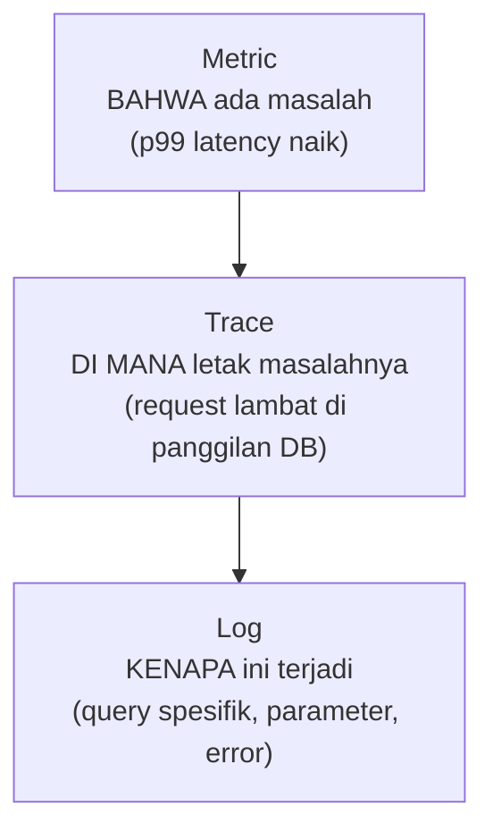

## TL;DR

Observability adalah kemampuan memahami apa yang terjadi **di dalam** sistem hanya dari sinyal yang dikeluarkannya, tanpa harus menambahkan instrumentasi baru setiap kali muncul pertanyaan baru. Tiga jenis sinyal yang saling melengkapi dikenal sebagai "tiga pilar": **log** (catatan peristiwa diskrit dengan detail kontekstual penuh), **metric** (angka teragregasi dari waktu ke waktu, murah disimpan dalam jumlah besar), dan **trace** (perjalanan satu request melintasi banyak service). Ketiganya menjawab pertanyaan yang berbeda — metric memberi tahu **bahwa** ada masalah, trace memberi tahu **di mana** letak masalahnya, log memberi tahu **kenapa** — dan sistem yang hanya punya salah satu selalu punya titik buta yang tidak bisa ditutup oleh dua lainnya.

## The Problem

Sebuah dashboard menunjukkan p99 latency salah satu dari 13 aplikasi melonjak tajam selama sepuluh menit tadi malam. Tim tahu **ada** masalah (dari metric), tapi metric saja tidak memberi tahu **request mana** yang lambat, apalagi **kenapa** ia lambat — apakah macet di database, di panggilan ke service lain, atau di logika internal aplikasi itu sendiri. Tanpa trace yang mengikuti perjalanan request individual lintas service, tim harus menebak-nebak, memeriksa log tiap service satu per satu berharap menemukan sesuatu yang mencurigakan di rentang waktu yang sama — proses yang lambat dan tidak pasti hasilnya, persis di saat kecepatan diagnosis paling dibutuhkan.

Masalah sebaliknya juga terjadi: sebuah tim punya log yang sangat detail untuk setiap request, tapi tidak punya metric teragregasi sama sekali. Untuk tahu "berapa persen request yang gagal dalam sejam terakhir", mereka harus menjalankan query pencarian teks di jutaan baris log dan menghitung manual — pekerjaan yang metric seharusnya menjawab dalam hitungan detik, karena metric memang dirancang untuk pertanyaan agregat semacam ini, bukan log.

## Intuition

Cara paling mudah memahaminya: bayangkan mendiagnosis kondisi kesehatan seseorang. **Metric** seperti hasil pemeriksaan vital rutin (suhu tubuh, tekanan darah) — angka yang dipantau terus-menerus dan langsung menunjukkan ada yang tidak beres tanpa perlu pemeriksaan mendalam. **Trace** seperti hasil pemindaian tubuh (CT scan) yang menunjukkan **di organ mana** letak masalahnya. **Log** seperti hasil biopsi jaringan spesifik di titik yang dicurigai — detail mendalam, tapi hanya berguna kalau kamu sudah tahu **di mana** harus memeriksa (informasi yang datang dari trace), karena memeriksa setiap jaringan tubuh secara detail satu per satu jelas tidak praktis.

Analogi ini bocor pada soal urutan pemakaian. Diagnosis medis hampir selalu berjalan dalam urutan tetap: vital dulu, baru pemindaian, baru biopsi. Ketiga pilar observability sering dipakai **bersamaan dan saling menyilang** — trace yang mencurigakan bisa langsung membawa ke log spesifik lewat correlation ID (lihat [[Correlation IDs]]), dan pola di metric bisa langsung memicu query trace tanpa urutan kaku yang harus diikuti setiap kali.

## How It Works


Alur diagnosis yang umum bergerak dari kiri ke kanan — metric memberi sinyal awal (biasanya lewat dashboard atau alert), trace mempersempit lokasi masalah ke service dan operasi spesifik, log memberi detail kontekstual penuh yang menjelaskan akar masalahnya. Tapi arah ini bukan aturan kaku: engineer berpengalaman sering melompat langsung ke log kalau sudah tahu persis apa yang dicari.

Detail yang membedakan ketiganya secara struktural, bukan hanya secara pemakaian: **metric** adalah angka teragregasi tanpa detail request individual (murah disimpan bertahun-tahun, tapi kehilangan detail spesifik). **Log** adalah catatan per-peristiwa dengan detail penuh (mahal disimpan dalam volume besar dan lama, lihat [[../94 Case Studies/Case - Log Volume That Costs More Than The Servers|Case - Log Volume That Costs More Than The Servers]]). **Trace** adalah struktur yang menghubungkan banyak span (satu span per operasi dalam satu service) jadi satu perjalanan lintas service — lihat [[Distributed Tracing]] untuk detail mekanismenya.

## Under The Hood

Tiga pilar ini secara historis dibangun sebagai tiga sistem terpisah (tool logging terpisah dari tool metric terpisah dari tool tracing) — masing-masing punya sistem penyimpanan dan bahasa query sendiri. Perkembangan terbaru industri (terutama lewat OpenTelemetry, lihat [[../92 Tools/OpenTelemetry|OpenTelemetry]]) mendorong **instrumentasi terpadu**: satu SDK yang menghasilkan ketiga jenis sinyal sekaligus dari kode yang sama, dengan konteks yang saling terhubung otomatis (trace ID yang sama muncul di log yang relevan, metric yang bisa di-drill-down ke trace terkait) — mengurangi biaya menginstrumentasi tiga kali secara terpisah, dan yang lebih penting, mengurangi celah saat mengaitkan ketiga sinyal secara manual saat insiden sedang berlangsung.

## In Go

```go
package observability

import (
	"context"
	"log/slog"
)

// Signal merepresentasikan gagasan bahwa SATU request seharusnya
// menghasilkan sinyal yang SALING TERHUBUNG di ketiga pilar, bukan
// tiga catatan terpisah yang tidak bisa dikaitkan satu sama lain.
type Signal struct {
	TraceID string // menghubungkan span di trace dengan baris log
	Logger  *slog.Logger
}

// HandleRequest menunjukkan pola dasar: trace ID yang sama disertakan
// di SETIAP baris log yang relevan dengan request ini, supaya
// engineer yang menemukan trace lambat bisa langsung mencari log
// dengan trace ID yang sama tanpa menebak-nebak.
func HandleRequest(ctx context.Context, sig Signal) error {
	sig.Logger.InfoContext(ctx, "memulai proses request",
		"trace_id", sig.TraceID,
	)

	if err := doWork(ctx); err != nil {
		sig.Logger.ErrorContext(ctx, "proses request gagal",
			"trace_id", sig.TraceID,
			"error", err,
		)
		return err
	}
	return nil
}

func doWork(ctx context.Context) error { return nil }
```

## In His Stack

Untuk 13 aplikasi yang belum punya observability terstruktur, log adalah titik awal paling realistis (paling murah diadopsi, paling dekat dengan kebiasaan debugging yang sudah ada), tapi berhenti di situ meninggalkan celah besar — tanpa metric, tim tidak tahu ada masalah sampai pengguna melapor; tanpa trace, mendiagnosis masalah lintas 13 aplikasi yang saling memanggil (integrasi antar sistem, lihat [[../30 APIs and Web/_Overview|APIs and Web Overview]]) jadi sangat lambat karena harus memeriksa log tiap aplikasi secara manual satu per satu. Investasi bertahap yang realistis: metric dan alert dasar dulu (deteksi cepat "ada masalah"), baru distributed tracing untuk jalur integrasi paling kritis antar aplikasi.

## Trade-offs and When Not To Use It

Ketiga pilar menambah biaya nyata — storage untuk log dan trace bisa jadi besar untuk sistem dengan traffic tinggi, dan instrumentasi penuh (terutama tracing) menambah sedikit overhead di setiap request. Untuk sistem internal kecil dengan traffic rendah dan konsekuensi downtime yang kecil, investasi observability penuh (ketiga pilar, instrumentasi menyeluruh) mungkin berlebihan — log dasar plus metric sederhana sering sudah cukup. Investasi penuh jelas sepadan untuk sistem dengan traffic tinggi, konsekuensi downtime besar, atau topologi lintas-service yang rumit — di situ, tanpa observability, waktu diagnosis insiden membengkak jauh melampaui biaya instrumentasinya.

## Common Mistakes

> [!warning] Jebakan
> Hanya mengandalkan log untuk seluruh kebutuhan observability, termasuk pertanyaan agregat ("berapa persen request gagal") yang seharusnya dijawab metric — mencoba menjawab pertanyaan agregat lewat pencarian log jauh lebih lambat dan lebih mahal dibanding memakai metric yang memang dirancang untuk itu.

> [!warning] Jebakan
> Menganggap ketiga pilar saling menggantikan, lalu hanya berinvestasi di satu — masing-masing pilar punya titik buta yang hanya ditutup oleh dua lainnya; sistem yang hanya punya metric tahu "ada masalah" tapi tidak "di mana" atau "kenapa".

> [!warning] Jebakan
> Menginstrumentasi log, metric, dan trace secara terpisah tanpa konteks yang saling terhubung (trace ID yang sama tidak muncul di log) — kehilangan manfaat terbesar observability terpadu, yaitu kemampuan melompat cepat dari satu sinyal ke sinyal lain saat mendiagnosis insiden.

## Exercises

1. Jelaskan pertanyaan berbeda yang dijawab masing-masing dari tiga pilar observability.
2. Kenapa mencoba menjawab pertanyaan agregat lewat pencarian log jauh lebih mahal dibanding memakai metric?
3. Kenapa konteks yang saling terhubung (trace ID di log) penting, bukan sekadar punya ketiga pilar secara terpisah?
4. Desain terbuka: salah satu dari 13 aplikasimu saat ini hanya punya log tanpa metric atau trace, dan tim baru sadar butuh waktu rata-rata 40 menit untuk mendiagnosis setiap insiden production. Rancang urutan investasi observability yang realistis untuk aplikasi ini, dengan anggaran dan waktu terbatas.

> [!success]- Kunci jawaban
> **1.** Metric menjawab **bahwa** ada masalah (angka teragregasi yang menyimpang dari normal). Trace menjawab **di mana** letak masalahnya (operasi atau service spesifik dalam perjalanan request). Log menjawab **kenapa** masalah itu terjadi (detail kontekstual penuh dari peristiwa spesifik).
> **4.** (1) Tambahkan metric dasar dulu (request rate, error rate, latency — lihat [[Metrics - The RED and USE Methods]]) dengan alert sederhana untuk error rate dan latency yang melonjak — investasi termurah dengan manfaat langsung: tim tahu ada masalah dalam hitungan detik/menit, bukan menunggu laporan pengguna; (2) pastikan log yang sudah ada terstruktur dan bisa di-query (lihat [[Structured Logging and Log Levels]]), bukan sekadar teks bebas — perbaikan murah yang langsung mempercepat pencarian; (3) tambahkan correlation ID ke log (lihat [[Correlation IDs]]) sebagai langkah antara sebelum tracing penuh — memungkinkan mengikuti satu request lintas beberapa baris log tanpa infrastruktur tracing lengkap; (4) baru setelah tiga langkah murah ini terpasang dan terbukti mengurangi waktu diagnosis, investasikan distributed tracing penuh untuk jalur integrasi paling kritis (bukan seluruh sistem sekaligus) — biasanya jalur yang paling sering jadi sumber insiden lambat lintas service.

## Self-Check

- Pertanyaan apa yang dijawab masing-masing dari tiga pilar observability?
- Kenapa pertanyaan agregat lebih baik dijawab metric, bukan log?
- Kenapa konteks yang saling terhubung antar pilar penting?
- Kapan investasi observability penuh tidak sepadan?

## Connected Notes

- [[Service Discovery]] — topologi service yang dinamis di note sebelumnya adalah salah satu alasan observability jadi kebutuhan, bukan sekadar pilihan.
- [[Structured Logging and Log Levels]] — kelanjutan langsung: pendalaman pilar log yang dibahas ringkas di note ini.
- [[Distributed Tracing]] dan [[Correlation IDs]] — pendalaman pilar trace, dan mekanisme yang menghubungkan ketiga pilar satu sama lain.
- [[Metrics - The RED and USE Methods]] — pendalaman pilar metric, kerangka memilih metrik yang benar-benar berguna.
- [[../92 Tools/OpenTelemetry|OpenTelemetry]] — standar instrumentasi terpadu yang menghasilkan ketiga pilar sekaligus dari kode yang sama.

## Further Reading

- Materi umum industri mengenai "tiga pilar observability", dipopulerkan luas lewat vendor observability dan komunitas OpenTelemetry.

## Catatan Saya

*Tulis di sini pilar observability mana yang paling lemah di salah satu dari 13 aplikasimu, dan insiden terakhir yang lebih lama didiagnosis karena celah itu.*
