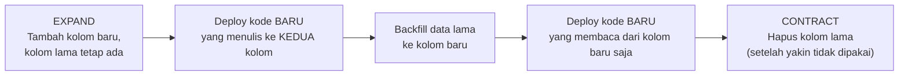

## TL;DR

[[../40 Databases/Database Migrations|Database Migrations]] level junior mengajarkan cara mengubah skema secara terkontrol dan versioned. Note ini menjawab pertanyaan lanjutannya: bagaimana melakukan itu **tanpa mematikan layanan**, ketika kode lama dan kode baru harus sama-sama bisa berjalan melawan database yang sama selama masa transisi deploy — sesuatu yang selalu terjadi sesaat, bahkan pada rolling update yang berjalan mulus, karena beberapa Pod versi lama dan beberapa Pod versi baru selalu hidup bersamaan sejenak. Polanya disebut **expand-contract**: tambahkan struktur baru tanpa menghapus yang lama (expand), migrasikan trafik dan data bertahap, baru hapus struktur lama setelah tidak ada lagi kode yang bergantung padanya (contract).

## The Problem

Sebuah tim ingin mengubah nama kolom `nama` menjadi `nama_lengkap` di tabel pengguna, karena nama lama dianggap ambigu. Migration ditulis sesederhana `ALTER TABLE users RENAME COLUMN nama TO nama_lengkap`, dan dijalankan tepat sebelum deploy kode baru yang memakai nama kolom baru. Masalahnya: rolling update tidak mengganti seluruh Pod secara instan — selama beberapa detik sampai menit, sebagian Pod masih menjalankan kode **lama** yang mengharapkan kolom `nama`, sementara migration sudah mengganti nama kolom itu. Setiap request yang mendarat di Pod lama selama jendela waktu itu gagal dengan error "kolom tidak ditemukan" — downtime parsial yang sepenuhnya bisa dihindari, tapi terjadi karena migration dan deploy kode dianggap satu peristiwa atom, padahal keduanya tidak pernah benar-benar atomik di sistem yang di-rolling-update.

Masalah yang sama, dengan konsekuensi lebih parah, terjadi kalau migration-nya menghapus kolom yang masih dipakai kode lama, atau mengubah tipe data dengan cara yang tidak kompatibel mundur — begitu migration berjalan, **tidak ada versi kode yang berjalan benar** sampai rolling update selesai sepenuhnya, membuat downtime penuh selama masa transisi, bukan cuma downtime parsial.

## Intuition

Cara paling mudah memahaminya: expand-contract seperti **mengganti jembatan yang masih dilalui kendaraan** — kamu tidak merobohkan jembatan lama lalu membangun yang baru (itu berarti jalan tertutup total selama pembangunan). Kamu membangun jembatan baru **di sebelah** jembatan lama dulu (expand), membiarkan keduanya berdiri bersamaan selama kendaraan lama dan baru sama-sama masih memakai salah satunya, lalu baru merobohkan jembatan lama (contract) setelah dipastikan tidak ada lagi kendaraan yang butuh melewatinya.

Analogi ini bocor pada soal berapa lama "keduanya berdiri bersamaan" itu berlangsung. Jembatan fisik yang dibangun berdampingan biasanya punya rencana waktu yang jelas kapan yang lama dirobohkan. Fase "expand" pada migrasi database kadang dibiarkan lebih lama dari yang direncanakan (tim lupa membersihkan kolom lama setelah migrasi "selesai" secara fungsional) — jembatan lama yang tidak pernah dirobohkan bukan hanya sia-sia, ia jadi kebingungan bagi siapa pun yang membaca skema database itu di kemudian hari, tidak yakin kolom mana yang benar-benar dipakai.

## How It Works


Setiap tahap ini adalah operasi yang aman dijalankan sendiri-sendiri, dan di antara setiap tahap, sistem tetap berjalan penuh — tidak ada satu titik pun di mana kode lama dan skema database saling tidak kompatibel, karena skema lama tidak pernah dihapus sampai tahap terakhir, setelah dipastikan tidak ada kode yang masih membutuhkannya.

Untuk kasus ganti nama kolom di "The Problem", polanya jadi: (1) tambah kolom `nama_lengkap` baru, kosong (expand); (2) deploy kode yang menulis ke **kedua** kolom setiap kali ada perubahan data, sambil masih membaca dari kolom lama; (3) jalankan backfill untuk menyalin data lama ke kolom baru untuk baris yang sudah ada sebelumnya; (4) deploy kode yang membaca dan menulis hanya ke kolom baru; (5) setelah yakin tidak ada lagi kode versi lama yang berjalan (semua Pod sudah rolling update penuh, dan cukup waktu berlalu untuk yakin tidak ada proses lama yang tertinggal), hapus kolom lama (contract).

## Under The Hood

Titik tersulit expand-contract bukan menambah kolom baru (operasi yang hampir selalu aman dan cepat) — titik tersulitnya ada di **backfill** data lama ke struktur baru pada tabel besar. Backfill yang dijalankan sebagai satu transaksi besar mengunci tabel dalam waktu lama dan bisa menyebabkan downtime sendiri, persis masalah yang expand-contract seharusnya hindari. Backfill yang aman dilakukan **per-batch** (memproses beberapa ribu baris per iterasi, dengan jeda di antaranya) supaya beban pada database tidak melonjak sekaligus, dan supaya proses ini bisa dihentikan atau dilanjutkan tanpa kehilangan progres kalau terjadi gangguan di tengah jalan.

Sebagian besar perubahan skema yang **terlihat sederhana** ternyata punya jebakan expand-contract tersendiri: mengubah kolom jadi `NOT NULL` butuh memastikan semua baris sudah terisi (backfill dulu) sebelum constraint itu ditambahkan; mengubah tipe data butuh memastikan kedua tipe kompatibel selama masa transisi; menambah index besar pada tabel yang sangat besar bisa memblokir tulisan kalau tidak dijalankan dengan opsi khusus (`CONCURRENTLY` di PostgreSQL, online DDL di MySQL/MariaDB) — detail dialek-spesifik ini penting diperiksa untuk database yang benar-benar dipakai, karena perilakunya berbeda antar sistem.

## In Go

```go
package backfill

import (
	"context"
	"database/sql"
	"fmt"
	"time"
)

// RunBatched menjalankan backfill per-batch, BUKAN satu transaksi
// raksasa — supaya beban database tidak melonjak sekaligus, dan
// proses ini bisa dihentikan/dilanjutkan tanpa kehilangan progres.
func RunBatched(ctx context.Context, db *sql.DB, batchSize int, pause time.Duration) error {
	for {
		res, err := db.ExecContext(ctx, `
			UPDATE users
			SET nama_lengkap = nama
			WHERE nama_lengkap IS NULL
			AND id IN (
				SELECT id FROM users
				WHERE nama_lengkap IS NULL
				LIMIT $1
			)
		`, batchSize)
		if err != nil {
			return fmt.Errorf("backfill: batch gagal: %w", err)
		}

		rows, err := res.RowsAffected()
		if err != nil {
			return fmt.Errorf("backfill: membaca rows affected: %w", err)
		}
		if rows == 0 {
			return nil // backfill selesai
		}

		select {
		case <-ctx.Done():
			return ctx.Err()
		case <-time.After(pause):
			// jeda sengaja diberi, memberi database napas
			// sebelum batch berikutnya
		}
	}
}
```

## In His Stack

Untuk 13 aplikasi yang berjalan di MariaDB, disiplin dual-write (menulis ke kolom lama **dan** baru sekaligus selama masa transisi) adalah langkah yang paling sering dilewatkan karena terasa merepotkan — tim tergoda menyingkat prosesnya langsung ke rename atau drop kolom demi kesederhanaan kode, mengulang persis pola kesalahan di "The Problem". Untuk tabel besar (jutaan baris, umum pada tabel riwayat kasus di sistem legal-services yang berjalan bertahun-tahun), backfill per-batch bukan opsional — migrasi yang mencoba mengubah jutaan baris sekaligus dalam satu statement berisiko mengunci tabel cukup lama untuk terasa sebagai downtime oleh pengguna, meski secara teknis service tidak pernah benar-benar mati.

## Trade-offs and When Not To Use It

Expand-contract menambah jumlah deploy dan langkah migrasi dibanding pendekatan langsung (rename sekali jalan) — untuk tabel kecil dengan traffic rendah di luar jam kerja, downtime singkat akibat migration langsung mungkin memang bisa diterima dan tidak sepadan investasi proses bertahap yang lebih rumit. Expand-contract jelas sepadan untuk tabel besar dengan traffic tinggi yang tidak punya jendela maintenance yang bisa diterima — situasi yang makin umum begitu sistem harus melayani traffic 24/7 tanpa jeda yang bisa diprediksi.

## Common Mistakes

> [!warning] Jebakan
> Menjalankan rename atau drop kolom secara langsung tanpa fase dual-write, mengasumsikan rolling update terjadi "cukup cepat" — tidak ada rolling update yang benar-benar instan; selalu ada jendela waktu di mana kode lama dan baru berjalan bersamaan, dan migration langsung mematahkan salah satunya di jendela itu.

> [!warning] Jebakan
> Menjalankan backfill sebagai satu transaksi besar pada tabel jutaan baris — mengunci tabel dalam waktu lama dan berpotensi menyebabkan downtime yang justru ingin dihindari; selalu pecah jadi batch kecil dengan jeda di antaranya.

> [!warning] Jebakan
> Lupa menjalankan fase "contract" setelah migrasi terasa "selesai" secara fungsional — kolom lama yang tidak pernah dihapus menumpuk sebagai utang teknis, membingungkan siapa pun yang membaca skema database di kemudian hari tanpa tahu kolom mana yang benar-benar masih dipakai.

## Exercises

1. Jelaskan tiga fase pola expand-contract dan kenapa urutannya penting.
2. Kenapa rolling update, meski berjalan mulus, tetap membutuhkan migrasi database yang kompatibel mundur untuk sesaat?
3. Kenapa backfill pada tabel besar harus dijalankan per-batch, bukan satu transaksi besar?
4. Desain terbuka: salah satu dari 13 aplikasimu punya tabel riwayat kasus dengan lebih dari 10 juta baris, dan kamu perlu mengubah kolom `status` dari tipe `VARCHAR` bebas menjadi enum dengan nilai yang dibatasi (`CHECK` constraint). Rancang migrasi expand-contract lengkap untuk perubahan ini, termasuk bagaimana menangani baris lama yang mungkin punya nilai `status` yang tidak valid menurut enum baru.

> [!success]- Kunci jawaban
> **1.** Expand (tambah struktur baru tanpa menghapus yang lama), migrasi bertahap (dual-write dan/atau backfill, kode baru mulai memakai struktur baru), Contract (hapus struktur lama setelah dipastikan tidak ada lagi kode yang bergantung padanya). Urutannya penting karena setiap tahap menjaga kompatibilitas mundur dengan kode versi sebelumnya — melompati urutan (langsung contract tanpa expand) berarti ada jendela waktu di mana skema dan kode saling tidak kompatibel.
> **4.** (1) **Expand**: tambah kolom baru `status_v2` bertipe enum, biarkan `status` lama tetap ada; (2) sebelum backfill, jalankan query audit untuk menemukan nilai `status` lama yang **tidak** valid menurut enum baru — nilai-nilai ini butuh keputusan eksplisit (dipetakan ke nilai enum terdekat, atau ditandai untuk peninjauan manual) sebelum backfill berjalan, karena backfill otomatis akan gagal atau salah kalau memaksakan nilai tidak valid ke constraint baru; (3) jalankan dual-write: deploy kode yang menulis ke kedua kolom setiap ada perubahan `status`; (4) jalankan backfill per-batch untuk baris lama, memakai hasil pemetaan dari langkah audit; (5) deploy kode yang membaca dan menulis hanya `status_v2`; (6) setelah periode observasi tanpa masalah, **Contract**: hapus kolom `status` lama dan ganti nama `status_v2` jadi `status` di migration terpisah berikutnya.

## Self-Check

- Sebutkan tiga fase pola expand-contract.
- Kenapa rolling update tetap butuh migrasi yang kompatibel mundur, meski berjalan mulus?
- Kenapa backfill harus per-batch pada tabel besar?
- Apa risiko lupa menjalankan fase contract?

## Connected Notes

- [[../40 Databases/Database Migrations|Database Migrations]] — note ini adalah kelanjutan langsung, menjawab bagaimana migration dijalankan tanpa downtime di sistem yang selalu hidup.
- [[Feature Flags]] — dual-write dan pola bertahap lain di note ini berbagi filosofi yang sama dengan feature flag: memecah perubahan besar jadi tahap-tahap kecil yang aman.
- [[Blue-Green and Canary Releases]] — migrasi expand-contract adalah prasyarat yang membuat blue-green dan canary release aman dijalankan pada aplikasi yang memakai database.
- [[../60 Distributed Systems/_Overview|Distributed Systems Overview]] — pola expand-contract untuk migrasi skala sangat besar (CDC-driven migration) dibahas lebih dalam di domain itu.
- [[../92 Tools/PostgreSQL - Locking and SELECT FOR UPDATE|PostgreSQL - Locking and SELECT FOR UPDATE]] — detail locking yang relevan memahami kenapa operasi DDL tertentu bisa memblokir tulisan pada tabel besar.

## Further Reading

- Dokumentasi resmi PostgreSQL/MariaDB bagian DDL online dan `CREATE INDEX CONCURRENTLY` — detail dialek-spesifik yang penting diperiksa untuk database yang benar-benar dipakai.

## Catatan Saya

*Tulis di sini migrasi skema paling berisiko yang pernah (atau akan) dijalankan di salah satu dari 13 aplikasimu, dan apakah prosesnya sudah memakai pola expand-contract.*
