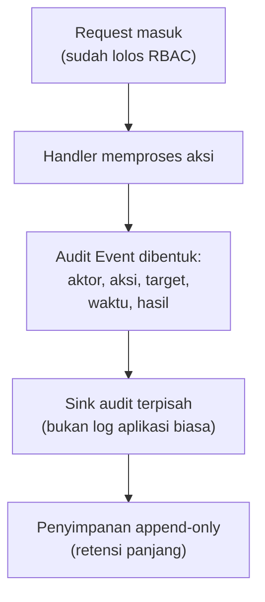

## TL;DR

Audit logging adalah mencatat **siapa melakukan apa, terhadap data apa, dan kapan** — secara terpisah dari log aplikasi biasa, dan idealnya tidak bisa diubah setelah dicatat. Log aplikasi biasa (lihat [[../70 Infrastructure and Delivery/Structured Logging and Log Levels|Structured Logging and Log Levels]]) dibuat untuk membantu developer men-debug sistem; audit log dibuat untuk menjawab pertanyaan investigatif setelah kejadian — "siapa yang mengubah data ini, dan kapan?" — pertanyaan yang tidak bisa dijawab log aplikasi biasa karena log itu dirotasi, dibuang, atau tidak pernah mencatat identitas aktor secara konsisten sejak awal.

## The Problem

Sebuah petugas di salah satu sistem legal-services ditemukan mengakses dan mengubah data kasus yang seharusnya di luar kewenangannya — kecurigaan muncul dari laporan pihak eksternal, bukan dari sistem itu sendiri. Tim teknis diminta menyelidiki: siapa yang mengakses data itu, kapan, dan apa saja yang diubah. Mereka membuka log aplikasi — dan menemukan log itu memang mencatat request masuk, tapi hanya `user_id` di sebagian endpoint (endpoint lain tidak mencatatnya sama sekali), tidak ada catatan **nilai sebelum dan sesudah** perubahan data, dan log yang relevan sudah terhapus karena kebijakan retensi log aplikasi yang hanya menyimpan 14 hari — sementara insiden yang diselidiki terjadi dua bulan lalu.

Sistem ini secara teknis punya "logging", tapi tidak punya **audit trail**. Log aplikasi dirancang untuk membantu debugging kesalahan teknis (kenapa request ini gagal, berapa lama query ini berjalan) — kebutuhan itu sah, tapi berbeda dari kebutuhan investigatif (siapa yang melakukan aksi tertentu, dan bisa dibuktikan aksi itu memang terjadi). Mencampur keduanya dalam satu aliran log yang sama, dengan kebijakan retensi yang sama, berarti kebutuhan investigatif — yang justru butuh retensi lebih panjang dan integritas lebih ketat — ikut kalah oleh kebijakan yang dirancang untuk kebutuhan debugging semata.

## Intuition

Padanan terdekatnya di luar dunia software: **buku tamu notaris** atau **flight data recorder** pada pesawat terbang. Keduanya bukan catatan yang dibuat untuk membantu operasional sehari-hari — notaris tidak membaca ulang buku tamunya untuk bekerja lebih efisien, pilot tidak mengecek flight data recorder saat menerbangkan pesawat. Keduanya ada semata-mata untuk **investigasi setelah kejadian**, dan karena itu, keduanya dirancang untuk sulit diubah setelah dicatat — buku tamu notaris dijilid dan diberi nomor halaman berurutan supaya halaman yang hilang langsung terlihat, flight data recorder dibungkus casing yang tahan benturan justru karena nilainya paling tinggi tepat saat sesuatu sudah terlanjur salah.

Analogi ini berhenti bekerja di soal volume. Buku tamu notaris mencatat puluhan entri sehari; flight data recorder mencatat parameter penerbangan yang jumlahnya terbatas dan sudah ditentukan sebelumnya. Sistem software modern berpotensi menghasilkan ribuan aksi per detik — audit logging yang naif (mencatat semuanya secara mendetail selamanya) dengan cepat menjadi masalah biaya penyimpanan tersendiri, sesuatu yang tidak pernah dihadapi notaris atau pilot.

## How It Works

Audit event punya struktur minimal yang harus selalu ada, tidak peduli aksi apa yang dicatat: **aktor** (siapa — user ID, service ID, atau identitas mTLS), **aksi** (apa yang dilakukan — create, update, delete, read untuk data yang sangat sensitif), **target** (data atau resource apa yang terkena), **waktu** (timestamp presisi tinggi), dan **hasil** (berhasil atau ditolak, dan kenapa). Untuk aksi yang mengubah data, audit event yang matang juga mencatat **nilai sebelum dan sesudah** — bukan hanya "field X diubah", tapi nilai lama dan nilai baru secara eksplisit.


Titik pentingnya ada di panah dari Handler ke Sink: audit event dikirim ke **aliran penyimpanan yang terpisah** dari log aplikasi biasa, dengan kebijakan retensi dan integritas sendiri — bukan bercampur di stdout yang sama dan berakhir di sistem log agregasi yang dirotasi tiap dua minggu.

## Under The Hood

**Tamper-evidence** adalah properti yang membedakan audit log yang matang dari sekadar "log yang disimpan lama." Kalau audit log disimpan di tabel database biasa dengan hak `UPDATE`/`DELETE` yang sama seperti tabel lain, seseorang dengan akses database (termasuk penyerang yang sudah kompromi) bisa mengubah atau menghapus jejaknya sendiri — audit log yang bisa diubah pelakunya tidak lagi berguna sebagai bukti. Dua pendekatan umum bisa membuat log tamper-evident. Pertama, **penyimpanan append-only** (WORM — write once, read many), baik di tingkat storage seperti object storage dengan object lock, atau di tingkat database dengan hak akses yang secara struktural menolak `UPDATE`/`DELETE` pada tabel audit. Kedua, **hash chaining** — setiap entri audit menyertakan hash dari entri sebelumnya, sehingga mengubah satu entri lama akan merusak rangkaian hash seluruh entri setelahnya, membuat perubahan mudah terdeteksi meski tidak sepenuhnya dicegah.

Poin kedua yang sering luput: audit log **sendiri** bisa jadi risiko keamanan kalau mencatat data sensitif mentah — mencatat nilai lama dan baru dari kolom yang berisi data pribadi berarti audit log itu sendiri sekarang jadi target yang sama sensitifnya dengan data aslinya, dan butuh proteksi yang sama (lihat [[Encryption at Rest vs In Transit]]). Praktik yang lebih aman: audit log mencatat **bahwa** field tertentu berubah dan **siapa** yang mengubahnya, tanpa selalu menyertakan nilai mentahnya kalau field itu termasuk kategori sangat sensitif — trade-off antara kelengkapan investigasi dan luasnya permukaan risiko yang harus disengaja, bukan kebetulan.

## In Go

```go
package audit

import (
	"context"
	"encoding/json"
	"fmt"
	"time"
)

// Event adalah struktur MINIMAL yang wajib ada di setiap audit log —
// terpisah dari struct logging aplikasi biasa.
type Event struct {
	Actor     string    `json:"actor"`      // user ID, service ID, atau identitas mTLS
	Action    string    `json:"action"`     // "update", "delete", "read_sensitive", dst.
	Target    string    `json:"target"`     // resource yang terkena, misalnya "case:12345"
	Timestamp time.Time `json:"timestamp"`
	Outcome   string    `json:"outcome"`    // "success" atau "denied"
	Before    any       `json:"before,omitempty"`
	After     any       `json:"after,omitempty"`
}

// Sink adalah tujuan penyimpanan audit event — SENGAJA dipisah dari
// logger aplikasi biasa, supaya kebijakan retensi dan akses bisa
// diatur berbeda (lebih lama, lebih ketat) tanpa terikat pada
// kebijakan log aplikasi.
type Sink interface {
	Write(ctx context.Context, e Event) error
}

// Record adalah titik panggil tunggal dari kode bisnis — dipanggil
// SETELAH aksi berhasil dievaluasi RBAC-nya, bukan menggantikan
// pengecekan otorisasi itu sendiri.
func Record(ctx context.Context, sink Sink, e Event) {
	e.Timestamp = time.Now().UTC()

	if err := sink.Write(ctx, e); err != nil {
		// Audit log yang gagal ditulis TIDAK BOLEH menggagalkan
		// request pengguna secara diam-diam tanpa jejak — di sistem
		// nyata, kegagalan ini sendiri harus memicu alert terpisah,
		// karena artinya ada aksi yang terjadi tanpa tercatat.
		fmt.Printf("audit: gagal menulis event %+v: %v\n", e, err)
	}
}

// Contoh pemakaian di layer service, setelah RBAC dan sebelum
// response dikirim ke klien.
func UpdateCaseStatus(ctx context.Context, sink Sink, actor, caseID, oldStatus, newStatus string) {
	oldJSON, _ := json.Marshal(map[string]string{"status": oldStatus})
	newJSON, _ := json.Marshal(map[string]string{"status": newStatus})

	Record(ctx, sink, Event{
		Actor:   actor,
		Action:  "update_case_status",
		Target:  "case:" + caseID,
		Outcome: "success",
		Before:  json.RawMessage(oldJSON),
		After:   json.RawMessage(newJSON),
	})
}
```

## In His Stack

Untuk sistem legal-services milik pemerintah, audit logging bukan fitur opsional — ia biasanya jadi prasyarat langsung untuk kebutuhan [[Compliance Trails for Government Systems]] yang dibahas di note berikutnya. Yang paling sering luput di 13 aplikasi semacam ini: audit trail baru dipikirkan **setelah** insiden atau permintaan audit eksternal datang, bukan didesain sejak skema data awal — akibatnya, sistem yang sudah lama berjalan sering tidak punya cukup data historis untuk menjawab pertanyaan "siapa yang mengubah ini" pada kejadian yang terjadi sebelum audit logging ditambahkan.

## Trade-offs and When Not To Use It

Audit logging menambah biaya nyata — penyimpanan tambahan yang harus disimpan lebih lama dari log aplikasi biasa (sering bertahun-tahun untuk kebutuhan compliance, dibanding hitungan minggu untuk log debugging), dan overhead menulis event tambahan di setiap aksi sensitif. Untuk aksi yang tidak mengubah data dan tidak menyangkut informasi sensitif (membaca halaman statis, memuat dropdown), audit logging penuh adalah overhead yang tidak sepadan — fokuskan pada aksi yang benar-benar butuh jejak investigatif: perubahan data, akses ke data sensitif, dan aksi yang mengubah hak akses (menambah peran, mencabut izin).

## Common Mistakes

> [!warning] Jebakan
> Mencampur audit log dengan log aplikasi biasa di aliran dan kebijakan retensi yang sama — begitu kebijakan retensi log aplikasi (biasanya pendek, untuk hemat biaya) berlaku, jejak audit yang seharusnya disimpan bertahun-tahun ikut terhapus dalam hitungan minggu.

> [!warning] Jebakan
> Mencatat nilai sensitif mentah (kata sandi, dokumen lengkap, nomor identitas) langsung di audit log tanpa pertimbangan — audit log yang isinya sama sensitifnya dengan data asli butuh proteksi yang sama, dan sering luput dari kebijakan enkripsi yang berlaku untuk tabel data utama.

> [!warning] Jebakan
> Menyimpan audit log di tabel database biasa dengan hak `UPDATE`/`DELETE` yang sama seperti tabel lain — siapa pun (termasuk penyerang yang sudah kompromi) yang punya akses database itu bisa mengubah atau menghapus jejaknya sendiri, meniadakan nilai audit log sebagai bukti.

## Exercises

1. Jelaskan perbedaan tujuan log aplikasi biasa dan audit log, dan kenapa keduanya butuh kebijakan retensi berbeda.
2. Sebutkan lima field minimal yang wajib ada di setiap audit event.
3. Jelaskan dua pendekatan membuat audit log tamper-evident, dan ancaman spesifik yang dijawab masing-masing.
4. Desain terbuka: salah satu dari 13 aplikasimu baru saja diminta menyediakan audit trail untuk kebutuhan investigasi eksternal, tapi sistemnya sudah berjalan tiga tahun tanpa audit logging sama sekali — hanya log aplikasi biasa dengan retensi 30 hari. Rancang rencana menambahkan audit logging ke sistem yang sudah berjalan, termasuk bagaimana menangani kenyataan bahwa data historis sebelum perubahan ini tidak akan pernah punya jejak audit yang lengkap.

> [!success]- Kunci jawaban
> **1.** Log aplikasi biasa dibuat untuk membantu debugging teknis (request gagal, query lambat) dan wajar dirotasi cepat karena nilainya menurun begitu masalah teknisnya selesai diselidiki. Audit log dibuat untuk investigasi "siapa melakukan apa" yang nilainya justru **meningkat** seiring waktu untuk kebutuhan hukum atau compliance, dan sering baru dibutuhkan bertahun-tahun setelah kejadian — kalau disimpan dengan kebijakan retensi yang sama dengan log debugging, kebutuhan investigatif ini kalah begitu saja oleh kebijakan hemat biaya yang dirancang untuk tujuan berbeda.
> **4.** (1) Definisikan dulu aksi mana yang paling kritis untuk dicatat (perubahan data kasus, perubahan hak akses, akses ke data sangat sensitif) — tidak perlu mencakup semua aksi sekaligus di iterasi pertama; (2) tambahkan pemanggilan audit record di titik-titik itu, dengan sink terpisah dan kebijakan retensi panjang sejak hari pertama diaktifkan; (3) komunikasikan secara eksplisit dan tertulis ke pihak yang meminta audit trail bahwa data sebelum tanggal aktivasi ini **tidak** akan punya jejak audit lengkap — ini keterbatasan jujur, bukan sesuatu yang ditutupi, dan sering log aplikasi lama (meski tidak selengkap audit log) masih bisa dipakai sebagai bukti pendukung parsial untuk periode itu; (4) pertimbangkan menambahkan kolom `updated_by`/`updated_at` minimal di tabel-tabel kritis sebagai jaring pengaman tambahan kalau audit log terpisah belum mencakup semua kasus, meski ini bukan pengganti audit trail penuh.

## Self-Check

- Apa perbedaan tujuan log aplikasi biasa dan audit log?
- Sebutkan lima field minimal yang wajib ada di setiap audit event.
- Apa itu tamper-evidence, dan kenapa audit log tanpa properti ini kurang berguna sebagai bukti?
- Kenapa mencatat nilai sensitif mentah di audit log bisa jadi masalah tersendiri?

## Connected Notes

- [[../70 Infrastructure and Delivery/Structured Logging and Log Levels|Structured Logging and Log Levels]] — audit log berbeda tujuan dan kebijakan retensi dari structured logging biasa yang dibahas di note itu, meski keduanya sama-sama menghasilkan data terstruktur.
- [[RBAC]] — audit log mencatat aksi yang sudah dievaluasi RBAC-nya; keduanya saling melengkapi, bukan saling menggantikan.
- [[Threat Modelling with STRIDE]] — audit logging adalah mitigasi konkret untuk ancaman kategori Repudiation yang diidentifikasi lewat proses STRIDE.
- [[Encryption at Rest vs In Transit]] — audit log yang mencatat data sensitif butuh proteksi yang sama seperti data aslinya, dibahas di note sebelumnya.
- [[Compliance Trails for Government Systems]] — audit logging adalah mekanisme teknis inti yang jadi fondasi kebutuhan compliance yang dibahas di note berikutnya.

## Further Reading

- OWASP Logging Cheat Sheet, bagian yang membahas audit trail secara spesifik terpisah dari logging umum.

## Catatan Saya

*Tulis di sini aksi paling kritis di salah satu dari 13 aplikasimu yang belum punya audit trail sama sekali, dan risiko konkret kalau ada penyalahgunaan yang tidak bisa dibuktikan siapa pelakunya.*
