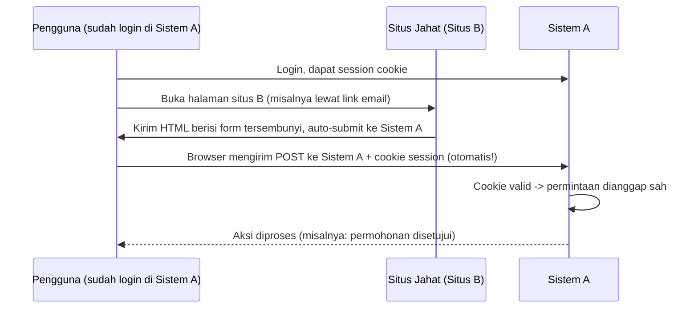

## TL;DR

CSRF (Cross-Site Request Forgery) mengeksploitasi satu fakta sederhana tentang browser: kalau pengguna sedang login di situs A (dan punya session cookie yang masih aktif), lalu membuka situs B yang jahat, browser **tetap** menyertakan cookie situs A pada request apa pun yang dipicu situs B ke situs A — karena browser mengirim cookie berdasarkan domain tujuan, bukan berdasarkan siapa yang "meminta" request itu dibuat. Situs B bisa memicu request tersembunyi (misalnya lewat form otomatis atau tag ``) ke endpoint sensitif di situs A, dan situs A akan memprosesnya seolah-olah itu benar-benar keinginan pengguna, karena secara teknis cookie sesinya valid. Pertahanan intinya adalah membuktikan bahwa request itu benar-benar berasal dari halaman situs A sendiri, bukan dipicu diam-diam oleh situs lain.

## The Problem

Seorang pegawai instansi pemerintah sedang login di sistem internal untuk mengelola status permohonan warga, dengan session cookie yang masih aktif. Di tab browser lain, ia membuka email berisi link yang terlihat tidak berbahaya, yang sebenarnya mengarah ke halaman berisi form tersembunyi yang otomatis ter-submit ke endpoint `POST /permohonan/42/setujui` milik sistem internal tadi. Karena browser menyertakan cookie session yang masih aktif pada request itu (endpoint tujuan sama dengan domain cookie, terlepas dari halaman mana yang memicu request), sistem internal memproses permintaan persetujuan itu seolah-olah pegawai itu sendiri yang mengklik tombol "Setujui" — padahal ia bahkan tidak sadar telah membuka halaman yang memicu aksi tersebut.

Skenario ini berbeda mendasar dari [[XSS]]: penyerang tidak perlu menjalankan kode apa pun di dalam halaman sistem internal (tidak ada script yang dieksekusi di domain sistem itu) — ia hanya memanfaatkan kepercayaan otomatis browser terhadap cookie, dari halaman **sama sekali di luar** domain sistem yang diserang.

## Intuition

CSRF seperti **menandatangani surat kuasa tanpa membaca isinya**, hanya karena stempel di amplopnya terlihat asli. Bayangkan kamu sudah punya cap resmi (session cookie) yang selalu kamu bawa, dan cap itu otomatis terpakai setiap kali kamu menandatangani dokumen apa pun yang disodorkan — kamu tidak sadar bahwa dokumen yang baru saja "kamu tandatangani" sebenarnya disodorkan diam-diam oleh orang lain (situs jahat) yang memanfaatkan fakta bahwa cap itu selalu siap dipakai, tanpa pernah menanyakan "apakah kamu benar-benar bermaksud menandatangani dokumen spesifik ini, dari sumber yang benar?"

Analogi ini bocor pada satu hal: manusia yang menandatangani surat kuasa fisik biasanya sadar sedang menandatangani sesuatu, meski tertipu soal isinya. Browser yang mengirim cookie pada request CSRF **tidak pernah meminta persetujuan apa pun** dari pengguna — seluruh proses (memuat form tersembunyi, submit otomatis) terjadi tanpa interaksi sadar apa pun dari korban, yang bahkan mungkin tidak pernah melihat halaman yang memicunya secara langsung.

## How It Works



Diagram ini menunjukkan bahwa Sistem A tidak punya cara membedakan "request ini datang dari form asli Sistem A" versus "request ini datang dari form tersembunyi di situs B" — keduanya terlihat identik dari sisi Sistem A, karena keduanya membawa cookie session yang sama-sama valid.

Pertahanan standar adalah **CSRF token**: nilai acak yang di-generate server dan disisipkan ke form asli Sistem A (biasanya sebagai hidden field), yang harus dikirim balik bersama request dan diverifikasi server. Situs jahat tidak bisa mengetahui nilai token ini (karena tidak bisa membaca halaman Sistem A akibat kebijakan *same-origin* browser), sehingga form palsu yang di-submit dari situs jahat tidak akan menyertakan token yang valid. Pertahanan kedua yang makin umum adalah atribut cookie `SameSite` — mengatur browser untuk **tidak** menyertakan cookie sama sekali pada request lintas-situs (cross-site), menutup celah ini langsung di level browser tanpa perlu token tambahan untuk banyak kasus.

## In Go

```go
package csrf

import (
	"context"
	"crypto/rand"
	"crypto/subtle"
	"encoding/base64"
	"fmt"
	"net/http"
)

// BuatCSRFToken menghasilkan token acak per session, disimpan di server
// (terkait session pengguna) dan dikirim ke klien untuk disisipkan di form.
func BuatCSRFToken() (string, error) {
	b := make([]byte, 32)
	if _, err := rand.Read(b); err != nil {
		return "", fmt.Errorf("generate csrf token: %w", err)
	}
	return base64.URLEncoding.EncodeToString(b), nil
}

// MiddlewareCSRF memverifikasi token pada method yang mengubah state
// (POST/PUT/PATCH/DELETE) — method GET yang idempotent (lihat
// [[../30 APIs and Web/Idempotency|Idempotency]]) sengaja tidak diperiksa,
// karena seharusnya tidak pernah mengubah state di server sama sekali.
func MiddlewareCSRF(ambilTokenSession func(ctx context.Context) string, next http.Handler) http.Handler {
	return http.HandlerFunc(func(w http.ResponseWriter, r *http.Request) {
		if r.Method == http.MethodGet || r.Method == http.MethodHead {
			next.ServeHTTP(w, r)
			return
		}

		tokenDikirim := r.Header.Get("X-CSRF-Token")
		tokenSeharusnya := ambilTokenSession(r.Context())

		// subtle.ConstantTimeCompare mencegah timing attack saat
		// membandingkan token, sama seperti perbandingan hash password.
		if tokenDikirim == "" || subtle.ConstantTimeCompare([]byte(tokenDikirim), []byte(tokenSeharusnya)) != 1 {
			http.Error(w, "CSRF token tidak valid", http.StatusForbidden)
			return
		}

		next.ServeHTTP(w, r)
	})
}

// SetCookieSessionAman menunjukkan flag SameSite sebagai lapisan pertahanan
// kedua — SameSiteStrictMode paling ketat (cookie tidak pernah dikirim pada
// request lintas-situs sama sekali), SameSiteLaxMode kompromi umum yang
// masih mengizinkan navigasi top-level (klik link biasa) tapi tetap
// menutup celah form/script otomatis yang jadi vektor utama CSRF.
func SetCookieSessionAman(w http.ResponseWriter, sessionID string) {
	http.SetCookie(w, &http.Cookie{
		Name:     "session_id",
		Value:    sessionID,
		HttpOnly: true,
		Secure:   true,
		SameSite: http.SameSiteLaxMode,
		Path:     "/",
	})
}
```

## In His Stack

Yii2 menyediakan proteksi CSRF bawaan (`Yii::$app->request->enableCsrfValidation`, aktif secara default) yang menyisipkan token CSRF otomatis ke setiap form yang dirender lewat helper form Yii2 — developer harus secara sengaja menonaktifkannya, bukan sengaja mengaktifkannya, yang merupakan default yang jauh lebih aman. Untuk API yang murni dikonsumsi lewat token `Authorization: Bearer` (bukan cookie, lihat [[Sessions vs Tokens]]), risiko CSRF secara mendasar jauh lebih kecil — CSRF secara spesifik mengeksploitasi pengiriman **cookie otomatis** oleh browser, dan token yang dikirim manual lewat header `Authorization` tidak pernah dikirim otomatis oleh browser tanpa sepengetahuan JavaScript aplikasi itu sendiri. Ini salah satu alasan tambahan (di luar skalabilitas) kenapa API yang dikonsumsi aplikasi mobile atau service-to-service sering memilih token murni dibanding cookie session.

## Trade-offs and When Not To Use It

CSRF token menambah kompleksitas nyata di sisi frontend (setiap form atau request state-changing harus menyertakan token yang valid, dan token itu perlu di-refresh mengikuti siklus hidup session) — untuk API yang seluruhnya berbasis token `Authorization` header tanpa cookie sama sekali, menambahkan proteksi CSRF adalah kerja sia-sia karena serangan CSRF secara mendasar bergantung pada pengiriman cookie otomatis oleh browser, bukan header yang harus disisipkan manual. Sebaliknya, untuk sistem apa pun yang memakai cookie untuk autentikasi (bahkan sebagian), CSRF protection bukan opsional — mengandalkan `SameSite` cookie saja tanpa CSRF token bisa jadi cukup untuk sebagian besar kasus modern, tapi untuk sistem dengan kebutuhan keamanan tinggi (seperti legal-services pemerintah), lapisan ganda (SameSite **dan** CSRF token) memberi pertahanan berlapis yang lebih defensif terhadap edge case atau browser lama yang dukungan `SameSite`-nya tidak konsisten.

## Common Mistakes

> [!warning] Jebakan
> Mengandalkan `SameSite=Lax` sebagai satu-satunya pertahanan tanpa CSRF token untuk sistem dengan kebutuhan keamanan tinggi — `SameSite` adalah pertahanan kuat, tapi dukungan browser dan edge case tertentu (misalnya subdomain, atau navigasi top-level tertentu di mode Lax) membuatnya kurang ideal sebagai satu-satunya lapisan untuk sistem sensitif.

> [!warning] Jebakan
> Menerapkan proteksi CSRF di endpoint API yang murni memakai token `Authorization` header tanpa cookie sama sekali — kerja tambahan yang tidak menutup risiko nyata apa pun, karena vektor serangan CSRF secara mendasar bergantung pada pengiriman cookie otomatis oleh browser.

> [!warning] Jebakan
> Tidak memeriksa CSRF token pada method GET yang **sebenarnya mengubah state** (misalnya endpoint lama bergaya `GET /permohonan/42/hapus`) — GET seharusnya selalu idempotent dan tidak mengubah state, tapi kalau desain lama melanggar aturan ini, endpoint tersebut tetap rentan CSRF meski middleware hanya memeriksa method state-changing standar.

## Exercises

1. Jelaskan kenapa CSRF bisa terjadi tanpa penyerang perlu menjalankan kode apa pun di domain sistem yang diserang, berbeda dari XSS.
2. Kenapa API yang murni memakai token `Authorization` header (bukan cookie) secara mendasar jauh lebih kecil risikonya terhadap CSRF?
3. Jelaskan perbedaan `SameSite=Strict` dan `SameSite=Lax`, dan kapan masing-masing lebih tepat dipakai.
4. Desain terbuka: sistemmu punya aplikasi web (memakai cookie session, dikonsumsi pegawai internal lewat browser) dan API terpisah (memakai token, dikonsumsi aplikasi mobile masyarakat). Rancang strategi proteksi CSRF yang berbeda untuk kedua permukaan ini, dan jelaskan kenapa menerapkan satu strategi yang sama untuk keduanya tidak tepat.

> [!success]- Kunci jawaban
> **1.** CSRF mengeksploitasi perilaku bawaan browser (mengirim cookie berdasarkan domain tujuan, tanpa peduli halaman mana yang memicu request) — penyerang hanya perlu membuat korban memuat halaman yang memicu request ke domain target, tanpa pernah membutuhkan kemampuan menjalankan kode di dalam domain target itu sendiri. XSS, sebaliknya, secara spesifik butuh menyuntikkan dan menjalankan kode **di dalam** konteks domain target, memberi penyerang kemampuan jauh lebih luas (membaca DOM, mencuri data apa pun yang terlihat di halaman) dibanding CSRF yang "hanya" bisa memicu request satu arah tanpa bisa membaca responsnya.
> **4.** Untuk aplikasi web berbasis cookie: terapkan CSRF token penuh (disisipkan di setiap form/request state-changing) ditambah `SameSite=Lax` atau `Strict` sebagai lapisan kedua — karena vektor serangan lewat cookie otomatis browser nyata di sini. Untuk API berbasis token yang dikonsumsi aplikasi mobile: tidak perlu proteksi CSRF sama sekali, karena aplikasi mobile mengirim token secara eksplisit lewat kode yang mereka tulis sendiri (bukan otomatis oleh sistem operasi/browser seperti cookie) — tidak ada mekanisme "pengiriman otomatis tanpa sepengetahuan aplikasi" yang setara dengan cookie browser. Menyamakan strategi berarti memaksa aplikasi mobile menangani CSRF token yang sama sekali tidak relevan untuk model ancamannya, kerja ekstra tanpa manfaat keamanan nyata.

## Self-Check

- Kenapa CSRF tidak membutuhkan penyerang menjalankan kode di domain target, berbeda dari XSS?
- Apa fungsi CSRF token, dan kenapa situs jahat tidak bisa memalsukannya?
- Kenapa `SameSite` cookie mengurangi risiko CSRF secara signifikan?
- Kapan proteksi CSRF menjadi tidak relevan sama sekali untuk sebuah endpoint API?

## Connected Notes

- [[XSS]] — sering disandingkan dengan CSRF karena keduanya menyerang lewat browser korban, tapi mekanisme dan pertahanannya berbeda mendasar.
- [[Sessions vs Tokens]] — CSRF secara spesifik relevan untuk autentikasi berbasis cookie/session; model token murni lewat header secara mendasar jauh lebih kecil risikonya.
- [[The OWASP Top 10]] — CSRF bersinggungan dengan kategori Broken Access Control dan Identification/Authentication Failures dalam daftar ini.
- [[../30 APIs and Web/Idempotency|Idempotency]] — method HTTP yang benar-benar idempotent (GET tidak mengubah state) adalah prasyarat supaya proteksi CSRF bisa fokus hanya pada method state-changing.
- [[Secret Management]] — CSRF token, meski tidak serahasia session credential, tetap perlu digenerate dengan sumber acak yang aman secara kriptografis.

## Further Reading

- OWASP Cross-Site Request Forgery Prevention Cheat Sheet.
- MDN Web Docs, halaman atribut cookie `SameSite`.

## Catatan Saya

*Tulis di sini apakah aplikasi web kerjaanmu (yang berbasis cookie session) sudah punya proteksi CSRF aktif, dan pernahkah diuji secara khusus.*
