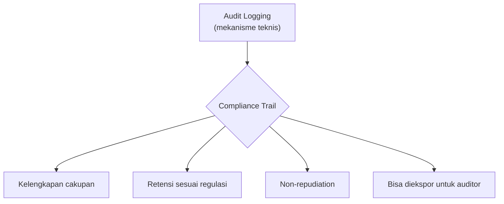

## TL;DR

Compliance trail adalah kebutuhan audit yang lahir dari **regulasi eksternal**, bukan dari pilihan teknis tim — sesuatu yang wajib dipenuhi bukan karena tim menganggapnya praktik baik, tapi karena hukum atau kebijakan instansi mewajibkannya. [[Audit Logging]] adalah mekanisme teknisnya; compliance trail adalah lapisan **kebutuhan** di atasnya yang menentukan apa yang harus dicatat, berapa lama disimpan, siapa yang boleh mengaksesnya, dan bagaimana ia bisa dibuktikan tidak diubah — kebutuhan yang sering datang dengan konsekuensi hukum kalau tidak dipenuhi, bukan sekadar konsekuensi teknis. Perbedaan paling penting: audit logging yang baik belum tentu memenuhi compliance, karena compliance sering menuntut properti spesifik (retensi minimum, chain of custody, laporan yang bisa diekspor untuk auditor eksternal) yang tidak otomatis ada hanya karena sistem "sudah mencatat aktivitas."

## The Problem

Sebuah sistem legal-services sudah berjalan tiga tahun dan berfungsi baik secara teknis. Suatu hari, datang permintaan resmi dari unit pengawasan internal instansi: sistem harus bisa menunjukkan riwayat lengkap siapa mengakses dan mengubah data kasus tertentu selama dua tahun terakhir, termasuk bukti bahwa riwayat itu tidak bisa dimanipulasi. Tim kaget menyadari beberapa hal sekaligus: audit logging yang ada hanya menyimpan 90 hari (bukan dua tahun), sebagian tabel memakai **hard delete** sehingga riwayat perubahan sebelum data dihapus benar-benar hilang tanpa jejak, dan tidak ada mekanisme untuk membuktikan log yang tersisa memang belum diubah sejak dicatat.

Ini adalah pola yang sangat umum: kebutuhan compliance **datang setelah sistem dibangun**, karena regulasi yang mewajibkannya sering baru berlaku, baru diperketat penegakannya, atau baru diminta pengawas setelah sistem sudah production bertahun-tahun. Masalahnya bukan hanya menambahkan audit logging sekarang — kerusakan sebenarnya adalah keputusan desain lama (hard delete, retensi pendek) yang sudah **menghancurkan** data yang seharusnya jadi bukti, dan keputusan itu tidak bisa diperbaiki secara retroaktif untuk data yang sudah terlanjur hilang.

## Intuition

Cara paling mudah memahaminya: bedanya seperti membangun gedung dengan **detektor asap yang dipasang sejak desain awal** dibanding menambahkannya setelah gedung berdiri karena baru diwajibkan peraturan kebakaran yang berubah. Kalau dipasang sejak awal, jalur kabel dan penempatannya menyatu rapi dengan struktur. Kalau ditambahkan belakangan, tim harus membongkar dinding yang sudah jadi, dan beberapa area mungkin sudah tidak mungkin dijangkau tanpa renovasi besar — beberapa keputusan struktural awal (di mana dinding permanen dipasang) sudah membuat sebagian solusi ideal tidak lagi mungkin.

Analogi ini berhenti bekerja di soal data yang sudah hilang. Gedung yang direnovasi tetap bisa mencapai standar keamanan penuh setelah renovasi selesai — masa lalunya tidak relevan lagi begitu detektor terpasang. Compliance trail berbeda: kalau data historis sudah dihapus permanen (hard delete) atau log lama sudah dirotasi habis sebelum kebutuhan compliance muncul, **tidak ada renovasi yang bisa mengembalikannya** — bagian riwayat itu hilang selamanya, dan yang bisa dilakukan hanya memastikan hal yang sama tidak terulang untuk data ke depan.

## How It Works

Compliance trail yang lengkap punya empat properti yang saling melengkapi, bukan cukup salah satu saja:

1. **Kelengkapan cakupan** — mencatat semua aksi yang relevan secara regulasi (bukan hanya yang kebetulan mudah dicatat), termasuk siapa yang **membaca** data sangat sensitif, bukan hanya yang mengubahnya.
2. **Retensi yang sesuai kewajiban** — disimpan selama periode yang diwajibkan regulasi, yang untuk sistem pemerintah sering jauh lebih panjang dari kebiasaan retensi log teknis biasa (bisa bertahun-tahun, tergantung jenis data dan regulasi yang berlaku).
3. **Non-repudiation** — bukti bahwa catatan itu memang berasal dari aksi yang benar-benar terjadi dan belum diubah sejak dicatat (lihat properti tamper-evidence di [[Audit Logging]]), sering diperkuat dengan tanda tangan digital atau hash chaining untuk laporan yang diserahkan ke auditor eksternal.
4. **Kemampuan diekspor dan dilaporkan** — auditor eksternal biasanya tidak diberi akses langsung ke sistem produksi; compliance trail harus bisa diekspor jadi laporan yang bisa diperiksa independen, dalam format yang bisa dibaca tanpa akses ke database asli.


Audit logging menyediakan mekanisme dasarnya, tapi compliance trail menuntut keempat properti ini secara eksplisit dan bisa dibuktikan — sistem yang "sudah punya audit log" belum tentu lolos audit compliance kalau salah satu dari empat properti ini tidak terpenuhi.

## Under The Hood

Perbedaan paling mendasar antara sistem yang **compliance-ready sejak desain** dan yang direstorasi belakangan ada di keputusan **soft delete vs hard delete**. Sistem yang compliance-ready tidak pernah benar-benar menghapus baris data yang tunduk kewajiban audit — perubahan dan penghapusan dicatat sebagai **versi baru**, bukan menimpa atau menghilangkan versi lama (pola ini dekat dengan gagasan event sourcing di domain distributed systems, meski di sini diterapkan secara lebih sederhana lewat tabel riwayat atau kolom `deleted_at` yang tidak pernah benar-benar menghapus baris). Sistem yang menambahkan compliance belakangan, di sisi lain, harus menerima bahwa riwayat sebelum perubahan ini diaktifkan sudah tidak lengkap, dan mengomunikasikan batasan itu secara eksplisit ke pihak yang meminta audit — bukan berpura-pura data itu masih ada.

**Separation of duties** adalah properti kedua yang sering dituntut regulasi tapi jarang ada sejak awal: orang yang punya akses mengubah data operasional idealnya **tidak** sama dengan orang yang punya akses mengubah atau menghapus audit trail-nya sendiri. Kalau administrator database yang sama bisa mengubah data **dan** audit log-nya, seluruh nilai audit trail sebagai bukti independen runtuh — inilah kenapa penyimpanan audit log append-only yang dibahas di [[Audit Logging]] sering diwajibkan berada di infrastruktur atau hak akses yang terpisah dari database operasional utama.

## In Go

```go
package compliance

import (
	"context"
	"fmt"
	"time"
)

// RetentionPolicy mengikat periode retensi ke KATEGORI data, bukan
// satu angka global — regulasi berbeda sering menuntut periode
// berbeda untuk jenis data berbeda.
type RetentionPolicy struct {
	Category   string
	MinRetain  time.Duration
	LegalBasis string // rujukan regulasi yang mewajibkan periode ini
}

// ExportRequest merepresentasikan permintaan ekspor audit trail untuk
// auditor eksternal — TIDAK memberi akses langsung ke database
// produksi, hanya laporan yang sudah disiapkan dan bisa diverifikasi
// independen.
type ExportRequest struct {
	CaseID    string
	From, To  time.Time
	Requestor string // aktor yang meminta ekspor, DICATAT sendiri sebagai audit event
}

type AuditStore interface {
	Query(ctx context.Context, caseID string, from, to time.Time) ([]AuditRecord, error)
}

type AuditRecord struct {
	Actor, Action, Target string
	Timestamp             time.Time
	PriorHash, Hash        string // hash chaining untuk bukti tamper-evidence
}

// ExportForAuditor menghasilkan laporan yang bisa diserahkan ke
// auditor eksternal, sambil MENCATAT permintaan ekspor itu sendiri
// sebagai audit event — akses ke audit trail juga bagian dari audit
// trail.
func ExportForAuditor(ctx context.Context, store AuditStore, sink Sink, req ExportRequest) ([]AuditRecord, error) {
	records, err := store.Query(ctx, req.CaseID, req.From, req.To)
	if err != nil {
		return nil, fmt.Errorf("compliance: query audit trail: %w", err)
	}

	Record(ctx, sink, Event{
		Actor:   req.Requestor,
		Action:  "export_audit_trail",
		Target:  "case:" + req.CaseID,
		Outcome: "success",
	})

	return records, nil
}

// VerifyChain memverifikasi hash chaining pada rangkaian audit
// record — kalau satu entri diubah, hash entri setelahnya tidak
// akan lagi cocok, membuat manipulasi terdeteksi.
func VerifyChain(records []AuditRecord) error {
	for i := 1; i < len(records); i++ {
		if records[i].PriorHash != records[i-1].Hash {
			return fmt.Errorf("compliance: rantai hash terputus di entri index %d (target=%s)", i, records[i].Target)
		}
	}
	return nil
}
```

## In His Stack

Untuk 13 aplikasi legal-services milik pemerintah, compliance trail bersinggungan langsung dengan regulasi perlindungan data pribadi yang berlaku di Indonesia — sistem yang menyimpan data pribadi warga (dokumen kependudukan, data kasus hukum) berpotensi tunduk pada kewajiban pencatatan dan perlindungan yang diatur undang-undang.

> [!question] Perlu diverifikasi
> Klaim: kewajiban spesifik terkait retensi audit trail, chain of custody, dan pelaporan yang berlaku untuk sistem legal-services pemerintah di bawah regulasi perlindungan data pribadi yang berlaku saat ini.
> Kenapa ragu: detail kewajiban ini spesifik per regulasi dan bisa berubah seiring aturan turunan yang diterbitkan setelah undang-undang utamanya berlaku; catatan ini tidak boleh jadi rujukan hukum.
> Cara verifikasi: konsultasi langsung dengan bagian legal/kepatuhan instansi tempat bekerja, karena kewajiban ini bisa berbeda antar jenis instansi dan jenis data yang ditangani.

Poin praktis yang tidak bergantung pada detail regulasi spesifik: begitu ada indikasi sistem menangani data yang mungkin tunduk kewajiban compliance, langkah paling murah adalah audit soft-delete dan retensi log **sekarang**, sebelum kebutuhan itu resmi diminta — jauh lebih murah membangun compliance-ready sejak awal dibanding merestorasi riwayat yang sudah hilang.

## Trade-offs and When Not To Use It

Membangun sistem compliance-ready penuh sejak hari pertama (soft delete di semua tabel, retensi audit bertahun-tahun, hash chaining, separation of duties) adalah investasi besar yang tidak sepadan untuk sistem internal kecil yang tidak menangani data sensitif dan tidak tunduk kewajiban regulasi apa pun. Investasi ini jelas sepadan untuk sistem yang menangani data pribadi warga negara atau dokumen yang berpotensi jadi bukti hukum — di situ, biaya membangunnya sejak awal jauh lebih kecil dibanding biaya (finansial, reputasi, dan kadang hukum) ketika audit eksternal datang dan sistem tidak bisa menunjukkan riwayat yang diminta.

## Common Mistakes

> [!warning] Jebakan
> Memakai hard delete pada tabel yang datanya berpotensi tunduk kewajiban audit — begitu baris dihapus, riwayatnya hilang permanen, dan tidak ada cara mengembalikannya kalau kebutuhan compliance datang setelahnya.

> [!warning] Jebakan
> Menganggap "sudah ada audit logging" berarti "sudah memenuhi compliance" — compliance sering menuntut properti spesifik (retensi minimum, non-repudiation, kemampuan ekspor untuk auditor eksternal) yang tidak otomatis terpenuhi hanya karena sistem mencatat aktivitas.

> [!warning] Jebakan
> Memberi hak akses yang sama untuk mengubah data operasional dan mengubah audit trail-nya — meniadakan gagasan separation of duties yang jadi salah satu tuntutan inti compliance yang matang.

## Exercises

1. Jelaskan perbedaan antara audit logging dan compliance trail — kenapa yang pertama tidak otomatis memenuhi yang kedua.
2. Sebutkan empat properti compliance trail yang lengkap.
3. Kenapa soft delete adalah keputusan desain yang jauh lebih murah dilakukan sejak awal dibanding ditambahkan setelah kebutuhan compliance muncul?
4. Desain terbuka: kamu koordinator teknis untuk 13 aplikasi, dan baru menyadari sebagian besar masih memakai hard delete serta retensi log pendek. Anggaran dan waktu terbatas untuk memperbaiki semuanya sekaligus. Rancang kriteria memprioritaskan aplikasi mana yang dibenahi dulu, dan langkah pertama yang realistis untuk aplikasi yang belum sempat dibenahi.

> [!success]- Kunci jawaban
> **1.** Audit logging adalah mekanisme teknis mencatat siapa-melakukan-apa. Compliance trail adalah kebutuhan yang dituntut regulasi eksternal, yang sering menambah syarat spesifik di atas audit logging dasar — retensi minimum tertentu, bukti non-repudiation, kemampuan diekspor untuk auditor independen, dan separation of duties. Sistem bisa punya audit logging yang berfungsi baik secara teknis tapi tetap gagal audit compliance kalau salah satu syarat tambahan ini tidak terpenuhi.
> **4.** Prioritaskan berdasarkan kombinasi sensitivitas data yang ditangani dan kemungkinan diaudit eksternal: (1) aplikasi yang menangani data pribadi warga paling sensitif atau dokumen yang berpotensi jadi bukti hukum — dampak dan risiko hukum kalau gagal audit paling besar di sini; (2) aplikasi yang sudah pernah menerima permintaan audit sebelumnya atau berada di bawah pengawasan yang lebih ketat. Untuk aplikasi yang belum sempat dibenahi, langkah pertama yang realistis dan murah: ubah `DELETE` jadi soft delete (kolom `deleted_at`) mulai sekarang — ini tidak memperbaiki riwayat yang sudah hilang, tapi menghentikan kerugian bertambah, dan jauh lebih murah dilakukan sekarang dibanding ditunda lagi sampai kebutuhan compliance benar-benar datang dan riwayat lebih banyak lagi sudah terlanjur hilang.

## Self-Check

- Apa perbedaan audit logging dan compliance trail?
- Sebutkan empat properti compliance trail yang lengkap.
- Kenapa hard delete adalah keputusan yang tidak bisa diperbaiki secara retroaktif?
- Apa itu separation of duties, dan kenapa ia relevan untuk audit trail?

## Connected Notes

- [[Audit Logging]] — compliance trail adalah lapisan kebutuhan regulasi di atas mekanisme teknis audit logging yang dibahas di note itu.
- [[Encryption at Rest vs In Transit]] — data yang tunduk kewajiban compliance sering juga tunduk kewajiban perlindungan lewat encryption at rest.
- [[RBAC]] — separation of duties yang dibahas di note ini adalah penerapan lebih ketat dari prinsip least privilege yang mendasari RBAC.
- [[Threat Modelling with STRIDE]] — kebutuhan compliance sering jadi salah satu pendorong eksplisit kenapa ancaman Repudiation harus ditangani serius sejak desain awal.
- [[../60 Distributed Systems/_Overview|Distributed Systems Overview]] — pola mencatat perubahan sebagai versi baru alih-alih menimpa data lama berakar dari gagasan event sourcing yang dibahas lebih dalam di domain itu.

## Further Reading

- Konsultasi langsung dengan bagian legal/kepatuhan instansi tempat bekerja untuk kewajiban spesifik yang berlaku — regulasi perlindungan data dan turunannya berubah, dan catatan ini sengaja tidak dijadikan rujukan hukum.

## Catatan Saya

*Tulis di sini apakah salah satu dari 13 aplikasimu pernah menerima permintaan audit trail yang sistemnya ternyata tidak bisa penuhi sepenuhnya, dan bagian mana yang paling sulit dipenuhi.*
