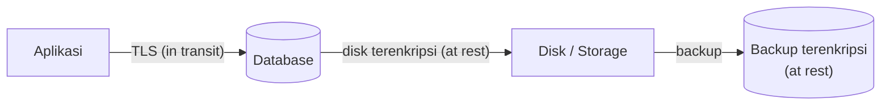

## TL;DR

Encryption in transit melindungi data selama ia **berpindah** antar dua titik — ini yang dikerjakan TLS/mTLS. Encryption at rest melindungi data selama ia **diam**, tersimpan di disk, backup, atau media penyimpanan lain. Keduanya menjawab ancaman yang berbeda: in transit mencegah data dibaca saat disadap di jaringan, at rest mencegah data dibaca kalau media penyimpanannya (disk server, backup, laptop yang hilang) jatuh ke tangan yang salah. Sistem yang hanya menerapkan salah satu punya lubang besar — TLS yang sempurna tidak melindungi apa pun kalau database backup-nya dicuri dalam bentuk tidak terenkripsi, dan database yang terenkripsi penuh tidak melindungi apa pun kalau data itu dikirim lewat HTTP polos.

## The Problem

Sebuah tim sudah menerapkan HTTPS di semua endpoint publik, merasa datanya "sudah aman", dan berhenti di situ. Suatu hari, mesin virtual yang menjalankan database production di-snapshot untuk keperluan migrasi ke provider cloud baru — snapshot itu (berisi seluruh isi disk, termasuk file database mentah) disimpan sementara di object storage yang konfigurasi aksesnya salah, sehingga bisa diakses publik selama beberapa jam sebelum ditemukan dan diperbaiki. Karena database itu tidak pernah dienkripsi at rest, seluruh datanya — termasuk data pribadi yang seharusnya paling dilindungi — bisa dibaca langsung dari file snapshot itu, tanpa perlu membobol aplikasi atau autentikasi apa pun.

TLS yang sudah diterapkan dengan benar sama sekali tidak relevan di skenario ini — TLS hanya melindungi data selama perjalanan lewat jaringan, dan insiden ini tidak melibatkan jaringan sama sekali. Ini yang membuat encryption at rest bukan opsional untuk data sensitif: ancaman yang dijawabnya — media penyimpanan yang dicuri, disalin, atau salah konfigurasi akses — sepenuhnya independen dari seberapa baik lapisan transportnya diamankan.

## Intuition

Cara paling mudah memahaminya: encryption in transit seperti **mengirim dokumen lewat kurir bersegel** — dokumen aman selama perjalanan dari titik A ke titik B, tapi begitu sampai dan disimpan di lemari arsip, keamanannya bergantung sepenuhnya pada apakah lemari itu **sendiri** terkunci. Encryption at rest adalah kunci lemari arsip itu — melindungi dokumen selama ia diam di tempat penyimpanannya, terlepas dari seberapa aman perjalanannya tadi.

Analogi ini bocor pada satu hal penting: kurir bersegel dan lemari terkunci di dunia fisik adalah dua sistem yang sepenuhnya independen dan tidak saling tahu. Di software, keduanya sering **berbagi infrastruktur kunci yang sama** (lihat [[Key Management and Rotation]]) — kunci yang dipakai mengenkripsi data at rest bisa jadi diterbitkan dan dikelola oleh sistem manajemen kunci yang sama dengan yang menerbitkan sertifikat untuk TLS in transit, sehingga kedua lapisan proteksi ini, meski menjawab ancaman berbeda, sering dibangun di atas fondasi manajemen kunci yang sama.

## How It Works


Data yang sama melewati dua lapisan proteksi berbeda tergantung keadaannya: terenkripsi TLS saat bergerak antar aplikasi dan database, lalu terenkripsi lagi (dengan mekanisme berbeda) saat diam di disk atau backup — kedua lapisan ini wajib ada karena ancamannya berbeda, bukan saling menggantikan.

Untuk in transit, mekanismenya sudah dibahas mendalam di [[../10 Foundations/The TLS Handshake|The TLS Handshake]] dan [[mTLS]]. Untuk at rest, ada tiga tingkat yang bisa dipilih, dari yang paling kasar sampai paling halus:

1. **Full disk encryption** — seluruh disk dienkripsi di tingkat sistem operasi atau storage layer (LUKS di Linux, atau enkripsi bawaan penyedia cloud). Melindungi dari pencurian media fisik atau snapshot disk mentah, tapi begitu sistem operasi berjalan dan disk ter-mount, data yang dibaca aplikasi sudah dalam bentuk plain text — tidak melindungi dari kompromi di tingkat aplikasi atau database.
2. **Transparent Data Encryption (TDE) di tingkat database** — database mengenkripsi file datanya sendiri secara transparan, aplikasi tetap melakukan query normal tanpa tahu ada enkripsi di baliknya. Melindungi dari pencurian file database mentah, tapi begitu database berjalan dan memproses query, hasilnya tetap plain text bagi siapa pun yang bisa query langsung ke database itu (termasuk penyerang yang berhasil melakukan SQL injection, lihat [[SQL Injection]]).
3. **Field-level encryption di tingkat aplikasi** — kolom tertentu (nomor identitas, data medis) dienkripsi oleh aplikasi sebelum disimpan, dan didekripsi hanya setelah dibaca kembali oleh aplikasi yang memegang kuncinya. Ini satu-satunya tingkat yang melindungi data itu **bahkan dari akun database yang kompromi atau SQL injection** — tapi mengorbankan kemampuan melakukan query langsung terhadap kolom itu (`WHERE nomor_identitas = ?` tidak bisa dipakai lagi kecuali dengan skema khusus, dan indexing biasa tidak berfungsi pada data terenkripsi).

## Under The Hood

Poin yang sering disalahpahami: **tidak satu pun dari ketiga tingkat di atas saling menggantikan** — masing-masing menjawab ancaman yang berbeda, dan sistem dengan data benar-benar sensitif biasanya memakai kombinasi. Full disk encryption menjawab "disk dicuri secara fisik." TDE menjawab "file database disalin tanpa lewat aplikasi." Field-level encryption menjawab "aplikasi atau database itu sendiri kompromi" — ancaman yang justru paling relevan untuk data paling sensitif, karena penyerang yang sudah mendapat akses query langsung (lewat SQL injection atau kredensial database yang bocor) tidak terhalang sama sekali oleh full disk encryption atau TDE, keduanya sudah "transparan" di titik itu.

Field-level encryption juga satu-satunya tingkat yang benar-benar butuh perhatian khusus soal [[Key Management and Rotation]] dari sisi aplikasi — kunci yang dipakai mengenkripsi kolom itu **tidak boleh disimpan di database yang sama** dengan data terenkripsinya (itu setara menyimpan kunci brankas di dalam brankas itu sendiri), dan harus dikelola lewat sistem terpisah seperti [[../92 Tools/Vault|Vault]] atau KMS.

## In Go

```go
package fieldcrypto

import (
	"crypto/aes"
	"crypto/cipher"
	"crypto/rand"
	"fmt"
	"io"
)

// Encrypt melakukan field-level encryption memakai AES-GCM — dipilih
// karena menyediakan authenticated encryption (mendeteksi kalau
// ciphertext diubah), bukan hanya kerahasiaan.
//
// key adalah data encryption key (DEK), BUKAN disimpan langsung di
// kode atau database yang sama — lihat [[Key Management and Rotation]]
// untuk envelope encryption yang mengelola key ini dengan benar.
func Encrypt(key []byte, plaintext []byte) ([]byte, error) {
	block, err := aes.NewCipher(key)
	if err != nil {
		return nil, fmt.Errorf("fieldcrypto: membuat cipher: %w", err)
	}

	gcm, err := cipher.NewGCM(block)
	if err != nil {
		return nil, fmt.Errorf("fieldcrypto: membuat GCM: %w", err)
	}

	nonce := make([]byte, gcm.NonceSize())
	if _, err := io.ReadFull(rand.Reader, nonce); err != nil {
		return nil, fmt.Errorf("fieldcrypto: membuat nonce: %w", err)
	}

	// Nonce disisipkan di depan ciphertext supaya Decrypt tidak perlu
	// menyimpannya terpisah — nonce tidak rahasia, hanya wajib unik
	// per operasi enkripsi dengan key yang sama.
	ciphertext := gcm.Seal(nonce, nonce, plaintext, nil)
	return ciphertext, nil
}

func Decrypt(key []byte, ciphertext []byte) ([]byte, error) {
	block, err := aes.NewCipher(key)
	if err != nil {
		return nil, fmt.Errorf("fieldcrypto: membuat cipher: %w", err)
	}

	gcm, err := cipher.NewGCM(block)
	if err != nil {
		return nil, fmt.Errorf("fieldcrypto: membuat GCM: %w", err)
	}

	nonceSize := gcm.NonceSize()
	if len(ciphertext) < nonceSize {
		return nil, fmt.Errorf("fieldcrypto: ciphertext terlalu pendek")
	}

	nonce, encrypted := ciphertext[:nonceSize], ciphertext[nonceSize:]
	plaintext, err := gcm.Open(nil, nonce, encrypted, nil)
	if err != nil {
		return nil, fmt.Errorf("fieldcrypto: dekripsi gagal (data diubah atau key salah): %w", err)
	}
	return plaintext, nil
}
```

## In His Stack

MariaDB pada instalasi standar **tidak** mengenkripsi data at rest secara default — mengaktifkannya butuh konfigurasi eksplisit (`innodb_encrypt_tables` dan sejenisnya, bervariasi tergantung versi).

> [!question] Perlu diverifikasi
> Klaim: nama parameter konfigurasi enkripsi InnoDB di atas.
> Kenapa ragu: nama dan perilaku parameter ini berbeda antar versi MariaDB/MySQL, dan berubah cukup sering.
> Cara verifikasi: dokumentasi resmi MariaDB bagian "Data at Rest Encryption" untuk versi yang benar-benar dipakai.

Untuk 13 aplikasi legal-services, kolom seperti nomor identitas kependudukan atau data personal lain adalah kandidat kuat untuk field-level encryption di tingkat aplikasi — bukan hanya mengandalkan TDE atau full disk encryption — justru karena ancaman yang paling relevan (SQL injection yang lolos, kredensial database yang bocor) sama sekali tidak terhalang oleh dua tingkat itu.

## Trade-offs and When Not To Use It

Field-level encryption mengorbankan kemampuan query langsung pada kolom itu — pencarian, sorting, dan indexing pada kolom terenkripsi tidak berfungsi seperti biasa, kecuali dengan skema khusus (deterministic encryption, yang punya trade-off keamanan sendiri karena nilai yang sama selalu menghasilkan ciphertext yang sama, sehingga pola data bisa bocor meski nilainya sendiri tidak terbaca). Untuk kolom yang memang perlu di-`WHERE` atau di-`JOIN` secara rutin, field-level encryption sering tidak praktis — pertimbangkan mengenkripsi hanya kolom yang benar-benar tidak perlu di-query langsung (data ditampilkan utuh, dicari lewat kolom lain yang tidak sensitif). Full disk encryption dan TDE, sebaliknya, hampir selalu sepadan diaktifkan karena overhead performanya kecil dan tidak mengubah cara aplikasi melakukan query sama sekali.

## Common Mistakes

> [!warning] Jebakan
> Menganggap HTTPS/TLS sudah cukup untuk "data aman" secara keseluruhan — TLS hanya menjawab ancaman in transit; backup, snapshot, dan disk yang tidak dienkripsi tetap jadi celah besar yang sepenuhnya di luar jangkauan TLS.

> [!warning] Jebakan
> Mengaktifkan TDE atau full disk encryption lalu berhenti di situ untuk data paling sensitif — keduanya transparan begitu sistem berjalan normal, sehingga tidak melindungi dari kompromi aplikasi atau database itu sendiri (SQL injection, kredensial bocor).

> [!warning] Jebakan
> Menyimpan kunci enkripsi field-level di kolom lain pada tabel yang sama, atau di file konfigurasi yang sama dengan database — ini meniadakan seluruh proteksi field-level encryption, karena siapa pun yang mendapat akses ke data juga otomatis mendapat kuncinya.

## Exercises

1. Jelaskan kenapa TLS yang diterapkan sempurna tidak melindungi dari insiden backup database yang bocor.
2. Sebutkan tiga tingkat encryption at rest, dan ancaman spesifik yang dijawab masing-masing.
3. Kenapa field-level encryption satu-satunya tingkat yang melindungi dari SQL injection, sementara TDE dan full disk encryption tidak?
4. Desain terbuka: salah satu dari 13 aplikasimu menyimpan nomor identitas kependudukan warga di kolom database biasa (tidak terenkripsi), dan kolom itu dipakai untuk pencarian (`WHERE nomor_identitas = ?`) di beberapa fitur. Rancang pendekatan menambahkan field-level encryption pada kolom ini tanpa mematikan fitur pencarian yang sudah ada.

> [!success]- Kunci jawaban
> **1.** TLS hanya mengamankan data selama bergerak lewat jaringan antara dua titik. Backup database, snapshot disk, dan file yang disalin ke media lain sama sekali tidak melewati jaringan saat "istirahat" di penyimpanan — ancamannya adalah pencurian atau kebocoran media penyimpanan itu sendiri, sesuatu yang sepenuhnya di luar cakupan TLS.
> **4.** Karena pencarian exact-match dibutuhkan, deterministic encryption adalah pendekatan yang realistis meski bukan yang paling kuat: (1) enkripsi nilai nomor identitas dengan skema yang menghasilkan ciphertext sama untuk plaintext sama (bukan AES-GCM biasa yang memakai nonce acak setiap kali); (2) simpan ciphertext ini di kolom yang sama, dan buat index pada ciphertext-nya, bukan plaintext; (3) saat mencari, aplikasi mengenkripsi nilai pencarian dengan skema yang sama sebelum melakukan query `WHERE`, sehingga pencocokan tetap berfungsi tanpa database pernah melihat plaintext; (4) terima trade-off eksplisit: karena deterministic, dua baris dengan nomor identitas sama akan punya ciphertext sama — pola kesamaan ini bisa terlihat meski nilainya sendiri tidak terbaca, cukup untuk kasus ini karena ancaman utamanya adalah pencurian data mentah, bukan analisis pola oleh penyerang yang sudah punya akses query.

## Self-Check

- Ancaman apa yang dijawab encryption in transit, dan ancaman apa yang dijawab encryption at rest?
- Sebutkan tiga tingkat encryption at rest dari paling kasar ke paling halus.
- Kenapa TDE tidak melindungi dari SQL injection yang berhasil?
- Kenapa kunci field-level encryption tidak boleh disimpan di tabel atau server yang sama dengan datanya?

## Connected Notes

- [[Key Management and Rotation]] — envelope encryption dan pengelolaan kunci yang dibahas di note itu adalah fondasi yang membuat field-level encryption di note ini bisa dikelola dengan aman.
- [[../10 Foundations/The TLS Handshake|The TLS Handshake]] dan [[mTLS]] — mekanisme konkret encryption in transit yang jadi kontras utama note ini.
- [[SQL Injection]] — ancaman konkret yang menunjukkan kenapa TDE dan full disk encryption tidak cukup untuk data paling sensitif.
- [[Audit Logging]] — kelanjutan langsung: setelah data dilindungi, langkah berikutnya adalah mencatat siapa yang mengaksesnya, dibahas di note berikutnya.
- [[../92 Tools/Vault|Vault]] — tool konkret untuk mengelola kunci field-level encryption secara terpisah dari data yang dilindunginya.

## Further Reading

- Dokumentasi resmi paket `crypto/cipher` dan `crypto/aes` Go, khususnya mode GCM untuk authenticated encryption.

## Catatan Saya

*Tulis di sini kolom data paling sensitif di salah satu dari 13 aplikasimu, dan tingkat encryption at rest mana (kalau ada) yang sebenarnya diterapkan padanya sekarang.*
