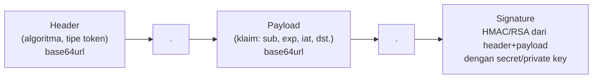

## TL;DR

JWT (JSON Web Token) adalah format token yang membungkus sekumpulan klaim (claims) — data tentang siapa pemilik token dan kapan ia kedaluwarsa — sebagai JSON yang di-encode dan **ditandatangani secara kriptografis**, bukan dienkripsi. Siapa pun yang punya token bisa membaca isinya (hanya perlu decode base64, bukan mendekripsi apa pun), tapi hanya pihak yang punya kunci rahasia (atau public key, tergantung algoritma) yang bisa memverifikasi bahwa token itu memang diterbitkan oleh server yang sah dan belum diubah. Masalah paling umum bukan JWT itu sendiri, melainkan dipakai untuk kasus yang salah: menyimpan data sensitif di dalam klaim (karena isinya bisa dibaca siapa saja), atau dipakai sebagai pengganti session untuk kasus yang justru butuh pencabutan instan.

## The Problem

Sebuah tim menyisipkan nomor KTP dan nama lengkap pengguna langsung sebagai klaim di dalam JWT, dengan asumsi "kan sudah ditandatangani, jadi aman". Beberapa minggu kemudian, seorang engineer front-end men-decode token itu (hanya perlu base64 decode, tersedia di jwt.io atau bahkan satu baris JavaScript) untuk debugging, dan menyadari data pribadi warga sudah terpampang jelas di dalam token yang tersimpan di local storage browser — bisa dibaca siapa pun yang punya akses ke perangkat itu atau lewat serangan XSS (lihat [[XSS]]) yang berhasil membaca local storage. "Ditandatangani" hanya menjamin **integritas** (tidak diubah) dan **keaslian penerbit**, sama sekali tidak menjamin **kerahasiaan** isi — kesalahan pemahaman ini adalah salah satu penyebab kebocoran data paling umum terkait JWT.

Masalah kedua: sebuah sistem menerbitkan JWT dengan masa berlaku 24 jam untuk kenyamanan pengguna (tidak perlu login ulang terlalu sering), lalu suatu hari sebuah akun terbukti disusupi. Tim ingin segera mencabut akses akun itu, tapi menyadari JWT yang sudah diterbitkan **tidak bisa dicabut** — token itu tetap lolos verifikasi signature sampai 24 jam berlalu, apa pun yang dilakukan di sisi database, karena verifikasi JWT murni tidak pernah menyentuh database sama sekali.

## Intuition

JWT seperti **ijazah yang sudah dicap dan ditandatangani kepala sekolah** — siapa pun yang memegangnya bisa langsung membaca isinya (nama, nilai, jurusan) tanpa perlu bertanya ke sekolah, dan siapa pun yang tahu bagaimana cap resmi sekolah itu terlihat bisa memverifikasi keasliannya. Tapi persis karena itu, ijazah ini **tidak dirahasiakan** dari siapa pun yang memegangnya — dan begitu dicetak dan diberikan, sekolah tidak bisa "menariknya kembali" dari tangan yang sudah menerimanya; yang bisa dilakukan sekolah hanyalah mengumumkan "ijazah nomor sekian batal", tapi orang yang memeriksa keasliannya di lapangan harus tahu untuk memeriksa pengumuman itu — persis seperti mekanisme blocklist tambahan yang harus dibangun terpisah dari JWT itu sendiri.

Analogi ini bocor pada satu hal: ijazah fisik butuh usaha nyata untuk dipalsukan (mencetak ulang dengan cap yang identik), sementara JWT yang ditandatangani dengan algoritma lemah atau kunci yang bocor bisa dipalsukan murni dengan komputasi — kekuatan "cap" JWT sepenuhnya bergantung pada kerahasiaan kunci penandatangan dan kekuatan algoritma yang dipakai, bukan pada kesulitan fisik memalsukan sesuatu.

## How It Works

Sebuah JWT terdiri dari tiga bagian dipisahkan titik: `header.payload.signature`.



Diagram ini menunjukkan bahwa header dan payload hanya di-encode base64url — **bukan dienkripsi** — sehingga siapa pun bisa membacanya tanpa kunci apa pun. Hanya signature yang butuh kunci rahasia untuk dihasilkan (dan, tergantung algoritma, untuk diverifikasi).

Dua keluarga algoritma yang paling umum:

- **HS256** (HMAC-SHA256, *symmetric*): satu secret key yang sama dipakai untuk menandatangani **dan** memverifikasi. Cocok kalau hanya satu service yang menerbitkan dan memverifikasi token — begitu secret ini perlu dibagikan ke banyak service lain untuk verifikasi, setiap service yang memegangnya juga punya kemampuan **menerbitkan** token palsu, bukan hanya memverifikasi.
- **RS256** (RSA signature, *asymmetric*): private key untuk menandatangani (hanya dipegang server penerbit), public key untuk memverifikasi (bisa dibagikan bebas ke service lain). Ini cocok untuk sistem dengan banyak service yang perlu memverifikasi token tapi tidak semuanya berhak menerbitkannya — public key boleh bocor tanpa risiko pemalsuan, karena memverifikasi tidak sama dengan bisa menandatangani.

Klaim standar yang penting: `exp` (waktu kedaluwarsa, wajib diperiksa), `iat` (waktu diterbitkan), `sub` (subject, biasanya user ID), `iss` (issuer, siapa yang menerbitkan).

## In Go

```go
package auth

import (
	"context"
	"fmt"
	"time"

	"github.com/golang-jwt/jwt/v5"
)

type KlaimPengguna struct {
	UserID int64  `json:"user_id"`
	Peran  string `json:"peran"`
	jwt.RegisteredClaims
}

// TerbitkanJWT membuat token bertanda tangan HS256 dengan masa berlaku
// pendek. Perhatikan: TIDAK ada data sensitif (nama lengkap, NIK, email) di
// klaim — hanya identifier yang boleh dibaca siapa pun yang memegang token.
func TerbitkanJWT(userID int64, peran string, secretKey []byte) (string, error) {
	klaim := KlaimPengguna{
		UserID: userID,
		Peran:  peran,
		RegisteredClaims: jwt.RegisteredClaims{
			ExpiresAt: jwt.NewNumericDate(time.Now().Add(5 * time.Minute)),
			IssuedAt:  jwt.NewNumericDate(time.Now()),
			Issuer:    "layanan-legal-pemerintah",
		},
	}

	token := jwt.NewWithClaims(jwt.SigningMethodHS256, klaim)
	signed, err := token.SignedString(secretKey)
	if err != nil {
		return "", fmt.Errorf("tanda tangani token: %w", err)
	}
	return signed, nil
}

// VerifikasiJWT memvalidasi signature DAN memastikan algoritma yang dipakai
// token memang yang diharapkan — memeriksa alg secara eksplisit mencegah
// serangan "alg confusion" di mana penyerang mengirim token dengan alg=none
// atau alg berbeda, berharap sisi verifikasi tidak memeriksa algoritma
// dengan ketat.
func VerifikasiJWT(ctx context.Context, tokenString string, secretKey []byte) (*KlaimPengguna, error) {
	klaim := &KlaimPengguna{}

	token, err := jwt.ParseWithClaims(tokenString, klaim, func(t *jwt.Token) (interface{}, error) {
		if _, ok := t.Method.(*jwt.SigningMethodHMAC); !ok {
			return nil, fmt.Errorf("algoritma signing tidak diharapkan: %v", t.Header["alg"])
		}
		return secretKey, nil
	})
	if err != nil {
		return nil, fmt.Errorf("verifikasi token: %w", err)
	}

	if !token.Valid {
		return nil, fmt.Errorf("token tidak valid")
	}

	return klaim, nil
}
```

Masa berlaku sengaja diset pendek (5 menit) di contoh ini — pola access token + refresh token yang dibahas di [[Sessions vs Tokens]], supaya jendela risiko kalau token bocor tetap kecil, dan kebutuhan pencabutan bisa ditangani lewat refresh token yang statusnya tersimpan di server.

## In His Stack

JWT sangat umum dipakai sebagai jembatan autentikasi antar service dalam arsitektur yang melibatkan Kafka dan Kubernetes — misalnya, sebuah service Go yang menerima request dari API gateway bisa memverifikasi JWT secara lokal (RS256 dengan public key yang di-share lewat Kubernetes ConfigMap) tanpa perlu memanggil service autentikasi terpusat untuk setiap request, mengurangi latensi dan coupling antar service. Kontras dengan Yii2, yang secara historis lebih sering memakai session berbasis cookie untuk aplikasi web tradisional server-rendered — JWT menjadi relevan justru ketika arsitektur bergeser ke API yang dikonsumsi banyak jenis klien berbeda (web, mobile, service-to-service), pola yang makin umum begitu Next.js dan aplikasi mobile mulai dipisah dari backend Yii2/Go.

## Trade-offs and When Not To Use It

JWT unggul ketika verifikasi perlu dilakukan di banyak tempat tanpa bergantung pada satu database sesi terpusat — cocok untuk arsitektur microservices dengan banyak service independen. Tapi untuk sistem yang butuh kemampuan mencabut akses secara instan dan sering (bukan hanya kasus disusupi yang jarang terjadi), JWT murni adalah pilihan yang salah — beban mengelola blocklist pencabutan pada akhirnya meniadakan keuntungan "tidak perlu cek database" yang jadi alasan awal memilih JWT. JWT juga menambah **ukuran** setiap request (token yang dikirim di setiap header `Authorization` jauh lebih besar dari session ID pendek), yang jadi pertimbangan nyata untuk sistem dengan volume request sangat tinggi dan bandwidth terbatas (misalnya, klien mobile di jaringan lambat).

## Common Mistakes

> [!warning] Jebakan
> Menyimpan data sensitif (NIK, email, nomor telepon) langsung di klaim JWT — payload JWT hanya di-encode base64, bisa dibaca siapa pun yang memegang token tanpa kunci apa pun, sama sekali bukan mekanisme kerahasiaan.

> [!warning] Jebakan
> Tidak memeriksa algoritma (`alg`) secara eksplisit saat verifikasi, membiarkan library menerima algoritma apa pun yang tertulis di header token — celah ini dikenal sebagai "alg confusion attack", di mana penyerang mengubah `alg` menjadi `none` atau algoritma lain untuk melewati verifikasi signature.

> [!warning] Jebakan
> Memberi masa berlaku (`exp`) yang sangat panjang (berhari-hari) pada access token tanpa mekanisme pencabutan tambahan, dengan alasan kenyamanan pengguna — memperbesar jendela risiko kalau token bocor, dan menghilangkan kemampuan mencabut akses tepat waktu untuk kebutuhan compliance.

## Exercises

1. Jelaskan kenapa JWT yang "ditandatangani" tidak sama dengan JWT yang "dienkripsi", dan implikasinya terhadap data apa yang boleh dimasukkan ke klaim.
2. Kapan HS256 menjadi pilihan yang salah dibanding RS256, dari sisi jumlah service yang perlu memverifikasi token?
3. Apa itu "alg confusion attack", dan bagaimana kode verifikasi harus ditulis untuk mencegahnya?
4. Desain terbuka: sebuah sistem legal-services melayani tiga jenis klien — aplikasi Next.js untuk pegawai internal, aplikasi mobile untuk masyarakat umum, dan beberapa service Go internal yang saling memanggil. Rancang skema penggunaan JWT (algoritma, masa berlaku, mekanisme pencabutan) yang berbeda untuk masing-masing jenis klien kalau memang perlu berbeda, dan jelaskan alasannya.

> [!success]- Kunci jawaban
> **1.** "Ditandatangani" berarti header dan payload tetap bisa dibaca siapa pun (hanya di-encode, bukan dienkripsi) — signature hanya membuktikan bahwa isi itu belum diubah dan memang berasal dari penerbit yang memegang kunci yang benar. Karena itu, data apa pun yang tidak boleh dilihat pihak yang memegang token (termasuk pengguna itu sendiri lewat local storage browser, atau siapa pun yang mencegat token lewat XSS) tidak boleh dimasukkan ke klaim — hanya identifier non-sensitif (user ID, peran) yang aman disertakan.
> **4.** Untuk aplikasi Next.js pegawai internal (kebutuhan pencabutan cepat lebih penting, akses ke data sensitif legal-services), pola access token pendek (HS256, karena hanya satu service penerbit dan satu API yang memverifikasi) + refresh token tersimpan server lebih tepat, memberi kemampuan mencabut akses cepat lewat refresh token. Untuk aplikasi mobile masyarakat umum (volume tinggi, kebutuhan pencabutan tidak sekritis pegawai internal), token dengan masa berlaku sedikit lebih panjang bisa diterima demi mengurangi frekuensi refresh, tapi tetap dengan refresh token terpisah untuk sesi yang lebih panjang. Untuk komunikasi service-to-service internal, RS256 lebih tepat karena banyak service perlu memverifikasi token yang diterbitkan satu authorization server terpusat — public key dibagikan bebas ke seluruh service (lewat Kubernetes Secret atau ConfigMap) tanpa risiko service mana pun bisa memalsukan token, karena hanya authorization server yang memegang private key untuk menandatangani.

## Self-Check

- Apa yang sebenarnya dilindungi oleh signature JWT, dan apa yang tidak?
- Kenapa memeriksa `alg` secara eksplisit saat verifikasi itu penting?
- Kapan RS256 lebih tepat dibanding HS256?
- Kenapa JWT murni tidak cocok untuk sistem yang butuh mencabut akses secara instan dan sering?

## Connected Notes

- [[Sessions vs Tokens]] — JWT adalah salah satu implementasi konkret dari model token yang dibahas secara umum di note itu, termasuk pola access token + refresh token untuk mengatasi keterbatasan pencabutan.
- [[OAuth2 Overview]] — JWT sering dipakai sebagai format access token yang diterbitkan dalam alur OAuth2, meski keduanya adalah hal yang berbeda (OAuth2 adalah protokol, JWT adalah format token).
- [[XSS]] — token yang tersimpan di local storage browser rentan dicuri lewat XSS, salah satu alasan kenapa data sensitif tidak boleh ada di klaim.
- [[RBAC]] — klaim `peran` di JWT sering menjadi input langsung untuk keputusan otorisasi RBAC di layer berikutnya.
- [[Key Management and Rotation]] — kunci penandatangan JWT (secret HS256 atau private key RS256) butuh siklus rotasi yang dibahas lebih dalam di note senior itu.

## Further Reading

- RFC 7519 (JSON Web Token) — spesifikasi resmi struktur dan klaim standar JWT.
- Dokumentasi package `github.com/golang-jwt/jwt`.

## Catatan Saya

*Tulis di sini apakah sistem kerjaanmu memakai JWT, dan kalau ya, klaim apa saja yang saat ini disertakan — apakah ada yang seharusnya tidak di situ?*
