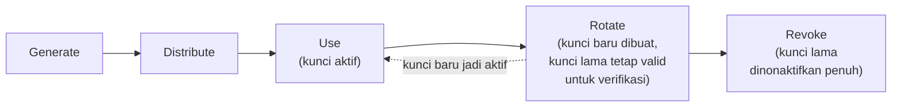

## TL;DR

Key management adalah mengelola kunci kriptografi (kunci enkripsi, kunci penandatanganan JWT, sertifikat mTLS) sebagai **siklus hidup** — dibuat, disimpan, dipakai, dirotasi, dan akhirnya dicabut — bukan sebagai nilai statis yang dibuat sekali lalu dilupakan. [[Secret Management]] menjawab pertanyaan "di mana kredensial disimpan supaya tidak bocor"; key management menjawab pertanyaan lanjutannya: "apa yang terjadi kalau kunci ini bocor, atau perlu diganti, tanpa mematikan sistem yang masih memakainya?" Jawabannya, hampir selalu, adalah rotasi — mengganti kunci secara berkala dan terencana, dengan periode tumpang tindih di mana kunci lama dan baru sama-sama valid.

## The Problem

Sebuah service menandatangani JWT dengan satu kunci privat yang di-hardcode saat aplikasi pertama kali dibangun, dua tahun lalu. Kunci itu tidak pernah diganti — tidak ada proses untuk menggantinya, dan tidak ada yang berani mengganti karena tidak jelas apa yang akan rusak kalau diganti. Suatu hari, kunci itu ditemukan ada di riwayat commit Git publik (masalah [[Secret Management]] klasik). Tim ingin segera menggantinya, tapi menyadari masalah kedua: **seluruh token yang sudah diterbitkan dengan kunci lama akan langsung invalid** begitu kunci diganti, memaksa logout paksa untuk semua pengguna aktif secara serentak — dan tidak ada cara mengganti kunci secara bertahap karena sistem hanya pernah didesain untuk satu kunci aktif dalam satu waktu.

Masalah aslinya bukan hanya "kunci bocor" — itu bisa terjadi pada sistem manapun cepat atau lambat. Masalah aslinya adalah sistem tidak pernah didesain untuk skenario **rotasi terencana**, sehingga saat rotasi benar-benar dibutuhkan (baik karena kebocoran maupun kebijakan keamanan rutin), satu-satunya pilihan yang tersedia adalah rotasi mendadak yang merusak pengalaman pengguna, dibanding rotasi mulus yang seharusnya jadi operasi rutin tanpa dampak terasa.

## Intuition

Cara paling mudah memahaminya: kunci kriptografi seperti **kunci fisik gedung kantor**. Begitu seorang karyawan resign, kebijakan keamanan yang baik tidak menunggu sampai kunci itu "kelihatan" disalahgunakan — gedung langsung **rekey** (ganti kunci) sebagai prosedur standar, dan karyawan yang masih aktif diberi kunci baru sebelum kunci lama benar-benar dinonaktifkan, supaya tidak ada satu momen pun di mana karyawan yang sah tidak bisa masuk gedung.

Analogi ini berhenti bekerja di soal skala dan kecepatan. Rekey gedung fisik adalah kejadian langka (karyawan resign, bukan kejadian harian). Rotasi kunci kriptografi yang matang justru dirancang untuk terjadi **rutin dan sering** — bukan hanya saat insiden — karena setiap hari kunci itu belum dirotasi adalah setiap hari tambahan risiko yang terakumulasi kalau kunci itu ternyata sudah bocor tanpa disadari.

## How It Works

Siklus hidup kunci punya lima tahap: **generate** (dibuat dengan sumber keacakan yang kuat), **distribute** (disebarkan ke sistem yang membutuhkannya, lewat mekanisme aman — lihat [[Secret Management]]), **use** (dipakai untuk enkripsi/dekripsi atau penandatanganan), **rotate** (diganti secara berkala, dengan periode tumpang tindih), dan **revoke** (dicabut sepenuhnya setelah periode tumpang tindih berakhir atau saat insiden).


Titik paling penting di diagram ini adalah tahap **Rotate**: kunci baru mulai dipakai untuk operasi baru (menandatangani token baru, mengenkripsi data baru), sementara kunci lama tetap dipertahankan **hanya untuk verifikasi** data lama (memverifikasi token lama yang belum kedaluwarsa, mendekripsi data lama yang belum di-reenkripsi) — bukan langsung dihapus. Tanpa periode tumpang tindih ini, rotasi kunci berarti semua yang ditandatangani atau dienkripsi dengan kunci lama langsung invalid, persis masalah yang terjadi di skenario JWT di atas.

## Under The Hood

Mekanisme yang membuat rotasi mulus mungkin terjadi disebut **key versioning** — setiap kunci diberi identitas (`kid`, key ID) yang disertakan bersama data yang ditandatangani atau dienkripsi, supaya sistem yang memverifikasi tahu **kunci versi mana** yang harus dipakai untuk memverifikasi item tertentu, tanpa harus mencoba semua kunci yang pernah ada satu per satu. Pada JWT, ini muncul sebagai header `kid` di setiap token; sistem verifikasi menyimpan beberapa kunci publik aktif sekaligus (biasanya diambil dari JWKS endpoint), dicocokkan berdasarkan `kid` token yang masuk.

Untuk enkripsi data (bukan penandatanganan), pola yang umum dipakai adalah **envelope encryption**: data tidak langsung dienkripsi dengan kunci utama (key encryption key/KEK) yang dikelola sistem manajemen kunci terpusat (KMS), melainkan dienkripsi dengan kunci acak sekali pakai (data encryption key/DEK) yang jauh lebih murah dibuat ulang, dan DEK itu sendiri yang dienkripsi memakai KEK lalu disimpan bersama data terenkripsi. Rotasi KEK, dalam skema ini, tidak berarti mengenkripsi ulang seluruh data yang sudah ada — cukup mendekripsi-lalu-mengenkripsi-ulang DEK yang jauh lebih kecil, jauh lebih murah dibanding mengenkripsi ulang seluruh dataset setiap kali KEK dirotasi.

## In Go

```go
package keys

import (
	"context"
	"crypto/rsa"
	"fmt"
	"time"
)

// KeyVersion merepresentasikan satu versi kunci dalam siklus rotasi —
// kid adalah identitas yang disertakan di setiap token yang
// ditandatangani, supaya verifikasi tahu kunci mana yang dipakai.
type KeyVersion struct {
	KID        string
	PrivateKey *rsa.PrivateKey
	PublicKey  *rsa.PublicKey
	ExpiresAt  time.Time // kapan kunci ini berhenti dipakai UNTUK MENANDATANGANI baru
}

// KeyStore menyimpan kunci aktif DAN kunci lama yang masih valid untuk
// verifikasi — inilah yang membuat rotasi tidak merusak token lama
// yang belum kedaluwarsa.
type KeyStore struct {
	active *KeyVersion
	prior  map[string]*KeyVersion // kid -> versi lama, untuk verifikasi saja
}

func (ks *KeyStore) SigningKey() *KeyVersion {
	return ks.active
}

// VerificationKey mencari kunci berdasarkan kid dari token yang masuk —
// bisa jadi kunci aktif, atau kunci lama yang masih dalam masa
// tumpang tindih.
func (ks *KeyStore) VerificationKey(kid string) (*KeyVersion, error) {
	if ks.active != nil && ks.active.KID == kid {
		return ks.active, nil
	}
	if kv, ok := ks.prior[kid]; ok {
		return kv, nil
	}
	return nil, fmt.Errorf("keys: kid %q tidak dikenal atau sudah dicabut", kid)
}

// Rotate memindahkan kunci aktif saat ini ke daftar kunci lama
// (masih valid untuk verifikasi), lalu memasang kunci baru sebagai
// kunci aktif untuk penandatanganan berikutnya.
func (ks *KeyStore) Rotate(ctx context.Context, newKey *KeyVersion) {
	if ks.active != nil {
		if ks.prior == nil {
			ks.prior = make(map[string]*KeyVersion)
		}
		ks.prior[ks.active.KID] = ks.active
	}
	ks.active = newKey
}

// Revoke menghapus kunci lama dari daftar verifikasi sepenuhnya —
// dipanggil SETELAH periode tumpang tindih berakhir (misalnya
// setelah token dengan kid lama dipastikan sudah kedaluwarsa semua).
func (ks *KeyStore) Revoke(kid string) {
	delete(ks.prior, kid)
}
```

## In His Stack

Sistem legal-services yang menandatangani dokumen atau menerbitkan token untuk 13 aplikasi punya risiko konkret kalau kunci penandatanganan sama sekali tidak pernah dirotasi — begitu kunci itu bocor (lewat repository yang salah konfigurasi, laptop developer yang hilang), tidak ada cara mencabutnya tanpa membatalkan seluruh token aktif secara serentak. Praktik minimal yang realistis: pakai [[../92 Tools/Vault|Vault]] atau KMS serupa untuk menyimpan dan menerbitkan kunci, terapkan `kid` di setiap JWT yang diterbitkan sejak awal (bukan ditambahkan belakangan setelah insiden), dan jadwalkan rotasi rutin (bukan hanya rotasi darurat) supaya proses rotasi teruji secara berkala, bukan pertama kali dicoba justru saat insiden sungguhan sedang berlangsung.

## Trade-offs and When Not To Use It

Membangun infrastruktur key versioning penuh (KMS terpisah, envelope encryption, rotasi otomatis terjadwal) adalah investasi yang tidak sepadan untuk sistem kecil dengan satu atau dua kunci yang risikonya rendah dan mudah diganti manual tanpa dampak besar. Investasi ini menjadi jelas sepadan begitu kunci itu menandatangani sesuatu yang **tidak bisa dibatalkan sepihak** tanpa dampak luas (token sesi aktif untuk ribuan pengguna, dokumen yang tanda tangannya jadi bukti hukum) — di titik itu, biaya membangun rotasi mulus di awal jauh lebih murah dibanding biaya insiden rotasi darurat yang memaksa downtime atau logout massal.

## Common Mistakes

> [!warning] Jebakan
> Mendesain sistem hanya untuk satu kunci aktif tanpa mekanisme `kid`/versioning — begitu rotasi benar-benar dibutuhkan, satu-satunya pilihan adalah mengganti kunci sekaligus, membatalkan semua yang ditandatangani kunci lama secara serentak.

> [!warning] Jebakan
> Merotasi kunci tapi langsung menghapus kunci lama tanpa periode tumpang tindih — token atau data yang masih memakai kunci lama langsung gagal diverifikasi, meski belum kedaluwarsa secara alami.

> [!warning] Jebakan
> Tidak pernah menguji proses rotasi sampai insiden sungguhan memaksa rotasi darurat — proses yang belum pernah dijalankan cenderung punya asumsi tersembunyi yang gagal justru saat paling dibutuhkan, saat tekanan waktu paling tinggi.

## Exercises

1. Jelaskan lima tahap siklus hidup kunci, dan kenapa "revoke" harus dipisah dari "rotate", tidak digabung jadi satu langkah.
2. Apa peran `kid` (key ID) dalam membuat rotasi kunci penandatanganan JWT berjalan mulus?
3. Jelaskan envelope encryption dan kenapa pola ini membuat rotasi KEK jauh lebih murah dibanding mengenkripsi ulang seluruh dataset.
4. Desain terbuka: salah satu dari 13 aplikasimu menandatangani JWT dengan satu kunci privat yang sudah dipakai dua tahun tanpa `kid` sama sekali, dan token yang diterbitkan berlaku sampai 30 hari. Kamu perlu mulai rotasi rutin tanpa memaksa logout massal pengguna aktif. Rancang langkah migrasinya.

> [!success]- Kunci jawaban
> **1.** Generate (kunci dibuat), Distribute (disebarkan ke sistem yang butuh), Use (dipakai aktif), Rotate (kunci baru jadi aktif, kunci lama dipertahankan hanya untuk verifikasi selama masa tumpang tindih), Revoke (kunci lama dinonaktifkan penuh). Revoke dipisah dari Rotate karena keduanya butuh **waktu berbeda**: rotate terjadi segera (kunci baru langsung dipakai untuk operasi baru), sementara revoke baru aman dilakukan setelah dipastikan tidak ada lagi data/token valid yang masih bergantung pada kunci lama — menggabungkan keduanya berarti memaksa revoke terjadi sebelum masa tumpang tindih selesai.
> **4.** (1) Tambahkan field `kid` ke skema penandatanganan JWT tanpa mengganti kunci dulu — kunci lama diberi `kid` tertentu, di-deploy, dan dipastikan token baru menyertakan `kid` ini tanpa masalah; (2) buat kunci baru dengan `kid` berbeda, pasang sebagai kunci aktif untuk penandatanganan token **baru**, sementara kunci lama tetap ada di daftar verifikasi; (3) karena token lama berlaku sampai 30 hari, pertahankan kunci lama di daftar verifikasi minimal 30 hari sejak rotasi (mencakup token dengan masa berlaku terpanjang yang mungkin masih beredar); (4) setelah masa tumpang tindih itu lewat dan dipastikan tidak ada lagi token dengan `kid` lama yang valid, cabut kunci lama sepenuhnya; (5) jadwalkan rotasi berikutnya sebagai proses rutin (misalnya tiap 90 hari), bukan menunggu insiden lagi.

## Self-Check

- Sebutkan lima tahap siklus hidup kunci.
- Apa fungsi `kid` dalam rotasi kunci penandatanganan?
- Apa itu envelope encryption, dan kenapa ia membuat rotasi KEK murah?
- Kenapa periode tumpang tindih wajib ada antara rotate dan revoke?

## Connected Notes

- [[Secret Management]] — key management adalah lanjutan dari secret management: bukan hanya "di mana disimpan", tapi "bagaimana siklus hidupnya dikelola dari waktu ke waktu."
- [[mTLS]] — sertifikat mTLS adalah salah satu jenis kunci yang butuh rotasi rutin, dengan tantangan operasional yang sama seperti dibahas di note ini.
- [[Encryption at Rest vs In Transit]] — envelope encryption yang dibahas di note ini adalah mekanisme inti untuk enkripsi data at rest, dibahas lebih dalam di note berikutnya.
- [[../92 Tools/Vault|Vault]] — tool yang mengimplementasikan sebagian besar mekanisme key management di note ini (penyimpanan, penerbitan, rotasi kunci) secara terkelola.
- [[JWT - Structure, Signature, and When It Is The Wrong Tool]] — `kid` di header JWT adalah penerapan langsung key versioning yang dibahas di note ini.

## Further Reading

- Dokumentasi resmi `crypto/rand` dan `crypto/rsa` Go untuk pembuatan kunci dengan sumber keacakan yang aman secara kriptografis.

## Catatan Saya

*Tulis di sini kunci atau kredensial mana di pekerjaanmu yang belum pernah dirotasi sejak dibuat, dan risiko konkret yang muncul kalau ternyata sudah bocor tanpa disadari.*
