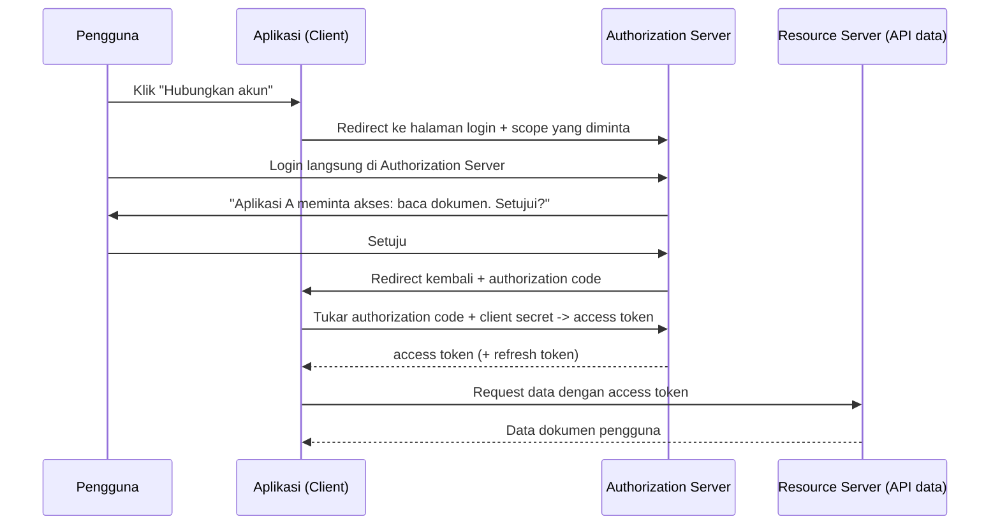

## TL;DR

OAuth2 menjawab satu masalah spesifik: bagaimana Aplikasi A bisa mengakses data milik pengguna yang tersimpan di Layanan B, **tanpa** pengguna pernah memberikan password akun Layanan B ke Aplikasi A. Alih-alih berbagi password, pengguna login langsung di Layanan B (yang dipercaya), lalu Layanan B memberi Aplikasi A sebuah **access token** terbatas — terbatas dalam hal apa yang boleh diakses (scope) dan berapa lama (masa berlaku). OAuth2 adalah protokol **otorisasi delegasi**, bukan protokol autentikasi — kesalahan memahami ini adalah sumber sebagian besar implementasi OAuth2 yang keliru.

## The Problem

Sebuah aplikasi pihak ketiga butuh membaca daftar dokumen milik pengguna yang tersimpan di sistem penyimpanan cloud milik instansi lain. Pendekatan paling naif: minta pengguna memasukkan username dan password akun penyimpanan cloud itu langsung ke form di aplikasi pihak ketiga, lalu aplikasi itu login atas nama pengguna menggunakan credential tadi. Pendekatan ini punya banyak masalah sekaligus: aplikasi pihak ketiga kini memegang password penuh milik pengguna (bisa disalahgunakan untuk mengakses apa pun, bukan hanya dokumen), tidak ada cara mencabut akses aplikasi ketiga itu tanpa mengganti password (yang berarti memutus akses semua aplikasi lain juga), dan pengguna tidak pernah benar-benar tahu atau menyetujui akses spesifik apa yang diberikan — semuanya atau tidak sama sekali.

Masalah kedua yang lebih halus: sebuah tim mengira "kami sudah pakai OAuth2, jadi sistem login kami sudah aman dan modern", padahal yang sebenarnya mereka butuhkan hanyalah autentikasi biasa (memverifikasi identitas pengguna sendiri) — bukan delegasi akses ke data pihak ketiga. Memaksakan OAuth2 untuk kasus ini menambah kompleksitas (authorization server terpisah, redirect flow, token exchange) tanpa manfaat nyata, karena masalah yang sebenarnya dipecahkan OAuth2 (delegasi akses lintas pihak) tidak pernah ada di situ.

## Intuition

OAuth2 seperti **kartu akses tamu di gedung perkantoran** — alih-alih memberikan kunci pribadimu (password) ke tamu supaya bisa masuk ke ruanganmu, resepsionis (authorization server) memverifikasi identitasmu langsung, lalu menerbitkan kartu tamu (access token) yang hanya bisa membuka pintu tertentu (scope terbatas) dan berlaku hanya untuk hari itu (masa berlaku terbatas). Tamu tidak pernah tahu atau memegang kunci aslimu, dan resepsionis bisa menonaktifkan kartu tamu itu kapan saja tanpa perlu mengganti kunci pribadimu.

Analogi ini bocor pada satu hal: kartu akses fisik biasanya butuh kehadiran resepsionis setiap kali diterbitkan, sementara OAuth2 punya beberapa "flow" berbeda untuk skenario yang berbeda (aplikasi web dengan backend server, aplikasi mobile tanpa backend rahasia, komunikasi service-to-service tanpa pengguna sama sekali) — memilih flow yang salah untuk konteksnya adalah kesalahan implementasi OAuth2 yang umum, dan analogi kartu tamu tunggal ini tidak menangkap perbedaan penting antar flow tersebut.

## How It Works

Flow yang paling relevan dan paling aman untuk aplikasi dengan backend server (bukan aplikasi mobile murni atau single-page app tanpa backend) adalah **Authorization Code flow**:



Diagram ini menunjukkan poin krusial: **pengguna tidak pernah memasukkan password di Aplikasi A** — login selalu terjadi langsung di Authorization Server (biasanya lewat redirect browser), dan Aplikasi A hanya menerima kode sementara (authorization code) yang baru ditukar jadi access token lewat request server-to-server yang juga menyertakan `client secret` — inilah kenapa flow ini butuh backend server yang bisa menyimpan secret dengan aman, tidak cocok untuk aplikasi yang seluruh kodenya berjalan di browser/mobile tanpa backend rahasia.

Empat peran yang selalu ada dalam OAuth2: **Resource Owner** (pengguna, pemilik data), **Client** (aplikasi yang meminta akses), **Authorization Server** (yang memverifikasi identitas dan menerbitkan token), **Resource Server** (yang menyimpan data dan menerima token untuk memutuskan akses).

## In Go

```go
package oauth

import (
	"context"
	"fmt"
	"net/http"

	"golang.org/x/oauth2"
)

// KonfigurasiOAuth mendefinisikan endpoint authorization server dan scope
// yang diminta. Nilai ClientID/ClientSecret HARUS datang dari environment
// atau secret manager, bukan hardcode — lihat
// [[../70 Infrastructure and Delivery/Configuration via Environment (12-Factor App)|Configuration via Environment (12-Factor App)]].
func KonfigurasiOAuth(clientID, clientSecret, redirectURL string) *oauth2.Config {
	return &oauth2.Config{
		ClientID:     clientID,
		ClientSecret: clientSecret,
		RedirectURL:  redirectURL,
		Scopes:       []string{"read:dokumen"},
		Endpoint: oauth2.Endpoint{
			AuthURL:  "https://authorization-server.example.gov.id/oauth/authorize",
			TokenURL: "https://authorization-server.example.gov.id/oauth/token",
		},
	}
}

// MulaiOtorisasi mengarahkan pengguna ke halaman login Authorization Server.
// Parameter "state" wajib acak dan diverifikasi saat callback — mencegah
// serangan CSRF pada alur OAuth2 itu sendiri (penyerang tidak bisa memaksa
// korban menyelesaikan authorization flow milik penyerang).
func MulaiOtorisasi(cfg *oauth2.Config, state string) http.HandlerFunc {
	return func(w http.ResponseWriter, r *http.Request) {
		url := cfg.AuthCodeURL(state, oauth2.AccessTypeOffline)
		http.Redirect(w, r, url, http.StatusFound)
	}
}

// TanganiCallback menukar authorization code dengan access token setelah
// pengguna menyetujui akses di Authorization Server.
func TanganiCallback(ctx context.Context, cfg *oauth2.Config, stateDiterima, stateSeharusnya, code string) (*oauth2.Token, error) {
	if stateDiterima != stateSeharusnya {
		return nil, fmt.Errorf("state tidak cocok, kemungkinan serangan CSRF pada alur OAuth")
	}

	token, err := cfg.Exchange(ctx, code)
	if err != nil {
		return nil, fmt.Errorf("tukar authorization code jadi token: %w", err)
	}
	return token, nil
}
```

## In His Stack

OAuth2 paling relevan di konteks kerja ini justru bukan untuk login pegawai internal (yang cukup dengan session/JWT biasa, lihat [[Sessions vs Tokens]]), melainkan untuk **integrasi antar instansi**: sebuah aplikasi pemerintah yang perlu mengakses data dari sistem instansi lain (misalnya data kependudukan dari Kemendagri, atau data dari platform pemerintah terpusat) hampir selalu memakai OAuth2 sebagai protokol standar delegasi akses lintas instansi, karena instansi pemilik data tidak mau (dan tidak boleh) membagikan credential login langsung ke setiap aplikasi konsumen. Ini adalah pola integration yang jauh lebih dekat ke konteks kerja koordinator teknis lintas 13 aplikasi dibanding OAuth2 untuk "login pakai akun Google" yang biasa dijumpai di aplikasi konsumen.

## Trade-offs and When Not To Use It

OAuth2 menambah kompleksitas nyata — authorization server terpisah, redirect flow, manajemen client secret, token refresh — yang tidak sepadan kalau kebutuhannya murni autentikasi pengguna terhadap sistem sendiri tanpa delegasi ke pihak ketiga mana pun. Untuk kasus itu, session atau JWT sederhana (lihat [[Sessions vs Tokens]]) sudah cukup dan jauh lebih sederhana dioperasikan. OAuth2 juga bukan protokol autentikasi identitas — ia hanya membuktikan "token ini punya akses ke scope tertentu", bukan "pengguna ini benar-benar siapa yang ia klaim" secara langsung; kebutuhan autentikasi identitas yang dibangun di atas OAuth2 butuh lapisan tambahan (OpenID Connect), yang secara sengaja tidak dibahas mendalam di sini karena berada di luar cakupan junior.

## Common Mistakes

> [!warning] Jebakan
> Meminta pengguna memasukkan password akun pihak ketiga langsung ke aplikasi sendiri ("password anti-pattern") alih-alih mengarahkan mereka login langsung di Authorization Server milik pihak ketiga — ini persis masalah yang OAuth2 dirancang untuk dihindari.

> [!warning] Jebakan
> Tidak memverifikasi parameter `state` saat menangani callback — membuka celah CSRF pada alur otorisasi itu sendiri, di mana penyerang bisa memaksa korban menyelesaikan authorization flow yang sebenarnya milik penyerang.

> [!warning] Jebakan
> Menyamakan OAuth2 dengan "sistem login yang aman" secara umum, lalu memaksakannya untuk kasus yang sebenarnya hanya butuh autentikasi biasa terhadap sistem sendiri — menambah kompleksitas operasional (authorization server terpisah, rotasi client secret) tanpa manfaat nyata.

## Exercises

1. Jelaskan kenapa OAuth2 disebut protokol otorisasi, bukan autentikasi, dan apa konsekuensi praktisnya.
2. Kenapa parameter `state` wajib diverifikasi saat menangani callback dari Authorization Server?
3. Sebutkan satu skenario di mana memakai OAuth2 justru berlebihan dibanding kebutuhan sebenarnya.
4. Desain terbuka: aplikasimu perlu mengambil data status permohonan dari sistem milik instansi lain, atas nama pengguna yang sedang login di aplikasimu, dan instansi itu sudah menyediakan OAuth2 Authorization Server. Rancang alur lengkap dari pengguna mengklik "Ambil status permohonan" sampai data berhasil ditampilkan, termasuk di mana access token disimpan di sisi aplikasimu dan bagaimana kamu menangani kondisi access token sudah kedaluwarsa saat pengguna kembali beberapa hari kemudian.

> [!success]- Kunci jawaban
> **1.** OAuth2 membuktikan "token ini berhak mengakses scope X", bukan "pemegang token ini benar-benar pengguna yang diklaim" secara kriptografis terverifikasi identitasnya. Konsekuensinya, sistem yang butuh tahu identitas pengguna secara pasti (bukan sekadar delegasi akses) tidak bisa berhenti di OAuth2 murni — butuh lapisan tambahan (OpenID Connect, yang menambahkan ID token berisi klaim identitas di atas OAuth2) kalau autentikasi identitas adalah kebutuhan sebenarnya.
> **4.** Alur: (1) pengguna klik tombol, aplikasi redirect ke Authorization Server instansi lain dengan `state` acak yang disimpan sementara di session aplikasi; (2) pengguna login di Authorization Server itu (bukan di aplikasimu) dan menyetujui scope yang diminta; (3) callback kembali ke aplikasimu dengan authorization code, `state` diverifikasi cocok; (4) aplikasimu (backend server) menukar code + client secret menjadi access token dan refresh token lewat request server-to-server; (5) access token **dan** refresh token disimpan di server (misalnya di database, terkait dengan user ID pengguna di sistemmu), bukan dikirim ke browser pengguna; (6) setiap kali perlu mengambil data status permohonan, aplikasimu memakai access token yang tersimpan; (7) kalau access token kedaluwarsa (terdeteksi dari response 401 Resource Server, atau dicek `exp`-nya lebih dulu), aplikasimu memakai refresh token yang tersimpan untuk meminta access token baru ke Authorization Server, tanpa perlu pengguna login ulang — proses ini transparan bagi pengguna selama refresh token itu sendiri masih valid.

## Self-Check

- Apa perbedaan peran Authorization Server dan Resource Server dalam OAuth2?
- Kenapa OAuth2 dianggap protokol otorisasi, bukan autentikasi?
- Apa fungsi parameter `state` dalam Authorization Code flow?
- Kenapa Authorization Code flow butuh backend server yang bisa menyimpan client secret dengan aman?

## Connected Notes

- [[JWT - Structure, Signature, and When It Is The Wrong Tool]] — access token yang diterbitkan OAuth2 sering berformat JWT, meski keduanya adalah konsep yang berbeda lapis.
- [[Sessions vs Tokens]] — untuk kebutuhan autentikasi murni terhadap sistem sendiri tanpa delegasi pihak ketiga, session/token sederhana di note itu biasanya sudah cukup tanpa perlu OAuth2.
- [[RBAC]] — scope yang diberikan lewat OAuth2 sering menjadi salah satu input yang dipetakan ke peran/izin RBAC di sisi Resource Server.
- [[../30 APIs and Web/Designing an API for a Partner You Do Not Control|Designing an API for a Partner You Do Not Control]] — OAuth2 adalah salah satu pola konkret untuk mengamankan integrasi lintas organisasi yang dibahas lebih luas di domain APIs, level intermediate.
- [[Secret Management]] — `client secret` yang dipakai menukar authorization code menjadi token harus dikelola dengan disiplin yang sama seperti secret lainnya.

## Further Reading

- RFC 6749 (The OAuth 2.0 Authorization Framework) — spesifikasi resmi seluruh flow OAuth2.
- Dokumentasi package `golang.org/x/oauth2`.

## Catatan Saya

*Tulis di sini apakah ada integrasi di kantor yang memakai OAuth2 (misalnya integrasi lintas instansi), dan flow mana yang dipakai.*
