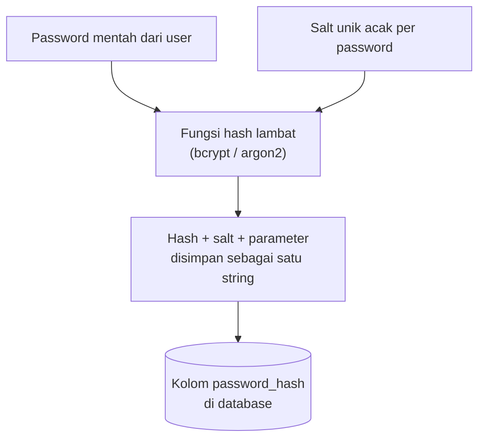

## TL;DR

Password pengguna tidak pernah disimpan dalam bentuk yang bisa dibaca kembali, dan idealnya juga tidak disimpan sebagai hasil fungsi hash cepat seperti SHA-256 — keduanya berakhir sama-sama katastrofik kalau database bocor. Password disimpan sebagai hasil **fungsi hash yang sengaja dibuat lambat dan mahal secara komputasi** (bcrypt, argon2), dilengkapi **salt** unik per password supaya dua pengguna dengan password sama tetap menghasilkan hash yang berbeda. "Lambat" di sini bukan cacat — itu justru intinya: kelambatan yang tidak terasa untuk satu kali login jujur menjadi penghalang praktis untuk penyerang yang mencoba miliaran kombinasi lewat brute-force setelah database bocor.

## The Problem

Sebuah sistem menyimpan password pengguna sebagai `SHA256(password)` di kolom database, dengan asumsi "kan sudah di-hash, aman". Suatu hari database bocor lewat SQL injection di endpoint lain yang tidak berkaitan. Penyerang mengambil seluruh tabel `users`, dan karena SHA-256 dirancang untuk **cepat** (dipakai juga untuk checksum file, tanda tangan digital — konteks di mana kecepatan adalah fitur, bukan cacat), penyerang bisa mencoba miliaran kombinasi password umum per detik dengan GPU murah, mencocokkan hash yang bocor terhadap rainbow table (tabel hash yang sudah dihitung sebelumnya untuk password umum) atau brute-force langsung. Dalam hitungan jam, mayoritas password dengan kekuatan biasa berhasil dipecahkan — bukan karena algoritma hash-nya "salah" secara matematis, tapi karena dipilih untuk kasus penggunaan yang salah.

Masalah kedua yang lebih halus: dua pengguna berbeda yang kebetulan memakai password yang sama (sangat umum untuk password populer) akan menghasilkan hash SHA-256 yang **identik**, sehingga penyerang yang berhasil memecahkan satu hash otomatis tahu password pengguna lain yang hash-nya sama, tanpa perlu memecahkannya ulang.

## Intuition

Bayangkan fungsi hash password seperti **brankas dengan kunci kombinasi yang sengaja diputar sangat lambat** — satu percobaan kombinasi butuh waktu terasa (katakanlah sepersekian detik), yang tidak masalah sama sekali untuk pemilik sah brankas yang cuma mencoba sekali saat login, tapi jadi penghalang serius bagi pencuri yang perlu mencoba jutaan kombinasi. SHA-256, sebaliknya, seperti kunci kombinasi yang bisa diputar secepat mungkin — cocok untuk kebutuhan lain (verifikasi cepat bahwa file tidak berubah), tapi salah total dipakai untuk brankas yang isinya berharga dan butuh menahan percobaan paksa.

Analogi ini bocor pada satu hal: memutar kombinasi brankas lebih lambat tidak mengubah **struktur** brankas itu sendiri, sementara bcrypt/argon2 sengaja dirancang dengan struktur algoritmik berbeda (bukan sekadar "SHA-256 diulang berkali-kali") yang juga tahan terhadap akselerasi hardware khusus (GPU, ASIC) — argon2 secara spesifik dirancang memory-hard, artinya ia juga butuh RAM signifikan per percobaan, yang jauh lebih sulit dipercepat lewat hardware paralel murah dibanding sekadar fungsi yang diulang berkali-kali.

## How It Works



Diagram ini menunjukkan bahwa salt **tidak disimpan terpisah secara rahasia** — ia disertakan langsung dalam string hash yang tersimpan (format bcrypt, misalnya, menyertakan salt dan cost factor di dalam string yang sama). Salt tidak perlu dirahasiakan; tujuannya hanya memastikan dua password yang identik menghasilkan hash yang berbeda, mencegah serangan rainbow table dan mencegah kebocoran "pengguna lain punya password sama".

Saat login, sistem tidak "mendekripsi" hash untuk mendapatkan password asli (hash bersifat satu arah, tidak bisa dibalik) — sistem menghitung ulang hash dari password yang dimasukkan pengguna, memakai salt dan parameter yang sudah tersimpan, lalu membandingkan hasilnya dengan hash yang tersimpan.

**bcrypt** memakai *cost factor* (biasa disebut *work factor*) yang menentukan berapa banyak putaran komputasi dijalankan — menaikkan angka ini melipatgandakan waktu komputasi secara eksponensial, memberi jalan untuk terus menaikkan biaya seiring hardware makin cepat dari tahun ke tahun. **argon2** (khususnya varian argon2id, yang direkomendasikan sebagai pilihan default oleh banyak pedoman keamanan modern) menambahkan dimensi memori: parameternya termasuk berapa banyak RAM yang harus dipakai tiap percobaan, membuatnya secara struktural lebih sulit dipercepat lewat GPU/ASIC dibanding bcrypt yang murni computation-bound.

## In Go

Contoh di bawah memakai cost factor 12 sebagai titik awal yang wajar per pertengahan 2020-an. Nilai ini harus dievaluasi ulang seiring waktu — makin cepat hardware tersedia, makin tinggi cost yang dibutuhkan supaya waktu komputasi tetap terasa mahal bagi penyerang.

> [!question] Perlu diverifikasi
> Klaim: cost factor 12 adalah nilai wajar untuk saat ini.
> Kenapa ragu: rekomendasi work factor bergeser seiring waktu dan kapasitas hardware; angka spesifik gampang basi.
> Cara verifikasi: cek rekomendasi terbaru di OWASP Password Storage Cheat Sheet.

```go
package auth

import (
	"fmt"

	"golang.org/x/crypto/bcrypt"
)

// HashPassword menghasilkan hash bcrypt dari password mentah.
func HashPassword(passwordMentah string) (string, error) {
	hash, err := bcrypt.GenerateFromPassword([]byte(passwordMentah), 12)
	if err != nil {
		return "", fmt.Errorf("hash password: %w", err)
	}
	return string(hash), nil
}

// VerifikasiPassword membandingkan password mentah yang dimasukkan user saat
// login dengan hash yang tersimpan di database. bcrypt.CompareHashAndPassword
// mengekstrak salt dan cost factor dari hash yang tersimpan secara otomatis —
// tidak ada parameter tambahan yang perlu disimpan terpisah.
func VerifikasiPassword(hashTersimpan, passwordMentah string) error {
	err := bcrypt.CompareHashAndPassword([]byte(hashTersimpan), []byte(passwordMentah))
	if err != nil {
		return fmt.Errorf("password tidak cocok: %w", err)
	}
	return nil
}
```

```go
package auth

import (
	"fmt"

	"golang.org/x/crypto/argon2"
	"crypto/rand"
	"crypto/subtle"
	"encoding/base64"
	"strings"
)

// parameterArgon2 menampung parameter yang dipakai saat hashing — waktu,
// memori, dan derajat paralelisme. Parameter ini disimpan bersama hash
// (bukan hanya bergantung pada nilai default kode), supaya hash lama tetap
// bisa diverifikasi meski parameter default berubah di deployment berikutnya.
type parameterArgon2 struct {
	waktu      uint32
	memoriKiB  uint32
	paralel    uint8
	panjangKey uint32
}

var parameterDefault = parameterArgon2{waktu: 1, memoriKiB: 64 * 1024, paralel: 4, panjangKey: 32}

// HashPasswordArgon2 menghasilkan hash argon2id dalam format string tunggal
// yang menyertakan parameter dan salt, mirip format bcrypt — supaya proses
// verifikasi nanti tidak bergantung pada parameter default yang mungkin sudah
// berubah sejak hash ini dibuat.
func HashPasswordArgon2(passwordMentah string) (string, error) {
	salt := make([]byte, 16)
	if _, err := rand.Read(salt); err != nil {
		return "", fmt.Errorf("generate salt: %w", err)
	}

	p := parameterDefault
	hash := argon2.IDKey([]byte(passwordMentah), salt, p.waktu, p.memoriKiB, p.paralel, p.panjangKey)

	encoded := fmt.Sprintf("$argon2id$v=19$m=%d,t=%d,p=%d$%s$%s",
		p.memoriKiB, p.waktu, p.paralel,
		base64.RawStdEncoding.EncodeToString(salt),
		base64.RawStdEncoding.EncodeToString(hash),
	)
	return encoded, nil
}

// VerifikasiPasswordArgon2 mem-parsing parameter dan salt dari string hash
// yang tersimpan, menghitung ulang hash dengan parameter yang SAMA (bukan
// parameter default saat ini), lalu membandingkan dalam waktu konstan
// (subtle.ConstantTimeCompare) untuk mencegah timing attack.
func VerifikasiPasswordArgon2(hashTersimpan, passwordMentah string) (bool, error) {
	bagian := strings.Split(hashTersimpan, "$")
	if len(bagian) != 6 {
		return false, fmt.Errorf("format hash argon2 tidak valid")
	}

	var memoriKiB, waktu uint32
	var paralel uint8
	if _, err := fmt.Sscanf(bagian[3], "m=%d,t=%d,p=%d", &memoriKiB, &waktu, &paralel); err != nil {
		return false, fmt.Errorf("parse parameter argon2: %w", err)
	}

	salt, err := base64.RawStdEncoding.DecodeString(bagian[4])
	if err != nil {
		return false, fmt.Errorf("decode salt: %w", err)
	}
	hashAsli, err := base64.RawStdEncoding.DecodeString(bagian[5])
	if err != nil {
		return false, fmt.Errorf("decode hash: %w", err)
	}

	hashBaru := argon2.IDKey([]byte(passwordMentah), salt, waktu, memoriKiB, paralel, uint32(len(hashAsli)))

	// subtle.ConstantTimeCompare mencegah timing attack: perbandingan byte
	// biasa (==) bisa berhenti lebih awal saat menemukan byte yang tidak
	// cocok, dan perbedaan waktu itu, meski kecil, secara teoretis bisa
	// dieksploitasi untuk menebak isi hash sedikit demi sedikit.
	cocok := subtle.ConstantTimeCompare(hashBaru, hashAsli) == 1
	return cocok, nil
}
```

Versi bcrypt jauh lebih sederhana karena package `golang.org/x/crypto/bcrypt` menangani encoding parameter dan salt secara internal; versi argon2 di atas menunjukkan secara eksplisit apa yang disembunyikan bcrypt — bahwa parameter dan salt harus disimpan **bersama** hash, bukan terpisah, dan perbandingan akhir harus memakai constant-time comparison.

## In His Stack

Yii2 menyediakan `Yii::$app->security->generatePasswordHash()` yang secara default memakai bcrypt di baliknya — secara konsep identik dengan yang dijelaskan di sini, hanya dibungkus API yang berbeda. Kalau mewarisi sistem lama yang ternyata masih memakai MD5 atau SHA-1 tanpa salt (pola umum di aplikasi PHP yang sangat lama), ini adalah temuan security serius yang butuh rencana migrasi: karena hash lama tidak bisa "diubah" jadi bcrypt tanpa password mentahnya, migrasi biasanya dilakukan bertahap — hash ulang ke bcrypt **saat pengguna berhasil login berikutnya** (karena di titik itu password mentah tersedia sesaat), bukan migrasi massal sekaligus.

## Trade-offs and When Not To Use It

Kelambatan yang jadi tujuan bcrypt/argon2 berarti hashing password **memang** memakan waktu CPU (dan untuk argon2, memori) yang terasa per request — untuk endpoint login dengan volume sangat tinggi, ini adalah beban komputasi nyata yang perlu diperhitungkan dalam kapasitas server, bukan diabaikan. Cost factor yang terlalu tinggi bisa membuat endpoint login sendiri jadi bottleneck di bawah traffic tinggi; cost factor yang terlalu rendah melemahkan pertahanan terhadap brute-force. Ini bukan angka yang ditetapkan sekali lalu dilupakan — idealnya diukur (target umum: waktu hashing sekitar setengah detik per percobaan di hardware production) dan dievaluasi ulang seiring waktu. Untuk kasus yang bukan password pengguna sama sekali (misalnya menghitung checksum integritas file, atau tanda tangan HMAC untuk webhook), memakai bcrypt/argon2 justru berlebihan dan salah — fungsi hash cepat seperti SHA-256 tetap pilihan yang benar di konteks itu, karena tujuannya bukan menahan brute-force melainkan verifikasi cepat.

## Common Mistakes

> [!warning] Jebakan
> Memakai fungsi hash cepat (MD5, SHA-1, SHA-256 tanpa lapisan tambahan) untuk password — dirancang untuk kecepatan, sehingga sama sekali tidak menahan brute-force setelah database bocor.

> [!warning] Jebakan
> Menyimpan password dengan enkripsi yang bisa dibalik (reversible encryption) alih-alih hash satu arah, dengan alasan "supaya bisa dikirim ulang kalau user lupa password" — sistem yang benar tidak pernah mengetahui password asli pengguna sama sekali, dan alur "lupa password" seharusnya selalu berupa reset (membuat password baru), bukan mengirim ulang yang lama.

> [!warning] Jebakan
> Membandingkan hash dengan operator `==` biasa alih-alih constant-time comparison — meski perbedaan waktunya kecil, celah timing attack tetap secara teoretis bisa dieksploitasi, dan library seperti `bcrypt.CompareHashAndPassword` di Go sudah menangani ini secara internal sehingga tidak perlu (dan tidak boleh) diimplementasikan ulang secara manual dengan cara yang naif.

> [!warning] Jebakan
> Melupakan bahwa bcrypt memotong password di **72 byte**. Password yang lebih panjang dipangkas diam-diam — dua passphrase berbeda yang 72 byte pertamanya identik akan sama-sama lolos verifikasi, tanpa error apa pun di mana pun. Kalau sistemmu mendorong pemakaian passphrase panjang, ini alasan konkret memilih argon2id yang tidak punya batas semacam itu. Kalau tetap memakai bcrypt, batasi panjang password di sisi validasi input supaya batasnya terlihat dan disengaja, bukan tersembunyi.

## Exercises

1. Jelaskan kenapa SHA-256 dianggap fungsi hash yang "salah" untuk password meski secara matematis sepenuhnya valid sebagai fungsi hash.
2. Apa fungsi salt, dan kenapa ia tidak perlu dirahasiakan meski disimpan bersama hash yang bisa dilihat siapa pun dengan akses ke database?
3. Jelaskan perbedaan mendasar antara pendekatan bcrypt (computation-hard) dan argon2 (memory-hard) dalam menahan serangan brute-force lewat GPU/ASIC.
4. Desain terbuka: sistem legal-services yang kamu kelola baru saja migrasi dari sistem lama yang menyimpan password sebagai MD5 tanpa salt, ke sistem baru berbasis Go yang memakai bcrypt. Rancang strategi migrasi yang tidak memaksa seluruh pengguna mengganti password secara paksa di hari pertama, dengan mempertimbangkan bahwa kamu tidak bisa "mengubah" hash MD5 lama jadi bcrypt tanpa mengetahui password mentahnya.

> [!success]- Kunci jawaban
> **1.** SHA-256 dirancang untuk dihitung **secepat mungkin** karena kasus penggunaan aslinya (checksum, tanda tangan digital) justru butuh verifikasi cepat sebagai fitur. Untuk password, kecepatan itu berbalik jadi kelemahan: penyerang yang punya hash bocor bisa mencoba miliaran kombinasi per detik dengan hardware murah (terutama GPU, yang sangat efisien menjalankan operasi SHA berulang secara paralel), membuat brute-force jadi praktis dalam waktu singkat untuk password dengan kekuatan biasa.
> **4.** Pola migrasi bertahap yang umum dipakai: (1) simpan kedua kolom — hash MD5 lama dan kolom baru untuk hash bcrypt yang awalnya kosong; (2) saat pengguna login dan password yang dimasukkan cocok dengan hash MD5 lama (verifikasi masih pakai logika lama untuk pengguna yang belum migrasi), hitung bcrypt dari password mentah yang baru saja dimasukkan (tersedia sesaat di memori sebelum di-discard) dan simpan ke kolom baru, lalu kosongkan/tandai hash lama sebagai sudah tidak dipakai; (3) setelah periode tertentu (misalnya tiga sampai enam bulan, cukup untuk menangkap sebagian besar pengguna aktif lewat login normal), pengguna yang belum pernah login sejak migrasi (masih hanya punya hash MD5) dipaksa lewat alur reset password eksplisit, bukan dibiarkan memakai hash lemah selamanya. Ini menghindari migrasi massal yang memaksa seluruh pengguna reset serentak (yang bisa menimbulkan lonjakan beban support), sambil tetap punya batas waktu jelas kapan hash lemah benar-benar dihapus dari sistem.

## Self-Check

- Kenapa hash password tidak bisa "didekripsi" untuk mendapatkan password asli?
- Apa yang disimpan bersama hash bcrypt/argon2 selain hash itu sendiri?
- Kenapa perbandingan hash harus memakai constant-time comparison, bukan `==` biasa?
- Kapan fungsi hash cepat seperti SHA-256 justru menjadi pilihan yang benar (bukan password)?

## Connected Notes

- [[Sessions vs Tokens]] — setelah password terverifikasi lewat mekanisme di note ini, sistem perlu memilih cara menjaga status "sudah login" pengguna, dibahas di note itu.
- [[../80 Security/The OWASP Top 10|The OWASP Top 10]] — penyimpanan credential yang lemah adalah salah satu kategori kerentanan dalam daftar ini (cryptographic failures).
- [[../80 Security/Secret Management|Secret Management]] — meski password pengguna di-hash bukan dienkripsi, prinsip "tidak pernah tersimpan sebagai plaintext" yang sama juga berlaku untuk credential aplikasi seperti API key.
- [[../40 Databases/Data Types and Constraints|Data Types and Constraints]] — kolom `password_hash` biasanya disimpan sebagai `VARCHAR`/`TEXT` dengan panjang cukup untuk menampung seluruh string hash termasuk parameter dan salt.
- [[Key Management and Rotation]] — cost factor bcrypt/argon2 yang perlu dinaikkan seiring waktu adalah versi sederhana dari prinsip rotasi yang dibahas lebih dalam untuk kunci kriptografi di note senior itu.

## Further Reading

- OWASP Password Storage Cheat Sheet — rekomendasi work factor dan pemilihan algoritma yang paling sering diperbarui.
- Dokumentasi package `golang.org/x/crypto/bcrypt` dan `golang.org/x/crypto/argon2`.

## Catatan Saya

*Tulis di sini algoritma hashing password yang dipakai sistem kerjaanmu saat ini, dan apakah pernah ada insiden atau audit terkait ini.*
