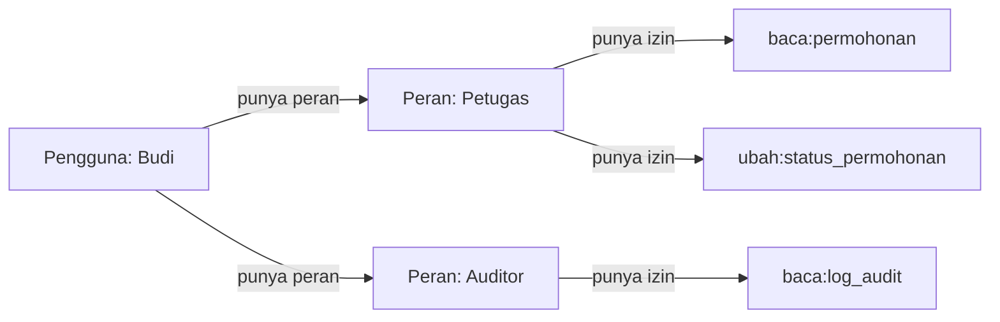

## TL;DR

Begitu sebuah sistem punya lebih dari satu jenis pengguna dengan hak akses berbeda, pengecekan `if user.id == 7` atau `if user.email == "admin@instansi.go.id"` yang tersebar di berbagai handler dengan cepat menjadi mimpi buruk yang tidak bisa dipelihara — setiap perubahan kebijakan akses berarti mencari dan mengubah kode di puluhan tempat berbeda. RBAC (Role-Based Access Control) memutuskan otorisasi lewat **peran** (role) yang dipegang pengguna, bukan identitas pengguna itu sendiri: pengguna diberi satu atau lebih peran, setiap peran punya sekumpulan izin (permission), dan kode hanya pernah bertanya "apakah peran ini punya izin ini", tidak pernah "apakah pengguna spesifik ini". Perubahan kebijakan akses berarti mengubah pemetaan peran-ke-izin di satu tempat, bukan menyisir seluruh basis kode.

## The Problem

Sebuah sistem legal-services pemerintah awalnya hanya punya dua jenis pengguna: warga dan petugas. Kode di banyak handler menulis pengecekan seperti `if user.Role == "petugas" { ... }` langsung tersebar di puluhan endpoint. Beberapa bulan kemudian, muncul kebutuhan baru: petugas supervisor yang bisa melakukan semua yang bisa dilakukan petugas biasa, ditambah kemampuan membatalkan permohonan yang sudah disetujui. Tim menambahkan `if user.Role == "petugas" || user.Role == "supervisor"` di sana-sini, dan `if user.Role == "supervisor"` di endpoint pembatalan — pola yang bekerja untuk sementara, tapi begitu peran ketiga dan keempat muncul (auditor, admin sistem), jumlah kombinasi kondisional ini tumbuh secara kombinatorial, dan tidak ada satu tempat pun yang bisa dilihat untuk menjawab pertanyaan sederhana: "izin apa saja yang dimiliki peran supervisor?"

Masalah yang lebih berbahaya muncul saat seorang developer baru menambahkan endpoint baru dan lupa menambahkan pengecekan otorisasi sama sekali — karena tidak ada pola terpusat yang memaksa setiap endpoint baru eksplisit menyatakan izin apa yang dibutuhkan, endpoint itu diam-diam bisa diakses siapa pun yang sudah login, termasuk warga biasa yang seharusnya tidak berhak melihat data yang endpoint itu tampilkan.

## Intuition

RBAC seperti **kartu identitas pegawai dengan level akses tercetak di dalamnya**, bukan daftar nama yang ditempel di setiap pintu. Alih-alih setiap pintu (endpoint) punya daftar nama orang yang boleh masuk (yang harus diperbarui manual setiap kali ada pegawai baru atau pindah jabatan), setiap pintu cukup memeriksa **level akses** pada kartu (peran), dan bagian kepegawaian (admin sistem) cukup mengubah level akses di satu kartu itu saat seseorang pindah jabatan — seluruh pintu yang relevan otomatis menyesuaikan tanpa perlu disentuh satu per satu.

Analogi ini bocor pada satu hal: kartu pegawai fisik biasanya punya satu level akses tunggal, sementara RBAC yang baik mendukung pengguna memegang **lebih dari satu peran sekaligus** (misalnya seorang petugas yang juga ditunjuk sebagai auditor sementara) — sistem otorisasi harus menggabungkan izin dari seluruh peran yang dipegang, bukan mengasumsikan satu pengguna hanya pernah punya tepat satu peran.

## How It Works



Diagram ini menunjukkan model relasi inti RBAC: pengguna terhubung ke peran (many-to-many — satu pengguna bisa punya beberapa peran, satu peran bisa dipegang banyak pengguna), dan peran terhubung ke izin (juga many-to-many). Kode aplikasi tidak pernah menanyakan "apakah Budi boleh mengubah status permohonan" secara langsung — ia menanyakan "apakah salah satu peran yang dipegang Budi punya izin `ubah:status_permohonan`", yang jawabannya dihitung dari relasi di atas, bukan dari kondisional yang di-hardcode.

Penamaan izin yang baik mengikuti pola `aksi:resource` (`baca:permohonan`, `ubah:status_permohonan`) — cukup granular untuk membedakan kebutuhan berbeda, tapi tidak terlalu granular sampai jadi tidak terkelola (izin terpisah untuk setiap kolom di setiap tabel, misalnya, biasanya berlebihan untuk kebanyakan sistem).

## In Go

```go
package authz

import (
	"context"
	"fmt"
)

type Izin string

const (
	IzinBacaPermohonan  Izin = "baca:permohonan"
	IzinUbahStatus      Izin = "ubah:status_permohonan"
	IzinBacaLogAudit    Izin = "baca:log_audit"
	IzinBatalkanSetelah Izin = "batalkan:permohonan_disetujui"
)

type Peran string

const (
	PeranWarga      Peran = "warga"
	PeranPetugas    Peran = "petugas"
	PeranSupervisor Peran = "supervisor"
	PeranAuditor    Peran = "auditor"
)

// petaIzinPeran adalah SATU-SATUNYA tempat kebijakan otorisasi didefinisikan.
// Perubahan kebijakan akses berarti mengubah peta ini, bukan mencari
// kondisional yang tersebar di puluhan handler.
var petaIzinPeran = map[Peran][]Izin{
	PeranWarga:      {IzinBacaPermohonan},
	PeranPetugas:    {IzinBacaPermohonan, IzinUbahStatus},
	PeranSupervisor: {IzinBacaPermohonan, IzinUbahStatus, IzinBatalkanSetelah},
	PeranAuditor:    {IzinBacaLogAudit},
}

// PunyaIzin memeriksa apakah SALAH SATU peran yang dipegang pengguna punya
// izin yang diminta — mendukung pengguna dengan lebih dari satu peran
// sekaligus.
func PunyaIzin(peranPengguna []Peran, izinDibutuhkan Izin) bool {
	for _, peran := range peranPengguna {
		for _, izin := range petaIzinPeran[peran] {
			if izin == izinDibutuhkan {
				return true
			}
		}
	}
	return false
}

// KontekPengguna adalah nilai yang disisipkan ke context.Context oleh
// middleware autentikasi (lihat Sessions vs Tokens), berisi identitas dan
// peran pengguna yang sudah terverifikasi.
type KontekPengguna struct {
	UserID int64
	Peran  []Peran
}

type kunciKonteks struct{}

func AmbilPenggunaDariKonteks(ctx context.Context) (KontekPengguna, bool) {
	u, ok := ctx.Value(kunciKonteks{}).(KontekPengguna)
	return u, ok
}

// WajibIzin adalah middleware yang membuat setiap endpoint EKSPLISIT
// menyatakan izin apa yang dibutuhkan — mencegah endpoint baru "lupa"
// pengecekan otorisasi, karena tanpa memanggil ini, tidak ada jalan pintas
// untuk mendaftarkan handler yang butuh proteksi.
func WajibIzin(izin Izin, next func(ctx context.Context) error) func(ctx context.Context) error {
	return func(ctx context.Context) error {
		pengguna, ok := AmbilPenggunaDariKonteks(ctx)
		if !ok {
			return fmt.Errorf("konteks pengguna tidak ditemukan: belum melalui middleware autentikasi")
		}
		if !PunyaIzin(pengguna.Peran, izin) {
			return fmt.Errorf("pengguna %d tidak punya izin %s", pengguna.UserID, izin)
		}
		return next(ctx)
	}
}
```

## In His Stack

Yii2 menyediakan RBAC bawaan lewat `yii\rbac\PhpManager` atau `DbManager`, dengan konsep yang identik (peran, izin, dan bahkan mendukung hierarki peran di mana satu peran mewarisi izin peran lain) — pengetahuan tentang model RBAC ini portable penuh ke Go, hanya beda implementasi teknis. Untuk sistem lintas 13 aplikasi pemerintah, keuntungan RBAC yang dikelola terpusat (misalnya lewat satu service otorisasi yang dipanggil seluruh aplikasi, bukan setiap aplikasi mendefinisikan peran sendiri-sendiri secara terpisah) menjadi jauh lebih relevan dibanding aplikasi tunggal — mencegah drift di mana peran "supervisor" berarti sesuatu yang berbeda di aplikasi A dibanding aplikasi B.

## Trade-offs and When Not To Use It

RBAC bekerja baik ketika kebijakan akses bisa dikelompokkan jadi peran yang jelas dan jumlahnya terbatas. Untuk sistem dengan kebutuhan otorisasi yang sangat granular dan kontekstual — misalnya "petugas hanya boleh mengubah permohonan yang **ditugaskan kepadanya sendiri**, bukan seluruh permohonan yang ada" — RBAC murni tidak cukup, karena keputusan aksesnya bergantung pada **data** (siapa yang ditugaskan), bukan sekadar peran statis. Kasus seperti ini butuh pola tambahan seperti ABAC (Attribute-Based Access Control) atau pengecekan kepemilikan data eksplisit di layer service, di atas RBAC yang menangani lapisan kasar (peran apa yang boleh mengakses fitur apa secara umum). RBAC juga menambah satu lapis indirection yang, untuk sistem sangat kecil dengan hanya satu jenis pengguna, mungkin belum sepadan — kesederhanaan tetap bernilai kalau kompleksitas peran-ganda memang belum dibutuhkan.

## Common Mistakes

> [!warning] Jebakan
> Menyebarkan pengecekan otorisasi (`if user.Role == "..."`) langsung di banyak handler alih-alih memusatkannya lewat satu peta izin-peran — membuat audit kebijakan akses ("izin apa saja yang dimiliki peran X") nyaris mustahil dilakukan tanpa membaca seluruh basis kode.

> [!warning] Jebakan
> Menambahkan endpoint baru tanpa middleware otorisasi eksplisit, dengan asumsi "nanti ditambahkan belakangan" — endpoint itu dalam praktiknya bisa diakses siapa pun yang sudah lolos autentikasi, termasuk peran yang seharusnya tidak berhak, sampai seseorang menyadari celah ini (seringnya lewat insiden, bukan lewat review).

> [!warning] Jebakan
> Menyamakan RBAC dengan seluruh kebutuhan otorisasi, padahal kebijakan akses yang bergantung pada kepemilikan data spesifik (bukan sekadar peran) butuh lapisan pengecekan tambahan di luar RBAC murni.

## Exercises

1. Jelaskan kenapa memusatkan pemetaan peran-ke-izin di satu tempat lebih baik daripada menyebarkan pengecekan `if user.Role == "..."` di setiap handler.
2. Kenapa RBAC harus mendukung satu pengguna memegang lebih dari satu peran sekaligus?
3. Berikan satu contoh kebutuhan otorisasi yang tidak bisa dijawab RBAC murni, dan jelaskan kenapa.
4. Desain terbuka: sistem legal-servicesmu punya kebutuhan baru — petugas hanya boleh mengubah status permohonan yang berada di wilayah kerjanya sendiri (misalnya kabupaten tertentu), bukan seluruh permohonan di seluruh Indonesia. Rancang bagaimana kebutuhan ini dipetakan di atas RBAC yang sudah ada (peran `petugas` dengan izin `ubah:status_permohonan`), tanpa membuat satu peran terpisah untuk setiap kombinasi wilayah yang mungkin ada.

> [!success]- Kunci jawaban
> **1.** Memusatkan pemetaan berarti pertanyaan "izin apa saja yang dimiliki peran X" bisa dijawab dengan membaca **satu struktur data**, bukan menyisir seluruh basis kode mencari kondisional yang tersebar. Ini juga berarti perubahan kebijakan (menambah izin baru ke peran tertentu) adalah perubahan satu baris di satu tempat, bukan pencarian-dan-ganti di banyak file yang berisiko melewatkan satu tempat yang seharusnya ikut diubah.
> **4.** RBAC menjawab "peran apa boleh melakukan aksi apa secara umum" — kebutuhan "wilayah kerja spesifik" adalah atribut data, bukan peran baru. Pendekatan yang tepat: pertahankan peran `petugas` dengan izin `ubah:status_permohonan` seperti biasa (RBAC menjawab lapisan kasar: apakah peran ini secara umum boleh melakukan aksi ini), lalu tambahkan pengecekan kepemilikan/scope di layer service **setelah** RBAC lolos: setiap petugas punya field `wilayah_kerja` di profilnya, dan layer service memeriksa apakah `wilayah_kerja` petugas itu cocok dengan wilayah permohonan yang ingin diubah, sebelum benar-benar mengizinkan perubahan. Ini menghindari ledakan kombinatorial peran (`petugas_jakarta`, `petugas_surabaya`, dst.) yang akan membuat manajemen peran menjadi tidak terkelola begitu jumlah wilayah bertambah.

## Self-Check

- Apa dua entitas utama yang direlasikan RBAC, dan bagaimana keduanya terhubung ke pengguna?
- Kenapa satu pengguna perlu bisa memegang lebih dari satu peran?
- Kapan RBAC murni tidak cukup untuk kebutuhan otorisasi tertentu?
- Kenapa endpoint baru yang lupa ditambahkan pengecekan otorisasi menjadi risiko keamanan yang nyata?

## Connected Notes

- [[Sessions vs Tokens]] — identitas dan peran pengguna yang dipakai RBAC biasanya datang dari session atau klaim token yang diverifikasi di note itu.
- [[JWT - Structure, Signature, and When It Is The Wrong Tool]] — peran pengguna sering disertakan sebagai klaim di dalam JWT, langsung dipakai sebagai input keputusan RBAC.
- [[The OWASP Top 10]] — otorisasi yang rusak (broken access control) adalah salah satu kategori kerentanan paling umum dalam daftar ini, dan RBAC yang diterapkan konsisten adalah salah satu pertahanan utamanya.
- [[../90 Architecture and Design/Handler-Service-Repository Layering|Handler-Service-Repository Layering]] — pengecekan otorisasi RBAC biasanya ditempatkan di boundary antara handler dan service, sebelum logika bisnis dijalankan.
- [[OAuth2 Overview]] — scope yang diberikan lewat OAuth2 sering dipetakan menjadi peran atau izin RBAC di sisi Resource Server.

## Further Reading

- NIST RBAC model (INCITS 359) — spesifikasi formal model RBAC yang menjadi acuan sebagian besar implementasi industri.

## Catatan Saya

*Tulis di sini bagaimana kebijakan akses (RBAC atau bentuk lain) dikelola di sistem kerjaanmu, dan apakah pernah ada celah otorisasi yang ditemukan.*
