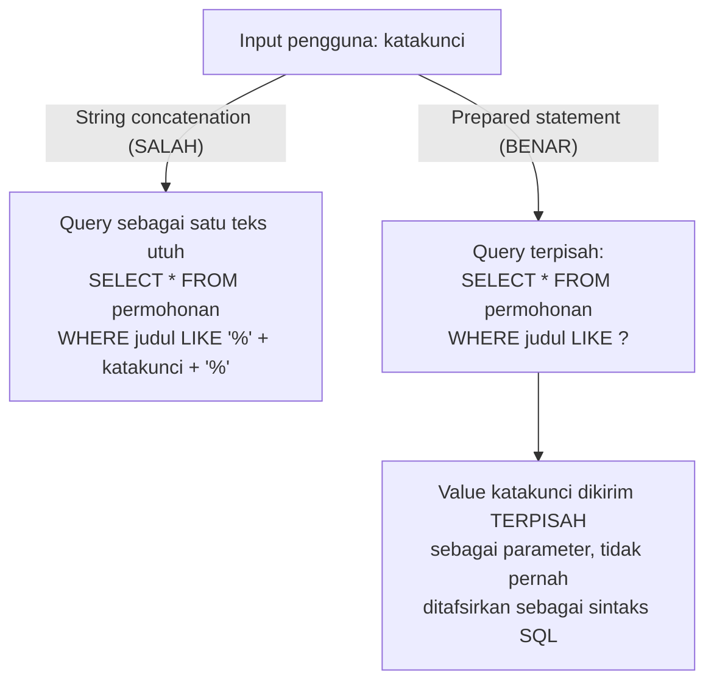

## TL;DR

SQL injection terjadi ketika data yang tidak tepercaya (input pengguna) dicampur langsung ke dalam teks query SQL, sehingga database tidak bisa membedakan mana bagian yang seharusnya "data" dan mana yang seharusnya "perintah". Penyerang memanfaatkan celah ini dengan menyisipkan potongan SQL di dalam input yang seharusnya berisi data biasa, mengubah makna query secara keseluruhan. Pertahanan utamanya adalah [[../40 Databases/Prepared Statements|prepared statement]]: memisahkan struktur query dari data secara struktural di level driver database, bukan sekadar "membersihkan" string secara manual — tapi prepared statement hanya melindungi *value*, bukan elemen struktural query seperti nama kolom atau arah pengurutan, yang butuh pendekatan berbeda sama sekali.

## The Problem

Sebuah endpoint pencarian permohonan menerima parameter `katakunci` dari pengguna dan menyusun query dengan string concatenation langsung: `"SELECT * FROM permohonan WHERE judul LIKE '%" + katakunci + "%'"`. Pengguna yang mengirim `katakunci` berisi `' OR '1'='1` mengubah query secara efektif menjadi `WHERE judul LIKE '%' OR '1'='1%'` — kondisi `'1'='1'` selalu benar, sehingga query mengembalikan **seluruh baris** tabel permohonan, termasuk permohonan milik warga lain yang seharusnya tidak terlihat oleh pengguna itu. Skenario yang jauh lebih merusak: input yang dirancang menyisipkan statement SQL tambahan sepenuhnya (`'; DROP TABLE permohonan; --`), berpotensi menghapus atau merusak data jauh di luar cakupan yang dimaksud endpoint tersebut — sebagaimana dibahas juga di [[../40 Databases/Prepared Statements|Prepared Statements]].

Masalah yang sering luput bahkan setelah tim "sudah pakai prepared statement": endpoint yang sama juga menerima parameter `?sort=nama_kolom` untuk menentukan pengurutan hasil, lalu menyisipkannya langsung sebagai `ORDER BY ` + nama_kolom mentah-mentah, dengan asumsi keliru bahwa "kan cuma nama kolom, bukan value yang bisa disuntik". Nama kolom dan arah pengurutan (`ASC`/`DESC`) adalah bagian **struktural** query, bukan value yang bisa diikat lewat placeholder parameterized query biasa — celah ini tetap terbuka meski seluruh *value* lain di query sudah aman lewat prepared statement, seperti dibahas di [[../30 APIs and Web/Filtering and Sorting|Filtering and Sorting]].

## Intuition

Bayangkan query SQL seperti **surat resmi dengan bagian isi surat dan bagian lampiran yang jelas terpisah amplopnya** — prepared statement adalah cara mengirim surat itu di mana bagian "isi surat" (struktur query, misalnya `SELECT * FROM permohonan WHERE judul LIKE ?`) dan bagian "lampiran" (data, nilai `katakunci`) dikirim dalam amplop yang benar-benar terpisah, sehingga penerima (database) tidak pernah bingung membaca isi lampiran sebagai bagian dari perintah surat itu sendiri, apa pun isi lampiran tersebut. String concatenation, sebaliknya, seperti menulis seluruh surat dalam satu paragraf panjang tanpa pemisah jelas — kalau isi lampiran (input pengguna) kebetulan berisi kalimat yang terlihat seperti instruksi, penerima surat bisa saja salah membacanya sebagai bagian dari perintah asli.

Analogi ini bocor pada satu hal: amplop terpisah untuk "isi surat" dan "lampiran" bekerja sempurna untuk *data* (nilai yang dicari, nama yang diinput), tapi tidak bisa dipakai untuk elemen yang secara inheren adalah bagian dari **struktur** surat itu sendiri — nama kolom mana yang dibaca, urutan apa yang dipakai. Ini seperti mencoba mengirim "alamat tujuan surat" sebagai lampiran terpisah: secara teknis tidak masuk akal, karena alamat tujuan adalah bagian dari bagaimana surat itu **disusun**, bukan isinya. Elemen struktural seperti nama kolom harus divalidasi dengan cara lain — biasanya lewat *whitelist* nilai yang diizinkan, bukan lewat placeholder.

## How It Works



Diagram ini menunjukkan perbedaan inti: pada jalur "SALAH", input pengguna menjadi bagian dari teks query yang sama yang dikirim ke database untuk di-parse sebagai SQL — kalau input itu mengandung sintaks SQL, ia akan **ditafsirkan** sebagai sintaks. Pada jalur "BENAR", struktur query (dengan placeholder `?`) dikirim terpisah dari nilai parameter — database sudah selesai mem-parse struktur query **sebelum** nilai parameter disisipkan, sehingga nilai apa pun yang dikirim, sekalipun berisi karakter SQL, tidak pernah ditafsirkan ulang sebagai bagian dari struktur.

Untuk elemen struktural (nama kolom, arah sorting) yang tidak bisa lewat placeholder, pendekatan yang benar adalah *whitelist* eksplisit — memetakan nilai input yang diizinkan (misalnya string `"tanggal"` dari parameter `?sort=tanggal`) ke nama kolom yang sudah diketahui aman di kode, bukan menyisipkan nilai input mentah langsung ke query.

## In Go

```go
package repository

import (
	"context"
	"database/sql"
	"fmt"
)

// CariPermohonan menunjukkan pertahanan lengkap: prepared statement untuk
// value (katakunci), dan whitelist eksplisit untuk elemen struktural
// (kolomSort, arahSort) yang tidak bisa diikat lewat placeholder.
func CariPermohonan(ctx context.Context, db *sql.DB, katakunci, kolomSort, arahSort string) (*sql.Rows, error) {
	// Whitelist kolom yang boleh dipakai untuk sorting — nilai input yang
	// tidak ada di peta ini ditolak, TIDAK PERNAH disisipkan mentah ke query.
	kolomDiizinkan := map[string]string{
		"tanggal": "tanggal_dibuat",
		"status":  "status_permohonan",
		"judul":   "judul",
	}
	kolomAman, ok := kolomDiizinkan[kolomSort]
	if !ok {
		return nil, fmt.Errorf("kolom sort tidak dikenal: %q", kolomSort)
	}

	arahAman := "ASC"
	if arahSort == "desc" {
		arahAman = "DESC"
	}

	// Query dibangun dengan fmt.Sprintf HANYA untuk elemen struktural yang
	// sudah divalidasi lewat whitelist (kolomAman, arahAman) — tidak pernah
	// untuk value pengguna. Value (katakunci) tetap lewat placeholder "?".
	query := fmt.Sprintf(
		"SELECT id, judul, status_permohonan FROM permohonan WHERE judul LIKE ? ORDER BY %s %s",
		kolomAman, arahAman,
	)

	rows, err := db.QueryContext(ctx, query, "%"+katakunci+"%")
	if err != nil {
		return nil, fmt.Errorf("query cari permohonan: %w", err)
	}
	return rows, nil
}
```

Perhatikan bahwa `fmt.Sprintf` di sini **hanya** menyisipkan `kolomAman` dan `arahAman` — dua nilai yang sudah lolos whitelist eksplisit dan karenanya bukan lagi "input pengguna mentah" pada titik itu. `katakunci` tidak pernah disentuh `fmt.Sprintf`; ia selalu lewat placeholder `?` sebagai parameter terpisah ke `QueryContext`.

## In His Stack

Active Record Yii2 secara default aman dari SQL injection untuk *value* selama developer memakai method bawaannya (`->where(['judul' => $keyword])`) yang secara otomatis memakai parameter binding di baliknya — masalah muncul justru ketika developer beralih ke `createCommand()->raw SQL` atau menyisipkan variabel langsung ke dalam kondisi `where()` sebagai string, pola yang kadang dipakai untuk query kompleks yang dirasa "tidak bisa" ditulis lewat Active Record biasa. Untuk MariaDB spesifik, penting diingat bahwa risiko yang sama berlaku sepenuhnya sama seperti PostgreSQL atau database relasional lain — SQL injection bukan kerentanan yang spesifik ke satu dialek SQL tertentu, karena akar masalahnya ada di cara aplikasi menyusun query, bukan di database itu sendiri.

## Trade-offs and When Not To Use It

Tidak ada trade-off yang membenarkan string concatenation untuk value pengguna dalam query SQL — ini bukan kasus di mana ada pilihan valid yang lebih cepat tapi kurang aman; prepared statement pada praktiknya juga tidak lebih lambat secara berarti untuk kebanyakan beban kerja, dan di banyak driver database bahkan bisa lebih cepat untuk query berulang karena database bisa meng-cache execution plan-nya (lihat [[../40 Databases/Prepared Statements|Prepared Statements]]). Satu-satunya area yang butuh pertimbangan tambahan adalah elemen struktural (nama kolom, nama tabel dinamis) yang memang tidak bisa lewat placeholder — di situ, whitelist eksplisit adalah satu-satunya pendekatan yang aman; membangun daftar "karakter yang diblokir" (blacklist) untuk membersihkan nama kolom mentah jauh lebih rapuh, karena mudah melewatkan satu variasi encoding atau karakter yang tidak terpikirkan.

## Common Mistakes

> [!warning] Jebakan
> Menyusun query lewat string concatenation atau `fmt.Sprintf` langsung dari input pengguna untuk *value* apa pun — bahkan untuk input yang "terlihat" aman seperti angka, karena validasi tipe yang salah atau terlewat bisa membuka celah yang sama.

> [!warning] Jebakan
> Menganggap prepared statement menutup seluruh celah SQL injection, lalu tetap menyisipkan nama kolom atau arah sorting dari input pengguna secara mentah — elemen struktural query butuh whitelist eksplisit, bukan placeholder.

> [!warning] Jebakan
> Memakai pendekatan blacklist (memblokir karakter atau kata kunci tertentu seperti `DROP`, `--`) untuk "membersihkan" input alih-alih prepared statement — blacklist selalu punya celah karena mustahil mendaftar seluruh variasi yang bisa dipakai penyerang, sementara prepared statement menutup masalah secara struktural, bukan lewat penyaringan yang mudah bocor.

## Exercises

1. Jelaskan kenapa prepared statement menutup celah SQL injection secara struktural, bukan sekadar "menyaring" karakter berbahaya.
2. Kenapa parameter `?sort=nama_kolom` tidak bisa diamankan dengan placeholder yang sama seperti value biasa, dan apa pendekatan yang benar untuk kasus itu?
3. Kenapa pendekatan blacklist (memblokir kata kunci tertentu) dianggap lebih rapuh dibanding prepared statement atau whitelist?
4. Desain terbuka: sebuah endpoint laporan butuh fitur "pilih tabel dan kolom mana yang ingin ditampilkan" secara dinamis oleh pengguna (misalnya untuk fitur ekspor data kustom), dengan puluhan kemungkinan kombinasi tabel dan kolom yang valid. Rancang cara memvalidasi input tabel/kolom ini tanpa harus menulis whitelist manual untuk setiap kombinasi satu per satu, sambil tetap menutup celah SQL injection struktural sepenuhnya.

> [!success]- Kunci jawaban
> **1.** Prepared statement bekerja dengan mengirim **struktur query** (dengan placeholder) ke database terpisah dari **nilai parameter**, dan database mem-parse struktur itu sebagai SQL terlebih dahulu, sebelum nilai parameter pernah disisipkan. Karena parsing struktur sudah selesai sebelum nilai masuk, nilai apa pun — sekalipun mengandung karakter yang secara sintaksis terlihat seperti SQL — tidak pernah ditafsirkan ulang sebagai bagian dari struktur query itu. Ini berbeda fundamental dari "menyaring karakter berbahaya", yang mencoba menghapus pola tertentu dari string sebelum digabung jadi satu teks query utuh — pendekatan yang selalu berisiko melewatkan satu pola yang tidak terpikirkan.
> **4.** Alih-alih whitelist statis satu per satu, bangun whitelist **generatif** dari metadata skema database itu sendiri: saat aplikasi startup (atau lewat cache berumur pendek), query metadata database (`information_schema.columns` di MySQL/MariaDB/PostgreSQL) untuk mendapatkan daftar tabel dan kolom yang benar-benar ada dan diizinkan diekspos (mungkin difilter lagi lewat daftar tabel yang eksplisit ditandai "boleh diekspor" di konfigurasi aplikasi, supaya tabel sensitif seperti `users` tidak otomatis ikut). Input pengguna kemudian divalidasi terhadap peta yang dihasilkan dari metadata ini — bukan menyisipkan nama tabel/kolom pengguna langsung ke query, dan bukan pula menulis ratusan baris whitelist manual. Ini tetap mempertahankan prinsip inti (tidak pernah menyisipkan input mentah pengguna sebagai elemen struktural query), hanya sumber whitelist-nya dibuat dinamis dari skema yang sudah diverifikasi aman, bukan dari input pengguna itu sendiri.

## Self-Check

- Kenapa string concatenation untuk membangun query SQL berbahaya, bahkan untuk input yang terlihat sederhana?
- Apa perbedaan cara mengamankan *value* dibanding elemen struktural (nama kolom) dalam query?
- Kenapa pendekatan blacklist dianggap lebih lemah dibanding whitelist atau prepared statement?
- Apakah SQL injection spesifik ke satu dialek database tertentu? Kenapa atau kenapa tidak?

## Connected Notes

- [[../40 Databases/Prepared Statements|Prepared Statements]] — mekanisme konkret di level driver database yang menjadi pertahanan utama terhadap SQL injection pada value.
- [[../30 APIs and Web/Filtering and Sorting|Filtering and Sorting]] — sumber paling umum celah SQL injection struktural, lewat parameter sorting dan filtering yang diterima langsung dari query string.
- [[The OWASP Top 10]] — SQL injection adalah salah satu kerentanan klasik dalam kategori Injection di daftar ini.
- [[XSS]] — kerentanan injection lain yang menyasar sisi klien alih-alih database, dengan akar masalah serupa: data tidak tepercaya dicampur dengan konteks eksekusi/interpretasi.
- [[../90 Architecture and Design/Handler-Service-Repository Layering|Handler-Service-Repository Layering]] — validasi whitelist untuk elemen struktural query paling wajar ditempatkan di layer repository, tempat query sesungguhnya disusun.

## Further Reading

- OWASP SQL Injection Prevention Cheat Sheet — referensi praktik terbaik yang lebih luas dari sekadar prepared statement, termasuk penanganan elemen struktural.

## Catatan Saya

*Tulis di sini kalau kamu pernah menemukan query di kode kerjaanmu yang masih rentan SQL injection, terutama di parameter sorting/filtering yang sering luput dari perhatian.*
