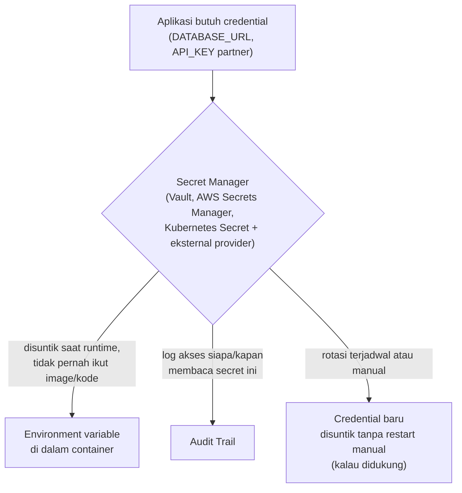

## TL;DR

Credential — password database, API key partner, private key untuk menandatangani token — tidak pernah boleh ada di kode, tidak pernah ter-commit ke Git, dan idealnya tidak dikelola manual di kepala satu orang saja. Secret management adalah disiplin memperlakukan credential sebagai aset yang siklus hidupnya (pembuatan, distribusi, rotasi, pencabutan) dikelola secara sadar dan terpusat, bukan sekadar "ditaruh di environment variable lalu dilupakan". Environment variable (lihat [[../70 Infrastructure and Delivery/Configuration via Environment (12-Factor App)|Configuration via Environment (12-Factor App)]]) adalah langkah pertama yang benar — memisahkan secret dari kode — tapi belum menjawab pertanyaan yang lebih sulit: siapa yang boleh melihat secret ini, bagaimana ia dirotasi tanpa downtime, dan bagaimana melacak siapa yang pernah mengaksesnya.

## The Problem

Sebuah tim menyimpan API key partner eksternal di file `.env` yang tidak ter-commit ke Git (sudah benar sejauh ini), tapi file itu didistribusikan ke seluruh developer lewat pesan Slack setiap kali ada perubahan, dan disalin manual ke server production lewat SSH oleh siapa pun yang kebetulan sedang melakukan deployment. Bertahun-tahun kemudian, credential partner itu masih persis sama sejak pertama kali dibuat — tidak pernah dirotasi, karena tidak ada yang tahu pasti di server mana saja credential itu tersebar, apalagi mengingat untuk menggantinya di semua tempat sekaligus. Ketika partner tersebut mengalami audit keamanan dan meminta bukti kapan terakhir kredensial dirotasi, tidak ada jawaban yang bisa diberikan — dan yang lebih buruk, tidak ada cara memastikan credential itu tidak pernah bocor ke satu pun channel Slack atau laptop developer yang sudah lama resign.

Masalah kedua: seorang developer meng-commit file konfigurasi berisi password database production "sementara untuk testing lokal", lupa membatalkannya sebelum push, dan baru menyadari kesalahan itu keesokan harinya. Meski commit itu langsung dihapus dan di-force-push, credential tersebut **tetap harus dianggap bocor secara permanen** — riwayat Git bisa saja sudah di-fetch orang lain sebelum dihapus, dan cache di berbagai sistem CI/CD mungkin masih menyimpan salinannya. Satu-satunya tindakan yang benar adalah rotasi credential itu sepenuhnya, bukan sekadar menghapus commit-nya.

## Intuition

Secret management seperti **mengelola kunci gedung kantor secara profesional**, bukan menaruh kunci cadangan di bawah keset depan pintu. Sistem kunci profesional tahu persis siapa yang pernah diberi kunci, bisa mencabut akses satu orang tanpa mengganti kunci untuk semua orang lain (lewat kartu akses elektronik yang bisa dinonaktifkan individual), dan punya jadwal penggantian kunci berkala terlepas dari ada insiden atau tidak. Menaruh kunci di bawah keset (menaruh credential di `.env` yang disalin manual lewat Slack) mungkin "berfungsi" untuk sementara, tapi tidak seorang pun benar-benar tahu siapa saja yang sudah pernah punya salinan kunci itu.

Analogi ini bocor pada satu hal: kunci fisik yang dicuri butuh usaha nyata (masuk ke gedung, membuka kunci) untuk benar-benar disalahgunakan. Credential digital yang bocor bisa disalahgunakan **seketika, dari mana saja di dunia**, tanpa kehadiran fisik apa pun — inilah kenapa kecepatan rotasi dan kemampuan mendeteksi kebocoran jauh lebih kritis untuk secret digital dibanding kunci fisik biasa.

## How It Works



Diagram ini menunjukkan pergeseran dari "credential ditaruh di file dan disalin manual" menjadi "credential diminta dari sistem terpusat saat runtime" — aplikasi tidak pernah menyimpan salinan permanen credential di tempat yang bisa bocor lewat commit atau chat, dan setiap akses ke secret bisa dicatat (siapa/kapan mengakses), menjawab pertanyaan audit yang di kasus pertama tidak bisa dijawab sama sekali.

Tiga prinsip inti secret management: **least privilege** (setiap service hanya bisa mengakses secret yang benar-benar dibutuhkannya, bukan seluruh secret di organisasi), **rotasi berkala** (mengganti credential secara terjadwal, bukan hanya setelah insiden), dan **audit trail** (mencatat siapa/apa yang mengakses secret dan kapan, penting khususnya untuk kepatuhan sistem pemerintah).

## In Go

```go
package secretmgr

import (
	"context"
	"fmt"
)

// PenyediaSecret adalah interface kecil supaya sumber secret (Vault, AWS
// Secrets Manager, atau bahkan environment variable biasa untuk local
// development) bisa ditukar tanpa mengubah kode yang memakainya — pola yang
// sama seperti [[../90 Architecture and Design/Manual Dependency Injection in Go|Manual Dependency Injection in Go]].
type PenyediaSecret interface {
	AmbilSecret(ctx context.Context, nama string) (string, error)
}

// KonfigurasiAplikasi memuat credential lewat PenyediaSecret, bukan
// langsung dari os.Getenv — memisahkan "dari mana secret ini datang" dari
// logika aplikasi, sehingga berpindah dari environment variable ke secret
// manager sungguhan nanti tidak mengubah kode aplikasi sama sekali.
func MuatKredensialDatabase(ctx context.Context, penyedia PenyediaSecret) (string, error) {
	dsn, err := penyedia.AmbilSecret(ctx, "database/dsn")
	if err != nil {
		return "", fmt.Errorf("ambil credential database: %w", err)
	}
	return dsn, nil
}

// penyediaEnvLokal adalah implementasi sederhana untuk local development —
// TIDAK dipakai di production, hanya jembatan supaya kode yang sama bisa
// jalan di laptop developer tanpa akses ke secret manager sungguhan.
type penyediaEnvLokal struct {
	getEnv func(string) string
}

func (p penyediaEnvLokal) AmbilSecret(ctx context.Context, nama string) (string, error) {
	nilai := p.getEnv(nama)
	if nilai == "" {
		return "", fmt.Errorf("secret %q tidak ditemukan di environment lokal", nama)
	}
	return nilai, nil
}
```

Struktur ini sengaja memisahkan **cara mengakses secret** (interface `PenyediaSecret`) dari **logika yang membutuhkannya** — production memakai implementasi yang bicara ke Vault atau AWS Secrets Manager sungguhan, sementara local development dan testing memakai implementasi sederhana berbasis environment variable, tanpa kode aplikasi yang memanggilnya perlu tahu perbedaan itu sama sekali.

## In His Stack

Kubernetes menyediakan resource `Secret` sebagai primitif bawaan, tapi penting dipahami batasannya: `Secret` bawaan Kubernetes hanya di-encode base64 (bukan dienkripsi) secara default di `etcd`, kecuali encryption at rest diaktifkan eksplisit di level cluster — banyak tim baru menyadari ini setelah audit keamanan menemukan bahwa "Secret" Kubernetes mereka sebenarnya bisa dibaca siapa pun yang punya akses ke `etcd` mentah. Karena itu, untuk kebutuhan yang lebih serius (khususnya sistem pemerintah dengan kebutuhan compliance), banyak tim memasangkan Kubernetes dengan secret manager eksternal seperti HashiCorp Vault, yang menyediakan enkripsi sungguhan, rotasi otomatis, dan audit trail lebih lengkap — Kubernetes `Secret` menjadi jembatan penyaluran, bukan tempat penyimpanan utama. Yii2, di sisi lain, secara historis lebih sering bergantung pada file konfigurasi yang dikelola manual di server, pola yang jauh lebih rentan terhadap masalah distribusi manual seperti di skenario "The Problem" pertama.

## Trade-offs and When Not To Use It

Secret manager penuh (Vault, AWS Secrets Manager) menambah kompleksitas operasional nyata — ada sistem tambahan yang harus dioperasikan, dipantau, dan menjadi titik kegagalan baru (kalau secret manager down, aplikasi yang bergantung padanya untuk mengambil credential saat startup juga gagal start). Untuk tim kecil dengan sedikit service dan credential yang jarang berubah, environment variable yang dikelola disiplin (lewat CI/CD yang menyuntikkan secret dari satu sumber terpusat, bukan disalin manual) mungkin sudah cukup sebagai titik awal — tapi ini adalah trade-off yang harus dievaluasi ulang seiring jumlah service dan credential bertambah, dan khususnya begitu kebutuhan compliance formal (seperti pada sistem pemerintah) mengharuskan audit trail yang tidak bisa diberikan environment variable murni.

## Common Mistakes

> [!warning] Jebakan
> Meng-commit file berisi credential asli ke Git, meski "sementara" — begitu ter-commit dan di-push, credential itu harus dianggap bocor permanen dan wajib dirotasi, terlepas dari seberapa cepat commit-nya dihapus.

> [!warning] Jebakan
> Mendistribusikan credential lewat kanal yang tidak diaudit (Slack, email, chat pribadi) — tidak ada jejak siapa yang pernah menerima dan menyimpan salinannya, membuat rotasi setelah kecurigaan kebocoran menjadi mustahil dilakukan dengan yakin.

> [!warning] Jebakan
> Mengasumsikan Kubernetes `Secret` bawaan setara dengan enkripsi sungguhan — secara default hanya di-encode base64 di `etcd`, bukan dienkripsi, kecuali encryption at rest diaktifkan eksplisit di level cluster.

## Exercises

1. Jelaskan kenapa credential yang pernah ter-commit ke Git harus dianggap bocor permanen, meski commit-nya langsung dihapus.
2. Apa perbedaan mendasar antara "menyimpan secret di environment variable" dan "mengelola secret lewat secret manager terpusat"?
3. Kenapa Kubernetes `Secret` bawaan tidak otomatis dianggap aman secara kriptografis?
4. Desain terbuka: kamu bertanggung jawab atas 13 aplikasi pemerintah yang beberapa di antaranya berbagi credential yang sama (misalnya API key satu partner eksternal dipakai tiga aplikasi berbeda). Suatu hari credential itu perlu dirotasi mendesak karena kecurigaan kebocoran. Rancang proses rotasi yang meminimalkan downtime ketiga aplikasi tersebut, dan jelaskan bagaimana arsitektur secret management yang kamu pilih sejak awal memengaruhi seberapa cepat rotasi darurat ini bisa dilakukan.

> [!success]- Kunci jawaban
> **1.** Git menyimpan seluruh riwayat perubahan, dan begitu sebuah commit di-push ke remote repository, salinannya berpotensi sudah di-fetch oleh siapa pun yang punya akses ke repository itu pada rentang waktu antara push dan penghapusan — termasuk sistem CI/CD yang mungkin sudah meng-clone dan meng-cache commit itu. Menghapus commit dari riwayat (lewat rebase atau force-push) tidak menjamin seluruh salinan yang mungkin sudah tersebar itu ikut terhapus; satu-satunya cara memastikan keamanan adalah menganggap credential itu terkompromi dan menggantinya sepenuhnya.
> **4.** Proses yang minim downtime membutuhkan arsitektur yang sudah memisahkan "sumber kebenaran credential" dari kode masing-masing aplikasi sejak awal (seperti pola `PenyediaSecret` di atas): (1) buat credential baru di sisi partner eksternal, tanpa langsung menonaktifkan yang lama (kebanyakan partner mendukung periode overlap di mana credential lama dan baru sama-sama valid); (2) perbarui nilai di satu tempat terpusat (secret manager), bukan di 13 tempat konfigurasi berbeda; (3) ketiga aplikasi yang membaca credential lewat `PenyediaSecret` yang sama otomatis memakai nilai baru pada request berikutnya (atau setelah mekanisme refresh cache singkat, tergantung implementasi), tanpa perlu redeploy manual satu per satu; (4) setelah dikonfirmasi ketiga aplikasi berhasil beralih ke credential baru (bisa dicek lewat audit log akses secret), baru nonaktifkan credential lama di sisi partner. Kalau sejak awal ketiga aplikasi menyalin credential secara manual ke masing-masing file konfigurasi (bukan membaca dari sumber terpusat), rotasi darurat ini akan butuh mengubah dan me-redeploy tiga aplikasi secara terpisah dan berurutan, jauh lebih lambat dan berisiko ada satu yang terlewat.

## Self-Check

- Kenapa credential yang pernah ter-commit ke Git harus dianggap bocor, meski hanya sesaat?
- Apa tiga prinsip inti secret management yang dibahas di note ini?
- Kenapa Kubernetes `Secret` bawaan belum tentu aman secara kriptografis tanpa konfigurasi tambahan?
- Apa keuntungan memisahkan "cara mengakses secret" dari "logika yang membutuhkannya" lewat interface seperti `PenyediaSecret`?

## Connected Notes

- [[../70 Infrastructure and Delivery/Configuration via Environment (12-Factor App)|Configuration via Environment (12-Factor App)]] — environment variable adalah langkah pertama yang benar (memisahkan config dari kode), tapi secret management adalah lapisan tambahan di atasnya khusus untuk credential.
- [[../30 APIs and Web/Pre-signed URLs|Pre-signed URLs]] — kredensial untuk menandatangani pre-signed URL harus dikelola dengan disiplin rotasi yang sama seperti secret lainnya.
- [[OAuth2 Overview]] — `client secret` yang dipakai dalam alur OAuth2 adalah salah satu jenis credential konkret yang butuh secret management yang sama.
- [[Key Management and Rotation]] — pembahasan lebih dalam soal siklus hidup dan rotasi kunci kriptografis di level senior, kelanjutan langsung dari prinsip di note ini.
- [[Audit Logging]] — audit trail akses secret yang disinggung di note ini adalah bentuk spesifik dari audit logging yang dibahas lebih luas di level senior.

## Further Reading

- Dokumentasi resmi HashiCorp Vault, khususnya konsep dynamic secrets dan lease/rotation.
- Dokumentasi Kubernetes mengenai Encrypting Secret Data at Rest.

## Catatan Saya

*Tulis di sini bagaimana credential (API key partner, password database) dikelola di sistem kerjaanmu saat ini, dan kapan terakhir kali ada yang benar-benar dirotasi.*
