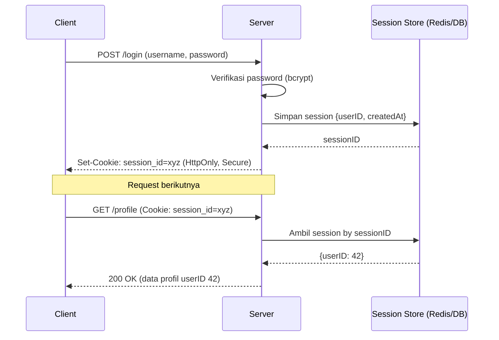
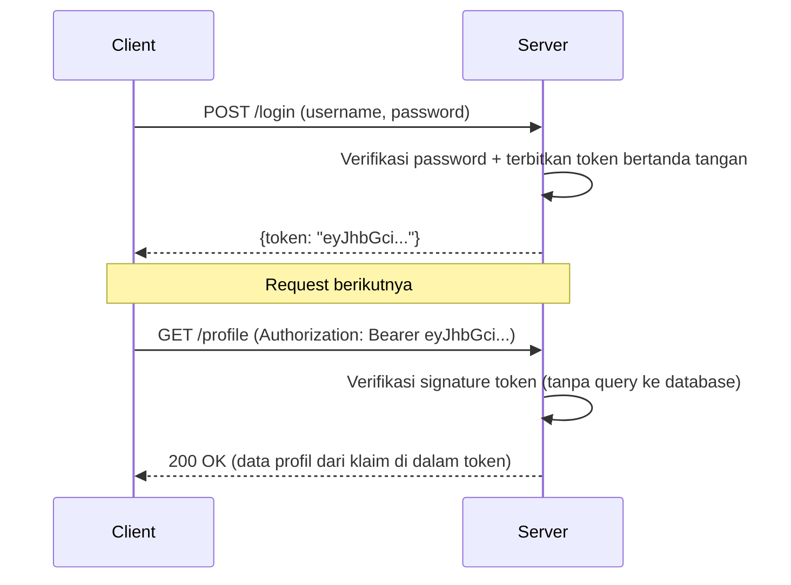

## TL;DR

Setelah pengguna berhasil login, server butuh cara mengingat "request berikutnya ini datang dari orang yang sama yang sudah login tadi" — karena HTTP itu sendiri stateless, tidak ada memori bawaan antar request. Ada dua model besar untuk ini: **session**, di mana server menyimpan status login di sisi server (biasanya di database atau Redis) dan hanya mengirim ID acak ke klien; dan **token**, di mana seluruh informasi yang dibutuhkan untuk memverifikasi identitas dikemas dan ditandatangani, lalu dikirim penuh ke klien, tanpa server perlu menyimpan apa pun. Pilihan ini bukan sekadar detail implementasi — ia menentukan seberapa mudah sistem di-scale secara horizontal, seberapa mudah sesi dicabut (revoke) di tengah jalan, dan di mana beban penyimpanan status sebenarnya berada.

## The Problem

Sebuah API dirancang untuk dipanggil oleh aplikasi Next.js di sisi frontend dan juga aplikasi mobile, keduanya butuh autentikasi. Tim awalnya memakai session berbasis cookie standar yang disimpan di memori proses aplikasi PHP (bukan di database/Redis terpusat) — pola yang wajar untuk aplikasi monolitik lama dengan satu server. Begitu aplikasi di-scale jadi tiga instance di belakang load balancer untuk menangani lonjakan traffic, pengguna mulai mengeluh tiba-tiba "logged out" secara acak: request pertama mendarat di instance A (yang menyimpan sesi mereka), request berikutnya di-load-balance ke instance B yang tidak pernah tahu sesi itu ada, karena statusnya tersimpan lokal di memori instance A saja.

Masalah kebalikannya muncul saat tim lain memilih JWT murni tanpa mekanisme tambahan, dengan asumsi "tinggal verifikasi signature, tidak perlu tanya database sama sekali — lebih cepat dan lebih scalable". Beberapa bulan kemudian, sebuah akun pegawai yang di-terminate ternyata masih bisa dipakai mengakses sistem selama beberapa jam setelah HRD menonaktifkan akunnya di database, karena token JWT yang sudah diterbitkan tetap valid secara kriptografis sampai masa berlakunya habis — tidak ada cara mencabutnya lebih awal tanpa mekanisme tambahan yang justru meniadakan sebagian keunggulan "tanpa perlu cek database" yang jadi alasan awal memilih JWT.

## Intuition

Session seperti **nomor antrean di loket layanan pemerintah** — kamu memegang secarik kertas bernomor (session ID), tapi seluruh detail permohonanmu (siapa kamu, apa statusnya) tersimpan di **komputer petugas loket**, bukan di kertas itu sendiri. Petugas tinggal mengetik nomor itu untuk melihat detailnya. Token seperti **surat keterangan resmi yang sudah lengkap berisi seluruh data dan cap basah** — siapa pun yang menerima surat itu bisa langsung memverifikasi keasliannya lewat cap (signature) tanpa perlu menelepon kantor yang menerbitkannya, karena seluruh informasi relevan sudah tertulis di surat itu sendiri.

Analogi ini bocor pada satu hal penting: surat keterangan resmi di dunia nyata bisa dicabut kalau pihak berwenang mengumumkan "surat bernomor sekian tidak berlaku lagi", dan orang yang memeriksa keasliannya di lapangan tetap bisa memeriksa pengumuman itu. Token JWT murni **tidak** punya mekanisme setara "periksa pengumuman pencabutan" bawaan — begitu diterbitkan dan ditandatangani, ia tetap dianggap valid oleh siapa pun yang memverifikasi signature-nya sampai `exp` (waktu kedaluwarsa) tercapai, kecuali sistem sengaja menambahkan lapisan pengecekan tambahan (blocklist, lihat [[JWT - Structure, Signature, and When It Is The Wrong Tool]]) yang berarti kembali butuh "menelepon kantor" — meniadakan sebagian alasan kenapa token dipilih di awal.

## How It Works



Diagram di atas menunjukkan model session: server selalu menyimpan status, dan setiap request butuh **satu round-trip tambahan** ke session store untuk memvalidasi. Ini berarti mencabut sesi sesederhana menghapus satu baris di session store — perubahan langsung berlaku di request berikutnya.



Diagram ini menunjukkan model token: server tidak menyimpan apa pun setelah token diterbitkan — verifikasi murni komputasi kriptografis lokal (memeriksa signature), yang berarti tidak ada round-trip tambahan ke database dan tidak ada masalah "instance mana yang tahu sesi ini" saat sistem di-scale horizontal. Trade-off-nya persis kebalikan dari session: mencabut token sebelum kedaluwarsa butuh mekanisme tambahan yang tidak dibawaan format token itu sendiri.

## In Go

```go
package auth

import (
	"context"
	"crypto/rand"
	"encoding/base64"
	"fmt"
	"net/http"
	"time"
)

type Session struct {
	UserID    int64
	CreatedAt time.Time
	ExpiresAt time.Time
}

// SessionStore adalah interface kecil supaya implementasi penyimpanan
// (Redis, database) bisa ditukar tanpa mengubah logika autentikasi di
// sekitarnya — lihat pola yang sama di
// [[../90 Architecture and Design/Manual Dependency Injection in Go|Manual Dependency Injection in Go]].
type SessionStore interface {
	Simpan(ctx context.Context, sessionID string, s Session) error
	Ambil(ctx context.Context, sessionID string) (Session, error)
	Hapus(ctx context.Context, sessionID string) error
}

// BuatSessionID menghasilkan ID acak yang cukup panjang dan tidak bisa
// ditebak — 32 byte acak, di-encode base64 URL-safe. ID session HARUS acak
// secara kriptografis (crypto/rand), bukan sekadar incrementing integer atau
// math/rand, supaya tidak bisa ditebak penyerang.
func BuatSessionID() (string, error) {
	b := make([]byte, 32)
	if _, err := rand.Read(b); err != nil {
		return "", fmt.Errorf("generate session id: %w", err)
	}
	return base64.URLEncoding.EncodeToString(b), nil
}

// Login memverifikasi kredensial, membuat session baru, dan mengeset cookie
// dengan flag keamanan yang wajib: HttpOnly (tidak bisa dibaca JavaScript,
// mengurangi risiko XSS mencuri session), Secure (hanya dikirim lewat HTTPS),
// dan SameSite (mengurangi risiko CSRF).
func Login(store SessionStore) http.HandlerFunc {
	return func(w http.ResponseWriter, r *http.Request) {
		ctx := r.Context()

		// (verifikasi username/password terhadap database diasumsikan
		// sudah terjadi sebelum titik ini, memakai VerifikasiPassword
		// dari note Password Hashing)
		var userID int64 = 42 // hasil verifikasi

		sessionID, err := BuatSessionID()
		if err != nil {
			http.Error(w, "gagal membuat session", http.StatusInternalServerError)
			return
		}

		session := Session{
			UserID:    userID,
			CreatedAt: time.Now(),
			ExpiresAt: time.Now().Add(24 * time.Hour),
		}

		if err := store.Simpan(ctx, sessionID, session); err != nil {
			http.Error(w, "gagal menyimpan session", http.StatusInternalServerError)
			return
		}

		http.SetCookie(w, &http.Cookie{
			Name:     "session_id",
			Value:    sessionID,
			HttpOnly: true,
			Secure:   true,
			SameSite: http.SameSiteLaxMode,
			Path:     "/",
			Expires:  session.ExpiresAt,
		})

		w.WriteHeader(http.StatusOK)
	}
}

// MiddlewareAutentikasi memvalidasi session dari cookie pada setiap request
// yang butuh login, menolak dengan 401 kalau session tidak ada atau sudah
// kedaluwarsa.
func MiddlewareAutentikasi(store SessionStore, next http.Handler) http.Handler {
	return http.HandlerFunc(func(w http.ResponseWriter, r *http.Request) {
		cookie, err := r.Cookie("session_id")
		if err != nil {
			http.Error(w, "belum login", http.StatusUnauthorized)
			return
		}

		session, err := store.Ambil(r.Context(), cookie.Value)
		if err != nil {
			http.Error(w, "session tidak valid", http.StatusUnauthorized)
			return
		}

		if time.Now().After(session.ExpiresAt) {
			_ = store.Hapus(r.Context(), cookie.Value)
			http.Error(w, "session kedaluwarsa", http.StatusUnauthorized)
			return
		}

		next.ServeHTTP(w, r)
	})
}
```

## In His Stack

Yii2 menyediakan komponen `Yii::$app->session` yang secara default menyimpan sesi di filesystem server (native PHP session) — pola ini punya masalah scaling yang identik dengan contoh di atas kalau aplikasi di-deploy sebagai banyak instance di belakang load balancer, tanpa "sticky session" atau session store terpusat. Solusi umum di dunia PHP adalah memindahkan session handler ke Redis (`yii\redis\Session`) — secara konsep sama persis dengan `SessionStore` interface di atas, hanya beda bahasa. Untuk aplikasi Next.js yang berkomunikasi dengan API Go, keputusan session vs token juga menentukan arsitektur: cookie session bekerja natural kalau frontend dan API berada di domain yang sama atau dikonfigurasi CORS dengan hati-hati, sementara token (dikirim lewat header `Authorization`) lebih natural untuk API yang juga dipakai aplikasi mobile atau dipanggil langsung server-to-server oleh partner eksternal yang tidak punya konsep cookie sama sekali.

## Trade-offs and When Not To Use It

**Session** lebih mudah dicabut (hapus satu baris di store) dan lebih mudah diaudit (server tahu persis sesi mana yang aktif), tapi butuh session store terpusat begitu aplikasi berjalan lebih dari satu instance, menambah satu round-trip jaringan per request dan satu titik kegagalan tambahan (kalau Redis/session store down, seluruh autentikasi ikut down). **Token** menghilangkan round-trip itu dan lebih natural untuk sistem terdistribusi lintas banyak service yang tidak semuanya perlu akses ke session store yang sama, tapi mencabutnya sebelum kedaluwarsa butuh usaha ekstra (blocklist, atau masa berlaku token dibuat sangat pendek dengan refresh token terpisah) — dan untuk sistem legal-services pemerintah, di mana kemampuan mencabut akses segera (misalnya pegawai yang diberhentikan) sering menjadi kebutuhan compliance yang keras, keterbatasan ini bukan detail kecil yang bisa diabaikan. Banyak sistem modern memakai hybrid: token berumur pendek (beberapa menit) untuk akses API, dipasangkan dengan refresh token yang statusnya **disimpan di server** (jadi tetap bisa dicabut) — mengambil keunggulan kedua sisi dengan trade-off kompleksitas implementasi yang lebih tinggi.

## Common Mistakes

> [!warning] Jebakan
> Menyimpan session di memori proses aplikasi (bukan store terpusat) lalu di-scale jadi banyak instance di belakang load balancer — menyebabkan pengguna "logout acak" tergantung instance mana yang menerima request mereka.

> [!warning] Jebakan
> Membuat session ID atau token yang bisa ditebak (misalnya ID berurutan, atau memakai `math/rand` alih-alih `crypto/rand`) — session ID harus punya entropi yang cukup tinggi sehingga menebaknya secara brute-force tidak praktis.

> [!warning] Jebakan
> Memilih token murni tanpa mekanisme pencabutan apa pun untuk sistem yang punya kebutuhan keras mencabut akses segera (akun disusupi, pegawai diberhentikan) — token yang sudah diterbitkan tetap valid sampai kedaluwarsa, sehingga masa berlaku yang terlalu panjang tanpa refresh token terpisah berarti jendela risiko yang sama panjangnya.

## Exercises

1. Jelaskan kenapa session berbasis memori lokal gagal begitu aplikasi di-scale jadi banyak instance di belakang load balancer, dan dua cara memperbaikinya.
2. Kenapa session ID harus dibuat dengan `crypto/rand`, bukan `math/rand` biasa?
3. Jelaskan trade-off spesifik antara "token berumur pendek + refresh token" dibanding "token berumur panjang tanpa refresh token".
4. Desain terbuka: sebuah sistem legal-services pemerintah butuh kemampuan mencabut akses seorang pegawai **dalam hitungan detik** sejak akunnya dinonaktifkan HRD (persyaratan compliance keras), tapi juga melayani ribuan request per detik dari aplikasi mobile milik masyarakat yang tidak boleh terganggu latensinya oleh round-trip database di setiap request. Rancang skema autentikasi yang memenuhi kedua kebutuhan ini, dan jelaskan bagian mana yang tetap butuh cek server-side dan bagian mana yang bisa diverifikasi murni secara lokal.

> [!success]- Kunci jawaban
> **1.** Instance A menyimpan sesi pengguna hanya di memorinya sendiri; begitu request berikutnya dari pengguna yang sama di-load-balance ke instance B, instance B tidak pernah tahu sesi itu ada, sehingga pengguna dianggap belum login. Dua perbaikan: (a) pindahkan penyimpanan sesi ke store terpusat (Redis/database) yang bisa diakses seluruh instance secara sama; atau (b) pakai token yang tidak butuh penyimpanan server sama sekali, sehingga instance mana pun bisa memverifikasi token secara independen.
> **4.** Skema yang wajar: pisahkan dua jenis token. **Access token** berumur sangat pendek (misalnya 2-5 menit), diverifikasi murni lewat signature secara lokal tanpa query ke database sama sekali — ini yang menangani mayoritas request volume tinggi dari aplikasi mobile tanpa round-trip tambahan. **Refresh token**, yang dipakai untuk menerbitkan access token baru begitu yang lama kedaluwarsa, statusnya **disimpan di server** (mirip session) dan dicek validitasnya (termasuk apakah pengguna masih aktif) setiap kali dipakai untuk refresh. Karena access token hanya berumur beberapa menit, mencabut akses pegawai berarti menonaktifkan refresh token-nya di server — access token lama yang mungkin masih beredar akan otomatis tidak berguna dalam hitungan menit begitu kedaluwarsa, dan tidak ada permintaan refresh baru yang akan berhasil setelah refresh token dicabut. Ini menukar "pencabutan instan sempurna" dengan "pencabutan dalam jendela beberapa menit", trade-off yang biasanya bisa diterima untuk kebanyakan kebutuhan compliance selama jendelanya dikomunikasikan eksplisit.

## Self-Check

- Apa perbedaan mendasar antara "di mana status login disimpan" pada session vs token?
- Kenapa mencabut token JWT murni sebelum kedaluwarsa butuh mekanisme tambahan?
- Flag cookie apa saja yang wajib diset untuk session ID, dan apa fungsi masing-masing?
- Kapan pola hybrid access token + refresh token lebih masuk akal dibanding token tunggal berumur panjang?

## Connected Notes

- [[Password Hashing - bcrypt and argon2]] — verifikasi password dengan mekanisme di note itu adalah langkah yang mendahului pembuatan session/token di sini.
- [[JWT - Structure, Signature, and When It Is The Wrong Tool]] — JWT adalah salah satu format konkret untuk model token yang dibahas di sini, dengan detail struktur dan batasannya sendiri.
- [[OAuth2 Overview]] — OAuth2 adalah protokol delegasi akses yang biasanya menerbitkan token, bukan session, sebagai hasil akhirnya.
- [[RBAC]] — baik session maupun token biasanya membawa identitas pengguna yang dipakai RBAC untuk memutuskan otorisasi di layer berikutnya.
- [[CSRF]] — model cookie-based session secara spesifik rentan terhadap CSRF dengan cara yang tidak berlaku sama untuk token yang dikirim lewat header `Authorization`.

## Further Reading

- OWASP Session Management Cheat Sheet — panduan flag cookie dan siklus hidup session yang aman.

## Catatan Saya

*Tulis di sini model autentikasi yang dipakai sistem kerjaanmu saat ini — session, token, atau hybrid — dan alasan historisnya kalau kamu tahu.*
