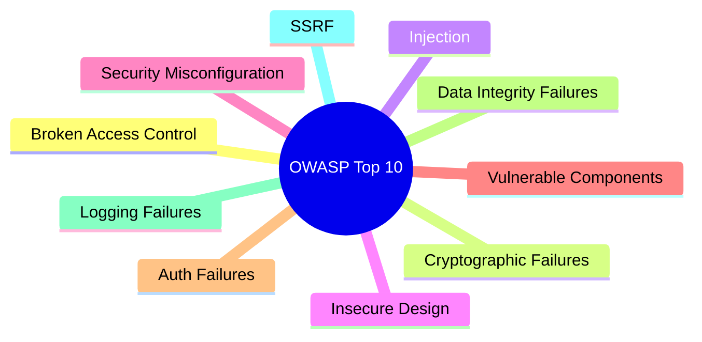

## TL;DR

OWASP Top 10 adalah daftar sepuluh kategori kerentanan aplikasi web paling berdampak dan paling sering ditemukan, disusun ulang secara berkala oleh komunitas keamanan OWASP berdasarkan data insiden nyata di industri. Daftar ini bukan checklist yang cukup "dicentang lalu selesai" — ia adalah peta area risiko yang harus terus dipikirkan di setiap fase pengembangan, dari desain sampai code review. Nilai terbesarnya untuk seorang koordinator teknis bukan menghafal sepuluh nama kategori, melainkan memakainya sebagai kerangka berpikir sistematis saat meninjau desain fitur baru atau kode orang lain: "kategori mana dari daftar ini yang relevan untuk perubahan ini?"

## The Problem

Sebuah tim developer government legal-services menyelesaikan fitur baru, lolos code review yang berfokus penuh pada logika bisnis (apakah alur permohonan sudah benar, apakah validasi data sudah sesuai peraturan), dan di-deploy ke production. Tiga bulan kemudian, sebuah audit keamanan eksternal (bagian dari kepatuhan sistem pemerintah) menemukan endpoint upload dokumen di fitur itu rentan terhadap path traversal (pengguna bisa mengunggah file dengan nama seperti `../../../etc/passwd` dan berpotensi menimpa file sistem), dan endpoint pencarian permohonan rentan SQL injection lewat parameter sorting yang tidak divalidasi. Tidak satu pun dari kedua celah ini pernah muncul di code review, karena review yang dilakukan murni berfokus pada "apakah fitur ini bekerja sesuai spesifikasi", bukan "apakah fitur ini bisa disalahgunakan dengan cara yang tidak dimaksud siapa pun yang menulisnya".

Masalah yang lebih mendasar: tanpa kerangka berpikir sistematis seperti OWASP Top 10, setiap developer akan menemukan kerentanan berdasarkan pengalaman pribadinya sendiri — developer yang pernah kena insiden SQL injection akan waspada terhadap itu, tapi mungkin buta terhadap CSRF karena belum pernah mengalaminya. Daftar terkurasi berbasis data industri memastikan tim tidak bergantung sepenuhnya pada pengalaman kebetulan masing-masing individu.

## Intuition

OWASP Top 10 seperti **daftar sepuluh penyebab kecelakaan kerja paling umum** yang disusun dari data kecelakaan nyata di banyak pabrik — bukan daftar arbitrer, melainkan hasil observasi "ini yang paling sering benar-benar terjadi dan paling parah akibatnya". Seorang supervisor pabrik yang hafal daftar ini tidak berhenti pada menghafal nama-namanya; ia memakainya sebagai lensa untuk memeriksa area kerja baru: "apakah ada risiko tergelincir di sini? Apakah ada risiko terjepit mesin di sini?"

Analogi ini bocor pada satu hal: penyebab kecelakaan kerja fisik relatif stabil dari dekade ke dekade, sementara lanskap kerentanan aplikasi web **bergeser** — daftar OWASP Top 10 sendiri berubah komposisinya antar revisi seiring pola serangan dan teknologi berkembang (misalnya, kategori tentang keamanan API dan supply chain menjadi jauh lebih menonjol di revisi-revisi yang lebih baru dibanding revisi lama). Menghafal satu revisi daftar ini sebagai kebenaran abadi adalah kesalahan; yang harus dipahami adalah **pola pikir** di baliknya, bukan daftar nama yang statis selamanya.

## How It Works

Sepuluh kategori (mengacu pada struktur umum revisi terbaru yang dikenal luas, dengan urutan dan nama persis yang sebaiknya selalu dicek ulang terhadap revisi resmi terkini):



> [!question] Perlu diverifikasi
> Klaim: sepuluh nama kategori di atas dan urutannya.
> Kenapa ragu: OWASP merevisi daftar ini secara berkala (bukan setiap tahun dengan jadwal tetap), dan nama/urutan kategori berubah antar revisi.
> Cara verifikasi: cek revisi terbaru langsung di owasp.org/Top10.

Beberapa kategori yang paling relevan untuk backend engineer, dijelaskan singkat (masing-masing yang punya note tersendiri di vault ini dibahas jauh lebih dalam di note itu):

- **Broken Access Control** — otorisasi yang salah atau lupa diterapkan, sehingga pengguna bisa mengakses data atau aksi yang seharusnya tidak berhak. Ini kenapa [[RBAC]] yang diterapkan konsisten (bukan pengecekan tersebar yang mudah terlewat) menjadi pertahanan utama.
- **Cryptographic Failures** — data sensitif tersimpan atau dikirim tanpa perlindungan kriptografis yang memadai, termasuk password yang tidak di-hash dengan benar (lihat [[Password Hashing - bcrypt and argon2]]) atau data yang seharusnya terenkripsi saat transit tapi tidak.
- **Injection** — data yang tidak tepercaya dicampur langsung ke dalam perintah yang dieksekusi interpreter (SQL, shell command, dll.), dibahas mendalam di [[SQL Injection]].
- **Insecure Design** — kerentanan yang lahir dari keputusan desain sejak awal (bukan bug implementasi), misalnya alur reset password yang secara desain memungkinkan enumerasi akun.
- **Security Misconfiguration** — pengaturan default yang tidak diubah (port debug yang terbuka di production, pesan error yang membocorkan stack trace ke pengguna), sering bersinggungan dengan [[../30 APIs and Web/Consistent Error Responses|Consistent Error Responses]].
- **Identification and Authentication Failures** — kelemahan di alur login itu sendiri, dibahas di [[Sessions vs Tokens]] dan [[JWT - Structure, Signature, and When It Is The Wrong Tool]].
- **Server-Side Request Forgery (SSRF)** — server dipaksa membuat request ke alamat yang tidak seharusnya (sering lewat input yang tidak divalidasi berupa URL), relevan khususnya untuk endpoint yang menerima URL dari pengguna (misalnya webhook, [[../30 APIs and Web/Pre-signed URLs|Pre-signed URLs]]).

## In Go

OWASP Top 10 bukan library atau kode yang diinstal — tapi sikap defensifnya bisa dicontohkan lewat satu pola kecil yang menyentuh beberapa kategori sekaligus: validasi input yang ketat di boundary sistem, sebelum data itu dipakai di mana pun.

```go
package validasi

import (
	"fmt"
	"path/filepath"
	"strings"
)

// ValidasiNamaFileUpload mencegah path traversal (bagian dari kategori
// Broken Access Control/Injection) dengan menolak nama file yang mengandung
// elemen path relatif, alih-alih mencoba "membersihkan" nama file yang sudah
// berpotensi berbahaya — menolak input yang salah selalu lebih aman daripada
// mencoba memperbaikinya secara diam-diam.
func ValidasiNamaFileUpload(namaFile string) error {
	bersih := filepath.Clean(namaFile)
	if strings.Contains(bersih, "..") || filepath.IsAbs(bersih) {
		return fmt.Errorf("nama file tidak valid: %q", namaFile)
	}
	if bersih != namaFile {
		return fmt.Errorf("nama file mengandung karakter path yang tidak diizinkan: %q", namaFile)
	}
	return nil
}
```

Pola "tolak input yang mencurigakan, jangan coba dibersihkan lalu dipakai" ini berulang di banyak kategori OWASP Top 10 — validasi ketat di titik masuk data selalu lebih aman daripada mencoba menyaring data berbahaya setelah ia sudah masuk lebih dalam ke sistem.

## In His Stack

Yii2 punya beberapa perlindungan bawaan yang secara implisit menutup sebagian kategori OWASP Top 10 — misalnya, Active Record Yii2 secara default memakai parameterized query yang mencegah SQL injection selama developer tidak menulis raw SQL dengan concatenation string manual. Tapi perlindungan bawaan framework tidak menutup seluruh sepuluh kategori: security misconfiguration (debug mode yang lupa dimatikan di production, `YII_DEBUG` yang masih `true`) dan broken access control (filter akses yang lupa diterapkan di controller action tertentu) tetap sepenuhnya tanggung jawab developer, terlepas dari framework apa pun yang dipakai. Ini kenapa daftar OWASP Top 10 tetap relevan dipahami sebagai kerangka berpikir, bukan sesuatu yang "sudah otomatis ditangani framework".

## Trade-offs and When Not To Use It

OWASP Top 10 bukan daftar lengkap seluruh kerentanan yang mungkin ada — ia sengaja fokus pada sepuluh kategori paling berdampak dan paling umum berdasarkan data, bukan katalog ekshaustif. Sistem dengan kebutuhan keamanan yang sangat spesifik (misalnya, sistem yang menangani data klasifikasi tinggi) butuh threat modelling yang jauh lebih mendalam dan spesifik konteks (lihat [[Threat Modelling with STRIDE]], level senior) daripada sekadar memastikan sepuluh kategori ini tertutup. Memakai OWASP Top 10 sebagai satu-satunya kerangka keamanan, tanpa threat modelling yang mempertimbangkan konteks spesifik sistem, memberi rasa aman yang keliru (false sense of security) — daftar ini adalah titik awal yang baik, bukan titik akhir.

## Common Mistakes

> [!warning] Jebakan
> Memperlakukan OWASP Top 10 sebagai checklist satu kali yang "sudah dicek, selesai" pada satu titik waktu, alih-alih kerangka berpikir yang dipakai berulang setiap kali fitur baru didesain atau kode baru direview.

> [!warning] Jebakan
> Mengasumsikan framework (Yii2, atau library Go apa pun) otomatis menutup seluruh sepuluh kategori — banyak kategori (security misconfiguration, broken access control spesifik fitur, insecure design) sepenuhnya bergantung pada keputusan developer, tidak ada framework yang menutupnya secara otomatis.

> [!warning] Jebakan
> Menghafal nama dan urutan sepuluh kategori dari satu revisi tertentu sebagai kebenaran abadi — daftar ini direvisi berkala, dan yang lebih penting untuk dipahami adalah pola pikir sistematis di baliknya, bukan daftar nama yang bisa berubah.

## Exercises

1. Jelaskan kenapa OWASP Top 10 lebih tepat dipahami sebagai kerangka berpikir dibanding checklist statis.
2. Sebutkan satu kategori dari daftar ini yang **tidak** otomatis ditutup oleh framework apa pun (Yii2 maupun Go), dan jelaskan kenapa.
3. Kenapa "membersihkan" input yang mencurigakan (misalnya nama file dengan `..`) dianggap kurang aman dibanding menolaknya langsung?
4. Desain terbuka: kamu ditugaskan meninjau desain fitur baru — endpoint yang menerima URL dari pengguna, lalu server men-download dan memproses gambar dari URL tersebut untuk disisipkan ke dokumen PDF. Jalankan tinjauanmu memakai kerangka OWASP Top 10: kategori apa saja yang relevan untuk fitur ini, dan pertanyaan spesifik apa yang perlu kamu ajukan ke tim yang mendesainnya untuk masing-masing kategori itu.

> [!success]- Kunci jawaban
> **1.** Checklist statis memberi kesan "sekali dicentang, selesai selamanya", padahal kerentanan baru muncul setiap kali ada fitur baru, dan kerentanan lama bisa muncul kembali lewat perubahan kode yang tidak disadari mempengaruhi area yang sudah "aman" sebelumnya. Kerangka berpikir berarti daftar ini dipakai sebagai lensa tinjauan berulang — setiap fitur baru, setiap code review, bukan satu kali audit di masa lalu.
> **4.** Fitur "download gambar dari URL yang diberikan pengguna" adalah kandidat klasik **SSRF** — pertanyaan kunci: apakah server bisa dipaksa mengakses alamat internal (misalnya `http://169.254.169.254` untuk metadata cloud, atau alamat internal jaringan kantor) lewat URL yang dikontrol pengguna? Perlu validasi ketat alamat tujuan (menolak alamat internal/private IP range) sebelum server melakukan request. Kategori kedua yang relevan: **Insecure Design** — apakah ada batas ukuran file yang di-download, batas waktu request, dan penanganan kalau URL mengarah ke resource yang sangat besar atau lambat (potensi denial of service dari sisi resource server sendiri)? Ketiga, **Security Misconfiguration** — apakah error dari proses download (URL tidak valid, koneksi timeout) ditampilkan sebagai pesan generik ke pengguna, atau membocorkan detail internal seperti struktur jaringan server? Pertanyaan untuk tim: "URL apa saja yang divalidasi/ditolak sebelum request dibuat? Ada batas ukuran dan timeout? Pesan error yang dikembalikan ke pengguna sudah digeneralisasi?"

## Self-Check

- Apa yang membedakan OWASP Top 10 dari checklist keamanan biasa?
- Sebutkan tiga kategori dari daftar ini beserta satu contoh konkret masing-masing.
- Kenapa framework tidak bisa menutup seluruh sepuluh kategori secara otomatis?
- Kenapa daftar ini perlu dipahami sebagai sesuatu yang berubah antar revisi, bukan daftar tetap?

## Connected Notes

- [[SQL Injection]] — pembahasan mendalam kategori Injection, kategori yang paling sering ditemui backend engineer secara langsung.
- [[XSS]] — pembahasan mendalam salah satu bentuk kerentanan injection yang menyasar sisi klien.
- [[CSRF]] — kerentanan yang bersinggungan dengan kategori Broken Access Control dan Identification/Authentication Failures.
- [[RBAC]] — otorisasi konsisten yang diterapkan lewat RBAC adalah pertahanan utama terhadap kategori Broken Access Control.
- [[Password Hashing - bcrypt and argon2]] — penyimpanan password yang benar adalah pertahanan utama terhadap kategori Cryptographic Failures.

## Further Reading

- owasp.org/Top10 — sumber resmi daftar terbaru; selalu rujuk ke sini untuk nama dan urutan kategori terkini, karena daftar ini direvisi berkala.

## Catatan Saya

*Tulis di sini hasil audit keamanan atau code review di kantor yang pernah menemukan kerentanan dari salah satu kategori ini.*
