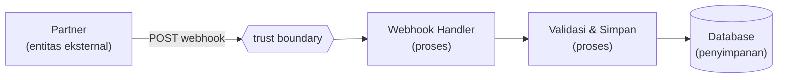

## TL;DR

STRIDE adalah kerangka sistematis untuk menemukan cara sebuah sistem bisa diserang, dilakukan **sebelum** sistem itu dibangun atau sebelum fitur baru di-deploy — bukan sesudah insiden terjadi. Namanya singkatan dari enam kategori ancaman: Spoofing, Tampering, Repudiation, Information Disclosure, Denial of Service, dan Elevation of Privilege. Caranya: gambar diagram alur data sistem (siapa bicara dengan siapa, data apa yang mengalir, di mana batas kepercayaan berubah), lalu untuk setiap elemen di diagram itu, tanyakan satu per satu apakah keenam kategori ancaman ini mungkin terjadi. Ini bukan alat yang menjamin sistem aman — ia adalah alat untuk mengubah "keamanan" dari perasaan menjadi daftar pertanyaan konkret yang bisa dijawab satu per satu.

## The Problem

Sebuah tim membangun endpoint baru untuk menerima dokumen dari sistem partner instansi lain lewat webhook. Fitur ini lolos code review, lolos QA fungsional, dan berjalan mulus di staging. Tiga bulan setelah production, muncul laporan bahwa endpoint itu bisa dipanggil oleh siapa saja yang tahu URL-nya — tidak ada verifikasi bahwa permintaan benar-benar berasal dari partner yang sah, karena semua orang yang menulis dan mereview kode itu berasumsi "toh URL-nya tidak dipublikasikan, aman."

Masalahnya bukan bahwa developer yang menulis kode itu ceroboh. Masalahnya adalah **tidak ada satu titik pun dalam proses** di mana seseorang secara sistematis bertanya "siapa yang bisa memanggil endpoint ini, dan bagaimana sistem membuktikan bahwa pemanggilnya memang benar partner yang dimaksud?" Code review memeriksa apakah kode melakukan apa yang dimaksud pembuatnya, bukan apakah ada jalan lain untuk memicu kode itu dengan cara yang tidak dimaksud. Threat modelling mengisi celah itu — ia adalah proses yang secara eksplisit memaksa pertanyaan "bagaimana ini bisa disalahgunakan" diajukan sebelum kode sampai ke production, bukan menunggu penyerang atau auditor yang menemukannya lebih dulu.

## Intuition

Cara paling mudah memahaminya: STRIDE adalah **daftar periksa arsitek bangunan** sebelum konstruksi dimulai — bukan pemeriksaan setelah gedung berdiri dan kebakaran terjadi. Arsitek tidak menunggu kebakaran sungguhan untuk tahu bahwa gedung butuh jalur evakuasi; ia punya daftar kategori risiko standar (kebakaran, gempa, beban berlebih) yang diperiksa terhadap setiap ruangan dan setiap pintu di denah, sebelum satu bata pun dipasang.

Analogi ini berhenti bekerja di titik jumlah kategorinya. Arsitek punya daftar risiko fisik yang relatif stabil dari dekade ke dekade. STRIDE punya enam kategori yang **tidak lengkap** secara desain — ia adalah alat bantu berpikir yang mempersempit ruang pencarian, bukan daftar ancaman yang lengkap dan final. Sebuah sistem bisa lolos seluruh enam kategori STRIDE dan tetap punya celah keamanan yang tidak masuk kategori mana pun (kesalahan logika bisnis, misalnya) — STRIDE mempersempit pencarian, tapi tidak menggantikan penilaian manusia yang melakukannya.

## How It Works

Prosesnya dimulai dari diagram alur data (data flow diagram/DFD), bukan dari kode. Empat elemen yang digambar: **proses** (kode yang mengeksekusi logika, misalnya handler HTTP), **penyimpanan data** (database, file storage, cache), **aliran data** (panggilan antar proses atau ke penyimpanan), dan **entitas eksternal** (partner, pengguna, sistem lain di luar kendalimu). Di antara elemen-elemen ini digambar **batas kepercayaan** (trust boundary) — garis yang menandai tempat data berpindah dari satu tingkat kepercayaan ke tingkat lain, misalnya dari internet publik ke jaringan internal.


Setiap panah dan setiap kotak di diagram ini adalah titik yang wajib diperiksa terhadap enam kategori STRIDE — garis trust boundary menandai tempat paling penting untuk diperiksa, karena di situlah asumsi kepercayaan berubah.

Enam kategori ancaman, masing-masing dengan pertanyaan intinya:

| Kategori | Pertanyaan Inti | Contoh pada kasus webhook di atas |
|---|---|---|
| **Spoofing** | Bisakah seseorang menyamar jadi pihak lain? | Siapa pun bisa memanggil endpoint dan mengaku sebagai partner, tanpa verifikasi signature. |
| **Tampering** | Bisakah data diubah tanpa terdeteksi selama perjalanan? | Payload webhook diubah di tengah jalan tanpa mekanisme integritas. |
| **Repudiation** | Bisakah pihak yang melakukan aksi menyangkalnya nanti? | Tidak ada catatan siapa (atau sistem apa) yang mengirim payload tertentu; lihat [[Audit Logging]]. |
| **Information Disclosure** | Bisakah data sensitif terbaca pihak yang tidak berhak? | Response error endpoint membocorkan struktur database internal. |
| **Denial of Service** | Bisakah sistem dibuat tidak bisa melayani permintaan sah? | Endpoint tanpa rate limit bisa dibanjiri permintaan sampai database kewalahan. |
| **Elevation of Privilege** | Bisakah seseorang mendapat akses lebih dari yang seharusnya? | Payload yang diterima langsung dipakai untuk query tanpa validasi peran pengirim. |

## Under The Hood

Threat modelling yang efektif dilakukan **per trust boundary**, bukan per baris kode — alasannya, mayoritas kerentanan nyata muncul tepat di titik data berpindah tingkat kepercayaan (dari partner ke sistemmu, dari pengguna ke database, dari service internal ke service lain), bukan di tengah-tengah logika yang seluruhnya berjalan dalam satu tingkat kepercayaan yang sama. Ini kenapa DFD digambar dulu sebelum pertanyaan STRIDE diajukan: tanpa diagram, mudah sekali memeriksa kode secara acak dan melewatkan justru titik-titik yang paling berisiko.

Setiap ancaman yang ditemukan diberi **mitigasi eksplisit** dan, kalau mitigasi itu tidak langsung dikerjakan, **risiko yang diterima secara sadar** (bukan diam-diam diabaikan). Tabel threat model yang matang biasanya berbentuk: ancaman → kategori STRIDE → elemen DFD yang terkena → mitigasi → status (sudah ditangani / direncanakan / risiko diterima). Baris terakhir ini penting — threat modelling yang baik tidak berpura-pura semua risiko bisa dihilangkan; ia membuat keputusan "kita terima risiko ini karena X" menjadi keputusan yang tercatat dan disengaja, bukan kelalaian yang baru ketahuan saat insiden terjadi.

## In Go

```go
package webhook

import (
	"crypto/hmac"
	"crypto/sha256"
	"encoding/hex"
	"errors"
	"io"
	"net/http"
)

// Handler ini adalah hasil LANGSUNG dari threat model di atas: setiap
// mitigasi berikut menjawab satu ancaman spesifik dari tabel STRIDE.

var errInvalidSignature = errors.New("webhook: signature tidak valid")

// verifySignature menjawab ancaman Spoofing dan Tampering sekaligus —
// signature membuktikan payload berasal dari partner (bukan pihak
// yang menyamar) DAN belum diubah selama perjalanan.
func verifySignature(payload []byte, signatureHeader, secret string) error {
	mac := hmac.New(sha256.New, []byte(secret))
	mac.Write(payload)
	expected := hex.EncodeToString(mac.Sum(nil))

	if !hmac.Equal([]byte(expected), []byte(signatureHeader)) {
		return errInvalidSignature
	}
	return nil
}

func WebhookHandler(secret string, maxBodyBytes int64) http.HandlerFunc {
	return func(w http.ResponseWriter, r *http.Request) {
		// Menjawab ancaman Denial of Service: body dibatasi SEBELUM
		// dibaca penuh ke memori, bukan sesudah.
		r.Body = http.MaxBytesReader(w, r.Body, maxBodyBytes)

		payload, err := io.ReadAll(r.Body)
		if err != nil {
			// Menjawab Information Disclosure: pesan error ke klien
			// tidak membocorkan detail internal (stack trace, path file).
			http.Error(w, "gagal membaca request", http.StatusBadRequest)
			return
		}

		signature := r.Header.Get("X-Webhook-Signature")
		if err := verifySignature(payload, signature, secret); err != nil {
			http.Error(w, "unauthorized", http.StatusUnauthorized)
			return
		}

		// Menjawab Repudiation: setiap payload yang lolos verifikasi
		// dicatat sebelum diproses lebih lanjut, lihat [[Audit Logging]].
		auditLog(r.Context(), payload)

		// Elevation of Privilege ditangani di lapisan berikutnya
		// (service/repository), bukan di handler ini — payload yang
		// sudah terverifikasi tetap divalidasi terhadap peran/scope
		// partner sebelum dipakai mengubah data.

		w.WriteHeader(http.StatusAccepted)
	}
}
```

## In His Stack

Untuk koordinator teknis 10+ developer lintas 13 aplikasi legal-services, threat modelling paling bernilai justru di titik integrasi antar-organisasi. Setiap kali sebuah aplikasi menambah endpoint baru yang dipanggil partner, atau memanggil API partner baru (lihat [[../30 APIs and Web/Designing an API for a Partner You Do Not Control|Designing an API for a Partner You Do Not Control]]), itu adalah trust boundary baru yang layak sesi STRIDE singkat sebelum kode ditulis. Ini tidak perlu jadi proses berat — untuk endpoint kecil, 30 menit menggambar DFD dan mengisi tabel enam kategori bersama satu-dua developer lain sudah menangkap mayoritas celah yang biasanya baru ketahuan lewat insiden production.

## Trade-offs and When Not To Use It

Threat modelling formal (sesi terjadwal, dokumen DFD, tabel mitigasi lengkap) sepadan untuk fitur yang menyeberangi trust boundary — endpoint publik, integrasi partner, apa pun yang menangani data sensitif. Untuk perubahan kecil yang seluruhnya berada dalam satu trust boundary yang sudah dianalisis sebelumnya (menambah field internal, mengubah query yang tidak menyentuh input eksternal), sesi STRIDE penuh adalah overhead yang tidak sepadan — cukup tanya "apakah ini menambah trust boundary baru?", dan kalau jawabannya tidak, threat modelling ulang tidak diperlukan. STRIDE juga tidak menangkap kesalahan logika bisnis murni (misalnya aturan diskon yang salah tapi tidak melibatkan pelanggaran kepercayaan) — untuk itu, code review dan test case tetap jadi lini pertama.

## Common Mistakes

> [!warning] Jebakan
> Melakukan threat modelling sekali di awal proyek lalu tidak pernah mengulanginya lagi — setiap fitur baru yang menambah trust boundary (integrasi partner baru, endpoint publik baru) butuh sesi STRIDE-nya sendiri, bukan mengandalkan hasil analisis lama yang sudah tidak mencakup permukaan sistem yang baru.

> [!warning] Jebakan
> Menjalankan STRIDE terhadap kode, bukan terhadap diagram alur data — tanpa DFD dan trust boundary yang digambar eksplisit, pemeriksaan cenderung acak dan melewatkan justru titik-titik perpindahan kepercayaan yang paling berisiko.

> [!warning] Jebakan
> Mencatat ancaman tapi tidak pernah memberi status mitigasi yang jelas — daftar ancaman tanpa keputusan "ditangani / direncanakan / risiko diterima" hanya jadi dokumen yang dibaca sekali lalu dilupakan, bukan alat kerja yang dipakai ulang.

## Exercises

1. Sebutkan enam kategori STRIDE dan pertanyaan inti masing-masing.
2. Kenapa threat modelling dimulai dari diagram alur data, bukan langsung dari kode?
3. Jelaskan kenapa trust boundary adalah titik paling penting untuk diperiksa dibanding bagian lain dari sistem.
4. Desain terbuka: kamu baru diminta menambahkan fitur di salah satu dari 13 aplikasi — partner instansi lain akan mengirim file PDF hasil scan dokumen lewat endpoint upload baru, dan sistemmu perlu menyimpannya lalu memberi notifikasi ke petugas terkait. Gambarkan (secara tekstual) elemen DFD-nya, tandai trust boundary-nya, dan identifikasi minimal satu ancaman konkret untuk tiap kategori STRIDE pada skenario ini.

> [!success]- Kunci jawaban
> **1.** Spoofing (menyamar jadi pihak lain), Tampering (mengubah data tanpa terdeteksi), Repudiation (menyangkal aksi yang dilakukan), Information Disclosure (data sensitif terbaca pihak tak berhak), Denial of Service (sistem dibuat tak bisa melayani), Elevation of Privilege (mendapat akses lebih dari seharusnya).
> **4.** Elemen DFD: entitas eksternal (sistem partner), trust boundary (di titik permintaan upload masuk dari internet), proses (handler upload, proses validasi file, proses notifikasi), penyimpanan (file storage, database metadata, antrian notifikasi). Ancaman per kategori: **Spoofing** — siapa pun bisa mengaku sebagai partner tanpa autentikasi request; **Tampering** — file PDF diubah di tengah jalan tanpa checksum; **Repudiation** — tidak ada catatan siapa yang mengunggah file tertentu kapan; **Information Disclosure** — URL file yang disimpan bisa ditebak dan diakses tanpa otorisasi; **Denial of Service** — upload file besar berulang tanpa batas ukuran atau rate limit membebani storage; **Elevation of Privilege** — metadata dalam request dipakai langsung menentukan petugas tujuan notifikasi tanpa validasi apakah partner berhak mengarahkan ke petugas tersebut.

## Self-Check

- Apa kepanjangan STRIDE, dan pertanyaan inti tiap kategorinya?
- Kenapa DFD dan trust boundary digambar sebelum pertanyaan STRIDE diajukan?
- Apa yang membedakan threat modelling yang matang dari sekadar daftar ancaman?
- Kapan sesi STRIDE formal jadi overhead yang tidak sepadan?

## Connected Notes

- [[The OWASP Top 10]] — OWASP Top 10 adalah daftar kerentanan yang sering muncul; STRIDE adalah proses untuk menemukan kerentanan spesifik pada sistemmu sendiri, termasuk yang tidak masuk daftar itu.
- [[../30 APIs and Web/Designing an API for a Partner You Do Not Control|Designing an API for a Partner You Do Not Control]] — setiap integrasi partner baru adalah trust boundary baru yang layak sesi STRIDE.
- [[Audit Logging]] — mitigasi konkret untuk ancaman Repudiation yang ditemukan lewat STRIDE.
- [[Zero Trust]] — kelanjutan langsung: prinsip arsitektur yang mengasumsikan sebagian ancaman STRIDE (terutama Spoofing dan Elevation of Privilege) selalu mungkin terjadi, bahkan dari dalam jaringan sendiri.
- [[RBAC]] — mitigasi struktural untuk ancaman Elevation of Privilege yang ditemukan lewat STRIDE.

## Further Reading

- Dokumentasi model STRIDE dari Microsoft SDL (Security Development Lifecycle), sumber asal kerangka ini.
- OWASP Threat Modeling Cheat Sheet.

## Catatan Saya

*Tulis di sini fitur atau integrasi partner di pekerjaanmu yang belum pernah melalui sesi threat modelling, dan ancaman paling jelas yang mungkin terlewat.*
