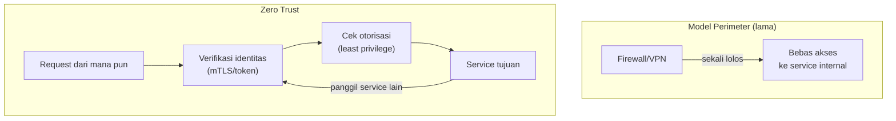

## TL;DR

Zero trust adalah prinsip arsitektur yang menolak asumsi lama "kalau sudah di dalam jaringan internal, berarti bisa dipercaya." Setiap permintaan — baik datang dari internet publik maupun dari service lain yang berjalan di jaringan yang sama — harus diverifikasi identitas dan otorisasinya sendiri, tanpa bergantung pada lokasi jaringan sebagai bukti kepercayaan. Ini bukan satu produk yang dibeli dan dipasang, melainkan pergeseran cara berpikir: dari "amankan perimeter, percayai isinya" menjadi "verifikasi setiap permintaan, di mana pun asalnya."

## The Problem

Sebuah instansi punya arsitektur klasik: firewall di batas jaringan, VPN untuk akses dari luar, dan begitu seseorang (atau sebuah service) berhasil masuk ke jaringan internal, ia bisa memanggil service lain di jaringan yang sama nyaris tanpa hambatan tambahan — asumsinya, kalau sudah lolos firewall dan VPN, berarti pihak yang sah. Suatu hari, kredensial VPN salah satu developer bocor lewat laptop yang terinfeksi malware. Penyerang yang masuk lewat kredensial itu tidak perlu membobol apa pun lagi — begitu berada "di dalam", ia bisa memanggil service internal, database, dan sistem manajemen lain yang semuanya berasumsi "traffic dari jaringan internal pasti aman", dan bergerak lateral dari satu service ke service lain tanpa satu pun dari mereka menanyakan ulang siapa sebenarnya yang memanggil.

Pola ini disebut **perimeter security** — keras di luar, lunak di dalam, seperti telur. Masalahnya: begitu perimeter itu ditembus sekali (dan riwayat insiden industri menunjukkan ini kejadian yang realistis, bukan hipotesis jauh), penyerang punya akses nyaris bebas ke segala sesuatu yang berada "di dalam", karena tidak ada lapisan verifikasi kedua yang menunggu di dalam jaringan.

## Intuition

Padanan terdekatnya di luar dunia software: bandara modern tidak cukup memeriksa penumpang sekali di pintu masuk lalu membiarkannya bebas berkeliaran ke semua area — ada pemeriksaan lagi di gerbang keberangkatan, ada area yang butuh badge khusus meski sudah berada "di dalam" bandara, dan petugas yang berpindah area tetap harus menunjukkan identitas ulang di setiap titik yang lebih sensitif. Bandara tidak mengasumsikan "sudah lolos pemeriksaan awal, berarti aman ke mana pun" — setiap titik sensitif memverifikasi ulang.

Yang tidak ditangkap analogi ini: bandara tetap punya satu perimeter fisik yang jelas (pagar, terminal). Zero trust justru menghilangkan gagasan "perimeter tunggal" itu sepenuhnya — tidak ada garis di mana verifikasi berhenti dan kepercayaan otomatis dimulai, karena setiap titik (setiap service, setiap permintaan) dianggap berpotensi berada di luar batas kepercayaan, termasuk yang secara fisik berjalan di rak server yang sama.

## How It Works

Tiga prinsip yang saling menopang:

1. **Verifikasi eksplisit, bukan implisit dari lokasi.** Identitas pemanggil (pengguna atau service) dibuktikan lewat kredensial yang bisa diverifikasi secara kriptografis — token yang ditandatangani, sertifikat client lewat [[mTLS]] — bukan disimpulkan dari fakta bahwa permintaan datang dari alamat IP internal.
2. **Least privilege secara default.** Setiap identitas hanya diberi akses persis ke apa yang ia butuhkan, sekecil mungkin cakupannya (lihat [[RBAC]]), bukan akses luas yang "kebetulan belum dipakai."
3. **Asumsikan pelanggaran sudah terjadi (assume breach).** Desain sistem seolah-olah penyerang sudah berhasil masuk ke suatu titik di jaringan — pertanyaannya bukan "bagaimana mencegah semua pelanggaran" (mustahil dijamin), tapi "seberapa jauh pelanggaran di satu titik bisa menyebar sebelum dihentikan." Ini yang mendorong micro-segmentation: memecah jaringan jadi zona-zona kecil yang masing-masing butuh verifikasi terpisah, supaya kompromi satu service tidak otomatis berarti kompromi seluruh sistem.


Di model perimeter, verifikasi terjadi sekali di gerbang lalu berhenti. Di zero trust, setiap panggilan — termasuk antar service internal — melewati verifikasi identitas dan otorisasi yang sama, tidak peduli dari mana ia datang.

## Under The Hood

Implementasi nyata zero trust bertumpu pada dua mekanisme teknis: **identitas yang bisa diverifikasi secara kriptografis** untuk setiap service (bukan hanya pengguna manusia) lewat sertifikat mTLS atau token pendek-umur, dan **policy engine** yang mengevaluasi setiap permintaan terhadap kebijakan akses secara real-time — bukan daftar IP yang diizinkan (allowlist berbasis jaringan), melainkan kebijakan berbasis identitas ("service A boleh memanggil endpoint X di service B, dengan scope Y"). Di ekosistem container modern, ini sering diimplementasikan lewat **service mesh** (lihat [[../92 Tools/Consul|Consul]]) yang menyuntikkan sidecar proxy ke setiap service — sidecar inilah yang menangani mTLS dan penegakan kebijakan, tanpa setiap service harus mengimplementasikan logikanya sendiri secara terpisah.

Poin yang sering disalahpahami: zero trust **tidak menghilangkan** firewall dan network segmentation — keduanya tetap berguna sebagai lapisan pertahanan. Yang berubah adalah zero trust tidak lagi **bergantung** pada firewall sebagai satu-satunya lapisan pertahanan. Ini prinsip defense in depth yang diterapkan secara konsisten: setiap lapisan diasumsikan bisa gagal sendiri-sendiri.

## In Go

```go
package middleware

import (
	"context"
	"crypto/x509"
	"net/http"
)

// Identity merepresentasikan identitas yang SUDAH diverifikasi
// secara kriptografis — bukan disimpulkan dari alamat IP pemanggil.
type Identity struct {
	ServiceName string
	Scopes      []string
}

type ctxKey string

const identityKey ctxKey = "identity"

// VerifyMTLS mengekstrak identitas dari client certificate yang wajib
// disertakan setiap request (RequireAndVerifyClientCert di server TLS
// config) — lihat [[mTLS]] untuk detail handshake-nya. Middleware ini
// TIDAK pernah mengasumsikan permintaan aman hanya karena datang dari
// jaringan internal.
func VerifyMTLS(next http.Handler) http.Handler {
	return http.HandlerFunc(func(w http.ResponseWriter, r *http.Request) {
		if len(r.TLS.PeerCertificates) == 0 {
			http.Error(w, "client certificate wajib disertakan", http.StatusUnauthorized)
			return
		}

		cert := r.TLS.PeerCertificates[0]
		identity := Identity{
			ServiceName: cert.Subject.CommonName,
			Scopes:      extractScopes(cert),
		}

		ctx := context.WithValue(r.Context(), identityKey, identity)
		next.ServeHTTP(w, r.WithContext(ctx))
	})
}

// RequireScope menegakkan least privilege: identitas yang lolos
// verifikasi TETAP harus punya scope yang sesuai untuk endpoint
// spesifik ini — lolos autentikasi bukan berarti lolos otorisasi.
func RequireScope(scope string, next http.Handler) http.Handler {
	return http.HandlerFunc(func(w http.ResponseWriter, r *http.Request) {
		identity, ok := r.Context().Value(identityKey).(Identity)
		if !ok || !hasScope(identity.Scopes, scope) {
			http.Error(w, "forbidden", http.StatusForbidden)
			return
		}
		next.ServeHTTP(w, r)
	})
}

func extractScopes(cert *x509.Certificate) []string {
	// Skema nyata: scope diambil dari extension khusus di sertifikat,
	// atau dari policy engine eksternal yang di-query pakai ServiceName.
	return []string{}
}

func hasScope(scopes []string, want string) bool {
	for _, s := range scopes {
		if s == want {
			return true
		}
	}
	return false
}
```

## In His Stack

Pola umum di sistem pemerintah yang diwarisi dari arsitektur lama: seluruh 13 aplikasi dianggap "aman" begitu berada di jaringan intranet yang sama, dan komunikasi antar service internal sering tidak diverifikasi sama sekali — mengandalkan firewall di batas jaringan sebagai satu-satunya pertahanan. Zero trust tidak berarti membongkar semua ini sekaligus; langkah paling realistis adalah mulai dari titik dengan risiko tertinggi — service yang menangani data paling sensitif, atau endpoint yang paling sering jadi jalur integrasi partner eksternal — dan menerapkan verifikasi identitas eksplisit di situ dulu, sebelum meluas ke seluruh mesh internal.

## Trade-offs and When Not To Use It

Zero trust menambah latency (setiap panggilan butuh verifikasi tambahan) dan kompleksitas operasional (mengelola sertifikat atau token untuk setiap service, policy engine yang harus dipelihara). Untuk sistem kecil dengan sedikit service yang seluruhnya dikelola satu tim kecil, overhead ini sering tidak sepadan — network segmentation dan firewall yang dikonfigurasi benar sudah memberi pertahanan yang cukup untuk skala itu. Zero trust menjadi bernilai jelas begitu jumlah service bertambah, tim yang mengoperasikan bertambah, atau sistem menangani data yang konsekuensi kebocorannya besar (data pribadi warga negara, dokumen hukum) — titik di mana asumsi "internal berarti aman" menjadi taruhan yang terlalu mahal kalau salah.

## Common Mistakes

> [!warning] Jebakan
> Menganggap zero trust sebagai produk yang cukup dibeli dan dipasang (banyak vendor memasarkannya begitu) — tanpa policy engine yang benar-benar menegakkan least privilege dan verifikasi identitas per request, memasang "solusi zero trust" hanya menambah biaya tanpa mengubah model kepercayaan yang sebenarnya.

> [!warning] Jebakan
> Menerapkan verifikasi identitas di gerbang masuk (API gateway) tapi membiarkan komunikasi antar service internal di belakang gateway tetap tanpa verifikasi — ini masih model perimeter, hanya perimeternya dipindah, bukan dihilangkan.

> [!warning] Jebakan
> Mengabaikan monitoring lalu lintas keluar (egress) sambil fokus penuh ke lalu lintas masuk — assume breach berarti mengasumsikan sesuatu di dalam jaringan mungkin sudah kompromi dan mencoba mengirim data keluar; tanpa memantau egress, kebocoran seperti ini bisa berjalan lama tanpa terdeteksi.

## Exercises

1. Jelaskan perbedaan mendasar antara model perimeter security dan zero trust.
2. Sebutkan tiga prinsip inti zero trust dan bagaimana masing-masing menjawab kelemahan model perimeter.
3. Kenapa "assume breach" mengubah cara mendesain segmentasi jaringan?
4. Desain terbuka: kamu koordinator teknis untuk 13 aplikasi yang saat ini seluruhnya saling memanggil bebas di jaringan intranet tanpa verifikasi antar service. Anggaran dan waktu terbatas — kamu tidak bisa menerapkan zero trust penuh ke semua 13 aplikasi sekaligus. Rancang urutan prioritas: service atau jalur komunikasi mana yang kamu amankan lebih dulu, dan kenapa.

> [!success]- Kunci jawaban
> **1.** Model perimeter memverifikasi sekali di batas jaringan (firewall/VPN) lalu mempercayai semua traffic di dalamnya tanpa verifikasi ulang. Zero trust memverifikasi identitas dan otorisasi di **setiap** permintaan, tidak peduli dari mana asalnya, sehingga tidak ada satu titik kompromi yang otomatis membuka akses ke segala sesuatu di baliknya.
> **4.** Prioritaskan berdasarkan kombinasi sensitivitas data dan luas dampak jika kompromi: (1) service yang menyimpan atau memproses data pribadi paling sensitif (dokumen hukum, data identitas warga) — dampak kebocoran di sini paling besar; (2) jalur komunikasi yang menjadi titik integrasi dengan partner eksternal — permukaan serangnya paling luas karena melibatkan pihak di luar kendali penuhmu; (3) service dengan hak akses paling luas ke service lain (misalnya service yang jadi hub bagi banyak service lain) — kompromi di sini punya potensi pergerakan lateral paling besar. Service internal kecil dengan data non-sensitif dan blast radius terbatas bisa ditunda ke fase berikutnya.

## Self-Check

- Apa perbedaan mendasar model perimeter dan zero trust?
- Sebutkan tiga prinsip inti zero trust.
- Kenapa zero trust tidak menghilangkan firewall, hanya mengubah ketergantungan padanya?
- Kapan investasi zero trust penuh tidak sepadan untuk sebuah sistem?

## Connected Notes

- [[Threat Modelling with STRIDE]] — zero trust adalah respons arsitektur terhadap ancaman Spoofing dan Elevation of Privilege yang ditemukan lewat proses STRIDE.
- [[mTLS]] — mekanisme teknis konkret yang membuat verifikasi identitas antar service pada zero trust bisa berjalan, dibahas di note berikutnya.
- [[RBAC]] — least privilege pada zero trust ditegakkan lewat model otorisasi berbasis peran yang sama seperti di note itu.
- [[../92 Tools/Consul|Consul]] — service mesh yang mengimplementasikan sebagian besar mekanisme zero trust (mTLS antar service, policy enforcement) secara otomatis lewat sidecar proxy.
- [[../30 APIs and Web/Designing an API for a Partner You Do Not Control|Designing an API for a Partner You Do Not Control]] — prinsip "jangan percaya lokasi jaringan" berlaku sama kuatnya untuk trafik dari partner eksternal.

## Further Reading

- NIST Special Publication 800-207, "Zero Trust Architecture" — dokumen rujukan industri yang mendefinisikan prinsip-prinsip di atas secara formal.

## Catatan Saya

*Tulis di sini asumsi "internal berarti aman" yang paling sering kamu temui di arsitektur 13 aplikasi kerjaanmu, dan titik mana yang paling berisiko kalau asumsi itu salah.*
