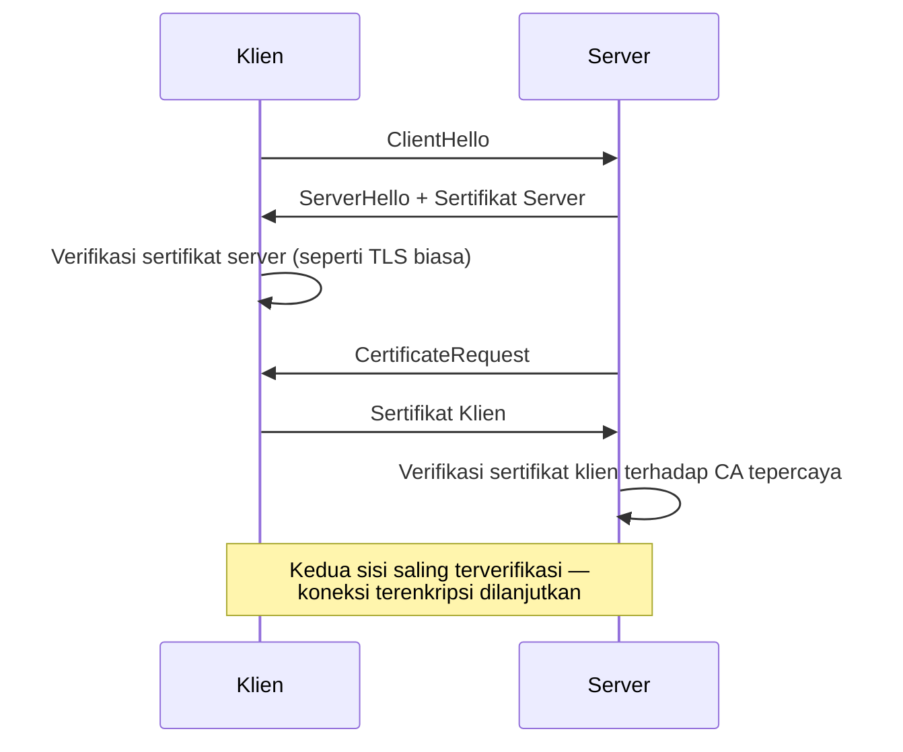

## TL;DR

mTLS (mutual TLS) adalah TLS handshake yang berjalan dua arah: bukan hanya server yang membuktikan identitasnya lewat sertifikat ke klien (seperti [[../10 Foundations/The TLS Handshake|TLS handshake]] biasa), tapi klien juga wajib menunjukkan sertifikatnya sendiri, dan server memverifikasinya sebelum melanjutkan koneksi. Hasilnya: kedua pihak saling mengenal identitas satu sama lain secara kriptografis, bukan hanya satu arah. Ini adalah mekanisme teknis konkret yang membuat prinsip [[Zero Trust]] — "verifikasi setiap permintaan, tidak peduli asalnya" — benar-benar bisa ditegakkan antar service, bukan sekadar slogan arsitektur.

## The Problem

Sebuah service internal menerima permintaan lewat HTTPS biasa dari service lain di jaringan yang sama. TLS di sini memang mengenkripsi data selama perjalanan dan membuktikan identitas server ke pemanggil — tapi tidak membuktikan apa pun sebaliknya. Server tidak tahu, secara kriptografis, siapa sebenarnya yang memanggilnya. Ia hanya tahu ada koneksi TCP terenkripsi dari suatu alamat IP di jaringan internal, dan (kalau ada) sebuah API key di header yang bisa saja dicuri dan dipakai ulang oleh siapa pun yang mendapatkannya.

Begitu satu service dalam jaringan itu kompromi — API key-nya bocor, atau penyerang berhasil mendapat posisi di jaringan yang sama — ia bisa menyamar sebagai pemanggil sah ke service lain. Tidak ada apa pun di lapisan koneksi yang membedakan "panggilan asli dari service A" dan "panggilan dari penyerang yang mengaku sebagai service A." API key yang dikirim lewat header bisa dicuri dari log, dari memory dump, atau dari service A sendiri yang sudah kompromi. Begitu dicuri, ia berlaku sama persis seperti aslinya sampai dicabut secara manual.

## Intuition

Pikirkan TLS satu arah sebagai **pemeriksaan ID satu pintu**: hanya penerima tamu (server) yang menunjukkan lencana identitasnya ke tamu. Tamu sendiri bisa masuk hanya dengan menyebut nama (API key yang bisa dipalsukan atau dicuri), tanpa ada yang benar-benar memverifikasi bahwa ia memang orang yang ia klaim. mTLS mengubahnya jadi pemeriksaan dua arah — tamu juga wajib menunjukkan ID resmi miliknya sendiri sebelum diizinkan masuk, dan ID itu diverifikasi terhadap otoritas yang sama-sama dipercaya kedua pihak.

Perbedaan pentingnya: ID di analogi ini (sertifikat) tidak bisa disalin dengan menyebut namanya saja, berbeda dari API key yang cukup "diketahui" untuk dipakai ulang. Sertifikat melibatkan pasangan kunci privat-publik — memiliki sertifikat tanpa kunci privat yang menyertainya tidak berguna, dan kunci privat itu (idealnya) tidak pernah meninggalkan mesin tempatnya dibuat. Ini yang membuat sertifikat jauh lebih sulit dicuri dan disalahgunakan dibanding string API key yang cukup disalin-tempel.

## How It Works


Langkah tambahan dibanding TLS satu arah ada di dua baris tengah: server secara eksplisit meminta sertifikat klien (`CertificateRequest`), dan tidak melanjutkan handshake sampai sertifikat itu diverifikasi terhadap certificate authority (CA) yang sama-sama dipercaya kedua pihak.

Yang membuat ini berfungsi sebagai kontrol akses, bukan hanya enkripsi tambahan: server hanya menerima sertifikat yang ditandatangani oleh CA internal yang ia percaya (biasanya CA internal organisasi sendiri, bukan CA publik seperti yang dipakai untuk situs web biasa). Karena hanya service yang memang berhak yang diberi sertifikat dari CA internal itu, kepemilikan sertifikat yang valid **adalah** buktinya — server tidak perlu mekanisme otorisasi terpisah untuk tahu "apakah pemanggil ini boleh bicara denganku sama sekali", meski otorisasi yang lebih halus (endpoint mana yang boleh diakses) tetap butuh lapisan terpisah di atasnya.

## Under The Hood

Operasional mTLS bertumpu pada **certificate authority (CA) internal** yang menandatangani sertifikat untuk setiap service — berbeda dari TLS publik yang bergantung pada CA komersial (Let's Encrypt dan sejenisnya) yang dipercaya browser secara luas. CA internal ini biasanya dijalankan lewat tooling khusus (HashiCorp Vault punya fitur PKI, atau service mesh seperti [[../92 Tools/Consul|Consul]] yang mengurus penerbitan dan rotasi sertifikat secara otomatis untuk setiap service yang berjalan di mesh-nya).

Dua detail yang sering luput: **verifikasi hostname tidak otomatis berarti verifikasi identitas layanan** — sertifikat klien biasanya memakai `Subject Alternative Name` atau `Common Name` yang berisi nama service (misalnya `payment-service.internal`), dan server harus secara eksplisit mencocokkan field ini terhadap daftar identitas yang diizinkan, bukan hanya memeriksa "apakah sertifikat valid secara kriptografis" (sertifikat valid tapi milik service yang salah tetap harus ditolak). Kedua, **sertifikat mTLS untuk service-to-service biasanya berumur pendek** (jam atau hari, bukan tahun seperti sertifikat TLS publik klasik) justru karena rotasi otomatis membuat umur pendek tidak menambah beban operasional manual — lihat [[Key Management and Rotation]] untuk mekanisme rotasinya.

## In Go

```go
package mtls

import (
	"crypto/tls"
	"crypto/x509"
	"fmt"
	"net/http"
	"os"
)

// NewServerTLSConfig membangun tls.Config yang MEWAJIBKAN client
// certificate — ini yang membedakan mTLS dari TLS satu arah biasa.
func NewServerTLSConfig(certFile, keyFile, clientCAFile string) (*tls.Config, error) {
	serverCert, err := tls.LoadX509KeyPair(certFile, keyFile)
	if err != nil {
		return nil, fmt.Errorf("mtls: memuat sertifikat server: %w", err)
	}

	clientCAPEM, err := os.ReadFile(clientCAFile)
	if err != nil {
		return nil, fmt.Errorf("mtls: membaca CA klien: %w", err)
	}

	clientCAPool := x509.NewCertPool()
	if !clientCAPool.AppendCertsFromPEM(clientCAPEM) {
		return nil, fmt.Errorf("mtls: gagal parse CA klien dari %s", clientCAFile)
	}

	return &tls.Config{
		Certificates: []tls.Certificate{serverCert},
		ClientCAs:    clientCAPool,
		// RequireAndVerifyClientCert: koneksi DITOLAK kalau klien
		// tidak mengirim sertifikat, atau sertifikatnya tidak
		// terverifikasi terhadap ClientCAs di atas.
		ClientAuth: tls.RequireAndVerifyClientCert,
		MinVersion: tls.VersionTLS12,
	}, nil
}

// NewClientTLSConfig membangun tls.Config sisi klien yang menyertakan
// sertifikat klien sendiri, bukan hanya memverifikasi server.
func NewClientTLSConfig(certFile, keyFile, serverCAFile string) (*tls.Config, error) {
	clientCert, err := tls.LoadX509KeyPair(certFile, keyFile)
	if err != nil {
		return nil, fmt.Errorf("mtls: memuat sertifikat klien: %w", err)
	}

	serverCAPEM, err := os.ReadFile(serverCAFile)
	if err != nil {
		return nil, fmt.Errorf("mtls: membaca CA server: %w", err)
	}

	serverCAPool := x509.NewCertPool()
	if !serverCAPool.AppendCertsFromPEM(serverCAPEM) {
		return nil, fmt.Errorf("mtls: gagal parse CA server dari %s", serverCAFile)
	}

	return &tls.Config{
		Certificates: []tls.Certificate{clientCert},
		RootCAs:      serverCAPool,
		MinVersion:   tls.VersionTLS12,
	}, nil
}

func ExampleServer(tlsConfig *tls.Config, handler http.Handler) *http.Server {
	return &http.Server{
		Addr:      ":8443",
		Handler:   handler,
		TLSConfig: tlsConfig,
	}
}
```

> [!warning] Jebakan
> Menonaktifkan verifikasi lewat `InsecureSkipVerify: true` saat debugging koneksi yang gagal, lalu lupa menghapusnya sebelum deploy ke production — ini melumpuhkan seluruh jaminan identitas yang diberikan mTLS, membuatnya setara dengan koneksi tanpa TLS sama sekali dari sisi keamanan identitas.

## In His Stack

mTLS jarang diimplementasikan manual per service di ekosistem Kubernetes modern — service mesh (lihat [[../92 Tools/Consul|Consul]]) biasanya mengurus penerbitan sertifikat, rotasi, dan pemasangan handshake mTLS lewat sidecar proxy secara transparan, sehingga kode aplikasi tidak perlu tahu detail `tls.Config` di atas sama sekali. Nilai mTLS paling jelas di titik komunikasi **antar service internal** yang menangani data sensitif (misalnya service yang menyimpan dokumen hukum memanggil service audit) — bukan untuk komunikasi dengan partner eksternal, yang biasanya memakai TLS satu arah plus mekanisme autentikasi lain di lapisan aplikasi (API key, OAuth2) karena partner jarang punya infrastruktur untuk mengelola sertifikat klien yang diterbitkan CA internalmu.

## Trade-offs and When Not To Use It

mTLS menambah overhead operasional yang nyata: setiap service butuh sertifikat yang diterbitkan, dipasang, dan dirotasi sebelum kedaluwarsa — tanpa otomasi (lewat service mesh atau tooling PKI seperti [[../92 Tools/Vault|Vault]]), ini jadi beban manual yang mudah terlupakan dan menyebabkan outage saat sertifikat kedaluwarsa tanpa disadari. Untuk komunikasi dengan pihak eksternal yang tidak berada di bawah kendali organisasimu (partner instansi lain), mewajibkan mTLS sering tidak realistis karena mereka tidak punya sertifikat dari CA internalmu — di situ, TLS satu arah plus autentikasi di lapisan aplikasi (signature HMAC, OAuth2) adalah pilihan yang lebih praktis. mTLS paling sepadan diterapkan lewat otomasi (service mesh), bukan dikelola manual per service.

## Common Mistakes

> [!warning] Jebakan
> Memverifikasi bahwa sertifikat klien valid secara kriptografis tapi tidak memeriksa identitas di dalamnya (Common Name/SAN) terhadap daftar yang diizinkan — sertifikat valid milik service lain yang sah tetap harus ditolak kalau bukan identitas yang seharusnya memanggil endpoint ini.

> [!warning] Jebakan
> Memakai sertifikat berumur panjang (bertahun-tahun) untuk mTLS antar service tanpa rencana rotasi — begitu satu sertifikat bocor, ia tetap valid dan bisa disalahgunakan sampai tanggal kedaluwarsanya, kecuali ada mekanisme pencabutan (revocation) yang aktif dipantau.

> [!warning] Jebakan
> Menganggap mTLS menggantikan otorisasi — mTLS membuktikan **siapa** pemanggilnya, bukan **apa yang boleh** dilakukan pemanggil itu. Endpoint yang sensitif tetap butuh pengecekan otorisasi terpisah (lihat [[RBAC]]) setelah identitas terverifikasi.

## Exercises

1. Jelaskan perbedaan TLS satu arah dan mTLS, dan langkah tambahan apa yang terjadi di handshake-nya.
2. Kenapa sertifikat klien lebih sulit dicuri dan disalahgunakan dibanding API key?
3. Jelaskan kenapa memverifikasi sertifikat valid secara kriptografis saja tidak cukup — apa langkah tambahan yang wajib dilakukan server?
4. Desain terbuka: salah satu dari 13 aplikasimu perlu memanggil dua pihak — service internal lain di Kubernetes cluster yang sama, dan API partner instansi eksternal. Jelaskan strategi autentikasi berbeda yang akan kamu pakai untuk masing-masing, dan kenapa mTLS tepat untuk satu tapi tidak untuk yang lain.

> [!success]- Kunci jawaban
> **1.** TLS satu arah hanya memverifikasi identitas server ke klien — klien tidak membuktikan identitasnya sendiri. mTLS menambah langkah `CertificateRequest` dari server ke klien, dan klien wajib mengirim sertifikatnya sendiri yang kemudian diverifikasi server terhadap CA tepercaya, sebelum handshake dilanjutkan.
> **4.** Untuk komunikasi antar service internal di Kubernetes cluster: mTLS lewat service mesh (Consul), karena kedua sisi berada di bawah kendali organisasi yang sama sehingga CA internal bisa menerbitkan sertifikat untuk keduanya, dan rotasi bisa diotomasi penuh. Untuk API partner eksternal: TLS satu arah standar plus autentikasi di lapisan aplikasi (API key atau OAuth2 client credentials, lihat [[OAuth2 Overview]]) — partner tidak berada di bawah kendali organisasimu, tidak realistis mewajibkan mereka memasang sertifikat dari CA internalmu, dan integrasi lintas organisasi biasanya sudah menyediakan mekanisme autentikasi standar di lapisan aplikasi yang lebih mudah dinegosiasikan kedua pihak.

## Self-Check

- Apa langkah tambahan yang membedakan mTLS dari TLS handshake biasa?
- Kenapa sertifikat klien lebih tahan dicuri dibanding API key?
- Apa dua hal yang wajib diverifikasi server terhadap sertifikat klien, bukan cuma satu?
- Kenapa mTLS jarang dipakai untuk komunikasi dengan partner eksternal?

## Connected Notes

- [[../10 Foundations/The TLS Handshake|The TLS Handshake]] — mTLS adalah perluasan langsung dari handshake ini, menambah verifikasi identitas klien di atas mekanisme yang sama.
- [[Zero Trust]] — mTLS adalah mekanisme teknis yang membuat prinsip "verifikasi setiap permintaan" pada zero trust benar-benar bisa ditegakkan.
- [[Key Management and Rotation]] — sertifikat mTLS adalah salah satu jenis kunci kriptografi yang butuh siklus hidup dan rotasi yang dibahas di note berikutnya.
- [[RBAC]] — mTLS membuktikan identitas pemanggil, tapi otorisasi tentang apa yang boleh dilakukan identitas itu tetap ditangani lapisan RBAC terpisah.
- [[../92 Tools/Consul|Consul]] — service mesh yang mengotomasi penerbitan dan rotasi sertifikat mTLS di lingkungan Kubernetes.

## Further Reading

- Dokumentasi resmi paket `crypto/tls` Go, khususnya field `ClientAuth` dan konstanta `tls.RequireAndVerifyClientCert`.

## Catatan Saya

*Tulis di sini service mana di pekerjaanmu yang paling butuh mTLS lebih dulu, dan hambatan operasional (pengelolaan CA, rotasi) yang realistis menghalanginya sekarang.*
