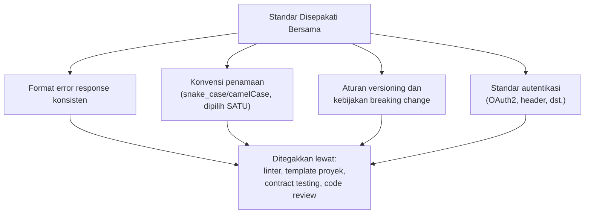

## TL;DR

Begitu sebuah organisasi punya lebih dari satu tim yang membangun dan mengonsumsi API satu sama lain, muncul pertanyaan yang tidak bisa dijawab satu tim saja: siapa yang memutuskan konvensi penamaan endpoint, format error response, aturan breaking change, atau standar autentikasi yang berlaku **lintas** seluruh API organisasi? API governance adalah disiplin menjawab pertanyaan ini secara sadar — bukan lewat kontrol terpusat yang mematikan otonomi tim (setiap perubahan API butuh persetujuan komite), dan bukan pula tanpa aturan sama sekali (setiap tim bebas berimprovisasi, menghasilkan API yang saling tidak konsisten) — tapi lewat **standar yang disepakati** dan (idealnya) **ditegakkan otomatis**, memberi otonomi tim dalam batas yang menjaga keseluruhan sistem tetap koheren.

## The Problem

13 aplikasi yang dikembangkan tim berbeda-beda masing-masing membangun API dengan konvensi mereka sendiri — satu tim memakai `snake_case` untuk field JSON, tim lain `camelCase`; satu tim mengembalikan error sebagai `{"error": "pesan"}`, tim lain sebagai `{"message": "...", "code": 123}`; satu tim mem-versioning API lewat path (`/v1/...`), tim lain lewat header. Seorang developer yang berpindah membantu aplikasi lain (skenario umum untuk koordinator teknis yang mengarahkan 10+ developer) harus mempelajari ulang konvensi yang berbeda setiap kali, dan integrasi antar 13 aplikasi ini sendiri (yang kadang saling memanggil) menjadi lebih rumit karena tidak ada format yang bisa diasumsikan konsisten.

Masalah kedua yang lebih berbahaya: tanpa proses governance yang jelas, sebuah tim melakukan breaking change pada API yang dikonsumsi tim lain **tanpa pemberitahuan** — perubahan yang terlihat masuk akal dari sudut pandang tim yang membuatnya (menghapus field yang dianggap tidak terpakai), tapi ternyata masih dipakai konsumen lain yang tidak pernah diberi kesempatan menyuarakan ketergantungan mereka sebelum perubahan itu di-deploy, menyebabkan insiden production yang bisa dihindari dengan proses koordinasi yang lebih baik.

## Intuition

Bayangkan API governance seperti **standar rel kereta api nasional** — bukan berarti satu perusahaan kereta tunggal yang mengendalikan segalanya (matinya kompetisi dan inovasi), tapi standar lebar rel yang disepakati **bersama**, sehingga kereta dari operator manapun bisa berjalan di jalur milik operator lain tanpa perlu membongkar roda setiap kali berpindah jalur. Setiap operator kereta tetap bebas mendesain gerbong, jadwal, dan layanannya sendiri (otonomi tim) — yang distandarkan hanya **titik temu** yang benar-benar perlu konsisten supaya interoperabilitas mungkin terjadi (lebar rel, sinyal, protokol komunikasi antar stasiun).

Analogi ini bocor pada satu hal: standar rel kereta ditetapkan sekali di masa lalu dan jarang berubah lagi. Standar API organisasi perlu **berevolusi** seiring waktu (kebutuhan baru muncul, praktik terbaik industri berubah) — governance yang baik bukan hanya menetapkan standar sekali, tapi juga menyediakan **proses** yang jelas untuk mengusulkan dan menyepakati perubahan standar itu sendiri (lihat [[The RFC Process]]), sesuatu yang tidak dibutuhkan standar rel fisik yang jauh lebih statis.

## How It Works



**Level penegakan standar, dari yang termurah sampai termahal**:
1. **Dokumentasi dan template** — standar tertulis, template proyek baru yang sudah mengikuti standar sejak awal (termurah, tapi bergantung penuh pada disiplin manual).
2. **Linter dan automated check di CI** — kode yang melanggar standar penamaan atau format gagal build otomatis, tidak bergantung pada ingatan manual developer.
3. **Contract testing** — memverifikasi API benar-benar sesuai skema/kontrak yang disepakati sebelum deployment, menangkap pelanggaran sebelum sampai ke konsumen.
4. **API gateway terpusat** — titik kontrol tunggal yang bisa menegakkan standar (autentikasi, rate limit, format) secara struktural, tapi menambah titik kegagalan tunggal dan kompleksitas infrastruktur.

## Under The Hood

**Governance yang terlalu ketat mematikan otonomi tim** — proses persetujuan yang lambat untuk setiap perubahan API kecil (harus menunggu rapat komite mingguan) memperlambat kecepatan tim tanpa manfaat proporsional, terutama untuk perubahan yang low-risk (menambah field opsional baru). **Governance yang terlalu longgar menciptakan kekacauan** yang dijelaskan di "The Problem". Titik keseimbangan yang umum dipraktikkan: standar yang **jelas dan otomatis ditegakkan** untuk hal-hal yang benar-benar perlu konsisten (format error, autentikasi, kebijakan breaking change), dengan **kebebasan penuh** untuk hal-hal yang tidak memengaruhi interoperabilitas (struktur internal endpoint, pilihan nama resource spesifik domain masing-masing tim).

**Breaking change lintas tim** butuh proses eksplisit yang berbeda dari perubahan biasa — biasanya melibatkan periode "deprecation" yang diumumkan (bukan dihapus mendadak), versi lama yang tetap didukung selama periode transisi (lihat [[../90 Architecture and Design/Semantic Versioning|Semantic Versioning]]), dan komunikasi eksplisit ke seluruh konsumen yang teridentifikasi sebelum perubahan benar-benar terjadi — proses yang harus dijalankan **terlepas** dari seberapa yakin tim pembuat perubahan bahwa "field ini tidak dipakai siapa-siapa lagi".

## In Go

```go
// contoh: skema error response TERSTANDAR yang disepakati lintas 13 aplikasi,
// didefinisikan sebagai satu shared package yang diimpor semua tim,
// bukan setiap tim mendefinisikan struct error-nya sendiri.
package apistandard

// ErrorResponse adalah FORMAT ERROR RESPONSE STANDAR yang disepakati
// seluruh organisasi — setiap API HARUS mengembalikan bentuk ini,
// ditegakkan lewat shared library, bukan hanya dokumentasi yang
// bisa diabaikan.
type ErrorResponse struct {
	Kode    string            `json:"kode"`
	Pesan   string            `json:"pesan"`
	Detail  map[string]string `json:"detail,omitempty"`
}

func NewErrorResponse(kode, pesan string) ErrorResponse {
	return ErrorResponse{Kode: kode, Pesan: pesan}
}
```

```yaml
# .golangci.yml — konfigurasi linter YANG SAMA dipakai di seluruh 13
# aplikasi, menegakkan konvensi lintas tim secara otomatis di CI,
# bukan bergantung pada disiplin manual code review.
linters:
  enable:
    - revive     # menegakkan konvensi penamaan Go standar
    - errcheck   # error tidak boleh diabaikan tanpa penanganan
    - gosec      # menangkap pola kode yang berisiko keamanan
```

## In His Stack

Untuk koordinator teknis 10+ developer lintas 13 aplikasi, API governance adalah salah satu tanggung jawab yang paling langsung relevan — menyepakati (bersama perwakilan setiap tim, bukan didiktekan sepihak) standar minimal yang ditegakkan otomatis lewat shared library dan CI, sambil membiarkan setiap tim tetap punya otonomi penuh atas keputusan yang tidak memengaruhi interoperabilitas lintas aplikasi. Ini juga jadi contoh nyata **Inverse Conway Maneuver** (disinggung di [[Defining Service Boundaries]]) — struktur komunikasi (proses menyepakati standar bersama) yang secara sengaja dibangun untuk menghasilkan sistem yang koheren, bukan kebetulan mengikuti struktur tim yang ada.

## Trade-offs and When Not To Use It

Untuk organisasi dengan satu atau dua tim kecil yang seluruh APInya dikonsumsi internal oleh tim yang sama, investasi governance formal (proses RFC, shared library standar, contract testing) adalah overhead yang tidak sepadan — komunikasi langsung antar developer yang duduk berdekatan sudah cukup menjaga konsistensi tanpa proses formal. Governance formal menjadi bernilai justru begitu jumlah tim dan API bertambah sampai titik di mana komunikasi informal tidak lagi bisa diandalkan menjaga konsistensi — sinyal konkretnya mirip dengan kapan memisah microservices (lihat [[Modular Monolith vs Microservices]]): ukuran tim dan jumlah titik integrasi yang sudah melebihi kapasitas koordinasi informal.

## Common Mistakes

> [!warning] Jebakan
> Menetapkan proses governance yang sangat ketat (persetujuan komite untuk setiap perubahan API sekecil apa pun) — memperlambat tim tanpa manfaat proporsional, terutama untuk perubahan low-risk yang seharusnya bisa langsung dilakukan tanpa birokrasi berlebihan.

> [!warning] Jebakan
> Melakukan breaking change pada API yang dikonsumsi tim lain tanpa periode deprecation atau komunikasi eksplisit — menyebabkan insiden production yang bisa dihindari lewat proses koordinasi sederhana.

> [!warning] Jebakan
> Menegakkan standar hanya lewat dokumentasi tanpa automasi (linter, CI check) — bergantung sepenuhnya pada disiplin manual yang tidak konsisten lintas 10+ developer dengan latar belakang dan kebiasaan berbeda-beda.

## Exercises

1. Jelaskan kenapa API governance yang terlalu ketat dan terlalu longgar sama-sama bermasalah, meski dengan gejala yang berbeda.
2. Sebutkan empat level penegakan standar API dari yang termurah sampai termahal, dan kapan masing-masing tepat dipakai.
3. Kenapa breaking change lintas tim butuh proses yang berbeda dari perubahan API biasa?
4. Desain terbuka: kamu koordinator teknis untuk 13 aplikasi yang saat ini punya tiga format error response berbeda. Rancang rencana migrasi menuju satu standar bersama, dengan mempertimbangkan bahwa memaksa seluruh 13 tim mengubah kode mereka serentak tidak realistis, dan beberapa aplikasi mungkin punya konsumen eksternal yang sudah bergantung pada format lama.

> [!success]- Kunci jawaban
> **1.** Governance yang terlalu ketat memperlambat kecepatan tim secara tidak proporsional — setiap perubahan kecil butuh persetujuan berlapis, menghambat iterasi cepat yang seharusnya jadi keunggulan tim kecil. Governance yang terlalu longgar menghasilkan inkonsistensi yang membuat integrasi lintas tim lebih mahal (setiap integrasi butuh mempelajari konvensi berbeda) dan risiko breaking change yang tidak terkoordinasi. Keduanya sama-sama mahal, hanya biayanya muncul di tempat berbeda — satu di kecepatan iterasi, satu di biaya integrasi dan risiko insiden.
> **4.** Rencana bertahap: (1) sepakati **satu** standar format error baru (lewat proses RFC yang melibatkan perwakilan tim yang terpengaruh, bukan didiktekan); (2) buat shared library yang mengimplementasikan standar baru ini, tersedia untuk seluruh 13 aplikasi; (3) untuk aplikasi **baru** atau endpoint **baru**, wajibkan standar baru sejak awal — tidak ada biaya migrasi karena belum ada konsumen yang bergantung padanya; (4) untuk aplikasi/endpoint **lama** dengan konsumen eksternal yang sudah bergantung pada format lama, terapkan periode **dual format** — endpoint tetap mengembalikan format lama sebagai default, tapi mendukung header (misalnya `Accept-Version: v2`) yang memicu format baru bagi konsumen yang siap bermigrasi; (5) tetapkan tenggat waktu deprecation yang dikomunikasikan jelas ke seluruh konsumen yang teridentifikasi, memberi waktu migrasi yang wajar sebelum format lama benar-benar dihapus. Pendekatan ini menghindari migrasi paksa serentak yang tidak realistis, sambil tetap memberi jalur konkret dan bertahap menuju konsistensi penuh.

## Self-Check

- Kenapa governance yang terlalu ketat dan terlalu longgar sama-sama bermasalah?
- Sebutkan empat level penegakan standar API, dari termurah ke termahal.
- Kenapa breaking change lintas tim butuh proses berbeda dari perubahan biasa?
- Kapan investasi governance formal tidak sepadan untuk sebuah organisasi?

## Connected Notes

- [[Synchronous vs Asynchronous Communication]] — standar komunikasi lintas service (baik sinkron maupun asinkron) adalah salah satu cakupan API governance yang dibahas di note ini.
- [[../30 APIs and Web/API Versioning|API Versioning]] — kebijakan breaking change dan versioning yang dibahas di note itu adalah salah satu pilar konkret API governance.
- [[Cross-Team Code Standards]] — kelanjutan langsung: standar kode yang lebih luas dari sekadar API, dibahas di note berikutnya.
- [[The RFC Process]] — mekanisme konkret mengusulkan dan menyepakati perubahan standar API, dibahas di note lain domain ini.
- [[Defining Service Boundaries]] — Inverse Conway Maneuver yang disinggung di note ini berkaitan langsung dengan cara menentukan batas service yang dibahas di note sebelumnya.

## Further Reading

- Materi umum industri mengenai API governance dan API-first design (dipublikasikan luas oleh berbagai perusahaan teknologi sebagai praktik umum, bukan rujukan satu sumber tunggal).

## Catatan Saya

*Tulis di sini inkonsistensi API paling mengganggu yang kamu temui lintas 13 aplikasi kerjaanmu, dan standar mana yang paling mendesak disepakati bersama.*
