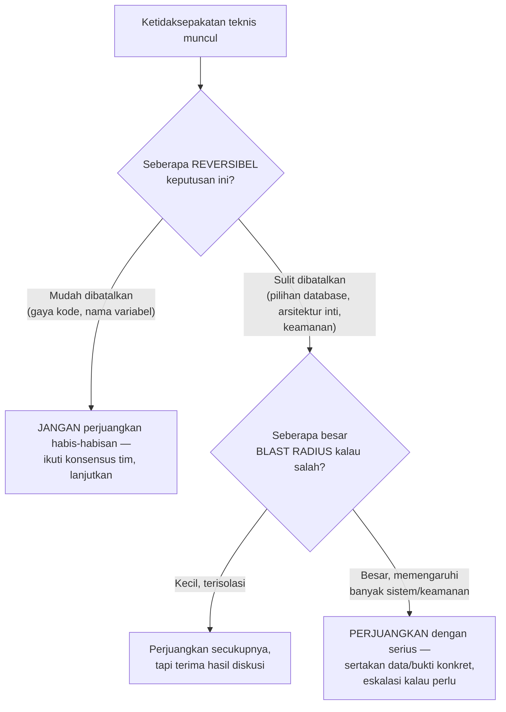

## TL;DR

Bukan setiap ketidaksepakatan teknis layak diperjuangkan sampai akhir — seorang engineer senior yang memperjuangkan **setiap** poin (setiap pilihan gaya kode, setiap keputusan library, setiap desain yang tidak sesuai preferensi pribadinya) kehilangan kredibilitas untuk pertempuran yang benar-benar penting, dan melelahkan tim yang harus terus-menerus berdebat hal yang sebenarnya tidak signifikan. Memilih pertempuran teknis berarti secara sadar menilai: seberapa besar dampak keputusan ini kalau salah (reversibilitas, blast radius), dan seberapa besar keyakinan objektif (bukan sekadar preferensi) bahwa posisimu benar — lalu mengalokasikan energi perjuangan sebanding dengan kedua faktor itu.

## The Problem

Seorang senior engineer berdebat panjang dengan tim soal preferensi gaya penulisan kode yang murni estetika (menggunakan `if err != nil { return err }` di satu baris vs beberapa baris) selama berjam-jam dalam code review, sementara di saat yang sama membiarkan lolos keputusan desain yang jauh lebih berisiko (menyimpan credential partner dalam plaintext di kode) tanpa protes berarti karena "sudah terlanjur di-deploy dan sepertinya tidak ada yang keberatan". Energi perdebatan dihabiskan untuk hal yang dampaknya kecil dan reversibel (gaya kode bisa diubah kapan saja tanpa risiko), sementara hal yang benar-benar berisiko (credential plaintext, potensi insiden keamanan serius) tidak mendapat perhatian yang sepadan dengan tingkat risikonya.

Masalah kedua: seorang senior engineer yang selalu "menang" dalam setiap perdebatan teknis (karena posisinya secara hierarki lebih senior, bukan karena argumennya secara konsisten lebih kuat) menciptakan budaya di mana developer junior berhenti menyuarakan pendapat berbeda sama sekali — bahkan ketika mereka punya kekhawatiran yang valid, karena pengalaman sebelumnya menunjukkan menyuarakan pendapat berbeda hanya berujung kalah debat tanpa pernah benar-benar dipertimbangkan secara objektif.

## Intuition

Bayangkan memilih pertempuran teknis seperti **memilih baterai mana yang layak diperjuangkan dalam sebuah perang** — jenderal yang baik tidak mengerahkan seluruh pasukan untuk setiap baterai kecil yang tidak strategis, tapi mengonsentrasikan kekuatan di titik yang benar-benar menentukan hasil perang secara keseluruhan. Analoginya untuk keputusan teknis: pertempuran yang layak diperjuangkan penuh adalah yang **sulit dibatalkan** (mengubahnya nanti butuh biaya besar) **dan** yang **berdampak besar** kalau salah (blast radius luas) — kombinasi keduanya menentukan seberapa besar energi perjuangan yang sepadan.

Analogi ini bocor pada satu hal: jenderal punya otoritas untuk memutuskan sepihak strategi perang. Keputusan teknis dalam tim yang sehat idealnya diputuskan lewat **argumen yang lebih kuat**, bukan otoritas hierarki semata — seorang senior yang "menang" karena jabatan, bukan karena argumennya memang lebih kuat, kehilangan manfaat penting dari perdebatan teknis: kemungkinan bahwa junior yang menyuarakan pendapat berbeda sebenarnya benar, dan tim kehilangan kesempatan menemukan itu kalau senior selalu "menang" secara default.

## How It Works



**Dua sumbu penilaian**: **reversibilitas** (seberapa mudah keputusan ini dibatalkan/diubah nanti kalau ternyata salah) dan **blast radius** (seberapa luas dampak kalau keputusan ini ternyata salah). Keputusan yang mudah dibatalkan dan dampaknya kecil (gaya kode) tidak layak diperjuangkan habis-habisan — biarkan berjalan, revisi kalau memang perlu nanti. Keputusan yang sulit dibatalkan dan dampaknya besar (pilihan database utama, kebijakan keamanan credential) layak diperjuangkan dengan serius, termasuk mengeskalasi kalau argumen di level tim tidak cukup meyakinkan.

## Under The Hood

**Membawa data/bukti konkret jauh lebih efektif daripada sekadar pendapat**, terutama untuk pertempuran yang benar-benar penting — argumen "menurutku ini berisiko" kalah kredibilitas dibanding "berdasarkan benchmark ini, pendekatan A menghasilkan p99 latency 3x lebih tinggi dari B" atau "praktik menyimpan credential plaintext ini melanggar OWASP Top 10 kategori Cryptographic Failures, dan berdampak pada seluruh 13 aplikasi yang berbagi pola yang sama". Data mengubah perdebatan dari "pendapat vs pendapat" menjadi "bukti vs bukti", jauh lebih produktif dan lebih mudah mencapai kesepakatan objektif.

**Kalah dengan elegan pada pertempuran yang tidak strategis membangun kredibilitas untuk pertempuran yang strategis** — seorang senior yang dikenal fleksibel pada hal-hal kecil (menerima keputusan tim meski tidak sepenuhnya setuju pada preferensi gaya) mendapat lebih banyak kepercayaan ketika benar-benar bersikeras pada sesuatu yang penting ("kalau saya sampai bersikeras soal ini, pasti memang serius") — dibanding senior yang selalu bersikeras di semua hal, yang membuat tim tidak bisa membedakan mana yang benar-benar kritis dari mana yang sekadar preferensi pribadi.

## In Go

```go
// Contoh KONKRET perbedaan dua jenis "pertempuran":

// PERTEMPURAN YANG TIDAK LAYAK diperjuangkan habis-habisan — gaya
// penulisan yang MUDAH DIUBAH kapan saja tanpa risiko, dan TIDAK
// memengaruhi korektnas atau keamanan sama sekali:
func ValidasiA(err error) error {
	if err != nil {
		return err
	}
	return nil
}
// vs
func ValidasiB(err error) error { return err }
// Kedua gaya ini FUNGSIONAL IDENTIK — memperjuangkan salah satu secara
// keras adalah pertempuran yang salah dipilih.

// PERTEMPURAN YANG LAYAK diperjuangkan serius — menyangkut KEAMANAN
// dengan BLAST RADIUS besar (memengaruhi kredensial partner untuk
// SELURUH 13 aplikasi) dan SULIT DIBATALKAN (begitu bocor, tidak bisa
// "ditarik kembali"):
type KonfigurasiBuruk struct {
	APIKeyPartner string // HARDCODED plaintext — HARUS diperjuangkan
}
// Argumen untuk pertempuran ini: rujuk langsung ke Secret Management
// dan The OWASP Top 10, sertakan data konkret (berapa aplikasi yang
// terpengaruh, apa konsekuensi kalau bocor) — bukan sekadar "menurutku
// ini kurang baik".
```

## In His Stack

Untuk koordinator teknis lintas 13 aplikasi dan 10+ developer, energi untuk "memperjuangkan" sesuatu adalah sumber daya terbatas — menghabiskannya untuk hal yang tidak strategis (memaksakan preferensi pribadi soal struktur folder) mengurangi kredibilitas dan energi yang tersisa untuk hal yang benar-benar penting (standar keamanan lintas aplikasi, arsitektur integrasi dengan instansi pemerintah yang berdampak hukum). Sistem legal-services pemerintah punya kelas keputusan yang hampir selalu layak diperjuangkan serius: apa pun yang menyangkut audit trail, kepatuhan regulasi, dan keamanan data warga — kategori ini secara struktural punya blast radius besar dan seringkali sulit dibatalkan setelah insiden terjadi.

## Trade-offs and When Not To Use It

Selalu "mengalah" tanpa pernah memperjuangkan apa pun juga bermasalah — kalau seorang senior tidak pernah bersikeras bahkan untuk keputusan yang benar-benar berisiko tinggi, tim kehilangan sinyal penting yang seharusnya diberikan pengalaman senior tersebut. Keseimbangan yang tepat bukan "selalu mengalah" atau "selalu bersikeras", tapi kalibrasi berdasarkan reversibilitas dan blast radius yang sesungguhnya — sebuah penilaian yang butuh pengalaman dan kadang salah dinilai (sesuatu yang terlihat low-risk ternyata berdampak besar, atau sebaliknya), dan itu bagian normal dari membangun judgment senior, bukan tanda kegagalan penilaian yang harus dihindari sepenuhnya.

## Common Mistakes

> [!warning] Jebakan
> Memperjuangkan setiap ketidaksepakatan teknis dengan intensitas yang sama, termasuk preferensi gaya kode yang murni estetika — menghabiskan kredibilitas dan energi tim untuk hal yang dampaknya kecil, mengurangi efektivitas saat benar-benar perlu bersikeras pada sesuatu yang penting.

> [!warning] Jebakan
> Menggunakan otoritas hierarki untuk "memenangkan" perdebatan teknis alih-alih argumen yang lebih kuat — membuat developer junior berhenti menyuarakan pendapat berbeda meski valid, karena pengalaman menunjukkan pendapat mereka tidak pernah benar-benar dipertimbangkan objektif.

> [!warning] Jebakan
> Tidak pernah bersikeras bahkan untuk keputusan berisiko tinggi (kredensial plaintext, arsitektur keamanan lemah) demi menghindari konflik — kehilangan sinyal penting yang seharusnya diberikan pengalaman senior justru pada momen yang paling membutuhkannya.

## Exercises

1. Jelaskan dua sumbu penilaian (reversibilitas dan blast radius) yang menentukan seberapa besar energi yang sepadan untuk memperjuangkan sebuah keputusan teknis.
2. Kenapa membawa data/bukti konkret lebih efektif dibanding sekadar pendapat dalam perdebatan teknis?
3. Kenapa "mengalah dengan elegan" pada pertempuran kecil bisa membangun kredibilitas untuk pertempuran yang benar-benar penting?
4. Desain terbuka: timmu berdebat soal dua hal bersamaan minggu ini — (a) apakah nama variabel harus `camelCase` atau memakai singkatan tertentu, dan (b) apakah boleh menyimpan token API partner di file konfigurasi yang ikut ter-commit ke repository publik "karena repository ini private kok". Tentukan mana yang layak kamu perjuangkan serius dan mana yang sebaiknya kamu lepaskan, dan jelaskan alasannya memakai kerangka reversibilitas dan blast radius.

> [!success]- Kunci jawaban
> **1.** **Reversibilitas** menilai seberapa mudah keputusan ini dibatalkan atau diubah nanti kalau ternyata salah — keputusan yang mudah diubah (gaya penulisan kode) tidak butuh perjuangan besar karena kesalahan bisa diperbaiki dengan biaya rendah kapan saja. **Blast radius** menilai seberapa luas dampak kalau keputusan ini ternyata salah — keputusan yang memengaruhi banyak sistem atau berisiko keamanan/hukum butuh perjuangan lebih serius karena kesalahan di sini jauh lebih mahal diperbaiki, kalaupun bisa diperbaiki sama sekali (kebocoran data, misalnya, tidak bisa "ditarik kembali").
> **4.** (a) Perdebatan penamaan variabel: **lepaskan**, ini reversibel sepenuhnya (bisa di-refactor kapan saja dengan alat otomatis) dan blast radius-nya nyaris nol (tidak memengaruhi korektnas atau keamanan sama sekali) — energi memperjuangkan preferensi penamaan pribadi tidak sepadan dengan gesekan tim yang ditimbulkan. (b) Menyimpan token API partner di file yang ter-commit: **perjuangkan serius**, meski alasan "repository private" terdengar masuk akal di permukaan — reversibilitasnya rendah (begitu ter-commit, harus dianggap bocor permanen sesuai prinsip di [[../80 Security/Secret Management|Secret Management]], bahkan jika kemudian dihapus dari commit terbaru) dan blast radius-nya berpotensi besar (siapa pun dengan akses repository, termasuk kontraktor sementara atau mantan karyawan yang belum di-revoke aksesnya, bisa melihat token itu; kalau token itu juga dipakai aplikasi lain, dampaknya menyebar lebih luas lagi). Ini kombinasi rendah-reversibilitas dan besar-blast-radius yang jelas layak diperjuangkan dengan bukti konkret (rujuk kebijakan secret management, jelaskan skenario konkret kebocoran), bukan dilepaskan hanya karena argumen "private repo" terdengar meyakinkan di permukaan.

## Self-Check

- Apa dua sumbu penilaian yang menentukan seberapa besar energi yang sepadan untuk memperjuangkan keputusan teknis?
- Kenapa data/bukti konkret lebih efektif dibanding pendapat dalam perdebatan teknis?
- Kenapa mengalah pada pertempuran kecil membangun kredibilitas untuk pertempuran penting?
- Kenapa tidak pernah bersikeras sama sekali juga bermasalah?

## Connected Notes

- [[Mentoring]] — membantu developer junior belajar kalibrasi memilih pertempuran teknis adalah bagian dari mentoring yang efektif, dibahas di note sebelumnya.
- [[Managing Technical Debt Explicitly]] — keputusan mana yang menjadi technical debt yang layak "diperjuangkan" untuk segera diperbaiki vs dibiarkan dulu bertumpu pada penilaian reversibilitas dan blast radius yang sama, dibahas di note berikutnya.
- [[../80 Security/Secret Management|Secret Management]] — contoh konkret keputusan berisiko tinggi (blast radius besar, reversibilitas rendah) yang selalu layak diperjuangkan serius.
- [[The RFC Process]] — forum yang tepat menyuarakan ketidaksepakatan teknis secara terstruktur dan berbasis argumen, bukan otoritas hierarki.
- [[../80 Security/The OWASP Top 10|The OWASP Top 10]] — kerangka objektif yang bisa dirujuk sebagai bukti konkret saat memperjuangkan keputusan keamanan, mengubah perdebatan dari pendapat menjadi bukti.

## Further Reading

- Materi umum tentang pengambilan keputusan reversibel vs ireversibel ("one-way vs two-way doors"), konsep yang dipopulerkan luas dalam literatur pengambilan keputusan bisnis dan teknologi.

## Catatan Saya

*Tulis di sini satu perdebatan teknis di kerjaanmu yang menurutmu, dengan hindsight, seharusnya kamu perjuangkan lebih keras (atau justru lebih baik dilepaskan).*
