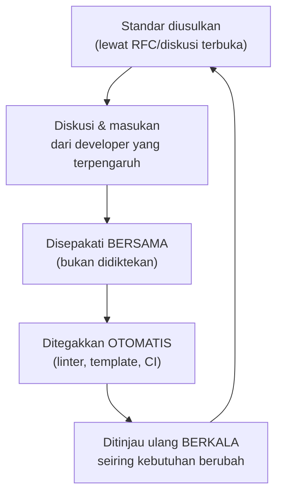

## TL;DR

[[API Governance]] fokus sempit pada kontrak API lintas tim. Cross-team code standards adalah cakupan yang lebih luas — konvensi kode (struktur project, gaya penulisan, pola error handling, keputusan library mana yang dipakai) yang **disepakati**, bukan **dipaksakan**, dan yang penting **tetap diikuti** setelah orang yang mengusulkannya pindah tim atau resign. Perbedaan antara "disepakati" dan "dipaksakan" bukan sekadar soal kesopanan — standar yang dipaksakan tanpa buy-in cenderung dilanggar diam-diam begitu tidak ada yang mengawasi, sementara standar yang disepakati (developer memahami *kenapa*-nya, bukan cuma *apa*-nya) jauh lebih tahan lama.

## The Problem

Seorang senior engineer menulis dokumen "standar kode Go" yang panjang dan detail, lalu mengirimkannya ke seluruh 10+ developer lewat pesan singkat tanpa diskusi — beberapa bulan kemudian, mayoritas developer tidak benar-benar mengikuti standar itu, sebagian karena tidak pernah membacanya secara lengkap, sebagian karena tidak setuju dengan beberapa poin tapi tidak pernah diberi kesempatan menyuarakan keberatannya sebelum standar itu "ditetapkan". Standar yang dipaksakan top-down tanpa proses diskusi cenderung diperlakukan sebagai formalitas yang harus "ditoleransi" saat code review, bukan prinsip yang benar-benar dipahami dan diikuti secara sukarela.

Masalah kedua: standar kode yang ditulis sekali dan tidak pernah direvisi menjadi usang seiring waktu — konvensi yang masuk akal untuk Go versi lama menjadi tidak relevan setelah bahasa menambah fitur baru (generics, misalnya), tapi karena tidak ada proses jelas untuk mengusulkan revisi standar, dokumen usang itu tetap "berlaku" secara nominal sementara developer mulai mengabaikannya diam-diam karena dianggap tidak lagi masuk akal — situasi yang lebih buruk daripada tidak punya standar sama sekali, karena menciptakan kesan standar itu "opsional" secara keseluruhan.

## Intuition

Bayangkan cross-team code standards seperti **peraturan lalu lintas di sebuah kota** — peraturan yang benar-benar diikuti bukan yang paling detail atau paling banyak dipasang rambu, tapi yang **masuk akal bagi pengemudi** (mereka paham kenapa lampu merah penting, bukan cuma menghafal aturan) dan **ditegakkan secara konsisten** (bukan kadang ada polisi, kadang tidak). Peraturan yang dipaksakan tanpa penjelasan ("pokoknya harus begini") cenderung dilanggar begitu tidak ada yang mengawasi, sementara peraturan yang dipahami alasannya cenderung diikuti bahkan tanpa pengawasan langsung.

Analogi ini bocor pada satu hal: peraturan lalu lintas jarang berubah drastis dari tahun ke tahun. Standar kode **harus** punya jalur revisi yang jelas dan mudah diakses (lihat [[The RFC Process]]) — bahasa pemrograman berkembang, praktik terbaik industri berubah, dan pelajaran dari insiden production sebelumnya perlu diintegrasikan ke standar yang ada, bukan standar yang dibekukan selamanya di titik ia pertama kali ditulis.

## How It Works



**Cakupan cross-team standards yang umum**: struktur project (`cmd/`, `internal/`, `pkg/` — konvensi Go standar yang bisa disepakati sebagai baku lintas tim), pola error handling (sentinel error vs error type, dibahas di [[../20 Go Language/Sentinel Errors vs Error Types|Sentinel Errors vs Error Types]] — konsistensi lintas tim membuat kode lebih mudah dipahami siapa pun), pemilihan library standar untuk kebutuhan umum (satu library logging terpilih untuk seluruh organisasi, bukan setiap tim memilih sendiri), dan konvensi commit message/Git workflow (lihat [[Git Workflow and Code Review]]).

## Under The Hood

**Standar yang ditegakkan otomatis (linter, CI) jauh lebih tahan lama dibanding yang hanya didokumentasikan** — dokumentasi bisa dilupakan atau diabaikan, tapi build yang gagal karena melanggar linter memaksa perhatian di titik yang tidak bisa dihindari. Investasi menulis linter kustom (Go mendukung ini lewat `go vet` custom analyzer atau plugin `golangci-lint`) untuk aturan yang spesifik organisasi (misalnya "semua error harus di-wrap dengan konteks", lihat [[../20 Go Language/Error Wrapping|Error Wrapping]]) memberi penegakan yang konsisten tanpa bergantung pada ingatan reviewer manusia yang bisa lelah atau lupa.

**Standar tidak sama dengan seragam total** — cross-team standards paling efektif ketika fokus pada hal yang benar-benar butuh konsistensi lintas tim (format logging terstruktur, supaya observability terpusat bisa memproses log dari 13 aplikasi yang berbeda dengan cara yang sama) dan membiarkan keputusan yang tidak memengaruhi interoperabilitas (struktur internal spesifik domain masing-masing tim) tetap fleksibel — persis prinsip yang sama seperti [[API Governance]].

## In Go

```go
// contoh: struktur project standar yang disepakati untuk SELURUH 13
// aplikasi Go — template ini di-generate otomatis untuk proyek baru,
// bukan sekadar didokumentasikan dan diharapkan diikuti manual.
//
// project-root/
//   cmd/server/main.go       — entry point, minim logika
//   internal/                — kode privat aplikasi ini, tidak diimpor project lain
//     handler/
//     service/
//     repository/
//   pkg/                     — kode yang SENGAJA dirancang dipakai ulang
//   go.mod

package main

import (
	"log/slog"
	"os"

	"example.com/app/internal/config"
)

// main.go SENGAJA tipis — hanya wiring (lihat Manual Dependency
// Injection in Go), TIDAK ADA logika bisnis di sini, sesuai standar
// yang disepakati lintas seluruh 13 aplikasi.
func main() {
	logger := slog.New(slog.NewJSONHandler(os.Stdout, nil))

	cfg, err := config.Muat()
	if err != nil {
		logger.Error("gagal memuat konfigurasi", "error", err)
		os.Exit(1)
	}
	_ = cfg
}
```

## In His Stack

Untuk koordinator teknis lintas 13 aplikasi, cross-team code standards yang paling bernilai bukan yang paling ketat, tapi yang **paling mudah diadopsi** — template project yang sudah mengikuti standar sejak `go mod init` dijalankan, linter yang otomatis dijalankan CI tanpa perlu diingat manual, dan proses revisi standar yang jelas (siapa pun bisa mengusulkan perubahan lewat RFC, bukan hanya orang tertentu) memberi rasa kepemilikan bersama, jauh lebih tahan lama dibanding dokumen yang diturunkan dari satu orang ke semua tim.

## Trade-offs and When Not To Use It

Cross-team standards yang terlalu banyak dan detail (mengatur setiap keputusan gaya penulisan kecil) menambah friksi tanpa manfaat proporsional — untuk keputusan yang benar-benar tidak memengaruhi interoperabilitas atau pemeliharaan lintas tim (preferensi gaya penulisan yang murni estetika), memaksakan keseragaman adalah pemborosan energi organisasi yang lebih baik dipakai untuk hal lain. Standar yang dipaksakan tanpa proses diskusi terbuka berisiko menciptakan resistensi diam-diam, bahkan kalau standar itu sendiri secara teknis masuk akal — proses yang melibatkan developer yang akan mengikutinya, meski memakan waktu lebih lama di awal, menghasilkan kepatuhan yang jauh lebih tahan lama.

## Common Mistakes

> [!warning] Jebakan
> Menetapkan standar kode secara top-down tanpa proses diskusi atau kesempatan developer menyuarakan keberatan — standar yang dipaksakan cenderung dilanggar diam-diam begitu tidak ada yang mengawasi secara langsung.

> [!warning] Jebakan
> Mengandalkan dokumentasi standar tanpa penegakan otomatis (linter, CI) — bergantung penuh pada ingatan manual reviewer yang tidak konsisten lintas puluhan pull request setiap minggu.

> [!warning] Jebakan
> Tidak menyediakan jalur revisi standar yang jelas — standar yang usang tapi tidak pernah direvisi secara resmi kehilangan kredibilitasnya, developer mulai mengabaikannya diam-diam karena dianggap sudah tidak relevan.

## Exercises

1. Jelaskan kenapa standar yang "disepakati" cenderung lebih tahan lama dibanding standar yang "dipaksakan", meski isi standarnya sama persis.
2. Kenapa penegakan otomatis (linter, CI) lebih andal dibanding dokumentasi murni untuk menjaga standar kode?
3. Sebutkan satu contoh keputusan kode yang sebaiknya distandarkan lintas tim, dan satu contoh yang sebaiknya dibiarkan fleksibel per tim.
4. Desain terbuka: kamu ingin mengusulkan standar baru — seluruh 13 aplikasi harus memakai format logging terstruktur yang sama (JSON dengan field wajib tertentu) supaya bisa diproses observability terpusat. Rancang proses memperkenalkan standar ini yang memaksimalkan buy-in dari 10+ developer, bukan sekadar mengumumkan dan berharap semua orang patuh.

> [!success]- Kunci jawaban
> **1.** Standar yang disepakati melibatkan developer dalam proses menentukannya — mereka memahami **alasan** di baliknya (bukan cuma aturan mentah) dan punya kesempatan menyuarakan keberatan yang valid sebelum standar itu ditetapkan. Ini menciptakan rasa kepemilikan bersama: developer mengikuti standar karena mereka **setuju** itu masuk akal, bukan karena diperintahkan. Standar yang dipaksakan tanpa proses ini tidak punya buy-in itu — developer mengikutinya (kalau mengikuti) semata karena diawasi, dan cenderung diabaikan begitu pengawasan berkurang.
> **4.** Proses yang memaksimalkan buy-in: (1) tulis proposal awal (draf RFC, lihat [[The RFC Process]]) yang menjelaskan **masalah** yang ingin diselesaikan (observability terpusat butuh format log konsisten) dan **usulan konkret** format yang diajukan, dibagikan ke perwakilan seluruh tim untuk didiskusikan, bukan langsung final; (2) kumpulkan masukan — mungkin ada kebutuhan spesifik satu tim yang belum terakomodasi format yang diusulkan, atau keberatan yang valid soal field tertentu; (3) revisi proposal berdasarkan masukan itu, sampai tercapai kesepakatan yang mayoritas tim merasa representatif; (4) sediakan **library shared** yang mengimplementasikan format yang disepakati (bukan hanya dokumentasi "begini formatnya, silakan implementasi sendiri"), memudahkan adopsi tanpa setiap tim menulis ulang logika yang sama; (5) berikan periode transisi yang wajar (bukan tenggat mendadak) untuk aplikasi yang sudah berjalan bermigrasi ke format baru, sementara aplikasi baru wajib memakainya sejak awal.

## Self-Check

- Kenapa standar yang disepakati lebih tahan lama dibanding yang dipaksakan?
- Kenapa penegakan otomatis lebih andal dibanding dokumentasi murni?
- Sebutkan satu contoh keputusan yang layak distandarkan lintas tim, dan satu yang sebaiknya fleksibel.
- Kenapa standar butuh jalur revisi yang jelas, bukan ditetapkan sekali dan dibekukan selamanya?

## Connected Notes

- [[API Governance]] — cross-team code standards adalah cakupan yang lebih luas dari governance API yang dibahas di note sebelumnya, mencakup seluruh konvensi kode, bukan hanya kontrak API.
- [[The RFC Process]] — mekanisme konkret mengusulkan dan merevisi standar kode secara terbuka, dibahas di note berikutnya.
- [[Git Workflow and Code Review]] — konvensi commit dan review yang konsisten lintas tim adalah salah satu cakupan cross-team standards yang sudah dibahas di note junior itu.
- [[../20 Go Language/Sentinel Errors vs Error Types|Sentinel Errors vs Error Types]] — pola error handling yang konsisten lintas tim adalah salah satu contoh konkret standar kode yang bernilai distandarkan.
- [[Choosing Which Technical Battles to Fight]] — menentukan standar mana yang layak diperjuangkan dan mana yang tidak adalah aplikasi langsung dari prinsip memilih pertempuran teknis, dibahas di note lain domain ini.

## Further Reading

- Materi umum tentang "engineering culture" dan konvensi kode lintas tim, dipublikasikan luas oleh berbagai perusahaan teknologi sebagai studi kasus (bukan rujukan satu sumber tunggal).

## Catatan Saya

*Tulis di sini standar kode yang menurutmu paling dibutuhkan lintas 13 aplikasi kerjaanmu saat ini, dan hambatan apa yang mungkin muncul saat mengusulkannya.*
