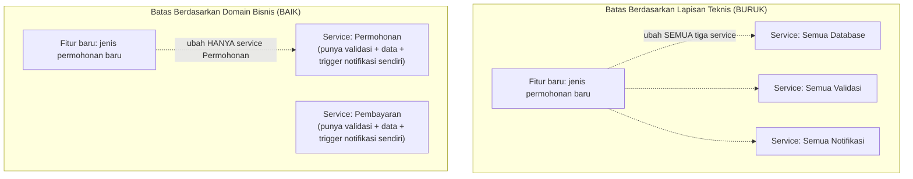

## TL;DR

Kalau [[Modular Monolith vs Microservices]] menjawab **kapan** memecah jadi service terpisah, note ini menjawab pertanyaan yang jauh lebih sulit dan lebih sering salah dijawab: **di mana tepatnya** garis batas itu ditarik. Batas yang buruk — ditarik berdasarkan lapisan teknis (semua database di satu service, semua UI di service lain) atau berdasarkan struktur organisasi yang kebetulan ada, bukan berdasarkan domain bisnis — menghasilkan service yang selalu harus berubah bersamaan (coupling tinggi antar service, kontradiksi langsung dengan tujuan independensi yang dicari microservices). Batas yang baik mengikuti prinsip **high cohesion, low coupling**: hal-hal yang sering berubah bersamaan karena alasan bisnis yang sama dikelompokkan dalam satu service; hal-hal yang jarang perlu tahu detail satu sama lain dipisah.

## The Problem

Sebuah tim memecah monolit menjadi microservices berdasarkan **lapisan teknis**: satu service untuk "semua operasi database", satu service untuk "semua logika validasi", satu service untuk "semua notifikasi" — pembagian yang terlihat rapi di atas kertas, tapi dalam praktik, hampir **setiap** fitur bisnis baru (misalnya "tambah jenis permohonan baru") butuh perubahan di ketiga service itu sekaligus, karena satu fitur bisnis yang koheren dipotong-potong berdasarkan jenis operasi teknis, bukan berdasarkan domain yang sebenarnya saling terkait. Hasilnya: deployment tiga service terkoordinasi untuk setiap fitur kecil, kontradiksi langsung dengan janji microservices untuk deployment independen per tim.

Masalah kedua: sebuah tim memecah service berdasarkan **struktur organisasi yang kebetulan ada** ("tim A mengerjakan modul ini, jadi ini jadi service A") tanpa menganalisis domain bisnis sesungguhnya — begitu struktur organisasi berubah (reorganisasi tim, penggabungan divisi), batas service yang sebelumnya "masuk akal" jadi tidak relevan lagi, tapi memisahkan ulang service yang sudah di-deploy dan dipakai jauh lebih mahal dibanding menggambar ulang kotak di diagram organisasi.

## Intuition

Bayangkan batas service yang baik seperti **memotong sebuah pizza berdasarkan topping yang berbeda**, bukan berdasarkan lapisan (semua keju di satu potongan, semua adonan di potongan lain — yang secara fisik bahkan tidak masuk akal, tapi menggambarkan absurditas batas berbasis lapisan teknis). Kamu memotong berdasarkan **rasa yang koheren** — potongan pepperoni punya semua yang dibutuhkan untuk jadi "pengalaman pepperoni" yang utuh (keju, saus, topping, adonan **di potongan itu juga**), tidak perlu meminjam keju dari potongan lain untuk menjadi lengkap. Ini analog dengan **cohesion tinggi**: satu service punya semua yang dibutuhkan untuk domain bisnisnya sendiri secara relatif lengkap.

Analogi ini bocor pada satu hal: potongan pizza secara fisik terpisah jelas dan tidak pernah perlu "berkomunikasi" satu sama lain setelah dipotong. Service dalam sistem nyata **tetap perlu** berkomunikasi untuk operasi bisnis yang benar-benar melintasi domain (permohonan butuh tahu status pembayaran, misalnya) — batas yang baik meminimalkan **frekuensi dan kedalaman** komunikasi lintas batas ini (low coupling), bukan menghilangkannya sepenuhnya, yang memang mustahil untuk sistem apa pun yang punya lebih dari satu bagian bermakna.

## How It Works



Diagram ini menunjukkan perbedaan inti: batas berdasarkan lapisan teknis memecah setiap **fitur bisnis** menjadi potongan yang tersebar di banyak service, memaksa koordinasi lintas service untuk perubahan yang secara logis adalah satu unit kerja. Batas berdasarkan domain bisnis menjaga setiap unit kerja bisnis yang koheren tetap **dalam satu service**, memungkinkan perubahan (dan deployment) independen.

**Heuristik konkret menentukan batas yang baik**:
- **Mengubah bersamaan?** Kalau dua hal hampir selalu berubah bersamaan (aturan validasi permohonan dan struktur data permohonan itu sendiri), mereka kemungkinan besar milik domain yang sama.
- **Bahasa yang sama?** (lihat [[Lightweight DDD]]) Kalau dua bagian sistem memakai istilah yang sama dengan makna yang berbeda (bounded context berbeda), itu sinyal kuat mereka seharusnya jadi service/modul terpisah.
- **Data yang dipakai bersama secara eksklusif?** Kalau sekumpulan tabel database hampir selalu di-query dan diubah bersamaan oleh kode yang sama, dan jarang diakses langsung dari bagian lain, itu kandidat kuat untuk satu service.

## Under The Hood

**Conway's Law** — pengamatan bahwa struktur sistem yang dibangun organisasi cenderung mencerminkan struktur komunikasi organisasi itu sendiri — bekerja **dua arah**: struktur organisasi yang sudah ada memengaruhi batas sistem yang dibangun (sering menghasilkan batas yang buruk kalau struktur organisasi itu sendiri tidak selaras dengan domain bisnis), tapi juga bisa dipakai **sengaja** (disebut *Inverse Conway Maneuver*) — menyusun ulang tim mengikuti batas domain yang **sudah dianalisis benar** terlebih dahulu, supaya struktur komunikasi organisasi mendukung batas sistem yang diinginkan, bukan kebetulan menghasilkan batas yang salah.

**Batas yang salah tidak selalu terlihat salah di awal** — dua service yang di-deploy terpisah tapi selalu perlu diubah dan di-deploy bersamaan untuk hampir setiap fitur adalah gejala klasik batas yang salah (kadang disebut *distributed monolith* — punya seluruh biaya operasional microservices tanpa manfaat independensinya) yang seringkali baru terlihat jelas setelah beberapa bulan operasional, bukan langsung terlihat dari diagram arsitektur di awal proyek.

## In Go

Batas service yang baik tercermin dari **API kontrak** yang stabil dan jarang berubah antar service — kalau kontrak API antar dua service terus berubah setiap sprint, itu sinyal batasnya salah:

```go
package permohonan

// KontrakAntarService adalah API PUBLIK yang diekspos service Permohonan
// ke service lain — perubahan pada kontrak ini seharusnya JARANG terjadi
// kalau batas domain sudah ditarik dengan benar. Kontrak yang sering
// berubah adalah sinyal batas service ini perlu ditinjau ulang.
type KontrakAntarService interface {
	// AmbilRingkasan hanya mengekspos data yang BENAR-BENAR dibutuhkan
	// service lain (misalnya service Notifikasi) — bukan seluruh detail
	// internal permohonan yang hanya relevan di dalam service ini sendiri.
	AmbilRingkasan(ctx context.Context, id int64) (RingkasanPermohonan, error)
}

// RingkasanPermohonan sengaja MINIMAL — hanya field yang benar-benar
// dibutuhkan konsumen lintas service, bukan seluruh struct internal
// yang dipakai di dalam service Permohonan sendiri.
type RingkasanPermohonan struct {
	ID     int64
	Status string
	Nama   string
}
```

## In His Stack

Untuk 13 aplikasi legal-services yang ditangani tim berbeda, batas antar aplikasi (dan modul dalam aplikasi) idealnya mengikuti domain hukum/administratif yang sesungguhnya (jenis layanan, jenis dokumen, alur persetujuan) — bukan sekadar mengikuti struktur tim yang kebetulan ada saat ini. Perubahan requirement dari regulasi baru (yang sering terjadi di sistem pemerintah) biasanya menyentuh **satu domain bisnis spesifik** — batas yang selaras dengan domain itu berarti perubahan regulasi bisa ditangani dengan mengubah satu aplikasi/modul, bukan berkoordinasi lintas banyak sistem yang batasnya salah ditarik sejak awal.

## Trade-offs and When Not To Use It

Menentukan batas domain yang benar butuh pemahaman mendalam tentang bisnis yang sedang dilayani — untuk proyek yang benar-benar baru (domain belum sepenuhnya dipahami, requirement masih berubah cepat), menarik batas service yang "final" terlalu dini berisiko salah, karena pemahaman domain baru benar-benar matang setelah beberapa iterasi pengembangan dan umpan balik nyata. Untuk kasus ini, memulai dengan modular monolith (lihat [[Modular Monolith vs Microservices]]) dan menunda pemisahan fisik menjadi service sampai batas domain benar-benar stabil adalah strategi yang lebih aman — mengubah batas modul dalam satu proses jauh lebih murah dibanding mengubah batas antar service yang sudah di-deploy terpisah dan dipakai banyak konsumen.

## Common Mistakes

> [!warning] Jebakan
> Menarik batas service berdasarkan lapisan teknis (semua database di satu service, semua UI di service lain) alih-alih domain bisnis — memaksa hampir setiap fitur baru mengubah banyak service sekaligus, kontradiksi langsung dengan tujuan independensi microservices.

> [!warning] Jebakan
> Menarik batas service berdasarkan struktur organisasi yang kebetulan ada saat ini, tanpa menganalisis domain bisnis — batas jadi usang begitu struktur organisasi berubah, sementara memisahkan ulang service yang sudah di-deploy jauh lebih mahal dibanding menggambar ulang diagram organisasi.

> [!warning] Jebakan
> Tidak menyadari gejala *distributed monolith* (dua service terpisah yang selalu harus diubah dan di-deploy bersamaan) sebagai sinyal batas yang salah — membiarkan kondisi ini berlanjut berbulan-bulan, membayar seluruh biaya operasional microservices tanpa manfaat independensinya.

## Exercises

1. Jelaskan kenapa batas service berdasarkan lapisan teknis (database, validasi, notifikasi) cenderung menghasilkan coupling yang tinggi antar service.
2. Apa itu Conway's Law, dan bagaimana *Inverse Conway Maneuver* memakainya secara sengaja?
3. Apa itu "distributed monolith", dan kenapa itu gejala batas service yang salah?
4. Desain terbuka: sistemmu punya dua service — "Service Permohonan" dan "Service Dokumen" — dan kamu menyadari bahwa hampir setiap perubahan fitur di beberapa bulan terakhir selalu butuh mengubah keduanya secara bersamaan (menambah jenis dokumen baru untuk jenis permohonan tertentu selalu butuh perubahan di kedua service). Analisis kemungkinan penyebab batas ini salah ditarik, dan usulkan bagaimana kamu akan menganalisis ulang batas yang lebih tepat.

> [!success]- Kunci jawaban
> **1.** Fitur bisnis yang koheren (misalnya "menambah jenis permohonan baru") hampir selalu membutuhkan perubahan pada validasi, data, DAN notifikasi yang berkaitan dengan jenis permohonan itu secara bersamaan — kalau ketiga aspek ini dipisah ke service berbeda berdasarkan jenis operasi teknisnya (bukan berdasarkan domain bisnis yang menyatukan ketiganya), setiap fitur baru terpaksa menyentuh ketiga service itu sekaligus, menciptakan coupling erat (harus berubah bersamaan) meski secara fisik service-nya terpisah — kontradiksi dengan tujuan independensi yang seharusnya didapat dari pemisahan service.
> **4.** Gejala "selalu berubah bersamaan" adalah sinyal kuat bahwa dokumen dan permohonan sebenarnya **satu domain bisnis yang sama** (mungkin dokumen adalah bagian integral dari konsep permohonan, bukan domain terpisah yang berdiri sendiri) yang salah dipisah menjadi dua service. Analisis yang tepat: telusuri apakah "Dokumen" pernah benar-benar dipakai secara independen dari "Permohonan" oleh konsumen lain (misalnya, apakah ada kebutuhan mengakses dokumen tanpa konteks permohonan sama sekali) — kalau tidak pernah, ini mendukung dugaan bahwa keduanya seharusnya digabung kembali menjadi satu service/modul "Permohonan" yang mencakup pengelolaan dokumennya sendiri sebagai bagian internal, bukan service terpisah. Kalau ternyata memang ada kebutuhan nyata mengakses dokumen secara independen (misalnya sistem arsip terpisah yang mengakses dokumen tanpa peduli permohonan spesifik), maka batasnya mungkin perlu digambar ulang dengan API kontrak yang lebih stabil (hanya mengekspos apa yang benar-benar dibutuhkan konsumen independen itu), bukan API yang berubah setiap kali ada penambahan jenis dokumen baru untuk kebutuhan spesifik permohonan.

## Self-Check

- Kenapa batas service berdasarkan lapisan teknis cenderung menghasilkan coupling tinggi?
- Apa itu Conway's Law dan Inverse Conway Maneuver?
- Apa itu distributed monolith, dan apa gejalanya?
- Heuristik apa yang membantu menentukan batas domain yang baik?

## Connected Notes

- [[Modular Monolith vs Microservices]] — note ini melanjutkan pertanyaan "kapan memecah" dengan "di mana tepatnya batas ditarik", dibahas di note sebelumnya.
- [[Lightweight DDD]] — bounded context yang dibahas di note itu adalah alat konseptual utama menentukan batas domain yang koheren.
- [[Synchronous vs Asynchronous Communication]] — kelanjutan langsung: begitu batas service ditentukan, keputusan berikutnya adalah bagaimana mereka berkomunikasi, dibahas di note berikutnya.
- [[API Governance]] — kontrak API yang stabil antar service (disinggung di note ini) adalah salah satu pilar tata kelola API yang dibahas lebih formal di level senior.
- [[../60 Distributed Systems/_Overview|Distributed Systems Overview]] — konsekuensi batas service yang salah (distributed monolith) berkaitan langsung dengan tantangan konsistensi dan transaksi lintas service yang dibahas di level senior.

## Further Reading

- Sam Newman, "Building Microservices" — rujukan luas mengenai prinsip menentukan batas service, termasuk pembahasan mendalam Conway's Law.

## Catatan Saya

*Tulis di sini apakah ada dua aplikasi/modul di kerjaanmu yang selalu harus diubah bersamaan untuk hampir setiap fitur baru — sinyal kemungkinan batasnya salah ditarik.*
