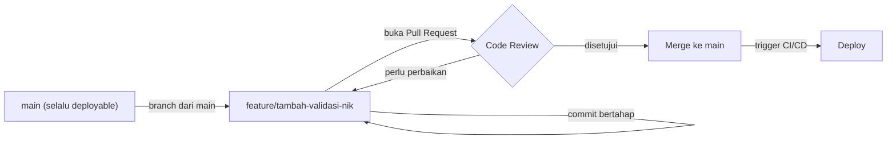

## TL;DR

Git sendiri tidak memaksa disiplin apa pun — semua orang bisa langsung push ke `main` dan berharap yang terbaik. Git workflow adalah **konvensi yang disepakati tim** tentang bagaimana branch dibuat, kapan digabungkan, dan siapa yang harus menyetujui sebelum kode masuk ke branch utama; code review adalah praktik yang memastikan setidaknya satu pasang mata lain melihat perubahan sebelum ia memengaruhi orang lain. Untuk tim dengan 10+ developer mengerjakan 13+ aplikasi, workflow yang konsisten bukan soal preferensi gaya — ia adalah satu-satunya cara mencegah konflik yang menghabiskan waktu, deployment yang tidak sengaja membawa kode setengah jadi, dan pengetahuan yang terkubur di kepala satu orang saja.

## The Problem

Sebuah tim kecil mulanya bekerja dengan gaya bebas: setiap developer bekerja di `main` langsung, commit dan push kapan saja terasa "cukup selesai". Ini bekerja saat timnya hanya tiga orang yang duduk berdekatan dan bisa saling bertanya langsung. Begitu tim bertambah jadi sepuluh orang yang tersebar di beberapa aplikasi berbeda, konflik merge mulai terjadi setiap hari, sebuah fitur setengah jadi yang di-push developer A tanpa sadar ikut ter-deploy bersama fitur developer B yang sebenarnya sudah siap rilis, dan tidak ada jejak yang jelas kenapa sebuah baris kode ditulis seperti itu — satu-satunya sumber jawaban adalah bertanya langsung ke orang yang menulisnya, yang mungkin sedang cuti atau sudah pindah ke aplikasi lain.

Masalah kedua yang lebih halus: seorang developer junior menulis kode yang secara fungsional bekerja tapi memiliki celah keamanan (misalnya lupa validasi input) yang tidak disadarinya. Tanpa code review, kode itu langsung ter-deploy dan celah itu baru ditemukan berbulan-bulan kemudian lewat audit atau, lebih buruk, lewat insiden nyata. Code review bukan sekadar mencari bug — ia adalah kesempatan systematis menangkap masalah sebelum sampai ke pengguna, sekaligus jalur transfer pengetahuan dari developer senior ke junior tanpa perlu sesi mentoring formal terpisah.

## Intuition

Git workflow seperti **jalur produksi pabrik dengan pos pemeriksaan kualitas** — setiap komponen (perubahan kode) melewati tahapan yang jelas (branch fitur, review, merge) sebelum menjadi bagian dari produk akhir (branch `main` yang di-deploy), dan pos pemeriksaan (code review) memastikan setidaknya satu pasang mata lain memverifikasi kualitas sebelum komponen itu melanjutkan ke tahap berikutnya. Tanpa jalur ini, setiap pekerja bisa langsung memasukkan komponennya ke produk akhir tanpa pemeriksaan apa pun — mungkin bekerja untuk pabrik kecil dengan sedikit pekerja yang saling kenal, tapi runtuh begitu pabrik itu membesar.

Analogi ini bocor pada satu hal: pos pemeriksaan kualitas di pabrik fisik biasanya memeriksa **hasil akhir** komponen terhadap spesifikasi tetap. Code review yang baik memeriksa lebih dari sekadar "apakah kode ini bekerja" — ia juga menilai apakah pendekatannya masuk akal untuk jangka panjang, apakah ia konsisten dengan pola yang sudah ada di basis kode, dan apakah reviewer sendiri bisa memahami kode itu tanpa penjelasan tambahan dari penulisnya — penilaian yang jauh lebih subjektif dan butuh penghakiman manusia dibanding sekadar mencocokkan spesifikasi tetap.

## How It Works



Diagram ini menunjukkan alur **trunk-based development** yang disederhanakan — pola yang umum dipakai untuk tim yang deploy sering: `main` selalu dalam keadaan siap deploy (deployable), setiap fitur dikerjakan di branch pendek berumur singkat (idealnya hari, bukan minggu), dan Pull Request menjadi gerbang review sebelum kode kembali ke `main`. Branch yang berumur sangat panjang cenderung menumpuk konflik merge yang makin sulit diselesaikan seiring waktu, karena `main` terus berubah sementara branch fitur tertinggal makin jauh.

**Elemen praktik code review yang penting:**

- **Pull Request kecil dan fokus** — PR yang mengubah satu hal spesifik jauh lebih mudah direview mendalam dibanding PR raksasa yang mengubah banyak hal sekaligus, di mana reviewer cenderung hanya "melihat sekilas" karena kelelahan kognitif.
- **Deskripsi PR yang menjelaskan *kenapa*, bukan hanya *apa*** — diff sudah menunjukkan apa yang berubah; deskripsi PR harus menjawab pertanyaan yang tidak terjawab diff: kenapa pendekatan ini dipilih, apa yang sudah dites, apa risikonya.
- **Review yang mengomentari kode, bukan orangnya** — "baris ini berpotensi race condition kalau dipanggil dari dua goroutine sekaligus" jauh lebih konstruktif dibanding "kenapa kamu tidak berpikir soal ini".
- **Reviewer yang benar-benar menjalankan/membaca kode**, bukan hanya menyetujui formalitas — code review yang menyetujui tanpa membaca sungguh-sungguh kehilangan seluruh manfaatnya.

## In Go

Git workflow bukan kode, tapi konvensi ini sering diperkuat lewat automasi yang berjalan di CI setiap kali Pull Request dibuka — memastikan standar minimum terpenuhi sebelum manusia menghabiskan waktu meninjau:

```go
package main

// contoh sederhana test yang harus lolos di CI sebelum PR bisa di-merge —
// bukan pengganti code review manusia, tapi penyaring lapis pertama supaya
// reviewer tidak membuang waktu meninjau kode yang bahkan belum lolos test
// dasar atau linting.
import "testing"

func TestValidasiNIK(t *testing.T) {
	kasus := []struct {
		nama    string
		nik     string
		inginOK bool
	}{
		{"NIK 16 digit valid", "3171012345678901", true},
		{"NIK kurang dari 16 digit", "12345", false},
		{"NIK mengandung huruf", "317101234567890A", false},
	}

	for _, k := range kasus {
		t.Run(k.nama, func(t *testing.T) {
			ok := ValidasiNIK(k.nik)
			if ok != k.inginOK {
				t.Errorf("ValidasiNIK(%q) = %v, ingin %v", k.nik, ok, k.inginOK)
			}
		})
	}
}
```

CI yang menjalankan `go test ./...`, `go vet`, dan linter seperti `golangci-lint` pada setiap Pull Request memastikan reviewer manusia bisa fokus pada hal yang benar-benar butuh penilaian manusia (desain, pendekatan, edge case bisnis) — bukan menghabiskan waktu menandai typo atau kesalahan format yang seharusnya sudah tertangkap otomatis sebelum manusia sempat melihatnya.

## In His Stack

Untuk tim yang mengelola 13+ aplikasi pemerintah dengan Yii1/Yii2, konvensi Git yang konsisten lintas seluruh aplikasi (bukan setiap aplikasi punya kebiasaan branch dan review sendiri-sendiri) menjadi jauh lebih penting dibanding tim yang hanya mengelola satu aplikasi — seorang developer yang berpindah membantu aplikasi lain harus bisa langsung memahami alur kerja tanpa belajar ulang konvensi yang berbeda setiap kali. Ini juga jadi salah satu tanggung jawab nyata seorang koordinator teknis: menyepakati dan menegakkan satu konvensi (misalnya penamaan branch `feature/`, `hotfix/`, `bugfix/`, dan aturan minimal satu approval sebelum merge) yang berlaku sama di seluruh 13 aplikasi, bukan membiarkan setiap tim aplikasi berimprovisasi sendiri-sendiri.

## Trade-offs and When Not To Use It

Untuk proyek yang benar-benar dikerjakan sendirian (tanpa kolaborator lain sama sekali), overhead membuka Pull Request dan menunggu review formal tidak punya manfaat nyata — code review butuh setidaknya satu pasang mata lain untuk memberi nilai. Branch yang terlalu ketat (misalnya mewajibkan tiga approval untuk perubahan sekecil apa pun) bisa memperlambat tim kecil tanpa manfaat proporsional, sementara branch yang terlalu longgar (boleh push langsung ke `main`) mengorbankan jaring pengaman yang justru paling dibutuhkan tim besar. Trunk-based development dengan branch berumur pendek juga butuh kedisiplinan test otomatis dan feature flag (lihat [[../70 Infrastructure and Delivery/Feature Flags|Feature Flags]]) yang matang — tanpa itu, tim mungkin lebih nyaman dengan branching model yang sedikit lebih konservatif (misalnya `develop` terpisah dari `main`) sampai kedewasaan proses CI/CD-nya cukup matang.

## Common Mistakes

> [!warning] Jebakan
> Membiarkan Pull Request menumpuk terlalu besar (mengubah ribuan baris sekaligus) sebelum direview — reviewer cenderung kehilangan fokus dan hanya menyetujui sekilas, kehilangan seluruh manfaat review mendalam yang seharusnya didapat.

> [!warning] Jebakan
> Menyetujui Pull Request tanpa benar-benar membaca atau menjalankan kodenya, hanya karena "sudah dipercaya" atau "buru-buru deploy" — meniadakan fungsi jaring pengaman code review itu sendiri, dan celah yang seharusnya tertangkap justru lolos.

> [!warning] Jebakan
> Membiarkan branch fitur hidup berminggu-minggu tanpa digabung ke `main` — menumpuk konflik merge yang makin sulit diselesaikan seiring `main` terus berubah, dan menunda umpan balik review sampai terlalu terlambat untuk diperbaiki tanpa biaya besar.

## Exercises

1. Jelaskan kenapa Pull Request yang kecil dan fokus menghasilkan review yang lebih bermakna dibanding PR besar yang mengubah banyak hal sekaligus.
2. Kenapa deskripsi Pull Request sebaiknya menjelaskan "kenapa", bukan hanya mengulang apa yang sudah terlihat di diff?
3. Sebutkan satu risiko konkret dari membiarkan branch fitur hidup terlalu lama sebelum digabung ke `main`.
4. Desain terbuka: kamu koordinator teknis untuk 13 aplikasi yang masing-masing dikerjakan tim kecil berbeda, dan saat ini setiap tim punya kebiasaan Git yang berbeda-beda (beberapa langsung push ke main, beberapa sudah pakai PR tapi tanpa aturan approval yang jelas). Rancang satu konvensi Git workflow dan code review minimal yang bisa diterapkan seragam lintas 13 tim tanpa terasa memaksakan proses berat yang tidak sesuai kebutuhan tim kecil, dan jelaskan bagaimana kamu akan memperkenalkan perubahan ini tanpa menimbulkan resistensi besar.

> [!success]- Kunci jawaban
> **1.** PR kecil membuat reviewer bisa benar-benar memahami **seluruh** konteks perubahan dalam waktu review yang wajar — satu perubahan logis yang jelas tujuannya. PR besar memaksa reviewer menahan banyak konteks sekaligus di kepala, yang secara alami menurunkan kualitas perhatian terhadap detail; penelitian dan pengalaman industri secara konsisten menunjukkan tingkat penemuan bug menurun tajam seiring ukuran diff yang direview bertambah besar.
> **4.** Konvensi minimal yang realistis untuk diterapkan lintas 13 tim heterogen: (1) `main` selalu deployable, tidak ada push langsung ke `main` — wajib lewat Pull Request, aturan ini diterapkan lewat branch protection di level platform Git (GitHub/GitLab), bukan sekadar kesepakatan lisan yang mudah dilanggar; (2) minimal satu approval sebelum merge — cukup ringan untuk tim kecil, tapi tetap memastikan jaring pengaman minimal ada; (3) template deskripsi PR yang seragam lintas 13 repository (apa yang berubah, kenapa, sudah dites bagaimana) supaya ekspektasi konsisten meski tim berbeda; (4) CI minimal (test + lint) sebagai syarat sebelum PR bisa di-merge, mengurangi beban review manual untuk hal yang bisa dicek otomatis. Untuk memperkenalkan perubahan tanpa resistensi besar: mulai dari branch protection dan CI minimal dulu (perubahan teknis, tidak butuh persetujuan budaya tim), sosialisasikan alasannya lewat contoh insiden nyata yang pernah terjadi (bukan sekadar "karena aturan"), dan izinkan setiap tim tetap fleksibel di detail non-kritis (misalnya penamaan branch spesifik) selama kerangka intinya (PR wajib, minimal satu approval, CI lolos) diikuti konsisten.

## Self-Check

- Apa perbedaan trunk-based development dengan branch fitur berumur panjang?
- Kenapa PR yang kecil dan fokus menghasilkan review yang lebih efektif?
- Apa fungsi CI (test, lint) otomatis dalam konteks code review manusia?
- Kenapa konvensi Git yang konsisten lintas banyak aplikasi lebih penting untuk koordinator teknis dibanding untuk developer di satu aplikasi tunggal?

## Connected Notes

- [[Handler-Service-Repository Layering]] — kode yang terstruktur dengan layering jelas jauh lebih mudah direview secara terfokus dibanding kode yang mencampur semua tanggung jawab dalam satu tempat.
- [[Semantic Versioning]] — konvensi commit dan branch yang konsisten sering menjadi input otomatis untuk menentukan versi rilis berikutnya.
- [[../70 Infrastructure and Delivery/Feature Flags|Feature Flags]] — trunk-based development dengan branch berumur pendek biasanya bergantung pada feature flag untuk memisahkan "deploy" dari "rilis" fitur yang belum selesai.
- [[Mentoring]] — code review adalah salah satu jalur transfer pengetahuan paling alami dari developer senior ke junior, dibahas lebih luas di note senior itu.
- [[Cross-Team Code Standards]] — konvensi Git workflow yang seragam lintas tim adalah salah satu wujud konkret dari standar lintas tim yang dibahas lebih dalam di note senior itu.

## Further Reading

- Dokumentasi GitHub/GitLab mengenai branch protection rules dan required reviewers.

## Catatan Saya

*Tulis di sini konvensi Git workflow yang dipakai timmu saat ini, dan bagian mana yang menurutmu paling sering dilanggar atau paling sering menimbulkan gesekan.*
