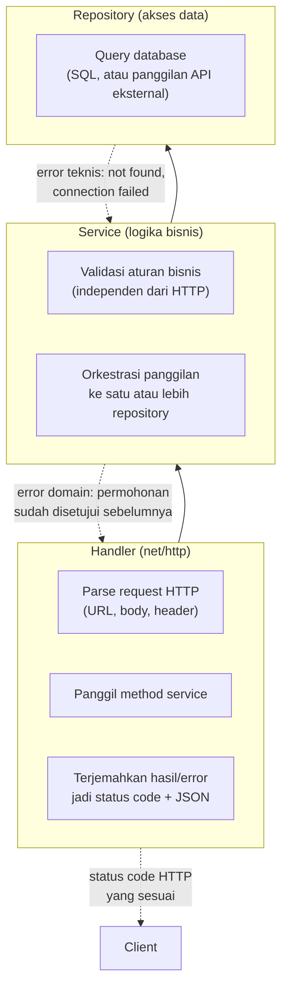

## TL;DR

Sebuah handler HTTP yang langsung menulis query SQL, memvalidasi input, menerapkan aturan bisnis, dan memformat response — semuanya dalam satu fungsi panjang — bekerja untuk endpoint pertama, lalu menjadi mimpi buruk begitu logika yang sama perlu dipakai ulang dari tempat lain (job terjadwal, konsumer Kafka, endpoint kedua yang mirip). Layering handler-service-repository memisahkan tiga tanggung jawab yang berbeda sifat perubahannya: **handler** menerjemahkan HTTP menjadi panggilan fungsi biasa dan sebaliknya, **service** menjalankan logika bisnis yang sepenuhnya independen dari HTTP, dan **repository** menerjemahkan panggilan fungsi menjadi query database dan sebaliknya. Pemisahan ini bukan birokrasi kosong — ia adalah alasan kenapa logika bisnis bisa dites tanpa menyalakan HTTP server sungguhan, dan kenapa mengganti database tidak berarti menulis ulang aturan bisnis.

## The Problem

Sebuah endpoint `POST /permohonan/{id}/setujui` ditulis sebagai satu handler HTTP yang langsung berisi: parsing `id` dari URL, query SQL untuk mengambil data permohonan, pengecekan apakah statusnya masih "menunggu", query SQL untuk mengubah status jadi "disetujui", dan penulisan response JSON — semuanya dalam satu fungsi sepanjang seratus baris. Fitur berkembang: sekarang butuh endpoint kedua yang melakukan persetujuan **massal** (banyak ID sekaligus), dan sebuah job terjadwal yang otomatis menyetujui permohonan tertentu yang memenuhi kriteria khusus setelah periode waktu tanpa aksi manual. Ketiga tempat ini membutuhkan logika bisnis yang **identik** (cek status, ubah status, catat log audit) — tapi karena logika itu terjebak di dalam satu handler HTTP, ia tidak bisa dipanggil ulang dari job terjadwal (yang tidak punya `http.Request` atau `http.ResponseWriter` sama sekali) tanpa menyalin-tempel seluruh logika, menghasilkan tiga salinan kode yang harus diperbarui serentak setiap kali aturan bisnisnya berubah — dan cepat atau lambat, salah satu salinan itu lupa diperbarui, menciptakan bug yang hanya muncul di satu jalur tapi tidak di jalur lain.

Masalah kedua: menulis unit test untuk logika bisnis "permohonan hanya bisa disetujui kalau statusnya masih menunggu" memaksa test itu menyalakan HTTP server sungguhan dan database sungguhan, karena tidak ada cara memanggil logika itu secara terisolasi — test jadi lambat, rapuh, dan susah menguji kasus tepi (edge case) tanpa benar-benar mengubah data di database test.

## Intuition

Bayangkan sebuah kantor pelayanan publik dengan tiga peran yang jelas terpisah: **petugas loket** (handler) yang menerima berkas dari warga dan menerjemahkan bahasa awam ("saya mau ajukan izin usaha") menjadi formulir standar internal, **penyelia** (service) yang memeriksa apakah permohonan itu memenuhi aturan (dokumen lengkap, tidak ada pelanggaran sebelumnya) tanpa peduli apakah permohonan itu datang lewat loket langsung, lewat pos, atau lewat aplikasi online, dan **petugas arsip** (repository) yang tahu persis di lemari mana dan folder apa data itu tersimpan secara fisik, tapi tidak pernah ikut memutuskan apakah sebuah permohonan layak disetujui. Ketiga peran ini bisa diganti secara independen — penyelia yang sama tetap menjalankan aturan yang sama, entah berkas datang dari loket atau dari pos, dan sistem arsip bisa dipindah dari lemari kayu ke sistem digital tanpa mengubah aturan yang diperiksa penyelia sama sekali.

Analogi ini bocor pada satu hal: petugas loket, penyelia, dan petugas arsip di dunia nyata adalah manusia yang bisa berimprovisasi dan saling bertanya langsung kalau ada kasus tidak terduga. Layer di kode adalah kontrak yang kaku — service **hanya** bisa memakai apa yang didefinisikan eksplisit di interface repository, dan handler **hanya** bisa memanggil apa yang diekspos service secara eksplisit; tidak ada "bertanya langsung" di luar kontrak itu, yang berarti desain interface antar layer harus dipikirkan matang di awal, bukan diperbaiki secara ad-hoc di tengah jalan.

## How It Works



Diagram ini menunjukkan arah ketergantungan yang selalu satu arah: handler bergantung pada service, service bergantung pada repository — **tidak pernah sebaliknya**. Repository tidak tahu apa-apa soal HTTP; service tidak tahu apa-apa soal `http.Request`; ini yang membuat service bisa dipanggil dari handler HTTP, konsumer Kafka, atau job terjadwal tanpa perubahan sama sekali.

Perhatikan juga alur error yang mengalir ke atas: repository mengembalikan error **teknis** (koneksi database gagal, baris tidak ditemukan), service menerjemahkannya jadi error **domain bisnis** (permohonan tidak ditemukan, status tidak valid untuk aksi ini), dan handler menerjemahkan error domain itu jadi status code HTTP yang tepat (404, 409, dst.) — pola ini dibahas lebih dalam di [[../20 Go Language/Errors as Values|Errors as Values]].

## In Go

```go
package repository

import (
	"context"
	"database/sql"
	"errors"
	"fmt"
)

var ErrPermohonanTidakDitemukan = errors.New("permohonan tidak ditemukan")

type Permohonan struct {
	ID     int64
	Status string
}

// PermohonanRepository adalah interface, bukan struct konkret — service
// bergantung pada abstraksi ini, bukan pada implementasi database tertentu,
// memungkinkan mock dipakai saat testing (lihat
// [[../20 Go Language/Mocking Through Interfaces|Mocking Through Interfaces]]).
type PermohonanRepository interface {
	AmbilByID(ctx context.Context, id int64) (Permohonan, error)
	UbahStatus(ctx context.Context, id int64, statusBaru string) error
}

type permohonanRepositorySQL struct {
	db *sql.DB
}

func NewPermohonanRepositorySQL(db *sql.DB) PermohonanRepository {
	return &permohonanRepositorySQL{db: db}
}

func (r *permohonanRepositorySQL) AmbilByID(ctx context.Context, id int64) (Permohonan, error) {
	var p Permohonan
	err := r.db.QueryRowContext(ctx, `SELECT id, status FROM permohonan WHERE id = ?`, id).
		Scan(&p.ID, &p.Status)
	if errors.Is(err, sql.ErrNoRows) {
		return Permohonan{}, ErrPermohonanTidakDitemukan
	}
	if err != nil {
		return Permohonan{}, fmt.Errorf("query ambil permohonan: %w", err)
	}
	return p, nil
}

func (r *permohonanRepositorySQL) UbahStatus(ctx context.Context, id int64, statusBaru string) error {
	_, err := r.db.ExecContext(ctx, `UPDATE permohonan SET status = ? WHERE id = ?`, statusBaru, id)
	if err != nil {
		return fmt.Errorf("query ubah status permohonan: %w", err)
	}
	return nil
}
```

```go
package service

import (
	"context"
	"errors"
	"fmt"

	"example.com/app/repository"
)

var ErrStatusTidakValidUntukPersetujuan = errors.New("permohonan hanya bisa disetujui saat status masih menunggu")

// PermohonanService berisi SELURUH aturan bisnis, tidak tahu apa-apa soal
// HTTP — bisa dipanggil dari handler, dari konsumer Kafka, atau dari job
// terjadwal tanpa perubahan apa pun di sini.
type PermohonanService struct {
	repo repository.PermohonanRepository
}

func NewPermohonanService(repo repository.PermohonanRepository) *PermohonanService {
	return &PermohonanService{repo: repo}
}

func (s *PermohonanService) Setujui(ctx context.Context, id int64) error {
	p, err := s.repo.AmbilByID(ctx, id)
	if err != nil {
		return fmt.Errorf("ambil permohonan untuk disetujui: %w", err)
	}

	if p.Status != "menunggu" {
		return fmt.Errorf("permohonan %d: %w", id, ErrStatusTidakValidUntukPersetujuan)
	}

	if err := s.repo.UbahStatus(ctx, id, "disetujui"); err != nil {
		return fmt.Errorf("ubah status jadi disetujui: %w", err)
	}
	return nil
}
```

```go
package handler

import (
	"encoding/json"
	"errors"
	"net/http"
	"strconv"

	"example.com/app/repository"
	"example.com/app/service"
)

type PermohonanHandler struct {
	svc *service.PermohonanService
}

func NewPermohonanHandler(svc *service.PermohonanService) *PermohonanHandler {
	return &PermohonanHandler{svc: svc}
}

// Setujui HANYA menerjemahkan HTTP <-> panggilan fungsi. Tidak ada aturan
// bisnis di sini sama sekali — kalau aturan bisnis berubah, handler ini
// tidak perlu disentuh.
func (h *PermohonanHandler) Setujui(w http.ResponseWriter, r *http.Request) {
	idStr := r.PathValue("id")
	id, err := strconv.ParseInt(idStr, 10, 64)
	if err != nil {
		http.Error(w, "id tidak valid", http.StatusBadRequest)
		return
	}

	err = h.svc.Setujui(r.Context(), id)
	switch {
	case err == nil:
		w.WriteHeader(http.StatusOK)
	case errors.Is(err, repository.ErrPermohonanTidakDitemukan):
		http.Error(w, "permohonan tidak ditemukan", http.StatusNotFound)
	case errors.Is(err, service.ErrStatusTidakValidUntukPersetujuan):
		http.Error(w, err.Error(), http.StatusConflict)
	default:
		json.NewEncoder(w).Encode(map[string]string{"error": "kesalahan internal"})
		w.WriteHeader(http.StatusInternalServerError)
	}
}
```

Perhatikan bahwa `PermohonanService.Setujui` bisa dipanggil identik dari job terjadwal atau konsumer Kafka — keduanya cukup memanggil `svc.Setujui(ctx, id)` langsung, tanpa perlu membangun `http.Request` palsu atau menyalin logika apa pun.

## In His Stack

Yii2 secara konvensi mendorong pola MVC (Model-View-Controller) yang mirip tapi tidak identik — Active Record di Yii2 sering menjadi tempat logika bisnis **dan** akses data bercampur jadi satu (method di dalam Model yang langsung memanggil query dan juga memvalidasi aturan bisnis), berbeda dari pemisahan repository/service yang lebih tegas di pola ini. Migrasi mental dari kebiasaan Yii2 ke Go sering berarti secara sadar memisahkan apa yang di Yii2 mungkin sudah bercampur dalam satu Model class, menjadi repository (murni akses data) dan service (murni aturan bisnis) yang terpisah — pemisahan yang jauh lebih penting di Go karena tidak ada "magic" framework yang menyembunyikan query di balik method Active Record.

## Trade-offs and When Not To Use It

Untuk skrip kecil, endpoint tunggal yang benar-benar tidak akan pernah dipanggil dari tempat lain, atau prototipe yang sengaja dibuang setelah divalidasi, memisahkan tiga layer penuh adalah overhead yang tidak sepadan — satu file sederhana yang langsung menulis query di dalam handler bisa lebih cepat ditulis dan cukup jelas dibaca untuk kasus sesederhana itu. Layering ini bernilai justru ketika logika bisnis **akan** dipakai ulang dari lebih dari satu jalur masuk (HTTP, job, message konsumer), atau ketika tim cukup besar sehingga kemampuan menguji logika bisnis secara terisolasi (tanpa menyalakan HTTP server) menjadi kebutuhan nyata untuk kecepatan iterasi. Memaksakan tiga layer penuh untuk aplikasi CRUD sederhana dengan satu jenis pengguna dan tidak ada rencana pertumbuhan bisa menjadi over-engineering yang menambah indirection tanpa manfaat nyata — clean architecture bukan tentang jumlah folder, dan tiga layer bukan tujuan itu sendiri.

## Common Mistakes

> [!warning] Jebakan
> Membiarkan service memanggil `*sql.DB` langsung untuk "query cepat" alih-alih lewat repository — begitu satu pengecualian dibuat, batas antar layer mulai bocor, dan lambat laun seluruh disiplin pemisahan runtuh menjadi tidak konsisten.

> [!warning] Jebakan
> Menaruh validasi aturan bisnis di handler (misalnya "kalau status sudah disetujui, tolak") alih-alih di service — membuat aturan itu hanya berlaku untuk jalur HTTP, dan harus disalin ulang secara manual (dengan risiko lupa atau berbeda) begitu ada jalur masuk baru seperti job terjadwal atau konsumer message.

> [!warning] Jebakan
> Membuat repository mengembalikan `*sql.Rows` mentah atau tipe spesifik database lain langsung ke service — mengikat service pada detail implementasi database tertentu, membuat mengganti database atau menulis mock untuk testing jadi jauh lebih sulit dari yang seharusnya.

## Exercises

1. Jelaskan kenapa arah ketergantungan (handler → service → repository) harus selalu satu arah, dan apa yang rusak kalau repository memanggil balik ke service.
2. Kenapa `PermohonanService.Setujui` di atas bisa dipanggil dari konsumer Kafka tanpa perubahan apa pun, padahal awalnya ditulis untuk dipanggil dari handler HTTP?
3. Sebutkan satu skenario konkret di mana memisahkan tiga layer penuh adalah over-engineering yang tidak sepadan.
4. Desain terbuka: fitur baru butuh "menyetujui banyak permohonan sekaligus dalam satu transaksi database" — kalau salah satu gagal disetujui (misalnya statusnya ternyata sudah berubah), seluruh batch harus dibatalkan (rollback), bukan sebagian berhasil sebagian gagal. Rancang bagaimana kebutuhan transaksi lintas beberapa pemanggilan repository ini dipetakan ke pola handler-service-repository, dan jelaskan di layer mana keputusan "mulai transaksi" dan "commit/rollback" sebaiknya berada.

> [!success]- Kunci jawaban
> **1.** Arah satu arah ini menjamin repository tidak pernah bergantung pada aturan bisnis apa pun — ia murni tahu cara membaca/menulis data. Kalau repository memanggil balik ke service (misalnya repository yang memvalidasi aturan bisnis sebelum menyimpan), lapisan itu jadi saling bergantung melingkar (circular dependency), yang membuat keduanya tidak bisa lagi diuji atau diganti secara independen — mengubah database berarti berpotensi harus mengubah aturan bisnis juga, padahal keduanya seharusnya adalah dua hal yang berubah karena alasan yang sama sekali berbeda.
> **4.** Keputusan "mulai transaksi" dan "commit/rollback" harus berada di **service**, bukan di repository maupun handler — service adalah satu-satunya layer yang tahu operasi mana saja yang secara bisnis harus atomik bersama (semua permohonan dalam batch harus berhasil, atau tidak sama sekali). Pola konkretnya: repository menyediakan method tambahan yang menerima `*sql.Tx` (bukan hanya `*sql.DB`) atau interface yang mengabstraksi keduanya, service membuka transaksi lewat `db.BeginTx`, memanggil method repository berkali-kali dalam transaksi yang sama untuk setiap permohonan dalam batch, dan men-commit hanya jika seluruhnya berhasil — kalau satu gagal di tengah, service memanggil rollback. Handler tetap tidak berubah sama sekali: ia hanya memanggil satu method service (`SetujuiBatch(ctx, ids)`) dan menerjemahkan hasilnya, tidak pernah tahu bahwa di baliknya ada transaksi database yang mengorkestrasi banyak operasi.

## Self-Check

- Apa tanggung jawab spesifik masing-masing dari handler, service, dan repository?
- Kenapa service tidak boleh menerima atau mengetahui `http.Request` sama sekali?
- Bagaimana error mengalir dan berubah bentuk saat naik dari repository ke service ke handler?
- Kapan memisahkan tiga layer penuh menjadi over-engineering yang tidak sepadan?

## Connected Notes

- [[../20 Go Language/Interfaces and Implicit Satisfaction|Interfaces and Implicit Satisfaction]] — `PermohonanRepository` sebagai interface, bukan struct konkret, adalah penerapan langsung dari mekanisme yang dijelaskan di note itu.
- [[../20 Go Language/Errors as Values|Errors as Values]] — pola error teknis-ke-domain-ke-HTTP yang mengalir lintas layer di note ini adalah aplikasi konkret dari filosofi error di note itu.
- [[Manual Dependency Injection in Go]] — cara `PermohonanHandler`, `PermohonanService`, dan repository disusun dan disuntikkan satu sama lain lewat constructor dibahas penuh di note itu.
- [[../20 Go Language/Mocking Through Interfaces|Mocking Through Interfaces]] — interface repository di layer ini adalah titik masuk utama untuk mocking saat menulis unit test service.
- [[../30 APIs and Web/API Versioning|API Versioning]] — layering ini adalah alasan kenapa logika bisnis tidak perlu terduplikasi antar versi API yang berbeda.

## Further Reading

- Robert C. Martin, "Clean Architecture" — sumber konsep pemisahan layer dan arah ketergantungan, meski istilah dan strukturnya di sini disederhanakan untuk konteks Go idiomatik.

## Catatan Saya

*Tulis di sini contoh kode di kerjaanmu (Yii2 atau Go) yang saat ini mencampur logika bisnis dengan akses data dalam satu tempat, dan bagaimana kamu akan memisahkannya.*
