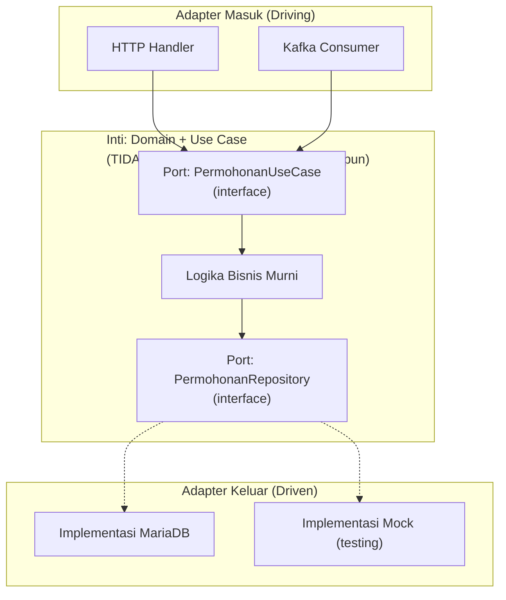

## TL;DR

[[Handler-Service-Repository Layering|Handler-service-repository]] adalah pola konkret yang **sudah** menerapkan prinsip inti hexagonal/clean architecture, tanpa menyebut namanya secara eksplisit: logika bisnis (service) tidak bergantung pada detail teknis (HTTP di satu sisi, database di sisi lain) — sebaliknya, **detail teknis yang bergantung pada logika bisnis**, lewat interface yang didefinisikan logika bisnis itu sendiri. Hexagonal architecture (juga disebut *ports and adapters*) dan Clean Architecture adalah dua nama yang cukup mirip untuk ide yang sama: aturan **arah ketergantungan** — kode yang mengandung aturan bisnis inti tidak boleh tahu apa-apa soal framework, database, atau protokol tertentu; merekalah yang harus beradaptasi ke bentuk yang dibutuhkan inti, bukan sebaliknya. Bab ini penting bukan sebagai "folder structure baru", tapi sebagai bahasa untuk menjelaskan **kenapa** pola layering yang sudah dipakai itu benar secara arsitektural, bukan sekadar kebiasaan.

## The Problem

Sebuah tim menulis logika bisnis verifikasi permohonan langsung di dalam handler HTTP, memanggil `*sql.DB` langsung di tengah fungsi yang juga membaca `*http.Request` dan menulis `http.ResponseWriter` — kode ini bekerja, tapi begitu tim perlu menjalankan **logika yang sama** dari konsumer Kafka (memproses permohonan yang masuk lewat integrasi batch, bukan API langsung), logika bisnis inti (aturan verifikasi) harus disalin-tempel ke tempat baru, karena ia sudah terikat erat (coupled) dengan `*http.Request` dan `*sql.DB` secara langsung, bukan dipisahkan sebagai unit yang berdiri sendiri.

Masalah kedua yang lebih halus: tim ingin menulis unit test untuk aturan bisnis "permohonan hanya bisa disetujui kalau dokumen lengkap dan kuota belum habis" — tapi karena aturan ini tertanam di dalam kode yang juga memanggil database secara langsung, menguji logika ini **memaksa** menyiapkan database sungguhan (atau setidaknya mock yang meniru seluruh perilaku driver database), padahal logika sesungguhnya yang ingin diuji murni soal perbandingan nilai dan pengambilan keputusan, tidak ada hubungannya dengan bagaimana data itu benar-benar disimpan.

## Intuition

Bayangkan hexagonal architecture seperti **kantor pusat perusahaan dengan pintu masuk berbeda untuk tamu berbeda**, tapi seluruh keputusan penting tetap dibuat oleh manajemen di dalam, tidak peduli tamu itu masuk lewat pintu depan (HTTP), pintu belakang (Kafka), atau telepon (gRPC). Setiap pintu (*adapter*) punya bentuk yang sesuai untuk jenis tamunya masing-masing (formulir tamu HTTP, protokol pesan Kafka), tapi begitu tamu itu masuk, ia diterjemahkan ke bahasa internal yang sama yang dipahami manajemen (*port*, berupa interface) — manajemen (logika bisnis inti) tidak pernah perlu tahu tamu itu datang lewat pintu mana, ia hanya bekerja dengan permintaan yang sudah diterjemahkan ke bentuk standar.

Analogi ini bocor pada satu hal: pintu kantor fisik adalah struktur permanen yang jarang berubah. Adapter dalam arsitektur ini justru **dirancang untuk mudah diganti** — mengganti database dari MariaDB ke PostgreSQL, atau mengganti dari HTTP ke gRPC, seharusnya berarti menulis ulang **adapter**-nya saja (implementasi yang memenuhi interface/port yang sudah ada), tanpa menyentuh satu baris pun logika bisnis inti — properti yang jauh lebih fleksibel daripada mengganti pintu fisik kantor.

## How It Works



Diagram ini menunjukkan arah ketergantungan yang **selalu menuju ke dalam** — adapter (HTTP, Kafka, SQL) bergantung pada port (interface) yang didefinisikan inti, tidak pernah sebaliknya. Inti tidak pernah mengimpor package `net/http` atau `database/sql` sama sekali; ia hanya tahu tentang interface abstrak yang **kebetulan** diimplementasikan oleh adapter tersebut (lihat [[../20 Go Language/Interfaces and Implicit Satisfaction|Interfaces and Implicit Satisfaction]] soal structural typing yang membuat ini alami di Go).

**Port** adalah interface yang didefinisikan di sisi inti — "masuk" (driving port, dipanggil dari luar untuk memicu use case) dan "keluar" (driven port, dipanggil inti untuk mengakses dunia luar seperti database). **Adapter** adalah implementasi konkret dari port itu, ditulis di lapisan luar yang tahu detail teknis (bagaimana HTTP request diparsing, bagaimana query SQL ditulis).

## Under The Hood

**Kenapa ini disebut idiomatic-di-Go, bukan meniru Java**: implementasi hexagonal architecture di Java/C# sering butuh **deklarasi eksplisit** "class X implements interface Y" dan biasanya dibantu framework dependency injection yang berat (Spring). Di Go, structural typing membuat sebuah implementasi otomatis memenuhi interface manapun yang cocok tanda tangannya (signature-nya), **tanpa deklarasi apa pun** — ini yang membuat pola ports-and-adapters terasa jauh lebih ringan di Go, karena tidak butuh boilerplate class hierarchy atau anotasi framework, cukup interface kecil dan constructor injection manual (lihat [[Manual Dependency Injection in Go]]).

**Clean Architecture** (istilah dari Robert C. Martin) dan **Hexagonal Architecture** (istilah dari Alistair Cockburn) berbeda asal dan sedikit berbeda penekanan (Clean Architecture menekankan lapisan konsentris dengan "Dependency Rule" yang eksplisit; Hexagonal menekankan port-adapter sebagai metafora heksagon dengan banyak sisi/adapter) — tapi keduanya mengekspresikan **prinsip inti yang sama**: dependency selalu mengarah ke dalam, menuju logika bisnis, tidak pernah keluar menuju detail teknis. Perdebatan soal nama mana yang "benar" kurang penting dibanding memahami prinsip yang mendasari keduanya.

## In Go

```go
package domain

import "context"

// PORT MASUK (driving port) — interface yang didefinisikan di INTI,
// dipanggil adapter (HTTP handler, Kafka consumer) untuk memicu use case.
type PermohonanUseCase interface {
	Setujui(ctx context.Context, id int64) error
}

// PORT KELUAR (driven port) — interface yang didefinisikan di INTI,
// diimplementasikan adapter (SQL, mock) untuk mengakses data.
type PermohonanRepository interface {
	AmbilByID(ctx context.Context, id int64) (Permohonan, error)
	UbahStatus(ctx context.Context, id int64, status string) error
}

type Permohonan struct {
	ID     int64
	Status string
}

// permohonanService adalah IMPLEMENTASI dari PermohonanUseCase — inilah
// LOGIKA BISNIS MURNI, tidak mengimpor net/http atau database/sql sama
// sekali, hanya bergantung pada port (interface) yang didefinisikan di
// package yang SAMA.
type permohonanService struct {
	repo PermohonanRepository
}

func NewPermohonanService(repo PermohonanRepository) PermohonanUseCase {
	return &permohonanService{repo: repo}
}

func (s *permohonanService) Setujui(ctx context.Context, id int64) error {
	p, err := s.repo.AmbilByID(ctx, id)
	if err != nil {
		return err
	}
	if p.Status != "menunggu" {
		return errStatusTidakValid
	}
	return s.repo.UbahStatus(ctx, id, "disetujui")
}

var errStatusTidakValid = &statusError{}

type statusError struct{}

func (e *statusError) Error() string { return "status tidak valid untuk persetujuan" }
```

```go
package adapter

import (
	"context"
	"net/http"

	"example.com/app/domain"
)

// ADAPTER MASUK: HTTP handler HANYA menerjemahkan HTTP <-> pemanggilan
// use case, tidak mengandung aturan bisnis apa pun.
type HTTPHandler struct {
	usecase domain.PermohonanUseCase
}

func (h *HTTPHandler) Setujui(w http.ResponseWriter, r *http.Request) {
	id := parseID(r)
	if err := h.usecase.Setujui(r.Context(), id); err != nil {
		http.Error(w, err.Error(), http.StatusConflict)
		return
	}
	w.WriteHeader(http.StatusOK)
}

func parseID(r *http.Request) int64 { return 0 }

// ADAPTER MASUK LAIN: Kafka consumer memanggil USE CASE YANG SAMA PERSIS,
// tanpa menyalin logika bisnis sama sekali.
func KonsumenKafkaSetujui(ctx context.Context, usecase domain.PermohonanUseCase, id int64) error {
	return usecase.Setujui(ctx, id)
}
```

## In His Stack

Ini adalah jawaban arsitektural langsung untuk masalah di "The Problem" — begitu use case (`PermohonanUseCase`) didefinisikan sebagai port di inti, menambah adapter masuk baru (Kafka consumer untuk memproses integrasi batch dari instansi lain) tidak pernah butuh menyalin logika bisnis, hanya memanggil use case yang sama dari titik masuk berbeda. Untuk 13 aplikasi yang mayoritas kemungkinan besar berbasis Yii2/MVC yang mencampur logika bisnis dengan Active Record (mengakses database) dalam satu Model, migrasi bertahap ke Go adalah kesempatan menerapkan pemisahan yang lebih tegas ini sejak awal, bukan mewarisi pencampuran yang sama.

## Trade-offs and When Not To Use It

Untuk aplikasi CRUD sederhana dengan satu jenis titik masuk (hanya HTTP, tidak pernah butuh Kafka consumer atau gRPC server terpisah) dan tanpa rencana pertumbuhan kompleksitas, memisahkan port dan adapter secara penuh adalah **overhead** — layer tambahan (interface untuk use case, interface untuk repository) menambah indirection yang tidak memberi manfaat nyata kalau memang tidak pernah ada kebutuhan mengganti adapter atau menambah titik masuk baru. Prinsip ini paling bernilai justru ketika **benar-benar** ada kebutuhan konkret: logika bisnis yang dipanggil dari lebih dari satu titik masuk, atau kebutuhan pengujian logika bisnis yang terisolasi dari infrastruktur — kalau tidak ada satu pun dari kedua kebutuhan ini, [[Handler-Service-Repository Layering]] versi yang lebih sederhana (tanpa interface use case terpisah, service langsung dipanggil handler) sudah lebih dari cukup.

## Common Mistakes

> [!warning] Jebakan
> Menerapkan hexagonal architecture penuh (banyak interface, banyak folder `port`/`adapter`) untuk aplikasi sederhana yang tidak pernah butuh mengganti adapter atau menambah titik masuk — menambah kompleksitas struktural tanpa manfaat nyata, "clean architecture" yang disalahpahami sebagai struktur folder wajib, bukan prinsip arah ketergantungan.

> [!warning] Jebakan
> Membiarkan logika bisnis inti mengimpor package spesifik teknologi (`net/http`, `database/sql`, SDK klien Kafka) secara langsung — melanggar aturan arah ketergantungan yang menjadi inti prinsip ini, meski struktur foldernya terlihat "benar" di permukaan.

> [!warning] Jebakan
> Mendefinisikan interface (port) di sisi adapter/infrastruktur, bukan di sisi domain/use case — kontras dengan konvensi Go yang lebih disukai (interface didefinisikan di sisi consumer/pemakai), yang membuat domain bergantung pada detail infrastruktur alih-alih sebaliknya.

## Exercises

1. Jelaskan aturan arah ketergantungan inti hexagonal/clean architecture, dan kenapa itu yang membedakan pola ini dari sekadar "susunan folder".
2. Kenapa Go tidak butuh framework dependency injection berat untuk menerapkan pola ini, berbeda dari Java?
3. Kapan menerapkan hexagonal architecture penuh adalah overhead yang tidak sepadan?
4. Desain terbuka: sistemmu saat ini hanya punya satu adapter masuk (HTTP), tapi ada rencana enam bulan ke depan menambah adapter gRPC untuk komunikasi service-to-service internal dan adapter Kafka consumer untuk integrasi batch. Rancang bagaimana kamu akan menyiapkan struktur kode SEKARANG (sebelum kedua adapter baru itu benar-benar dibutuhkan) supaya penambahan nanti tidak memaksa menulis ulang logika bisnis, tanpa over-engineering untuk kebutuhan yang belum ada.

> [!success]- Kunci jawaban
> **1.** Aturan arah ketergantungan menyatakan bahwa kode yang mengandung aturan bisnis inti (domain, use case) tidak boleh bergantung pada (mengimpor, mengetahui detail) kode yang lebih dekat ke infrastruktur (HTTP, database, message broker) — sebaliknya, kode infrastruktur itu yang bergantung pada kontrak (interface) yang didefinisikan inti. Ini yang membedakan dari "susunan folder" — folder bisa disusun rapi tapi tetap melanggar aturan ini kalau, misalnya, struct di folder "domain" tetap mengimpor `database/sql` secara langsung; kepatuhan sesungguhnya diukur dari arah impor dan ketergantungan, bukan nama folder.
> **4.** Definisikan `PermohonanUseCase` sebagai interface di package domain **sekarang**, meski adapter yang memanggilnya baru satu (HTTP) — biaya menulis satu interface kecil ini rendah, dan ini yang membuat penambahan adapter gRPC/Kafka nanti murni soal menulis adapter baru yang memanggil interface yang sudah ada, tanpa menyentuh logika bisnis sama sekali. Yang **tidak perlu** disiapkan sekarang: struktur folder rumit dengan banyak sub-package terpisah untuk "port" dan "adapter" yang belum benar-benar dibutuhkan, atau abstraksi berlebihan untuk kemungkinan yang masih spekulatif di luar dua adapter yang sudah direncanakan konkret. Prinsip yang dipegang: siapkan **titik ekstensi yang murah** (interface use case) yang memang hampir pasti dibutuhkan, tapi jangan bangun seluruh kerangka arsitektur besar untuk kemungkinan yang belum benar-benar direncanakan.

## Self-Check

- Apa aturan arah ketergantungan inti hexagonal/clean architecture?
- Apa perbedaan port dan adapter dalam pola ini?
- Kenapa Go tidak butuh framework DI berat untuk menerapkan pola ini?
- Kapan pola ini menjadi overhead yang tidak sepadan?

## Connected Notes

- [[Handler-Service-Repository Layering]] — pola konkret yang sudah menerapkan prinsip inti arsitektur ini tanpa menyebut namanya, dijelaskan di note itu.
- [[Manual Dependency Injection in Go]] — mekanisme constructor injection yang menghubungkan adapter ke port, dijelaskan detail di note itu.
- [[../20 Go Language/Interfaces and Implicit Satisfaction|Interfaces and Implicit Satisfaction]] — structural typing yang membuat pola ports-and-adapters terasa ringan di Go, tanpa boilerplate seperti di Java.
- [[Lightweight DDD]] — kelanjutan langsung: bagaimana logika domain yang dipisahkan di note ini bisa dimodelkan lebih kaya memakai konsep DDD, dibahas di note berikutnya.
- [[Modular Monolith vs Microservices]] — batas port-adapter yang jelas dalam satu layanan adalah prasyarat alami untuk memecah layanan itu menjadi microservices di kemudian hari, kalau memang diperlukan.

## Further Reading

- Robert C. Martin, "Clean Architecture" — sumber istilah dan penjelasan mendalam Dependency Rule.
- Alistair Cockburn, "Hexagonal Architecture" (artikel asli yang memperkenalkan istilah ports and adapters).

## Catatan Saya

*Tulis di sini apakah ada logika bisnis di kerjaanmu yang saat ini terikat erat dengan HTTP atau database secara langsung, dan bagaimana kamu akan memisahkannya kalau perlu dipanggil dari titik masuk lain.*
