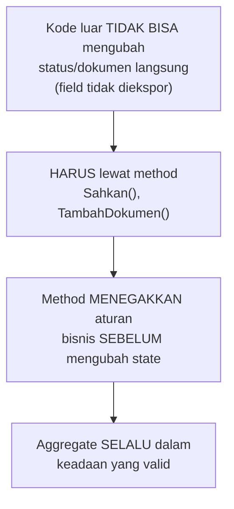

## TL;DR

Domain-Driven Design (DDD) lengkap adalah metodologi besar dengan banyak ritual (event storming, bounded context mapping formal, strategic design workshop berhari-hari) yang seringkali berlebihan untuk tim kecil-menengah. Lightweight DDD mengambil **beberapa konsep taktis** yang paling bernilai tanpa seluruh ritualnya: **ubiquitous language** (bahasa yang sama dipakai kode dan percakapan bisnis, tanpa terjemahan), **entity vs value object** (membedakan sesuatu yang punya identitas berkelanjutan dari sesuatu yang murni didefinisikan oleh nilainya), dan **aggregate** (batas konsistensi yang jelas — sekumpulan objek yang harus selalu valid bersama sebagai satu kesatuan). Nilainya bukan mengikuti DDD secara ketat, tapi memakai kosakatanya untuk membuat kode mencerminkan **bahasa yang dipakai orang bisnis**, bukan istilah teknis generik yang menjauh dari domain sesungguhnya.

## The Problem

Sebuah tim menulis kode dengan istilah generik seperti `processData()`, `handleItem()`, `updateStatus()` — nama yang secara teknis valid tapi tidak mencerminkan apa pun tentang **domain sesungguhnya** (izin usaha, verifikasi dokumen, proses hukum). Ketika seorang analis bisnis dari instansi terkait menjelaskan "kalau permohonan sudah **diverifikasi** tapi belum **disahkan**, statusnya seharusnya **tertahan**, bukan **ditolak**" — istilah "diverifikasi", "disahkan", "tertahan", "ditolak" ini adalah **bahasa domain** yang punya makna presisi bagi orang bisnis, tapi kode yang ditulis developer memakai istilah generik seperti `status = 2` atau `processStep = "step3"` yang tidak punya hubungan langsung dengan bahasa itu — setiap kali ada diskusi bisnis, developer harus **menerjemahkan** bolak-balik antara istilah bisnis dan representasi teknis, penerjemahan yang rawan salah dan kehilangan nuansa penting.

Masalah kedua: sebuah `Permohonan` punya field `alamat` sebagai string sederhana, dan field `dokumen` sebagai list sederhana yang bisa ditambah/dihapus dari mana saja di kode tanpa aturan konsisten — tidak ada satu tempat yang menegakkan aturan "permohonan tidak boleh disetujui kalau dokumen kurang dari tiga jenis wajib" atau "alamat harus mengikuti format kode pos yang valid". Aturan-aturan ini tersebar di berbagai tempat (kadang di handler, kadang di service, kadang tidak dicek sama sekali di jalur tertentu), membuat konsistensi data bergantung pada disiplin developer mengingat seluruh aturan di setiap titik, bukan ditegakkan secara struktural oleh desain kode itu sendiri.

## Intuition

Bayangkan ubiquitous language seperti **kamus istilah resmi kantor yang sama-sama dipakai** oleh petugas loket, sistem komputer, dan dokumen hukum — begitu petugas bilang "permohonan tertahan", semua orang (dan sistem) tahu persis apa yang dimaksud, tanpa perlu menerjemahkan ke istilah lain. Aggregate seperti **satu berkas fisik yang dijilid jadi satu** — permohonan dan dokumen pendukungnya dijilid sebagai satu kesatuan yang **selalu** diperiksa dan diubah bersama-sama sebagai satu unit, bukan lembaran lepas yang bisa hilang atau berubah sendiri-sendiri tanpa sepengetahuan berkas induknya. Entity seperti **orang dengan KTP** — punya identitas yang bertahan selama hidupnya meski atributnya berubah (alamat pindah, status pernikahan berubah, tapi tetap orang yang sama). Value object seperti **uang Rp 50.000** — dua lembar uang Rp 50.000 sepenuhnya bisa dipertukarkan dan tidak punya "identitas" masing-masing, yang penting hanya nilainya.

Analogi ini bocor pada satu hal: berkas fisik yang dijilid butuh usaha manual untuk memastikan tetap utuh. Aggregate dalam kode ditegakkan secara **struktural** oleh desain — method yang mengubah aggregate ditempatkan **di dalam** aggregate itu sendiri (bukan diakses dan diubah bebas dari luar), memaksa setiap perubahan melalui aturan konsistensi yang didefinisikan aggregate itu, sesuatu yang tidak bisa "dilewati" begitu saja seperti berkas fisik yang secara teori bisa dibongkar paksa oleh siapa pun.

## How It Works

```go
package domain

import "fmt"

// Permohonan adalah AGGREGATE ROOT — satu-satunya titik masuk untuk
// mengubah Permohonan DAN Dokumen di dalamnya. Field tidak diekspor
// (huruf kecil), memaksa perubahan lewat method yang menegakkan aturan.
type Permohonan struct {
	id       int64
	status   StatusPermohonan
	dokumen  []Dokumen
}

// StatusPermohonan adalah VALUE OBJECT sederhana yang memakai ISTILAH
// DOMAIN persis seperti yang dipakai orang bisnis — bukan angka generik
// seperti status=2.
type StatusPermohonan string

const (
	StatusMenunggu    StatusPermohonan = "menunggu"
	StatusDiverifikasi StatusPermohonan = "diverifikasi"
	StatusTertahan     StatusPermohonan = "tertahan"
	StatusDisahkan     StatusPermohonan = "disahkan"
	StatusDitolak      StatusPermohonan = "ditolak"
)

type Dokumen struct {
	Jenis string
	Path  string
}

// Sahkan adalah METHOD PADA AGGREGATE, bukan fungsi bebas yang menerima
// Permohonan sebagai parameter — ini menegakkan aturan bisnis TEPAT di
// satu tempat, tidak bisa "dilewati" dengan mengubah field secara
// langsung dari luar package (karena field tidak diekspor).
func (p *Permohonan) Sahkan() error {
	if p.status != StatusDiverifikasi {
		return fmt.Errorf("permohonan harus diverifikasi dulu sebelum disahkan, status saat ini: %s", p.status)
	}
	if len(p.dokumen) < 3 {
		return fmt.Errorf("dokumen wajib minimal 3 jenis, saat ini hanya %d", len(p.dokumen))
	}
	p.status = StatusDisahkan
	return nil
}

func (p *Permohonan) TambahDokumen(d Dokumen) error {
	if p.status == StatusDisahkan {
		return fmt.Errorf("tidak bisa menambah dokumen setelah permohonan disahkan")
	}
	p.dokumen = append(p.dokumen, d)
	return nil
}
```



Diagram ini menunjukkan bagaimana aggregate menegakkan **invariant** (aturan yang harus selalu benar) secara struktural — tidak mungkin ada `Permohonan` dengan status "disahkan" tapi dokumen kurang dari tiga, karena satu-satunya jalan mencapai status itu (`Sahkan()`) memeriksa aturan itu terlebih dulu.

## Under The Hood

**Bounded context** (konsep DDD lain yang bernilai diambil tanpa seluruh ritualnya) mengakui bahwa istilah yang sama bisa berarti **berbeda** di bagian sistem berbeda — "Dokumen" di konteks pengajuan permohonan (butuh validasi kelengkapan) bisa berarti sesuatu yang berbeda dari "Dokumen" di konteks arsip jangka panjang (butuh metadata retensi legal) — memaksakan satu model `Dokumen` tunggal untuk memuaskan kedua konteks sering menghasilkan model yang membingungkan, penuh field opsional yang hanya relevan di salah satu konteks. Mengenali batas ini (bahkan tanpa event storming formal) membantu memutuskan kapan dua bagian sistem butuh model data terpisah, bukan dipaksa berbagi satu struct besar yang mencoba melayani semua kebutuhan sekaligus.

**Entity vs value object** membedakan cara membandingkan kesamaan: dua entity dianggap sama hanya kalau **identitasnya** sama (dua `Permohonan` dengan ID berbeda selalu dianggap berbeda meski seluruh atributnya kebetulan identik), sementara dua value object dianggap sama kalau **nilainya** sama (dua `StatusPermohonan` dengan nilai "disahkan" sepenuhnya bisa dipertukarkan, tidak ada konsep "instance spesifik" dari status itu). Perbedaan ini memengaruhi keputusan desain seperti apakah sebuah tipe butuh field ID sama sekali, dan bagaimana perbandingan kesamaan (`==` atau method `Equals`) seharusnya bekerja untuknya.

## In Go

```go
package domain

// Alamat sebagai VALUE OBJECT — dua Alamat dengan field yang identik
// dianggap SAMA (tidak ada identitas terpisah), dan immutable setelah
// dibuat (tidak ada method untuk mengubah field-nya langsung).
type Alamat struct {
	Jalan    string
	Kota     string
	KodePos  string
}

// NewAlamat memvalidasi invariant SAAT PEMBUATAN — value object yang
// tidak valid tidak boleh bisa dibuat sama sekali.
func NewAlamat(jalan, kota, kodePos string) (Alamat, error) {
	if len(kodePos) != 5 {
		return Alamat{}, errKodePosTidakValid
	}
	return Alamat{Jalan: jalan, Kota: kota, KodePos: kodePos}, nil
}

var errKodePosTidakValid = &validasiError{pesan: "kode pos harus 5 digit"}

type validasiError struct{ pesan string }

func (e *validasiError) Error() string { return e.pesan }
```

## In His Stack

Ubiquitous language paling langsung bermanfaat saat berkomunikasi dengan analis bisnis atau perwakilan instansi pemerintah yang memakai istilah hukum/administratif presisi ("diverifikasi", "disahkan", "diregistrasi") — kode yang memakai istilah generik ("status 1, 2, 3") memaksa penerjemahan bolak-balik di setiap rapat dan setiap perubahan requirement, sementara kode yang memakai istilah yang sama persis dengan dokumen resmi/regulasi membuat diskusi dengan pihak non-teknis jauh lebih lancar, dan mengurangi risiko salah paham yang bisa berakibat serius untuk sistem legal-services.

## Trade-offs and When Not To Use It

Menerapkan aggregate dengan enkapsulasi ketat (field tidak diekspor, seluruh perubahan lewat method) menambah boilerplate dibanding sekadar struct dengan field publik — untuk data yang benar-benar sederhana tanpa invariant apa pun yang perlu ditegakkan (misalnya data referensi statis seperti daftar provinsi), enkapsulasi ini adalah usaha berlebihan. DDD taktis paling bernilai untuk **domain yang punya aturan bisnis kompleks** — kalau logika bisnis sistemmu sebagian besar hanya CRUD sederhana tanpa banyak invariant yang perlu dijaga, mengadopsi seluruh kosakata DDD (aggregate, entity, value object, bounded context) menambah kerumitan konseptual tanpa manfaat proporsional.

## Common Mistakes

> [!warning] Jebakan
> Memakai istilah teknis generik (`status`, `type`, `flag`) di kode padahal ada istilah domain yang presisi dan sudah dipakai orang bisnis — memperbesar jarak antara percakapan bisnis dan kode, meningkatkan risiko salah paham requirement.

> [!warning] Jebakan
> Mengekspos seluruh field aggregate (huruf besar, bisa diubah langsung dari luar) alih-alih memaksa perubahan lewat method — menghilangkan jaminan bahwa aggregate selalu berada dalam keadaan valid, karena kode luar bisa mengubah state tanpa melalui pemeriksaan aturan bisnis apa pun.

> [!warning] Jebakan
> Mencoba mengadopsi seluruh ritual DDD penuh (event storming, strategic design workshop berhari-hari) untuk tim kecil dengan domain yang relatif sederhana — investasi proses yang tidak sepadan dengan kompleksitas domain sesungguhnya.

## Exercises

1. Jelaskan apa itu ubiquitous language, dan kenapa memakai istilah generik di kode bisa merugikan komunikasi dengan pihak bisnis.
2. Apa perbedaan entity dan value object, dan bagaimana perbedaan ini memengaruhi cara membandingkan kesamaan dua instance?
3. Kenapa mengekspos field aggregate secara langsung (bukan lewat method) menghilangkan jaminan konsistensi data?
4. Desain terbuka: domainmu punya konsep "Petugas" yang di konteks penugasan kerja perlu tahu wilayah kerja dan divisi, tapi di konteks audit trail hanya perlu tahu nama dan ID untuk keperluan pencatatan siapa yang melakukan aksi. Jelaskan bagaimana konsep bounded context membantu memutuskan apakah kamu butuh satu model `Petugas` besar yang mencakup semua kebutuhan, atau dua model terpisah untuk masing-masing konteks.

> [!success]- Kunci jawaban
> **1.** Ubiquitous language adalah kesepakatan memakai **istilah yang sama persis** di kode, dokumentasi, dan percakapan dengan pihak bisnis — tanpa terjemahan bolak-balik antara "bahasa developer" dan "bahasa bisnis". Memakai istilah generik (`status = 2`) memaksa developer menerjemahkan setiap kali berdiskusi dengan pihak bisnis ("status 2 itu yang mana ya, yang diverifikasi atau yang tertahan?"), penerjemahan yang rawan salah dan kehilangan nuansa penting yang sebenarnya dimaksud pihak bisnis — terutama untuk istilah yang punya makna hukum/administratif presisi.
> **4.** Bounded context menyarankan bahwa kalau kebutuhan kedua konteks (penugasan kerja vs audit trail) benar-benar berbeda signifikan (satu butuh detail wilayah/divisi yang mungkin berubah seiring waktu, satu hanya butuh snapshot nama/ID yang tidak boleh berubah demi integritas audit), lebih baik dipisah menjadi **dua model berbeda**: `PetugasPenugasan` (dengan wilayah kerja, divisi, bisa diperbarui) untuk konteks operasional, dan `PetugasAuditSnapshot` (nama dan ID yang di-capture pada saat aksi terjadi, tidak pernah berubah setelahnya) untuk konteks audit trail — memaksakan satu model `Petugas` tunggal untuk keduanya berisiko menciptakan model yang membingungkan (field wilayah kerja yang "seharusnya" tidak relevan untuk audit lama, atau audit trail yang tidak sengaja ikut berubah kalau field petugas yang sama diupdate untuk kebutuhan penugasan). Pemisahan ini juga menghormati kebutuhan audit trail yang harus immutable — sesuatu yang sulit dijamin kalau berbagi model yang sama dengan data operasional yang memang didesain untuk berubah.

## Self-Check

- Apa itu ubiquitous language, dan kenapa penting untuk domain dengan istilah presisi?
- Apa perbedaan entity dan value object?
- Bagaimana aggregate menegakkan invariant secara struktural?
- Kapan mengadopsi kosakata DDD taktis tidak sepadan dilakukan?

## Connected Notes

- [[Hexagonal and Clean Architecture in Go]] — logika domain yang dijelaskan di note ini adalah "inti" yang dilindungi oleh port-adapter yang dibahas di note sebelumnya.
- [[../20 Go Language/Structs and Methods|Structs and Methods]] — enkapsulasi aggregate lewat method dan field tidak diekspor bertumpu langsung pada mekanisme struct dan method dasar Go.
- [[Modular Monolith vs Microservices]] — bounded context yang disinggung di note ini sering menjadi dasar menentukan batas modul atau service, dibahas di note berikutnya.
- [[Defining Service Boundaries]] — kelanjutan langsung: bagaimana bounded context diterjemahkan menjadi batas service yang konkret, dibahas di note lain domain ini.
- [[../30 APIs and Web/Resource Modelling|Resource Modelling]] — pemodelan resource API idealnya konsisten dengan model domain (entity, value object) yang dijelaskan di note ini, bukan dua model terpisah yang harus terus disinkronkan manual.

## Further Reading

- Eric Evans, "Domain-Driven Design: Tackling Complexity in the Heart of Software" — buku asli yang memperkenalkan seluruh kosakata DDD, termasuk konsep-konsep taktis yang dibahas ringkas di note ini.
- Vaughn Vernon, "Implementing Domain-Driven Design" — rujukan praktis yang lebih fokus pada implementasi taktis DDD.

## Catatan Saya

*Tulis di sini istilah bisnis presisi di kerjaanmu yang saat ini diterjemahkan jadi kode generik (status angka, flag boolean) — apakah memakai istilah domain langsung akan membantu.*
