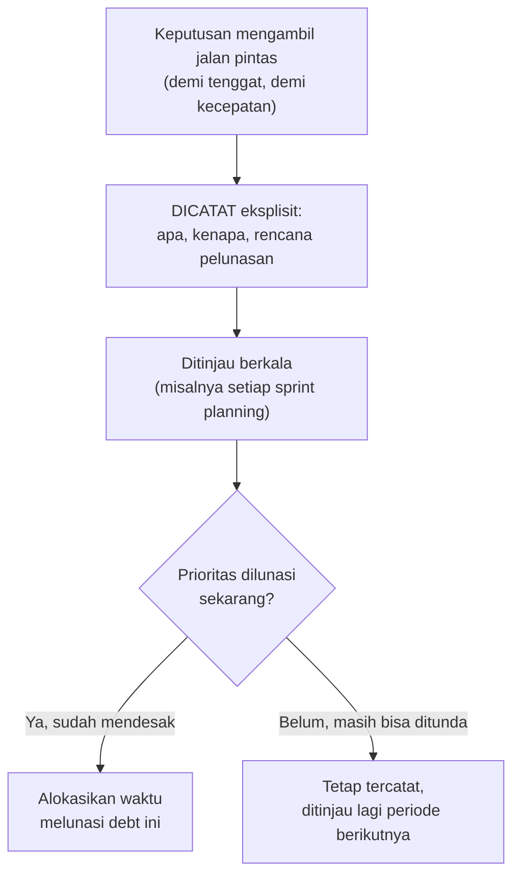

## TL;DR

Technical debt bukan sekadar "kode jelek" — istilah ini paling berguna kalau dipakai persis seperti metafora finansialnya: sebuah **keputusan sadar** mengambil jalan pintas sekarang (seperti berhutang) demi kecepatan, dengan konsekuensi harus "dibayar" nanti (usaha refactoring, biasanya lebih besar dari yang dihemat di awal, seperti bunga). Debt yang **dicatat secara eksplisit** (apa yang diambil jalan pintas, kenapa, dan kapan rencananya dilunasi) adalah keputusan bisnis yang bisa dipertanggungjawabkan. Debt yang menumpuk **diam-diam** — tidak ada yang mencatat, tidak ada yang berencana melunasi — adalah kegagalan manajemen yang cepat atau lambat "meledak" dalam bentuk yang lebih mahal dan tidak terduga daripada yang seharusnya bisa direncanakan.

## The Problem

Sebuah tim, dikejar tenggat peluncuran fitur, memutuskan melewati beberapa validasi input yang seharusnya ada, dengan niat "akan diperbaiki setelah peluncuran" — niat itu tidak pernah dituliskan di mana pun, tidak ada tiket yang dibuat, tidak ada yang secara resmi bertanggung jawab menindaklanjuti. Enam bulan kemudian, celah validasi itu menjadi sumber bug data yang tidak konsisten, dan ketika seseorang akhirnya menemukan akar masalahnya, tidak ada yang ingat bahwa ini adalah keputusan **sadar** yang diambil demi tenggat — ia terlihat seperti kelalaian murni, bukan trade-off yang sebenarnya masuk akal diambil pada saat itu, dengan konteks yang sudah hilang sepenuhnya.

Masalah kedua yang lebih besar: technical debt yang terus menumpuk tanpa pernah dibayar (fitur baru terus ditambahkan di atas fondasi yang semakin rapuh, tanpa pernah menyisihkan waktu memperbaiki fondasi itu) mencapai titik di mana kecepatan pengembangan **melambat drastis** — setiap perubahan kecil butuh usaha besar karena harus berhati-hati terhadap efek samping yang tidak terduga di kode yang sudah terlalu rapuh, sebuah "bunga" yang terus membesar sampai akhirnya organisasi terpaksa menghentikan pengembangan fitur baru sepenuhnya untuk fokus melunasi debt yang sudah menumpuk bertahun-tahun — situasi yang jauh lebih mahal dan mengganggu dibanding kalau debt itu dilunasi secara bertahap dan terencana sejak awal.

## Intuition

Bayangkan technical debt seperti **pinjaman KPR (kredit rumah) yang dicatat resmi**, dibanding **berhutang ke banyak orang berbeda tanpa catatan apa pun**. Pinjaman KPR resmi punya jadwal pembayaran yang jelas, bunga yang diketahui di depan, dan kedua pihak (bank dan peminjam) sadar penuh akan kewajiban itu — kamu bisa merencanakan keuangan di sekitarnya. Berhutang tanpa catatan ke banyak orang berbeda (satu jalan pintas di sini, satu lagi di sana, tidak ada yang mencatat totalnya) berarti kamu **tidak tahu** seberapa besar total kewajibanmu sampai semua penagih datang bersamaan pada waktu yang tidak terduga — jauh lebih berbahaya justru karena ketidaktahuan itu sendiri, bukan karena jumlah total hutangnya (yang mungkin sebenarnya sama).

Analogi ini bocor pada satu hal: bunga KPR ditentukan oleh kontrak yang jelas dan tidak berubah sepihak. "Bunga" technical debt (biaya tambahan melunasi debt itu nanti, dibanding kalau langsung dikerjakan dengan benar sejak awal) cenderung **membesar tak terduga** seiring waktu — kode yang dibangun di atas fondasi yang mengandung debt sering menambah lapisan ketergantungan baru di atas jalan pintas lama, membuat "bunga" technical debt jauh lebih sulit diprediksi dan berpotensi jauh lebih besar dibanding bunga finansial yang sudah disepakati di kontrak.

## How It Works



**Cara mencatat debt secara eksplisit yang konkret**: tiket/issue tracker dengan label khusus (misalnya `tech-debt`) yang menjelaskan apa yang diambil jalan pintas dan konsekuensinya; komentar kode terstruktur (`// TODO(nama, tanggal): validasi ini dilewati demi tenggat rilis, lihat TIKET-123`) yang bisa di-grep dan dilacak; atau dokumen technical debt register terpisah yang ditinjau berkala dalam rapat perencanaan, memberi visibilitas ke seluruh tim (dan manajemen) soal debt yang ada, bukan tersembunyi hanya diketahui developer yang mengambil keputusan itu.

## Under The Hood

**Tidak semua technical debt "buruk" secara default** — kadang mengambil jalan pintas yang sadar adalah keputusan bisnis yang **benar**, terutama kalau kecepatan peluncuran fitur untuk memvalidasi hipotesis bisnis lebih bernilai dibanding kesempurnaan teknis dari awal (misalnya fitur eksperimental yang mungkin akan dibuang sepenuhnya kalau hipotesisnya salah — menyempurnakan kodenya di awal adalah investasi sia-sia kalau fiturnya sendiri tidak pernah dipakai). Yang membedakan debt yang sehat dari yang berbahaya bukan keberadaannya, tapi **kesadaran** dan **rencana pelunasannya** — debt yang diambil sadar dengan rencana jelas adalah alat strategis; debt yang menumpuk tanpa disadari adalah risiko yang tidak terkelola.

**Interest rate technical debt cenderung meningkat, bukan tetap** — semakin lama debt dibiarkan, semakin banyak kode baru yang dibangun **di atas** fondasi yang mengandung debt itu (dependency baru pada asumsi yang sebenarnya rapuh), membuat biaya pelunasan di masa depan lebih besar dari biaya pelunasan sekarang — properti yang membuat "menunda selamanya" menjadi strategi yang secara matematis semakin buruk seiring waktu, berbeda dari sekadar menunda pembayaran yang bunganya tetap.

## In Go

```go
// Contoh KONKRET mencatat technical debt langsung di kode, dengan
// format yang bisa di-grep dan dilacak secara sistematis — bukan
// sekadar komentar informal yang mudah terlewat.

package permohonan

// TODO(budi, 2026-07-29): validasi format NIK dilewati sementara demi
// tenggat rilis fitur pendaftaran. RISIKO: NIK format salah bisa
// tersimpan tanpa terdeteksi. RENCANA: tambahkan validasi lengkap di
// TIKET-482, ditargetkan sprint berikutnya.
func ValidasiPermohonanSementara(nik string) error {
	if len(nik) == 0 {
		return errNIKKosong
	}
	// validasi format lengkap (16 digit, checksum daerah) BELUM ada —
	// lihat TIKET-482.
	return nil
}

var errNIKKosong = &validasiError{pesan: "NIK tidak boleh kosong"}

type validasiError struct{ pesan string }

func (e *validasiError) Error() string { return e.pesan }
```

```bash
# Perintah yang bisa dijalankan rutin (bahkan di CI, sebagai laporan
# bukan gate) untuk melacak seluruh debt yang tercatat lewat TODO
# terstruktur, memberi visibilitas ke seluruh tim.
grep -rn "TODO(.*," --include="*.go" . | wc -l
```

## In His Stack

Untuk sistem pemerintah dengan siklus anggaran dan audit yang formal, mencatat technical debt secara eksplisit bukan sekadar praktik baik teknis — ia juga memberi **bahasa** untuk mengomunikasikan kebutuhan sumber daya ke pihak non-teknis ("kita punya debt senilai estimasi X hari kerja yang perlu dialokasikan sebelum menambah fitur baru Y") jauh lebih meyakinkan dibanding "kode kita agak berantakan, butuh waktu membersihkan" yang terdengar samar dan sulit diprioritaskan oleh pihak yang mengalokasikan anggaran/waktu tim.

## Trade-offs and When Not To Use It

Mencatat **setiap** ketidaksempurnaan kecil sebagai "technical debt formal" (tiket terpisah untuk setiap baris kode yang bisa sedikit lebih rapi) adalah overhead administratif yang tidak sepadan — pencatatan formal paling bernilai untuk debt yang benar-benar punya **konsekuensi nyata** kalau tidak dilunasi (risiko bug, risiko keamanan, hambatan kecepatan pengembangan di masa depan), bukan preferensi gaya kode yang tidak berdampak fungsional. Untuk tim yang sangat kecil dengan komunikasi informal yang erat, pencatatan formal mungkin terasa berlebihan dibanding sekadar diskusi langsung — tapi begitu tim membesar (10+ developer, seperti konteks kerja ini), ingatan informal tidak lagi bisa diandalkan menjaga jejak seluruh debt yang ada, membuat pencatatan eksplisit menjadi kebutuhan struktural, bukan birokrasi berlebihan.

## Common Mistakes

> [!warning] Jebakan
> Mengambil jalan pintas teknis tanpa mencatatnya di mana pun — keputusan yang sebenarnya sadar dan masuk akal pada saat itu terlihat seperti kelalaian murni begitu ditemukan berbulan-bulan kemudian, kehilangan konteks yang menjelaskan kenapa itu diambil.

> [!warning] Jebakan
> Membiarkan debt terus menumpuk tanpa pernah dialokasikan waktu untuk melunasi, sampai kecepatan pengembangan melambat drastis — situasi yang jauh lebih mahal diatasi dibanding kalau debt dilunasi bertahap dan terencana sejak awal.

> [!warning] Jebakan
> Mencatat setiap ketidaksempurnaan kecil sebagai technical debt formal, termasuk yang tidak berdampak fungsional apa pun — overhead administratif yang tidak sepadan, dan bisa membuat sistem pencatatan debt kehilangan sinyal karena terlalu banyak noise.

## Exercises

1. Jelaskan kenapa technical debt yang dicatat eksplisit berbeda dari debt yang menumpuk diam-diam, meski secara teknis kodenya mungkin identik.
2. Kenapa "bunga" technical debt cenderung meningkat seiring waktu, bukan tetap?
3. Kapan mengambil technical debt adalah keputusan bisnis yang benar, bukan sekadar kemalasan teknis?
4. Desain terbuka: kamu koordinator teknis yang baru menyadari salah satu dari 13 aplikasi punya technical debt signifikan yang terakumulasi selama dua tahun terakhir (validasi yang dilewati, kode yang di-duplikasi alih-alih di-refactor, dependency yang sudah usang) tapi tidak pernah tercatat di mana pun secara sistematis. Rancang proses untuk (a) menginventarisasi debt yang sudah ada, dan (b) mencegah debt baru menumpuk tanpa tercatat di masa depan.

> [!success]- Kunci jawaban
> **1.** Secara teknis, kode yang sama bisa jadi identik terlepas apakah debt-nya dicatat atau tidak — perbedaannya bukan pada kode itu sendiri, tapi pada **informasi yang menyertainya**: debt yang dicatat punya jejak keputusan (kenapa diambil, konsekuensi apa yang disadari, kapan rencana pelunasan) yang memungkinkan siapa pun di masa depan memahami konteks dan membuat keputusan yang tepat (melunasi sekarang, atau menunda lagi dengan alasan yang jelas). Debt yang tidak tercatat kehilangan seluruh konteks itu — orang yang menemukannya nanti tidak tahu apakah ini kelalaian yang harus segera diperbaiki, atau trade-off sadar yang mungkin masih bisa ditunda, memaksa investigasi ulang dari nol untuk memahami sesuatu yang sebenarnya sudah pernah dipahami sepenuhnya di masa lalu.
> **4.** (a) Inventarisasi: jalankan audit kode sistematis (grep untuk pola umum seperti `TODO`/`FIXME`/`HACK` yang sudah ada meski tidak terstruktur, tinjau dependency yang sudah usang lewat tool seperti `go list -u -m all`, wawancara developer yang paling lama mengerjakan aplikasi ini untuk debt yang "diketahui" tapi tidak pernah tertulis) — hasilnya dikumpulkan jadi satu **debt register** (bisa sesederhana spreadsheet atau board di issue tracker) dengan estimasi dampak dan usaha pelunasan masing-masing, diprioritaskan berdasarkan risiko (mirip kerangka reversibilitas/blast radius dari [[Choosing Which Technical Battles to Fight]]). (b) Mencegah debt baru menumpuk tanpa tercatat: tetapkan **konvensi wajib** (bagian dari [[Cross-Team Code Standards]]) bahwa setiap jalan pintas yang diambil sadar (karena tenggat, karena ketidakpastian requirement) harus dicatat lewat format terstruktur (`TODO(nama, tanggal): alasan, rencana, nomor tiket`) yang bisa di-grep dan ditinjau otomatis, dan jadikan peninjauan debt register sebagai agenda rutin (misalnya setiap awal sprint) supaya debt yang tercatat benar-benar ditinjau ulang secara berkala, bukan hanya dicatat lalu dilupakan selamanya.

## Self-Check

- Kenapa technical debt yang dicatat eksplisit berbeda nilainya dari debt yang menumpuk diam-diam?
- Kenapa "bunga" technical debt cenderung meningkat seiring waktu?
- Kapan mengambil technical debt adalah keputusan bisnis yang tepat?
- Bagaimana cara konkret mencatat technical debt supaya bisa dilacak sistematis?

## Connected Notes

- [[Choosing Which Technical Battles to Fight]] — kerangka reversibilitas dan blast radius yang dibahas di note sebelumnya juga relevan menentukan prioritas pelunasan technical debt.
- [[Mentoring]] — "debt pengetahuan" (hanya satu orang paham suatu bagian sistem) yang disinggung di note itu adalah salah satu jenis technical debt yang paling sering diabaikan.
- [[../90 Architecture and Design/Semantic Versioning|Semantic Versioning]] — mempertahankan versi lama selama migrasi bertahap yang dibahas di note itu adalah bentuk technical debt yang sengaja dan tercatat.
- [[The RFC Process]] — keputusan besar mengambil technical debt yang signifikan (bukan jalan pintas kecil) layak melalui proses RFC untuk memastikan seluruh tim yang terpengaruh menyadari trade-off yang diambil.
- [[../70 Infrastructure and Delivery/Linux for Backend Engineers|Linux for Backend Engineers]] — kebocoran file descriptor yang "dibiarkan" dengan menaikkan ulimit, disinggung di note itu, adalah contoh konkret technical debt yang tidak dicatat.

## Further Reading

- Ward Cunningham, konsep asli "technical debt metaphor" (dari wawancara dan tulisan awal yang memperkenalkan istilah ini di komunitas software engineering).
- Martin Fowler, "Technical Debt Quadrant" — kerangka membedakan debt yang disengaja/tidak disengaja dan bijak/ceroboh.

## Catatan Saya

*Tulis di sini technical debt terbesar yang kamu ketahui di salah satu dari 13 aplikasi kerjaanmu — apakah sudah tercatat di mana pun, dan apa rencana pelunasannya.*
