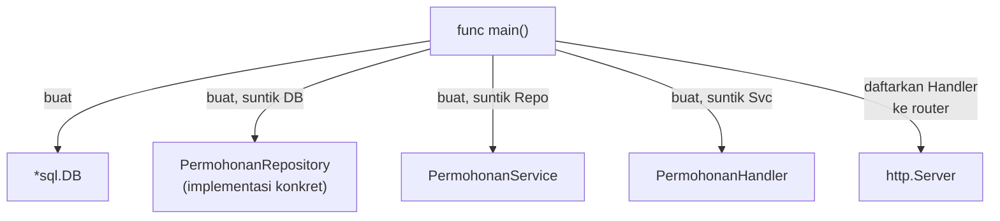

## TL;DR

Dependency injection terdengar seperti konsep besar yang butuh framework — di Go, ia biasanya berarti sesuatu yang jauh lebih sederhana: sebuah struct menerima dependency-nya (repository, service lain, koneksi database) sebagai parameter constructor, bukan membuatnya sendiri di dalam. Ini bukan pola eksotis; ini adalah konsekuensi langsung dari memakai interface (lihat [[../20 Go Language/Interfaces and Implicit Satisfaction|Interfaces and Implicit Satisfaction]]) sebagai tipe parameter. Go secara filosofis menghindari framework DI besar bergaya Spring (Java) atau Symfony (PHP) yang memakai reflection dan container magic — constructor biasa yang eksplisit dianggap lebih idiomatic, lebih mudah dilacak lewat "go to definition", dan tidak menyembunyikan bagaimana sebuah dependency benar-benar terhubung ke pemakainya.

## The Problem

Sebuah `PermohonanService` awalnya ditulis dengan membuat koneksi database-nya sendiri di dalam constructor: `func NewPermohonanService() *PermohonanService { db, _ := sql.Open(...); return &PermohonanService{db: db} }`. Ini bekerja untuk aplikasi kecil, tapi menulis unit test untuk `PermohonanService` menjadi mustahil dilakukan secara terisolasi — setiap test harus benar-benar menyalakan koneksi database sungguhan, karena tidak ada cara mengganti koneksi itu dengan sesuatu yang bisa dikontrol test (mock atau fake). Ketergantungan ke database "tertanam" di dalam struct, bukan diserahkan dari luar.

Masalah kedua muncul ketika sistem berkembang dan `PermohonanService` butuh memanggil `NotifikasiService` untuk mengirim email setiap kali status berubah. Kalau `NotifikasiService` juga membuat koneksi SMTP-nya sendiri di dalam constructor-nya, dan `PermohonanService` membuat instance `NotifikasiService` sendiri di dalamnya, seluruh graf dependency menjadi tertanam berlapis-lapis, tidak bisa diganti sebagian pun untuk keperluan testing — setiap test terhadap `PermohonanService` sekarang juga diam-diam membutuhkan server SMTP sungguhan berjalan, meski test itu sama sekali tidak sedang menguji fitur notifikasi.

## Intuition

Manual dependency injection seperti **membangun perkakas dari komponen yang dipasang dari luar**, bukan komponen yang dicor menyatu dengan bodinya. Bayangkan bor listrik yang mata bornya bisa dilepas-pasang (dependency diserahkan lewat constructor) dibanding bor yang mata bornya dicor menyatu permanen dengan motornya (dependency dibuat sendiri di dalam) — yang pertama memungkinkan mengganti mata bor sesuai kebutuhan (mock untuk testing, implementasi berbeda untuk environment berbeda) tanpa membongkar motornya sama sekali.

Analogi ini bocor pada satu hal: mata bor fisik yang dilepas-pasang tetap harus **kompatibel secara fisik** (ukuran chuck yang sama) untuk bisa dipasang. Di Go, kompatibilitas ini dijamin oleh interface — selama sebuah tipe memenuhi interface yang diharapkan (secara implisit, tanpa perlu deklarasi eksplisit "implements"), ia bisa "dipasang" sebagai dependency, meski ditulis di package yang sama sekali tidak tahu-menahu soal interface tersebut, sesuatu yang tidak punya analogi persis di dunia fisik.

## How It Works



Diagram ini menunjukkan **composition root** — satu tempat (biasanya `func main()` atau fungsi setup yang dipanggil darinya) di mana seluruh graf dependency dirangkai dari bawah ke atas: database dibuat lebih dulu, disuntikkan ke repository, repository disuntikkan ke service, service disuntikkan ke handler. Setiap komponen di tengah (`Repo`, `Svc`, `Handler`) tidak pernah tahu **bagaimana** dependency-nya dibuat — ia hanya tahu **interface** apa yang diterimanya sebagai parameter constructor.

Ini berbeda dari framework DI otomatis (Spring, NestJS) yang memakai reflection atau decorator untuk "menebak" cara merangkai graf dependency saat runtime — Go secara sengaja tidak punya mekanisme setara di stdlib, dan komunitas Go secara umum menganggap constructor eksplisit (yang bisa dilacak langsung lewat pembacaan kode, tanpa perlu menjalankan program untuk tahu apa yang terhubung ke apa) sebagai trade-off yang lebih baik dibanding "kenyamanan" container magic yang menyembunyikan alur perangkaian dependency.

## In Go

```go
package main

import (
	"context"
	"database/sql"
	"fmt"
	"net/http"
	"os"

	"example.com/app/handler"
	"example.com/app/repository"
	"example.com/app/service"
)

// setupAplikasi adalah composition root — SATU tempat di mana seluruh graf
// dependency dirangkai. Kalau kelak butuh mengganti implementasi repository
// (misalnya dari MySQL ke PostgreSQL), atau menambah dependency baru
// (NotifikasiService), perubahan hanya terjadi di sini, tidak menyebar ke
// setiap layer yang memakainya.
func setupAplikasi(db *sql.DB) *handler.PermohonanHandler {
	permohonanRepo := repository.NewPermohonanRepositorySQL(db)
	permohonanSvc := service.NewPermohonanService(permohonanRepo)
	permohonanHandler := handler.NewPermohonanHandler(permohonanSvc)
	return permohonanHandler
}

func main() {
	db, err := sql.Open("mysql", os.Getenv("DATABASE_URL"))
	if err != nil {
		fmt.Fprintf(os.Stderr, "gagal buka koneksi database: %v\n", err)
		os.Exit(1)
	}
	defer db.Close()

	permohonanHandler := setupAplikasi(db)

	mux := http.NewServeMux()
	mux.HandleFunc("POST /permohonan/{id}/setujui", permohonanHandler.Setujui)

	if err := http.ListenAndServe(":8080", mux); err != nil {
		fmt.Fprintf(os.Stderr, "server berhenti: %v\n", err)
		os.Exit(1)
	}
}
```

```go
package service_test

import (
	"context"
	"testing"

	"example.com/app/repository"
	"example.com/app/service"
)

// repositoryPalsu adalah implementasi PALSU dari interface
// repository.PermohonanRepository, dibuat KHUSUS untuk testing — tidak ada
// koneksi database sungguhan yang tersentuh sama sekali. Ini yang membuka
// kemungkinan testing terisolasi setelah dependency di-inject lewat
// constructor, bukan dibuat sendiri di dalam service.
type repositoryPalsu struct {
	permohonan repository.Permohonan
}

func (r *repositoryPalsu) AmbilByID(ctx context.Context, id int64) (repository.Permohonan, error) {
	return r.permohonan, nil
}

func (r *repositoryPalsu) UbahStatus(ctx context.Context, id int64, statusBaru string) error {
	r.permohonan.Status = statusBaru
	return nil
}

func TestPermohonanService_Setujui_GagalKalauStatusBukanMenunggu(t *testing.T) {
	repo := &repositoryPalsu{permohonan: repository.Permohonan{ID: 1, Status: "disetujui"}}
	svc := service.NewPermohonanService(repo)

	err := svc.Setujui(context.Background(), 1)

	if err == nil {
		t.Fatal("mengharapkan error karena status sudah disetujui, tapi tidak ada error")
	}
}
```

Test ini berjalan dalam hitungan milidetik, tanpa database sungguhan sama sekali — dimungkinkan murni karena `PermohonanService` menerima `PermohonanRepository` (interface) lewat constructor, bukan membuat koneksi database-nya sendiri di dalam.

## In His Stack

Yii2 punya container DI bawaan (`Yii::$container`) yang mendukung *auto-wiring* — secara otomatis menebak dependency apa yang harus disuntikkan berdasarkan type-hint di constructor, memakai reflection PHP di baliknya. Ini kontras filosofis yang tegas dengan pendekatan Go: Yii2 memilih kenyamanan (developer tidak perlu menulis composition root secara eksplisit) dengan menyembunyikan sebagian alur perangkaian di balik reflection, sementara Go secara sengaja memilih eksplisit (`setupAplikasi` di atas terlihat jelas apa yang terhubung ke apa hanya dengan membaca kode, tanpa perlu menjalankan program atau memahami mekanisme reflection). Memahami perbedaan filosofi ini penting saat berpindah konteks — mencoba membawa pola "auto-wiring implisit" ala Yii2 ke Go biasanya berarti menulis (atau mengimpor) container DI pihak ketiga yang justru bertentangan dengan idiom Go yang lebih disukai komunitasnya.

## Trade-offs and When Not To Use It

Untuk graf dependency yang sangat besar (puluhan service saling terhubung), composition root manual bisa menjadi panjang dan berulang — beberapa tim mengadopsi tool seperti `google/wire` (code generation, bukan reflection runtime) untuk menghasilkan composition root secara otomatis dari deklarasi dependency, mengurangi boilerplate tanpa mengorbankan sifat eksplisit dan bisa-dilacak dari pendekatan manual. Untuk aplikasi kecil sampai menengah (kebanyakan sistem yang dikelola sehari-hari), dependency injection manual tetap pilihan yang lebih sederhana untuk dipahami tim baru — tidak ada "magic" tambahan yang harus dipelajari di luar Go itu sendiri, dan kemampuan melacak "siapa memanggil siapa" murni lewat "go to definition" adalah nilai yang tidak boleh diremehkan untuk basis kode yang dikerjakan banyak developer dengan level pengalaman berbeda-beda, seperti pada tim dengan 10+ developer.

## Common Mistakes

> [!warning] Jebakan
> Membuat dependency (koneksi database, client HTTP ke partner eksternal) di dalam constructor struct itu sendiri, alih-alih menerimanya sebagai parameter — meniadakan kemungkinan mengganti dependency itu dengan mock saat testing.

> [!warning] Jebakan
> Menyuntikkan struct konkret (`*repository.PermohonanRepositorySQL`) sebagai tipe parameter constructor, alih-alih interface (`repository.PermohonanRepository`) — secara teknis tetap "menyuntikkan", tapi menutup kemungkinan mengganti implementasi untuk testing atau untuk kebutuhan environment berbeda.

> [!warning] Jebakan
> Menambahkan container DI pihak ketiga yang berat (dengan reflection dan konfigurasi tag khusus) untuk aplikasi kecil yang graf dependency-nya masih bisa dirangkai manual dalam belasan baris kode — menambah lapisan kompleksitas dan "magic" yang justru bertentangan dengan alasan sebagian besar tim memilih Go.

## Exercises

1. Jelaskan kenapa menyuntikkan interface (bukan struct konkret) sebagai parameter constructor penting untuk kemampuan testing.
2. Apa yang dimaksud "composition root", dan kenapa idealnya hanya ada di satu (atau sedikit) tempat dalam aplikasi?
3. Jelaskan perbedaan filosofis antara pendekatan DI manual di Go dan auto-wiring berbasis reflection seperti di Yii2 atau Spring.
4. Desain terbuka: `PermohonanService` sekarang butuh memanggil `NotifikasiService` (mengirim email) setiap kali status permohonan berubah jadi "disetujui", tapi tim ingin notifikasi ini bisa dinonaktifkan sepenuhnya di environment testing tanpa mengubah kode `PermohonanService` sama sekali. Rancang bagaimana `NotifikasiService` disuntikkan ke `PermohonanService`, dan bagaimana pola yang sama bisa dipakai untuk kebutuhan "matikan notifikasi di test" tanpa if/else berbasis environment di dalam `PermohonanService` itu sendiri.

> [!success]- Kunci jawaban
> **1.** Interface mendefinisikan **kontrak perilaku** tanpa mengikat pada satu implementasi tertentu — struct apa pun (implementasi sungguhan yang bicara ke database, atau implementasi palsu yang hanya mengembalikan data tetap) bisa dipasang sebagai pengganti selama sama-sama memenuhi interface itu. Menyuntikkan struct konkret langsung mengikat pemakainya pada satu implementasi spesifik, menutup kemungkinan menukarnya dengan versi palsu untuk testing tanpa mengubah tipe parameter constructor itu sendiri.
> **4.** Definisikan interface kecil, misalnya `Notifikator` dengan method `Kirim(ctx context.Context, userID int64, pesan string) error`, di package `service` (dekat dengan pemakainya, bukan di package notifikasi itu sendiri — konvensi Go yang umum). `PermohonanService` menerima `Notifikator` ini lewat constructor, persis seperti menerima `PermohonanRepository`. Implementasi sungguhan (`NotifikasiServiceEmail`) dipasang di composition root untuk environment production. Untuk testing, cukup buat implementasi palsu `notifikatorNoop` yang method `Kirim`-nya langsung `return nil` tanpa melakukan apa pun — disuntikkan sebagai pengganti di composition root khusus test (atau langsung di dalam test itu sendiri). `PermohonanService` tidak pernah tahu atau peduli apakah `Notifikator` yang diterimanya benar-benar mengirim email atau tidak melakukan apa-apa — tidak ada if/else berbasis environment yang perlu ditulis di dalam logika bisnisnya sama sekali.

## Self-Check

- Apa perbedaan menyuntikkan dependency lewat constructor dibanding membuatnya sendiri di dalam struct?
- Kenapa parameter constructor idealnya bertipe interface, bukan struct konkret?
- Apa itu composition root, dan di mana biasanya ia berada dalam aplikasi Go?
- Kenapa Go secara filosofis cenderung menghindari container DI otomatis berbasis reflection?

## Connected Notes

- [[Handler-Service-Repository Layering]] — pola constructor yang menyuntikkan repository ke service, dan service ke handler, adalah penerapan langsung dependency injection manual yang dibahas di note ini.
- [[../20 Go Language/Interfaces and Implicit Satisfaction|Interfaces and Implicit Satisfaction]] — dependency injection di Go seluruhnya bertumpu pada structural typing yang dijelaskan di note itu.
- [[../20 Go Language/Mocking Through Interfaces|Mocking Through Interfaces]] — kemampuan menyuntikkan mock sebagai pengganti dependency sungguhan adalah manfaat utama dari pola di note ini, dibahas lebih dalam soal teknik mocking-nya di note itu.
- [[../20 Go Language/The Go Type System|The Go Type System]] — structural typing yang mendasari seluruh mekanisme injection ini adalah bagian dari sistem tipe yang dijelaskan penuh di note itu.
- [[Hexagonal and Clean Architecture in Go]] — dependency injection manual adalah alat konkret yang membuat prinsip "dependency selalu mengarah ke dalam" pada arsitektur hexagonal/clean bisa diterapkan secara idiomatik di Go.

## Further Reading

- Dokumentasi package `google/wire` — alternatif code-generation untuk mengurangi boilerplate composition root pada graf dependency besar, tanpa reflection runtime.

## Catatan Saya

*Tulis di sini contoh service atau class di kerjaanmu yang saat ini membuat dependency-nya sendiri di dalam constructor, dan bagaimana kamu akan mengubahnya jadi disuntikkan dari luar.*
