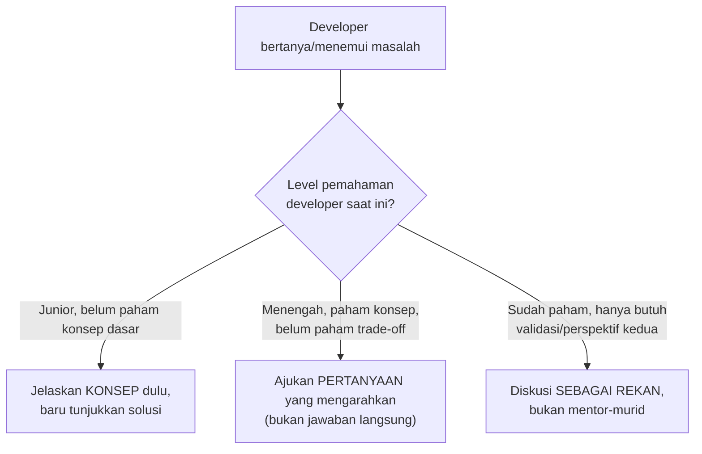

## TL;DR

Pengetahuan yang hanya ada di kepala satu orang senior — kenapa satu keputusan arsitektur diambil, bagaimana men-debug kelas masalah tertentu, pola mana yang sudah terbukti gagal sebelumnya — adalah **single point of failure** dalam bentuk manusia. Mentoring adalah proses sengaja memindahkan pengetahuan itu ke seluruh tim, bukan menunggu ia "menyebar sendiri" lewat kebetulan. Untuk koordinator teknis yang mengarahkan 10+ developer, mentoring bukan aktivitas sampingan yang dilakukan kalau sempat — ia adalah salah satu cara paling efektif melipatgandakan dampak, karena satu developer yang benar-benar dibimbing sampai mandiri bisa membimbing developer lain di masa depan, sementara satu developer yang hanya "diberi tahu jawabannya" setiap kali bertanya tidak pernah benar-benar tumbuh independen.

## The Problem

Seorang senior engineer yang menjadi satu-satunya orang yang benar-benar memahami arsitektur integrasi dengan salah satu instansi partner mengambil cuti panjang — selama ia tidak ada, tim lain yang perlu memperbaiki bug di integrasi itu kesulitan besar, karena pengetahuan tentang kenapa desain itu dibuat seperti itu, apa saja perilaku aneh partner yang sudah "diketahui" tapi tidak pernah didokumentasikan, hanya ada di kepala satu orang itu. Ini bukan kegagalan orang itu secara pribadi — ini kegagalan organisasi yang tidak pernah secara sengaja memastikan pengetahuan kritis itu dipindahkan ke lebih dari satu orang.

Masalah kedua yang lebih halus: seorang senior engineer sering menjawab pertanyaan junior dengan memberikan jawaban langsung ("ubah baris ini jadi begini") tanpa menjelaskan **kenapa** — cara ini menyelesaikan masalah immediate lebih cepat, tapi developer junior itu tidak pernah membangun pemahaman yang membuatnya bisa menyelesaikan masalah serupa secara mandiri di masa depan, dan akan kembali bertanya pertanyaan yang secara esensial sama berulang kali, menghabiskan waktu senior engineer yang seharusnya bisa dikurangi dengan investasi penjelasan yang lebih dalam sejak awal.

## Intuition

Bayangkan mentoring seperti **perbedaan antara memberi seseorang ikan dan mengajarinya memancing** — pepatah yang klise tapi tepat sasaran di sini. Memberi jawaban langsung ("ubah baris ini") adalah memberi ikan — menyelesaikan masalah hari ini, tapi orang itu akan lapar lagi besok dan kembali meminta ikan. Mengajarkan **cara berpikir** untuk sampai ke jawaban itu (kenapa baris itu salah, bagaimana proses debugging yang mengarah ke sana, pola apa yang bisa dikenali di masa depan) butuh waktu lebih lama sekarang, tapi menghasilkan seseorang yang bisa "memancing sendiri" untuk masalah serupa di masa depan, mengurangi ketergantungan jangka panjang pada mentor.

Analogi ini bocor pada satu hal: mengajarkan memancing adalah keterampilan yang relatif statis (teknik memancing tidak berubah drastis). Mentoring teknis harus terus beradaptasi dengan **konteks spesifik** orang yang dibimbing — developer junior yang baru belajar dasar butuh pendekatan berbeda dari developer menengah yang sudah paham dasar tapi butuh membangun judgment arsitektural; menyamakan pendekatan mentoring untuk semua orang di semua tahap sama tidak efektifnya dengan mengajarkan teknik memancing yang sama ke pemula dan nelayan berpengalaman.

## How It Works



**Teknik konkret yang sering lebih efektif dibanding memberi jawaban langsung**: bertanya "menurutmu kenapa ini terjadi?" sebelum menjelaskan, memaksa developer mencoba menganalisis dulu; pair programming untuk masalah kompleks (bukan sekadar menonton mentor menyelesaikannya); meminta developer menjelaskan kembali pemahamannya dengan kata-katanya sendiri setelah dijelaskan (teknik yang sama dengan filosofi "recall lebih baik dari re-reading" yang mendasari desain vault ini sendiri).

## Under The Hood

**Mentoring butuh investasi waktu di depan yang terasa lebih lambat, tapi lebih cepat secara agregat** — menjelaskan konsep secara mendalam untuk satu masalah butuh waktu lebih lama dibanding sekadar memberi jawaban, tapi mengurangi jumlah pertanyaan serupa di masa depan secara signifikan. Trade-off ini sering tidak terlihat dalam jangka pendek (tekanan deadline membuat "beri jawaban cepat" terasa lebih rasional), tapi terlihat jelas dalam jangka menengah-panjang — tim yang di-mentoring dengan baik menjadi semakin independen, sementara tim yang hanya diberi jawaban tetap bergantung penuh pada satu orang selamanya.

**Dokumentasi adalah bentuk mentoring skala besar** — pengetahuan yang dituliskan (seperti catatan "In His Stack" dan "Catatan Saya" di vault ini sendiri) bisa diakses banyak orang tanpa mentor harus mengulang penjelasan yang sama berkali-kali secara langsung; kombinasi mentoring langsung (untuk kasus yang butuh nuansa dan konteks spesifik) dan dokumentasi tertulis (untuk pengetahuan yang bisa distandarkan) memberi jangkauan yang lebih luas dibanding mengandalkan salah satunya saja.

## In Go

```go
// Contoh konkret: alih-alih menjawab langsung "tambahkan mutex di
// sini" ketika seorang junior bertanya kenapa ada race condition,
// mentoring yang baik menuntun mereka menemukan sendiri lewat
// pertanyaan dan alat yang tepat.

package counter

// Kode yang ditemukan junior punya race condition:
type Counter struct {
	nilai int
}

func (c *Counter) Tambah() {
	c.nilai++ // TIDAK aman untuk akses konkuren
}

// Pendekatan mentoring: alih-alih langsung bilang "tambahkan mutex",
// tanyakan: "coba jalankan `go test -race` pada kode ini — apa yang
// kamu lihat?" Biarkan mereka menemukan race detector MELAPORKAN
// masalahnya sendiri (lihat Race Conditions and the Race Detector),
// lalu tanyakan: "menurutmu kenapa ini terjadi? Apa yang terjadi kalau
// dua goroutine menjalankan baris c.nilai++ bersamaan?"
//
// Proses ini butuh waktu lebih lama dari sekadar bilang "tambahkan
// sync.Mutex", TAPI junior itu akan mengenali POLA ini sendiri di
// kode lain di masa depan, bukan sekadar menghafal "counter butuh
// mutex" tanpa paham kenapa.
```

## In His Stack

Untuk koordinator teknis 10+ developer lintas 13 aplikasi, mentoring yang efektif berarti **tidak** menjadi satu-satunya orang yang dipanggil setiap kali ada masalah kompleks di aplikasi mana pun — investasi membangun beberapa developer senior lain di setiap tim yang bisa menangani kelas masalah serupa secara independen adalah yang membuat 13 aplikasi bisa dikelola tanpa satu orang menjadi bottleneck tunggal. Ini juga relevan langsung dengan [[Managing Technical Debt Explicitly]] — technical debt yang paling berbahaya sering adalah "debt pengetahuan" (hanya satu orang yang paham suatu bagian sistem), yang harus secara sengaja dilunasi lewat mentoring dan dokumentasi, bukan dibiarkan menumpuk.

## Trade-offs and When Not To Use It

Mentoring yang terlalu intensif untuk **semua** hal (menjelaskan mendalam bahkan untuk masalah sederhana dan berulang yang jawabannya sudah jelas) memboroskan waktu senior engineer yang bisa dipakai untuk hal lain — untuk masalah yang benar-benar rutin dan tidak butuh pemahaman mendalam (kesalahan konfigurasi sederhana, typo), memberi jawaban langsung lebih efisien dan tidak mengorbankan pertumbuhan developer secara berarti. Mentoring paling bernilai justru untuk masalah yang **mengandung pola** yang akan berulang dalam bentuk berbeda di masa depan — investasi penjelasan mendalam di situ punya manfaat berlipat karena satu pemahaman bisa dipakai untuk banyak masalah serupa nanti.

## Common Mistakes

> [!warning] Jebakan
> Selalu memberi jawaban langsung tanpa menjelaskan alasan, bahkan untuk masalah yang mengandung pola penting yang akan berulang — developer tidak pernah membangun pemahaman independen, terus bergantung pada mentor untuk masalah serupa di masa depan.

> [!warning] Jebakan
> Menyamakan pendekatan mentoring untuk semua level developer — pendekatan yang tepat untuk junior (jelaskan konsep dasar) berbeda dari yang tepat untuk developer menengah (pertanyaan yang mengarahkan) atau senior (diskusi sebagai rekan sejawat).

> [!warning] Jebakan
> Membiarkan pengetahuan kritis tetap hanya ada di kepala satu orang tanpa upaya sengaja mendokumentasikan atau memindahkannya ke lebih dari satu orang — menciptakan single point of failure dalam bentuk manusia yang terasa baik-baik saja sampai orang itu tidak tersedia.

## Exercises

1. Jelaskan kenapa memberi jawaban langsung lebih cepat jangka pendek tapi bisa lebih lambat secara agregat dibanding mentoring yang menjelaskan konsep.
2. Kenapa pendekatan mentoring yang tepat berbeda untuk developer junior, menengah, dan senior?
3. Kenapa dokumentasi tertulis dianggap "bentuk mentoring skala besar"?
4. Desain terbuka: kamu satu-satunya orang di timmu yang benar-benar memahami detail integrasi dengan satu instansi partner yang perilakunya sering aneh dan tidak terdokumentasi resmi (workaround yang sudah ditemukan lewat trial-and-error selama bertahun-tahun). Rancang rencana memindahkan pengetahuan ini ke minimal satu developer lain dalam waktu tiga bulan, dengan mempertimbangkan bahwa kamu tetap punya pekerjaan lain yang perlu dikerjakan bersamaan.

> [!success]- Kunci jawaban
> **1.** Memberi jawaban langsung menyelesaikan masalah spesifik yang ada saat ini dengan cepat — tapi developer yang menerima jawaban itu tanpa memahami alasannya akan kembali dengan pertanyaan yang esensinya sama (variasi masalah yang sama) di masa depan, masing-masing butuh waktu mentor lagi. Menjelaskan konsep di baliknya butuh waktu lebih lama untuk **satu** kejadian pertama, tapi developer itu kemudian bisa menyelesaikan variasi masalah serupa secara mandiri — mengalikan investasi waktu awal itu ke banyak kejadian di masa depan yang tidak lagi membutuhkan waktu mentor sama sekali.
> **4.** Rencana bertahap: (1) bulan pertama — mulai **mendokumentasikan** workaround dan perilaku aneh partner yang sudah diketahui secara tertulis (bahkan draf kasar), sambil melibatkan satu developer yang dipilih untuk pair programming setiap kali masalah terkait partner ini muncul secara alami dalam pekerjaan rutin (tidak perlu sesi khusus terpisah yang menambah beban); (2) bulan kedua — mulai mendelegasikan tugas terkait integrasi ini ke developer yang sama, dengan kamu sebagai pendamping yang menjawab pertanyaan (bukan lagi mengerjakan sendiri) — pendekatan "kamu kerjakan, aku dampingi" alih-alih "aku kerjakan, kamu tonton"; (3) bulan ketiga — developer itu menangani masalah terkait integrasi ini secara independen, dengan kamu hanya dihubungi untuk kasus benar-benar baru yang belum pernah ditemui sebelumnya. Sepanjang proses, dokumentasi yang terus diperbarui (bukan ditulis sekali di awal lalu dilupakan) memastikan pengetahuan itu juga tersedia tertulis, bukan hanya berpindah ke satu kepala baru yang menciptakan single point of failure yang sama, hanya dengan orang berbeda.

## Self-Check

- Kenapa memberi jawaban langsung bisa lebih lambat secara agregat dibanding menjelaskan konsep?
- Kenapa pendekatan mentoring perlu berbeda untuk level developer berbeda?
- Kenapa dokumentasi tertulis dianggap bentuk mentoring skala besar?
- Kenapa pengetahuan kritis yang hanya ada di kepala satu orang adalah risiko organisasi?

## Connected Notes

- [[The RFC Process]] — dokumentasi keputusan lewat RFC yang diarsipkan adalah salah satu bentuk mentoring pasif yang menjangkau developer di masa depan.
- [[Managing Technical Debt Explicitly]] — "debt pengetahuan" (hanya satu orang paham suatu bagian sistem) adalah jenis technical debt yang dibahas lebih formal di note berikutnya.
- [[Choosing Which Technical Battles to Fight]] — mentoring yang baik termasuk membantu developer junior belajar kapan sebuah ketidaksepakatan teknis layak diperjuangkan, dibahas di note lain domain ini.
- [[../90 Architecture and Design/Git Workflow and Code Review|Git Workflow and Code Review]] — code review adalah salah satu jalur mentoring paling alami dan rutin yang sudah dibahas di note junior itu.
- [[../00 Start Here/How To Read This Vault|How To Read This Vault]] — filosofi "recall lebih baik dari re-reading" yang mendasari desain vault ini sendiri adalah prinsip yang sama dengan teknik mentoring "minta developer menjelaskan kembali dengan kata-katanya sendiri".

## Further Reading

- Materi umum tentang teknik mentoring teknis dan Socratic method dalam pengajaran, dipublikasikan luas di berbagai sumber engineering leadership (bukan rujukan satu sumber tunggal).

## Catatan Saya

*Tulis di sini pengetahuan kritis di kerjaanmu yang saat ini hanya ada di kepalamu sendiri — dan rencana konkret memindahkannya ke minimal satu orang lain.*
