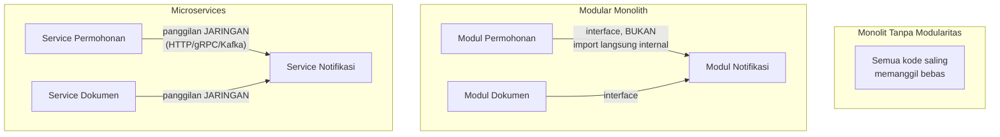

## TL;DR

**Microservices tidak mengurangi kompleksitas — ia memindahkannya dari dalam kode ke jaringan.** Ini adalah klaim yang harus dipahami secara harfiah, bukan slogan: kompleksitas yang tadinya berupa pemanggilan fungsi dalam satu proses (cepat, reliable, mudah di-debug dengan stack trace) berubah menjadi panggilan jaringan (lambat secara relatif, bisa gagal karena banyak alasan yang tidak pernah ada dalam satu proses, sulit di-debug lintas beberapa layanan). Modular monolith adalah titik tengah yang sering diabaikan: satu proses yang **di-deploy sebagai satu unit**, tapi disiplin secara internal menjaga batas modul yang jelas (mirip batas yang akan dipakai kalau nanti dipecah jadi microservices) — mendapatkan sebagian besar manfaat organisasi microservices (batas tanggung jawab yang jelas) tanpa membayar biaya operasional penuh (deployment terpisah, jaringan, observability lintas layanan) di awal.

## The Problem

Sebuah tim, terinspirasi tren industri, memutuskan memecah aplikasi monolitik menjadi belasan microservices sejak awal proyek — sebelum benar-benar memahami di mana batas domain yang tepat, dan sebelum tim punya kematangan operasional (observability lintas layanan, distributed tracing, strategi retry/circuit breaker) untuk menangani kompleksitas tambahan yang datang bersamanya. Hasilnya: setiap perubahan fitur kecil yang sebenarnya menyentuh dua "domain" berbeda (yang batasnya salah ditarik sejak awal) memerlukan koordinasi deployment dua atau tiga service sekaligus, memperlambat kecepatan pengembangan yang justru diharapkan meningkat dengan microservices. Latency yang tadinya nol (pemanggilan fungsi dalam satu proses) sekarang menjadi panggilan jaringan berkali-kali untuk satu operasi bisnis, dan debugging satu bug butuh menelusuri log di lima layanan berbeda alih-alih satu stack trace.

Masalah kedua yang sebaliknya: sebuah tim mempertahankan monolit besar tanpa disiplin modularitas internal apa pun — setiap bagian kode bisa memanggil bagian lain secara bebas tanpa batas jelas, sampai titik di mana **tidak ada** yang benar-benar memahami seluruh basis kode, dan perubahan di satu bagian sering merusak bagian lain yang tidak terduga karena ketergantungan implisit yang tidak pernah didokumentasikan atau ditegakkan. Monolit yang "big ball of mud" seperti ini sama bermasalahnya dengan microservices yang dipecah terlalu dini — keduanya adalah kegagalan mengelola kompleksitas, hanya dengan gejala yang berbeda.

## Intuition

Bayangkan monolit tanpa modularitas seperti **rumah tanpa sekat ruangan** — semua orang di rumah itu bisa masuk ke mana saja, mengubah apa saja, tanpa batas jelas siapa bertanggung jawab atas ruangan mana. Microservices seperti **memecah rumah jadi beberapa bangunan terpisah di lokasi berbeda** — setiap bangunan punya penghuni dan tanggung jawabnya sendiri yang jelas, tapi sekarang untuk berbagi apa pun antar bangunan, penghuninya harus keluar rumah, berjalan (kadang jauh), dan mengetuk pintu (panggilan jaringan) — proses yang jauh lebih lambat dan bisa gagal (hujan, pintu terkunci, penghuni sedang tidak ada) dibanding sekadar berjalan dari satu ruangan ke ruangan lain dalam rumah yang sama.

Modular monolith seperti **rumah yang sama, tapi dengan sekat ruangan yang jelas dan pintu yang harus diketuk** (interface antar modul) meski masih dalam satu bangunan — kamu tetap bisa berpindah ruangan dengan cepat (pemanggilan fungsi dalam proses, bukan jaringan), tapi setiap ruangan tetap punya penghuni yang jelas dan aturan siapa boleh masuk lewat pintu mana, bukan bebas keluar-masuk tanpa batas.

Analogi ini bocor pada satu hal: bangunan terpisah secara fisik memaksa jarak yang jelas terlihat. Batas modul dalam satu proses (modular monolith) **tidak dipaksakan secara fisik** — ia hanya ditegakkan lewat disiplin kode (interface, package boundary, aturan import) yang bisa dilanggar kalau tim tidak disiplin, sesuatu yang tidak mungkin terjadi pada microservices yang benar-benar terpisah proses dan jaringannya.

## How It Works



Diagram ini menunjukkan spektrum dari tanpa batas (monolit big ball of mud) sampai batas yang benar-benar terpisah fisik (microservices), dengan modular monolith sebagai titik tengah: batas yang sama tegasnya secara **logis** dengan microservices (modul hanya berkomunikasi lewat interface, tidak mengakses internal modul lain secara langsung), tapi tanpa biaya jaringan karena semuanya tetap satu proses yang di-deploy bersama.

**Sinyal yang menunjukkan siap memecah modular monolith menjadi microservices sungguhan**: satu modul butuh **skala** yang jauh berbeda dari modul lain (misalnya modul pemrosesan gambar yang CPU-intensive, sementara modul lain ringan I/O saja); tim yang mengerjakan modul berbeda sudah cukup besar untuk butuh **deployment independen** (tim A tidak ingin menunggu tim B selesai testing sebelum bisa deploy perubahannya sendiri); atau modul butuh **teknologi berbeda** yang tidak bisa dipenuhi dalam satu runtime yang sama. Tanpa sinyal konkret ini, memecah menjadi microservices adalah biaya operasional tambahan tanpa manfaat yang sepadan.

## Under The Hood

**Menegakkan batas modul dalam monolit** butuh disiplin yang eksplisit di Go — memakai package yang terpisah dengan jelas, dan **tidak** mengekspor struct/field internal yang seharusnya hanya diakses lewat interface publik modul itu (mirip prinsip [[../20 Go Language/Designing Stable Library APIs|desain API stabil]], hanya diterapkan secara internal antar modul dalam satu basis kode, bukan untuk pemakai eksternal). Beberapa tim menambah tooling linting kustom yang menolak import langsung ke sub-package internal modul lain, menegakkan batas ini secara otomatis di CI, bukan hanya mengandalkan disiplin manual developer.

**Migrasi dari modular monolith ke microservices** menjadi jauh lebih mudah justru **karena** batas modul sudah jelas sejak awal — modul yang siap dipisah biasanya sudah berkomunikasi lewat interface yang terdefinisi baik, tinggal mengganti implementasi pemanggilan interface itu dari "pemanggilan fungsi langsung" menjadi "panggilan jaringan ke service terpisah" (pola yang dikenal sebagai *strangler fig*, dibahas lebih dalam di `60 Distributed Systems`, level senior) — jauh lebih terkendali dibanding memecah monolit tanpa batas modul yang jelas, di mana menentukan **di mana** harus dipotong menjadi tantangan besar tersendiri.

## In Go

```go
// Struktur folder modular monolith - batas modul ditegakkan lewat
// package Go, TIDAK ada import langsung ke sub-package internal modul lain.

// module/permohonan/service.go
package permohonan

import "context"

// PublicAPI adalah SATU-SATUNYA cara modul lain berinteraksi dengan
// modul permohonan — modul lain TIDAK BOLEH mengimpor
// "module/permohonan/internal" secara langsung.
type PublicAPI interface {
	Setujui(ctx context.Context, id int64) error
}

// module/permohonan/internal/repository.go — hanya dipakai INTERNAL
// modul permohonan sendiri, tidak pernah diimpor modul lain.
package internal

type Repository struct{}
```

```go
// module/notifikasi/service.go
package notifikasi

import (
	"context"

	"example.com/app/module/permohonan" // HANYA import PublicAPI, bukan internal
)

type Service struct {
	permohonanAPI permohonan.PublicAPI
}

// KirimNotifikasiPersetujuan memanggil modul permohonan HANYA lewat
// interface publiknya — batas ini yang membuat modul ini SIAP dipecah
// jadi service terpisah nanti, tinggal ganti implementasi pemanggilan
// ini dari fungsi langsung jadi panggilan jaringan.
func (s *Service) KirimNotifikasiPersetujuan(ctx context.Context, id int64) error {
	if err := s.permohonanAPI.Setujui(ctx, id); err != nil {
		return err
	}
	// ... kirim notifikasi ...
	return nil
}
```

## In His Stack

Untuk 13 aplikasi yang dikelola tim berbeda-beda, modular monolith adalah titik awal yang jauh lebih realistis dibanding microservices penuh sejak hari pertama — terutama kalau kematangan operasional (observability terpusat, strategi deployment lintas layanan, budaya on-call untuk banyak service) belum sepenuhnya matang. Migrasi ke Go dari Yii2 monolitik adalah kesempatan menegakkan batas modul yang lebih jelas sejak awal (yang mungkin tidak ada di kode PHP lama), tanpa harus melompat langsung ke kompleksitas operasional penuh microservices sebelum benar-benar dibutuhkan berdasarkan sinyal konkret (skala, ukuran tim, kebutuhan teknologi berbeda).

## Trade-offs and When Not To Use It

Modular monolith tetap punya keterbatasan yang tidak dimiliki microservices sungguhan: seluruh modul di-deploy **bersamaan** sebagai satu unit — bug fatal di satu modul (memori habis, panic yang tidak ter-recover) bisa menjatuhkan **seluruh** aplikasi, termasuk modul lain yang sebenarnya sehat, sesuatu yang tidak terjadi kalau modul-modul itu benar-benar terpisah proses. Skalabilitas juga terikat bersama — kalau satu modul butuh lebih banyak resource (CPU untuk modul yang berat komputasi) sementara modul lain ringan, modular monolith memaksa menskalakan **seluruh** aplikasi bersamaan, tidak bisa menskalakan satu modul secara independen seperti microservices. Microservices sungguhan tetap pilihan yang tepat begitu sinyal konkret (skala berbeda signifikan, tim yang benar-benar butuh deployment independen) sudah ada — modular monolith adalah titik awal yang baik, bukan tujuan akhir yang harus dipertahankan selamanya kalau kebutuhan nyata sudah melampauinya.

## Common Mistakes

> [!warning] Jebakan
> Memecah aplikasi menjadi microservices sejak awal proyek tanpa sinyal konkret (skala berbeda, tim besar yang butuh deployment independen) — membayar biaya operasional penuh (jaringan, observability lintas layanan, deployment terkoordinasi) tanpa manfaat yang sepadan pada tahap itu.

> [!warning] Jebakan
> Mempertahankan monolit tanpa disiplin modularitas internal apa pun ("big ball of mud") — kompleksitas ketergantungan implisit yang tidak terkendali membuat basis kode semakin sulit dipahami dan diubah seiring waktu, tanpa manfaat kesederhanaan monolit yang seharusnya didapat.

> [!warning] Jebakan
> Mengizinkan satu modul mengimpor package internal modul lain secara langsung (melewati interface publik) "demi kepraktisan sesaat" — melanggar batas modul yang seharusnya dijaga, membuat modul itu tidak lagi bisa dipisah dengan mudah di kemudian hari.

## Exercises

1. Jelaskan kenapa "microservices tidak mengurangi kompleksitas, ia memindahkannya" adalah klaim yang harus dipahami secara harfiah.
2. Apa perbedaan modular monolith dan monolit "big ball of mud" tanpa disiplin modularitas?
3. Sebutkan tiga sinyal konkret yang menunjukkan siap memecah modular monolith menjadi microservices sungguhan.
4. Desain terbuka: sistemmu saat ini adalah modular monolith dengan modul permohonan, dokumen, dan notifikasi. Modul dokumen tiba-tiba butuh memproses OCR (optical character recognition) yang sangat CPU-intensive dan perlu diskalakan jauh lebih agresif dibanding modul lain saat volume upload tinggi. Jelaskan sinyal apa dari skenario ini yang mendukung memisahkan modul dokumen menjadi service terpisah, dan bagaimana batas modul yang sudah ada (interface publik) memudahkan migrasi ini.

> [!success]- Kunci jawaban
> **1.** Kompleksitas yang ada dalam sistem apa pun (mengoordinasikan operasi bisnis lintas beberapa bagian logika) tidak hilang begitu saja saat dipecah jadi microservices — kompleksitas itu tetap ada, hanya **bentuknya berubah**: dari pemanggilan fungsi dalam proses (yang selalu berhasil kecuali ada bug, dan bisa di-debug lewat satu stack trace) menjadi panggilan jaringan (yang bisa gagal karena timeout, partition, versi API yang tidak cocok, dan butuh di-debug lintas beberapa layanan dengan distributed tracing). Total kompleksitas yang harus dikelola tim seringkali **bertambah** (karena sekarang harus menangani kegagalan jaringan yang sebelumnya tidak ada), bukan berkurang — ia hanya berpindah lokasi dari dalam kode ke antar layanan.
> **4.** Sinyal yang mendukung pemisahan: kebutuhan **skala berbeda signifikan** — modul dokumen (dengan OCR) butuh diskalakan jauh lebih agresif dan independen dari modul lain saat volume tinggi, sementara menskalakan seluruh modular monolith bersamaan (termasuk modul permohonan dan notifikasi yang tidak butuh skala setinggi itu) memboroskan resource. Karena modul dokumen sudah mengekspos **interface publik** yang dipakai modul lain (bukan diakses lewat internal package langsung), migrasi berarti: (1) buat service terpisah yang menjalankan logika modul dokumen (termasuk OCR) yang sebelumnya ada dalam proses monolit; (2) ganti implementasi yang memenuhi interface publik modul dokumen dari "pemanggilan fungsi langsung dalam proses" menjadi "client yang memanggil service dokumen lewat jaringan (HTTP/gRPC)"; (3) modul lain (permohonan, notifikasi) yang sebelumnya memanggil `dokumen.PublicAPI` **tidak perlu diubah kodenya sama sekali** — mereka tetap memanggil interface yang sama, hanya implementasi di baliknya yang berubah dari lokal menjadi jarak jauh. Ini persis manfaat yang dijanjikan modular monolith yang disiplin: batas yang sudah jelas membuat migrasi menjadi soal mengganti implementasi, bukan menulis ulang seluruh interaksi antar modul dari nol.

## Self-Check

- Kenapa microservices dikatakan memindahkan kompleksitas, bukan menguranginya?
- Apa perbedaan modular monolith dan monolit tanpa disiplin modularitas?
- Sebutkan tiga sinyal konkret siap memecah modular monolith jadi microservices.
- Kenapa batas modul yang jelas memudahkan migrasi ke microservices di kemudian hari?

## Connected Notes

- [[Lightweight DDD]] — bounded context yang dibahas di note itu sering menjadi dasar menentukan batas modul dalam modular monolith.
- [[Defining Service Boundaries]] — kelanjutan langsung: prinsip menentukan batas yang baik, berlaku baik untuk modul dalam monolit maupun service terpisah, dibahas di note berikutnya.
- [[Hexagonal and Clean Architecture in Go]] — interface publik antar modul dalam modular monolith adalah penerapan langsung prinsip port-adapter pada skala antar-modul, bukan hanya dalam satu modul.
- [[../20 Go Language/Designing Stable Library APIs|Designing Stable Library APIs]] — disiplin merancang permukaan API kecil dan stabil yang dibahas di note itu berlaku sama persis untuk interface publik antar modul internal.
- [[../60 Distributed Systems/The Strangler Fig Pattern|The Strangler Fig Pattern]] — pola migrasi bertahap dari monolit ke microservices yang disinggung sekilas di note ini, dibahas mendalam di level senior.

## Further Reading

- Simon Brown, konsep "Modular Monolith" (banyak dipublikasikan lewat talk dan artikel yang populer di komunitas arsitektur software) — rujukan konseptual populer untuk pola ini, tanpa satu sumber tunggal definitif.

## Catatan Saya

*Tulis di sini apakah salah satu dari 13 aplikasi kerjaanmu punya batas modul internal yang jelas, atau lebih mendekati "big ball of mud" — dan bagian mana yang paling butuh disiplin batas lebih jelas.*
