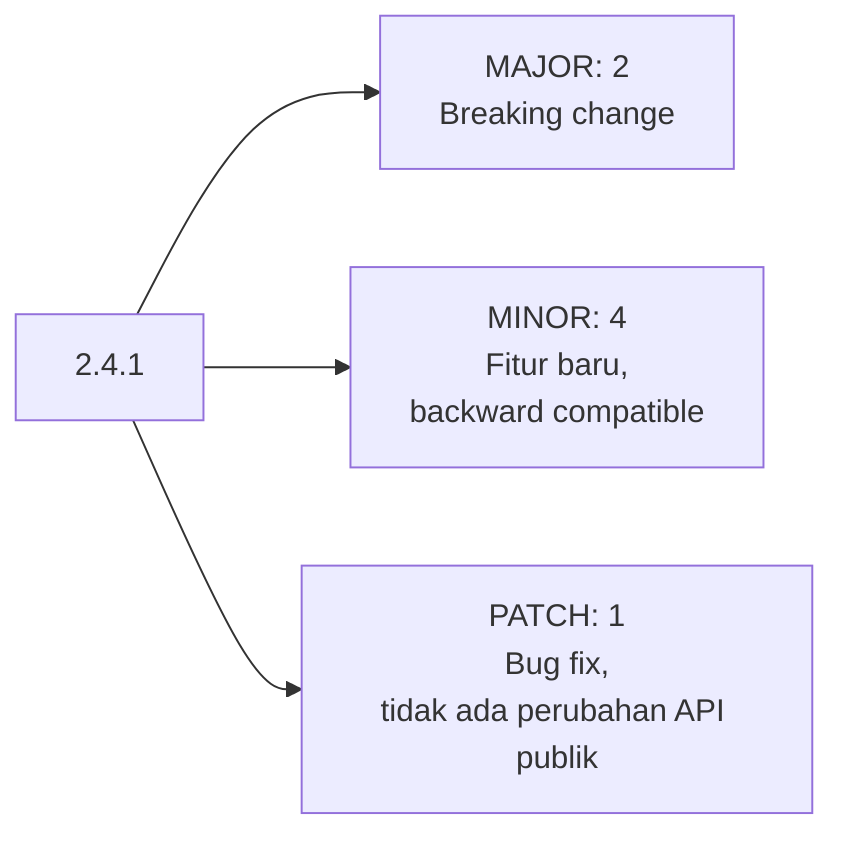

## TL;DR

Semantic versioning (semver) adalah konvensi penomoran versi `MAJOR.MINOR.PATCH` (misalnya `2.4.1`) yang mengomunikasikan **jenis perubahan** lewat angka itu sendiri, bukan lewat kejutan yang baru diketahui setelah upgrade: `PATCH` naik untuk perbaikan bug yang tidak mengubah perilaku publik, `MINOR` naik untuk penambahan fitur yang tetap kompatibel mundur (backward compatible), dan `MAJOR` naik untuk breaking change yang memaksa pemakainya menyesuaikan kode mereka. Nilainya bukan sekadar kerapian administratif — ia adalah kontrak kepercayaan antara penerbit module/API dan pemakainya: pemakai yang melihat `MINOR` naik tahu ia bisa upgrade tanpa membaca changelog detail, sementara `MAJOR` yang naik adalah sinyal eksplisit "berhenti dan baca dulu apa yang berubah".

## The Problem

Sebuah module internal `common-lib` yang dipakai lima aplikasi berbeda merilis perubahan yang menghapus satu method dari struct publik, tapi tetap menaikkan versi dari `1.4.2` ke `1.4.3` — angka yang menurut konvensi tim seharusnya berarti "perbaikan kecil, aman untuk upgrade otomatis". Tiga dari lima aplikasi yang memakai upgrade otomatis (karena mempercayai konvensi versi yang biasanya diikuti) langsung gagal build begitu pipeline CI mereka mengambil versi terbaru, karena method yang dihapus ternyata masih dipakai di kode mereka. Kegagalan ini terjadi bukan karena perubahannya salah secara teknis — tapi karena nomor versi yang dipilih **berbohong** tentang jenis perubahan yang sebenarnya terjadi, meruntuhkan kepercayaan seluruh tim terhadap nomor versi module itu untuk waktu yang lama setelahnya.

Masalah kedua: sebuah API publik yang dikonsumsi partner eksternal mengubah format response (menambah field bersarang baru yang mengubah struktur JSON) tanpa menaikkan versi mayor API sama sekali, dengan asumsi "kan cuma menambah field, tidak menghapus apa pun". Beberapa integrator partner yang parsing response dengan cara yang rapuh (misalnya mengasumsikan urutan field tertentu, atau library parsing lama yang tidak toleran terhadap struktur tak terduga) mengalami kegagalan produksi tanpa peringatan apa pun — ini mengingatkan bahwa "backward compatible" harus dinilai dari sudut pandang realistis pemakai yang beragam, bukan hanya dari sudut pandang penerbit yang tahu persis apa yang berubah.

## Intuition

Semantic versioning seperti **label peringatan pada obat** — tiga angka itu setara dengan tiga tingkat peringatan berbeda: "aman diminum tanpa perlu baca apa-apa lagi" (PATCH), "baca dulu dosis barunya, tapi tetap obat yang sama" (MINOR), "ini formulasi berbeda, konsultasikan ulang dengan dokter sebelum pakai" (MAJOR). Sistem label ini hanya berguna kalau **setiap orang mempercayai konvensinya** — begitu satu produsen memberi label "aman" pada sesuatu yang sebenarnya formulasinya berubah total, seluruh sistem kepercayaan terhadap label itu runtuh, dan orang mulai membaca komposisi lengkap setiap kali, meniadakan seluruh manfaat sistem label itu sendiri.

Analogi ini bocor pada satu hal: label obat diperiksa oleh badan regulasi independen sebelum diedarkan. Nomor versi semver **tidak** diverifikasi otomatis oleh siapa pun — sepenuhnya bergantung pada kejujuran dan kedisiplinan penerbitnya menilai sendiri jenis perubahan yang ia buat, yang berarti disiplin tim (dan, untuk module Go, tooling seperti pemeriksa kompatibilitas API) menjadi satu-satunya penjaga kebenaran label itu.

## How It Works



Aturan intinya: kalau kode yang sebelumnya bekerja dengan versi lama **berhenti** bekerja (tanpa perubahan apa pun di sisi pemakai) setelah upgrade, itu adalah breaking change, dan `MAJOR` **harus** naik — tidak peduli seberapa kecil perubahan itu terasa dari sudut pandang penerbit. Menghapus field dari struct publik, mengubah signature function publik, mengubah tipe data field JSON yang sudah ada — semuanya breaking change. Menambah method baru, menambah field opsional baru — biasanya aman sebagai `MINOR`, selama kode lama tetap bisa dikompilasi dan berjalan tanpa perubahan.

Go punya aturan tambahan yang spesifik dan sering mengejutkan pendatang baru: **semantic import versioning** — begitu sebuah module mencapai `v2` atau lebih tinggi, **path import itu sendiri harus berubah** (`example.com/mymodule/v2`, bukan hanya `example.com/mymodule`). Ini memastikan sebuah program bisa memakai `v1` dan `v2` dari module yang sama secara bersamaan tanpa konflik, karena keduanya dianggap Go sebagai package yang berbeda secara path — konsekuensi langsung dari filosofi Go bahwa breaking change harus terlihat eksplisit bahkan di level import path, bukan tersembunyi di balik nomor versi yang mudah diabaikan.

## In Go

```go
// go.mod untuk module yang MASIH v0 atau v1 — path import biasa
module example.com/common-lib

go 1.22
```

```go
// go.mod untuk module yang SUDAH v2 — perhatikan suffix /v2 wajib ada
module example.com/common-lib/v2

go 1.22
```

```go
package main

// Import path v2 HARUS menyertakan suffix /v2 secara eksplisit — ini bukan
// pilihan gaya, tapi aturan tooling Go module yang memaksa breaking change
// v2 ke atas terlihat jelas di setiap tempat yang mengimpornya.
import (
	commonlibv2 "example.com/common-lib/v2/logging"
)

func main() {
	commonlibv2.Log("aplikasi dimulai")
}
```

```go
package logging

// CATATAN SEMVER: menghapus atau mengubah signature function berikut
// adalah BREAKING CHANGE — wajib menaikkan MAJOR version dan mengubah
// import path ke /v3 kalau memang harus dilakukan. Menambah parameter baru
// dengan functional options (lihat domain intermediate) adalah cara umum
// menambah kemampuan tanpa memaksa breaking change.
func Log(pesan string) {
	// implementasi logging
}
```

## In His Stack

Yii2 sendiri, sebagai framework, mengikuti semantic versioning untuk rilisnya — inilah kenapa upgrade dari `2.0.44` ke `2.0.45` biasanya aman dilakukan tanpa membaca changelog detail, sementara upgrade dari Yii1 ke Yii2 (`MAJOR` berbeda) adalah migrasi besar yang butuh usaha signifikan, persis sesuai konvensi yang dijanjikan nomor versinya. Untuk 13 aplikasi pemerintah yang mungkin saling berbagi library internal (baik di PHP maupun Go), menegakkan semver secara disiplin di seluruh library bersama itu jauh lebih kritis dibanding di aplikasi tunggal — satu library yang dipakai lima aplikasi dan "berbohong" soal versi breaking change-nya bisa menyebabkan kegagalan berantai di banyak aplikasi sekaligus, seperti pada skenario "The Problem" pertama.

## Trade-offs and When Not To Use It

Semantic versioning mengasumsikan API publik yang jelas batasnya — untuk kode aplikasi internal yang tidak pernah diimpor sebagai dependency oleh kode lain (misalnya `main package` sebuah service, bukan library), semver kurang relevan; versi rilis service semacam itu biasanya lebih baik mengikuti skema lain seperti tanggal rilis atau nomor build berurutan, karena konsep "breaking change untuk API publik" tidak benar-benar berlaku pada sesuatu yang tidak diimpor siapa pun. Semver juga menuntut kedisiplinan yang harus dijaga terus-menerus — tim yang tidak konsisten menilai jenis perubahannya (seperti pada skenario "The Problem") akhirnya membuat nomor versi kehilangan makna sepenuhnya, di titik mana pemakai terpaksa kembali membaca changelog detail setiap saat, meniadakan seluruh manfaat konvensi ini.

## Common Mistakes

> [!warning] Jebakan
> Menaikkan `PATCH` atau `MINOR` untuk perubahan yang sebenarnya breaking (menghapus field, mengubah signature function publik) — meruntuhkan kepercayaan pemakai terhadap nomor versi, karena mereka mengasumsikan aman upgrade berdasarkan konvensi yang ternyata tidak dipatuhi.

> [!warning] Jebakan
> Lupa mengubah import path (`/v2`, `/v3`, dst.) saat menaikkan MAJOR version module Go — ini bukan detail kosmetik, tapi aturan wajib tooling Go module untuk memastikan versi lama dan baru bisa hidup berdampingan tanpa konflik.

> [!warning] Jebakan
> Menganggap "hanya menambah field baru" pada response API selalu aman tanpa breaking change, tanpa mempertimbangkan bahwa sebagian integrator/parser di sisi pemakai mungkin ditulis dengan cara yang rapuh terhadap struktur baru yang tidak terduga — "backward compatible" harus dinilai realistis dari sudut pandang keberagaman pemakai, bukan hanya dari sudut pandang penerbit.

## Exercises

1. Jelaskan kenapa menghapus satu field dari struct publik adalah breaking change, meski perubahan itu terasa "kecil" dari sisi penerbit.
2. Apa itu semantic import versioning di Go, dan kenapa Go mewajibkan perubahan import path untuk `v2` ke atas, tidak seperti kebanyakan bahasa lain?
3. Kenapa nomor versi yang "berbohong" soal jenis perubahannya lebih merusak dibanding tidak memakai semver sama sekali?
4. Desain terbuka: kamu mengelola `common-lib` yang dipakai lima aplikasi pemerintah berbeda, dan perlu mengubah signature satu function penting karena ditemukan bug desain yang butuh parameter tambahan wajib. Rancang strategi merilis perubahan ini yang meminimalkan gangguan ke lima aplikasi tersebut, dengan mempertimbangkan bahwa mereka mungkin tidak bisa semuanya upgrade serentak di hari yang sama.

> [!success]- Kunci jawaban
> **1.** Kontrak semver menjamin bahwa kode pemakai yang sudah bekerja dengan versi lama tetap bekerja tanpa perubahan setelah upgrade MINOR/PATCH. Menghapus field publik berarti kode pemakai mana pun yang mengakses field itu (kompilasi Go akan gagal, atau runtime error di bahasa yang lebih dinamis) langsung rusak — terlepas dari seberapa "kecil" perubahan itu secara baris kode, dampaknya terhadap pemakai persis sama seperti breaking change besar lainnya, sehingga harus diberi label yang sama (MAJOR).
> **4.** Strategi yang meminimalkan gangguan: (1) rilis versi baru dengan signature yang diubah sebagai MAJOR version baru (`v2`) dengan import path baru (`/v2`) — versi lama (`v1`) tetap ada dan bisa terus dipakai aplikasi yang belum siap migrasi, karena Go module mendukung keduanya hidup berdampingan tanpa konflik; (2) sertakan changelog dan panduan migrasi eksplisit yang menjelaskan parameter baru dan alasannya; (3) migrasi lima aplikasi dilakukan bertahap sesuai kesiapan masing-masing tim, bukan dipaksa serentak — karena `v1` tetap dipertahankan (bahkan hanya menerima bug fix kritis, tanpa fitur baru) selama periode transisi yang disepakati; (4) setelah seluruh lima aplikasi berhasil migrasi ke `v2`, `v1` bisa mulai proses deprecation resmi dengan tenggat waktu yang dikomunikasikan jauh-jauh hari, bukan dihentikan mendadak.

## Self-Check

- Kapan MAJOR, MINOR, dan PATCH masing-masing seharusnya dinaikkan?
- Apa itu semantic import versioning, dan kenapa itu spesifik relevan di Go?
- Kenapa nomor versi yang tidak konsisten dengan jenis perubahan sebenarnya lebih merusak kepercayaan dibanding tidak memakai semver sama sekali?
- Kapan semver menjadi kurang relevan untuk sebuah kode/aplikasi?

## Connected Notes

- [[../20 Go Language/Packages and Modules|Packages and Modules]] — semantic import versioning adalah aturan konkret dari sistem module Go yang dijelaskan penuh di note itu.
- [[Git Workflow and Code Review]] — commit message dan tag rilis yang konsisten sering menjadi input otomatis untuk menentukan kenaikan versi berikutnya.
- [[../30 APIs and Web/API Versioning|API Versioning]] — semantic versioning adalah salah satu skema penomoran yang bisa dipakai untuk strategi versioning API yang dibahas lebih luas di note itu.
- [[Hexagonal and Clean Architecture in Go]] — batas API publik yang jelas (port dan adapter) mempermudah menilai perubahan mana yang benar-benar breaking terhadap kontrak publik.
- [[Managing Technical Debt Explicitly]] — mempertahankan versi lama (`v1`) selama migrasi bertahap adalah bentuk technical debt yang sengaja dan dicatat, bukan diabaikan.

## Further Reading

- semver.org — spesifikasi resmi Semantic Versioning 2.0.0.
- Dokumentasi resmi Go mengenai "Go Modules: v2 and beyond".

## Catatan Saya

*Tulis di sini apakah library internal atau API di kerjaanmu sudah konsisten memakai semantic versioning, dan pernahkah ada insiden akibat versi yang "berbohong" soal jenis perubahannya.*
