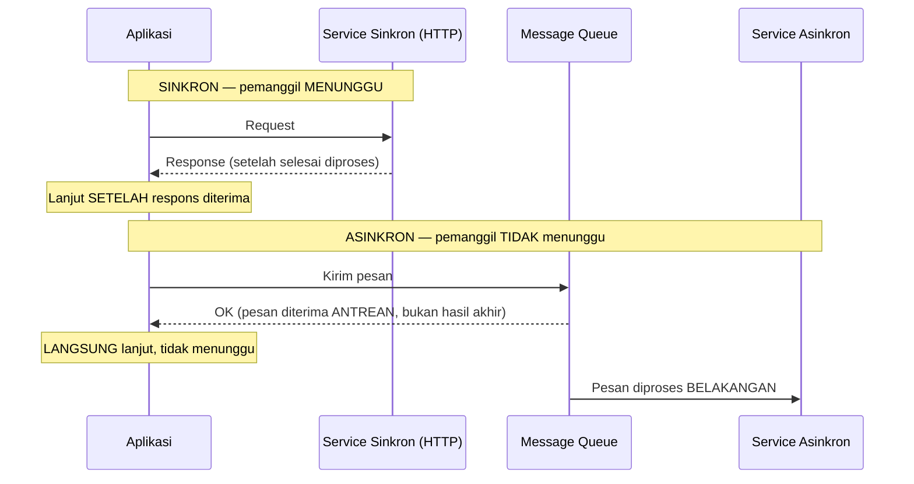

## TL;DR

Begitu [[Defining Service Boundaries|batas service]] ditentukan, keputusan berikutnya adalah bagaimana mereka saling bicara. **Sinkron** (biasanya HTTP/gRPC): pemanggil **menunggu** respons sebelum melanjutkan — sederhana untuk dipahami dan di-debug, tapi menciptakan **coupling waktu** (pemanggil dan yang dipanggil harus sama-sama hidup dan responsif pada saat yang sama) dan **coupling kegagalan** (kalau yang dipanggil lambat/down, pemanggil ikut tertahan atau gagal). **Asinkron** (biasanya lewat message queue/log seperti Kafka): pemanggil mengirim pesan dan **langsung melanjutkan** tanpa menunggu — melepas kedua jenis coupling itu, dengan harga kompleksitas yang signifikan lebih tinggi (harus menangani pesan yang diproses belakangan, kemungkinan gagal terpisah dari pengirim, dan konsistensi yang tertunda/eventual).

## The Problem

Sebuah endpoint "submit permohonan" secara sinkron memanggil tiga service lain secara berurutan sebagai bagian dari satu request HTTP: validasi dokumen, cek kuota, kirim notifikasi — kalau service notifikasi (yang sebenarnya tidak kritis, hanya "nice to have") sedang lambat atau down, **seluruh** proses submit permohonan ikut gagal atau tertahan, meski kegagalan notifikasi seharusnya tidak menghalangi keberhasilan inti (permohonan yang sudah tervalidasi dan tersimpan). Coupling waktu ini — pemanggil harus menunggu **semua** yang dipanggil secara sinkron, termasuk yang sebenarnya tidak esensial — adalah biaya tersembunyi yang sering tidak disadari sampai salah satu dependency yang "tidak penting" ternyata menjadi titik kegagalan yang memengaruhi seluruh alur kritis.

Masalah kedua: sebuah tim mengganti seluruh komunikasi antar service menjadi asinkron (lewat Kafka) tanpa mempertimbangkan bahwa beberapa operasi **butuh** jawaban segera untuk melanjutkan alur pengguna (misalnya, "apakah pembayaran berhasil?" yang harus dijawab sebelum halaman konfirmasi ditampilkan) — memaksakan asinkron untuk kasus yang secara alami butuh respons langsung membuat pengalaman pengguna jadi rumit tanpa alasan (harus polling berulang atau menunggu notifikasi push untuk sesuatu yang sebenarnya bisa dijawab dalam hitungan milidetik lewat panggilan sinkron biasa).

## Intuition

Bayangkan komunikasi sinkron seperti **percakapan telepon langsung** — kamu bertanya, menunggu di telepon sampai lawan bicara menjawab, lalu melanjutkan berdasarkan jawabannya. Cepat dan langsung, tapi kamu **terjebak menunggu** kalau lawan bicara lambat menjawab, dan percakapan gagal total kalau sambungan telepon terputus di tengah jalan. Komunikasi asinkron seperti **mengirim surat** — kamu menulis dan mengirimkannya, lalu melanjutkan aktivitas lain tanpa menunggu balasan; penerima membaca dan membalas kapan pun mereka sempat, dan kamu tidak "terjebak" menunggu di depan kotak surat. Tapi surat butuh waktu, bisa hilang di jalan (butuh mekanisme konfirmasi terpisah), dan kamu tidak bisa langsung tahu apakah suratmu sudah dibaca atau belum tanpa balasan eksplisit.

Analogi ini bocor pada satu hal: percakapan telepon dan surat adalah pilihan yang jelas berbeda secara sosial dan mudah dipilih sesuai konteks (urusan mendesak vs tidak). Dalam sistem software, batas antara "butuh jawaban segera" dan "bisa ditunda" sering **tidak sejelas itu** — sebuah operasi yang terlihat butuh jawaban segera (kirim notifikasi) sebenarnya bisa ditunda (asinkron), sementara operasi yang terlihat bisa ditunda (validasi kuota) ternyata harus segera dijawab karena memengaruhi keputusan berikutnya dalam alur yang sama — analisis yang butuh pemahaman domain, bukan aturan mekanis sederhana.

## How It Works



**Kapan sinkron lebih tepat**: operasi yang hasilnya **dibutuhkan segera** untuk melanjutkan alur (memverifikasi saldo sebelum menampilkan konfirmasi transaksi), atau operasi sederhana dengan dependency yang sangat andal dan cepat (memanggil service internal yang sama-sama dikelola tim sendiri dengan SLA ketat).

**Kapan asinkron lebih tepat**: operasi yang **tidak** memengaruhi keberhasilan alur utama (mengirim notifikasi, mencatat log audit, memperbarui statistik agregat), atau operasi yang secara alami butuh waktu lama (memproses file besar, memanggil API partner eksternal yang lambat) di mana memaksa pemanggil menunggu synchronous hanya menambah latensi yang dirasakan pengguna tanpa manfaat.

## Under The Hood

**Coupling waktu (temporal coupling)** dari komunikasi sinkron berarti pemanggil dan yang dipanggil harus **sama-sama hidup dan responsif** pada saat yang persis bersamaan — kalau yang dipanggil sedang deployment (downtime singkat), pemanggil ikut merasakan kegagalan itu secara langsung. Komunikasi asinkron memutus coupling ini: pesan bisa dikirim kapan saja, dan diproses kapan pun penerima siap (bahkan kalau penerima sedang down saat pesan dikirim, pesan itu tetap menunggu di antrean sampai penerima kembali online) — properti yang sangat berharga untuk sistem dengan banyak service yang di-deploy independen dan tidak selalu sama-sama "hidup" di waktu yang sama.

**Trade-off konsistensi**: komunikasi sinkron secara alami memberi konsistensi yang lebih mudah dipahami (kalau panggilan berhasil, efeknya sudah pasti terjadi saat itu juga). Komunikasi asinkron memperkenalkan **eventual consistency** — ada jeda waktu antara pesan dikirim dan efeknya benar-benar terjadi di penerima, jeda yang harus diterima dan dikomunikasikan dengan jelas ke pengguna/sistem lain yang bergantung padanya (dibahas lebih formal sebagai *defensible eventual consistency* di `60 Distributed Systems`, level senior).

## In Go

```go
package permohonan

import (
	"context"
	"fmt"
)

// SubmitPermohonan menunjukkan KOMBINASI sinkron dan asinkron dalam
// satu alur — operasi yang MEMENGARUHI keberhasilan alur (validasi,
// simpan) tetap SINKRON; operasi yang TIDAK esensial (notifikasi)
// dikirim ASINKRON, tidak menahan response ke pengguna.
func SubmitPermohonan(ctx context.Context, data DataPermohonan, penyimpan Penyimpan, publisher EventPublisher) error {
	// SINKRON: hasilnya menentukan apakah submit berhasil atau tidak —
	// pemanggil HARUS tahu hasilnya sebelum melanjutkan.
	if err := validasiSinkron(ctx, data); err != nil {
		return fmt.Errorf("validasi gagal: %w", err)
	}

	id, err := penyimpan.Simpan(ctx, data)
	if err != nil {
		return fmt.Errorf("simpan permohonan: %w", err)
	}

	// ASINKRON: kegagalan mengirim event notifikasi TIDAK BOLEH
	// menggagalkan submit yang sudah berhasil — publish event dan
	// LANJUTKAN, tidak menunggu hasil pemrosesan notifikasi.
	if err := publisher.Publish(ctx, "permohonan.disubmit", id); err != nil {
		// Kegagalan publish DICATAT (untuk investigasi/retry terpisah),
		// TAPI TIDAK menggagalkan response ke pengguna — submit tetap
		// dianggap berhasil karena data intinya sudah tersimpan aman.
		logGagalPublish(id, err)
	}

	return nil
}

type DataPermohonan struct{}
type Penyimpan interface {
	Simpan(ctx context.Context, data DataPermohonan) (int64, error)
}
type EventPublisher interface {
	Publish(ctx context.Context, topik string, id int64) error
}

func validasiSinkron(ctx context.Context, data DataPermohonan) error { return nil }
func logGagalPublish(id int64, err error)                            {}
```

## In His Stack

Untuk integrasi dengan partner eksternal (instansi lain) yang responsnya kadang lambat atau tidak terduga, memilih asinkron untuk operasi yang tidak butuh jawaban segera adalah pola yang relevan langsung — pola polling vs push dan webhook (dibahas lebih dalam di domain `30 APIs and Web`) adalah wujud konkret komunikasi asinkron dalam konteks integrasi lintas organisasi. Kafka, yang sudah menjadi bagian ekosistem kerja, adalah infrastruktur konkret untuk komunikasi asinkron lewat log-based messaging, dibahas lebih dalam di domain APIs level intermediate.

## Trade-offs and When Not To Use It

Komunikasi asinkron menambah kompleksitas operasional yang signifikan — butuh infrastruktur message broker, mekanisme menangani pesan yang gagal diproses (dead letter queue), dan pemahaman tim yang lebih matang soal eventual consistency, debugging lintas komponen yang tidak lagi linear seperti panggilan sinkron. Untuk operasi yang secara alami butuh jawaban segera dan dependency yang andal (service internal tim sendiri dengan SLA yang jelas), memaksakan asinkron menambah kompleksitas tanpa manfaat nyata — sinkron tetap pilihan yang lebih sederhana dan lebih mudah dipahami untuk kasus itu. Keputusan sinkron vs asinkron idealnya dibuat **per operasi**, bukan kebijakan seluruh sistem ("semuanya harus asinkron" atau "semuanya harus sinkron") — kebanyakan sistem nyata memakai kombinasi keduanya sesuai kebutuhan masing-masing operasi, seperti ditunjukkan di contoh kode di atas.

## Common Mistakes

> [!warning] Jebakan
> Memanggil operasi yang tidak esensial (notifikasi, logging) secara sinkron sebagai bagian dari alur kritis — kegagalan atau kelambatan operasi non-esensial ikut menggagalkan/menahan alur utama yang seharusnya tidak bergantung padanya.

> [!warning] Jebakan
> Memaksakan asinkron untuk operasi yang secara alami butuh jawaban segera untuk melanjutkan alur pengguna — menambah kompleksitas (polling, callback) tanpa manfaat, untuk kasus yang sebenarnya lebih sederhana dijawab lewat panggilan sinkron biasa.

> [!warning] Jebakan
> Menetapkan kebijakan "semua komunikasi harus asinkron" atau "semua harus sinkron" secara seragam di seluruh sistem, tanpa menganalisis kebutuhan spesifik setiap operasi — keputusan ini seharusnya dibuat per kasus, bukan kebijakan universal.

## Exercises

1. Jelaskan apa itu coupling waktu (temporal coupling) pada komunikasi sinkron, dan bagaimana komunikasi asinkron melepaskannya.
2. Kapan komunikasi sinkron tetap menjadi pilihan yang lebih tepat dibanding asinkron?
3. Apa yang dimaksud "eventual consistency" sebagai trade-off komunikasi asinkron?
4. Desain terbuka: alur "submit permohonan"-mu saat ini memanggil lima operasi secara sinkron berurutan: validasi dokumen, cek kuota, simpan ke database, generate nomor registrasi, dan kirim notifikasi email. Analisis masing-masing dari kelima operasi ini — mana yang harus tetap sinkron, mana yang bisa diubah jadi asinkron — dan jelaskan alasan untuk setiap keputusan.

> [!success]- Kunci jawaban
> **1.** Coupling waktu berarti pemanggil dan yang dipanggil harus sama-sama aktif dan responsif pada saat yang sama — kalau yang dipanggil down atau lambat, pemanggil langsung merasakan dampaknya (menunggu lama atau gagal), karena panggilan sinkron secara struktural memaksa keduanya "hadir" bersamaan. Komunikasi asinkron melepaskan ini karena pesan disimpan di perantara (message queue) yang bertahan meski penerima sedang tidak aktif — pengirim tidak perlu menunggu penerima aktif untuk menyelesaikan pengirimannya sendiri, dan penerima memproses pesan itu kapan pun ia kembali aktif.
> **4.** **Validasi dokumen**: SINKRON — hasilnya menentukan apakah submit valid, harus diketahui segera sebelum melanjutkan. **Cek kuota**: SINKRON — sama seperti validasi, hasil "kuota habis" harus menghentikan proses submit segera, tidak bisa ditunda. **Simpan ke database**: SINKRON — ini inti operasi yang harus berhasil sebelum submit dianggap sukses. **Generate nomor registrasi**: SINKRON kalau nomor ini harus segera ditampilkan ke pengguna sebagai bukti submit berhasil (kemungkinan besar iya, untuk kebutuhan bukti resmi) — meski secara teknis bisa dipisah, ketergantungan pengguna butuh nomor ini segera membuatnya lebih tepat tetap sinkron. **Kirim notifikasi email**: ASINKRON — kegagalan atau kelambatan mengirim email (SMTP lambat, penyedia layanan email down sesaat) sama sekali tidak boleh menggagalkan submit yang datanya sudah tersimpan aman; email bisa dikirim beberapa detik atau menit kemudian tanpa memengaruhi pengalaman pengguna yang sudah menerima konfirmasi submit berhasil.

## Self-Check

- Apa itu coupling waktu, dan bagaimana asinkron melepaskannya?
- Kapan komunikasi sinkron tetap menjadi pilihan yang tepat?
- Apa trade-off eventual consistency pada komunikasi asinkron?
- Kenapa keputusan sinkron vs asinkron sebaiknya dibuat per operasi, bukan kebijakan seragam?

## Connected Notes

- [[Defining Service Boundaries]] — setelah batas service ditentukan, keputusan komunikasi antar batas itu dibahas di note ini.
- [[../30 APIs and Web/Polling vs Push|Polling vs Push]] — wujud konkret pola komunikasi asinkron dalam konteks integrasi lintas organisasi, dibahas lebih dalam di domain APIs.
- [[../30 APIs and Web/Queue vs Log Semantics|Queue vs Log Semantics]] — infrastruktur message broker yang mendasari komunikasi asinkron, dibahas lebih dalam di domain APIs.
- [[API Governance]] — kontrak API yang stabil relevan baik untuk komunikasi sinkron (REST/gRPC) maupun asinkron (skema event), dibahas di note berikutnya.
- [[../60 Distributed Systems/Defensible Eventual Consistency|Defensible Eventual Consistency]] — pembahasan formal trade-off konsistensi yang disinggung sekilas di note ini, dibahas mendalam di level senior.

## Further Reading

- Materi umum arsitektur software mengenai trade-off komunikasi sinkron vs asinkron (dipublikasikan luas oleh berbagai vendor cloud dan buku arsitektur sebagai referensi konseptual umum).

## Catatan Saya

*Tulis di sini satu alur di kerjaanmu yang memanggil operasi non-esensial secara sinkron — apakah mengubahnya jadi asinkron akan memperbaiki ketahanan alur utama.*
