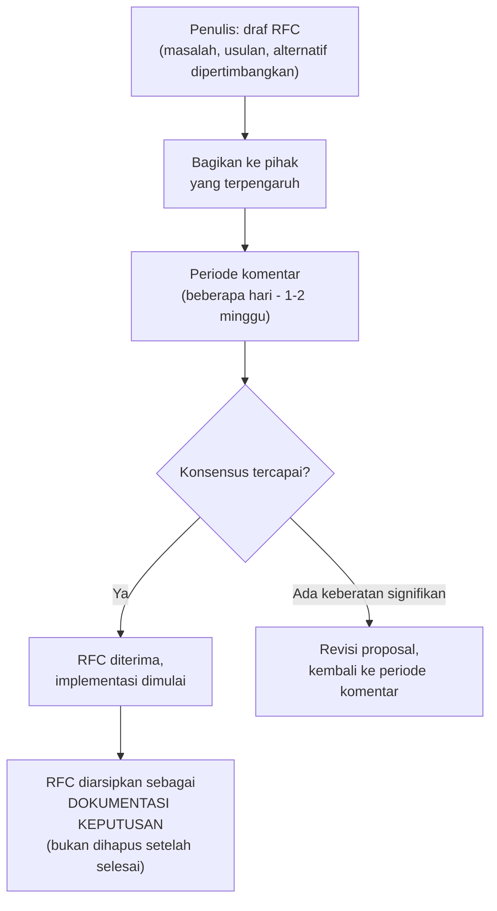

## TL;DR

RFC (Request for Comments) adalah proses mengusulkan perubahan besar — arsitektur, standar lintas tim, atau keputusan teknis yang berdampak luas — secara **tertulis**, dibagikan untuk didiskusikan **sebelum** kodenya ditulis. Nilai intinya bukan birokrasi tambahan, tapi memaksa penulis proposal **berpikir menyeluruh** (menulis dengan jelas mengungkap celah pemikiran yang tidak terlihat saat hanya dipikirkan di kepala) dan memberi kesempatan pihak yang terpengaruh menyuarakan keberatan **sebelum** investasi besar sudah terlanjur dilakukan — jauh lebih murah membatalkan proposal di atas kertas dibanding membatalkan kode yang sudah ditulis dan sebagian di-deploy.

## The Problem

Seorang senior engineer memutuskan sendiri untuk mengganti library HTTP client yang dipakai lintas beberapa aplikasi, menghabiskan dua minggu menulis migrasi, lalu baru mengumumkannya ke tim lain yang ternyata sangat bergantung pada fitur spesifik library lama yang tidak didukung penggantinya — dua minggu kerja itu harus dibatalkan sebagian, atau tim lain terpaksa menanggung beban adaptasi mendadak yang seharusnya bisa diantisipasi kalau keberatan itu disuarakan **sebelum** kode ditulis, bukan setelah.

Masalah kedua: sebuah keputusan arsitektur penting (misalnya memilih antara dua pendekatan integrasi dengan partner eksternal) dibuat lewat diskusi lisan di satu rapat yang hanya dihadiri sebagian tim — keputusan itu "ada" tapi tidak terdokumentasi secara formal, sehingga beberapa bulan kemudian ketika pertanyaan "kenapa kita memilih pendekatan ini, bukan yang lain?" muncul, tidak ada yang ingat detail pertimbangannya, dan developer baru yang bergabung kemudian tidak punya cara memahami konteks keputusan itu selain bertanya langsung ke orang yang kebetulan masih ingat (dan mungkin sudah pindah tim atau resign).

## Intuition

Bayangkan RFC seperti **proposal pembangunan yang harus diajukan dan disetujui sebelum konstruksi dimulai**, dibanding langsung membangun dan berharap tidak ada yang keberatan. Proposal tertulis memaksa arsitek menjelaskan secara eksplisit: kenapa desain ini, apa alternatif yang dipertimbangkan, apa dampaknya ke lingkungan sekitar — proses menulis proposal ini sendiri sering **mengungkap** kelemahan desain yang tidak terlihat sampai benar-benar dituliskan secara detail dan sistematis, bukan hanya dipikirkan sekilas di kepala.

Analogi ini bocor pada satu hal: proposal pembangunan fisik butuh persetujuan otoritas formal sebelum bisa dimulai (proses yang bisa memakan waktu lama). RFC software idealnya **tidak** menjadi hambatan birokrasi yang lambat — periode komentar yang wajar (beberapa hari sampai satu-dua minggu tergantung skala dampak), bukan proses persetujuan berlapis yang memakan waktu berbulan-bulan untuk setiap perubahan; RFC yang terlalu lambat prosesnya kehilangan manfaatnya dan mulai dihindari tim yang butuh bergerak cepat.

## How It Works



**Struktur RFC yang umum dipakai**: (1) **Ringkasan** — satu-dua paragraf inti proposal; (2) **Motivasi** — masalah apa yang ingin diselesaikan, kenapa penting; (3) **Desain detail** — usulan konkret, termasuk contoh kode/skema kalau relevan; (4) **Alternatif yang dipertimbangkan** — pendekatan lain yang dipikirkan dan kenapa tidak dipilih (bagian ini penting — menunjukkan penulis sudah berpikir menyeluruh, bukan hanya satu ide pertama yang terpikir); (5) **Dampak** — siapa/apa yang terpengaruh, termasuk kebutuhan migrasi kalau ada.

## Under The Hood

**RFC yang diarsipkan (bukan dihapus setelah diterima) berfungsi sebagai bentuk sederhana Architecture Decision Record** — dokumentasi hidup yang menjawab "kenapa kita memutuskan begini" untuk siapa pun yang bertanya di masa depan, termasuk developer baru yang belum ada saat keputusan dibuat. Ini menyelesaikan masalah kedua di "The Problem" — keputusan yang didiskusikan lewat RFC tertulis punya jejak yang bisa dirujuk kembali, berbeda dari keputusan yang hanya "ada" dalam ingatan orang yang menghadiri rapat tertentu.

**Skala RFC harus proporsional dengan dampak perubahan** — mengharuskan RFC formal untuk setiap perubahan kecil (menambah satu field opsional ke API) adalah birokrasi berlebihan yang membuat proses ini dihindari; RFC paling bernilai untuk perubahan yang **sulit dibatalkan** (mengganti database, mengubah arsitektur inti, standar yang memengaruhi banyak tim) di mana biaya menulis proposal jauh lebih murah dibanding biaya membatalkan keputusan yang sudah terlanjur diimplementasikan secara luas.

## In Go

```markdown
# RFC 2026-07: Migrasi library HTTP client internal

## Ringkasan
Mengusulkan mengganti library `oldhttp` dengan `newhttp` untuk seluruh
service internal yang memanggil API partner eksternal.

## Motivasi
`oldhttp` tidak lagi dipelihara aktif (rilis terakhir 2 tahun lalu),
dan tidak mendukung context cancellation dengan benar (lihat
[[Context for Cancellation and Deadlines]]), menyebabkan goroutine
leak yang sudah terjadi di dua service.

## Desain Detail
- Ganti import `oldhttp` -> `newhttp` di seluruh service.
- API `newhttp` cukup mirip, migrasi diperkirakan mekanis untuk 90% kasus.
- 10% kasus butuh penyesuaian manual (daftar terlampir).

## Alternatif yang Dipertimbangkan
- Tetap pakai `oldhttp`, tulis wrapper context cancellation sendiri:
  DITOLAK — menambah maintenance burden untuk masalah yang sudah
  diselesaikan library lain.
- Pakai `net/http` stdlib langsung tanpa library tambahan:
  DIPERTIMBANGKAN SERIUS, tapi `newhttp` menyediakan retry/circuit
  breaker bawaan yang harus ditulis manual kalau pakai stdlib murni.

## Dampak
- Tim A, B, C (pemakai oldhttp) perlu migrasi dalam 1 bulan.
- Estimasi effort: 2-3 hari per service.
```

## In His Stack

Untuk keputusan seperti "instansi mana yang jadi prioritas integrasi berikutnya" atau "format kontrak API standar untuk seluruh 13 aplikasi" (lihat [[API Governance]]), RFC tertulis yang dibagikan ke perwakilan setiap tim jauh lebih efektif dibanding keputusan yang dibuat sepihak lalu diumumkan — terutama untuk sistem pemerintah di mana keputusan arsitektur sering perlu dipertanggungjawabkan (kepada auditor, kepada instansi terkait) jauh setelah keputusan itu dibuat, dan RFC yang terarsip memberi jejak keputusan yang jauh lebih kuat dibanding mengandalkan ingatan orang.

## Trade-offs and When Not To Use It

Mewajibkan RFC untuk **setiap** perubahan, termasuk yang kecil dan low-risk, adalah birokrasi yang memperlambat tim tanpa manfaat proporsional — RFC paling bernilai untuk keputusan yang **sulit dibatalkan** dan **berdampak luas**, bukan setiap baris kode yang ditulis. Untuk tim yang sangat kecil (dua-tiga orang yang duduk berdekatan dan bisa berdiskusi langsung dalam hitungan menit), proses RFC formal mungkin terasa berlebihan dibanding komunikasi langsung — RFC menjadi bernilai justru ketika jumlah orang yang perlu tahu dan menyuarakan pendapat sudah melebihi kapasitas percakapan informal.

## Common Mistakes

> [!warning] Jebakan
> Mewajibkan proses RFC formal untuk setiap perubahan sekecil apa pun — birokrasi yang memperlambat tim tanpa manfaat proporsional, membuat proses ini dihindari atau dianggap formalitas kosong.

> [!warning] Jebakan
> Menghapus atau tidak mengarsipkan RFC setelah diterima dan diimplementasikan — kehilangan nilai dokumentasi keputusan yang seharusnya bisa dirujuk kembali oleh siapa pun di masa depan.

> [!warning] Jebakan
> Membuat keputusan besar dan mengimplementasikannya penuh sebelum membagikan proposal ke pihak yang terpengaruh — kehilangan seluruh manfaat RFC yang seharusnya menangkap keberatan **sebelum** investasi besar terlanjur dilakukan.

## Exercises

1. Jelaskan kenapa menulis proposal secara eksplisit (RFC) sering mengungkap celah pemikiran yang tidak terlihat kalau hanya dipikirkan di kepala.
2. Kenapa RFC yang diarsipkan setelah diterima berfungsi sebagai bentuk sederhana Architecture Decision Record?
3. Kapan proses RFC formal menjadi birokrasi yang tidak sepadan, dan kapan menjadi sangat bernilai?
4. Desain terbuka: kamu ingin mengusulkan perubahan besar — memisahkan modul dokumen menjadi service terpisah (lihat [[Modular Monolith vs Microservices]]) karena kebutuhan skala OCR yang berbeda. Rancang draf RFC untuk proposal ini, sebutkan minimal lima bagian yang harus ada, dan jelaskan kenapa bagian "alternatif yang dipertimbangkan" penting disertakan meski kamu sudah yakin dengan pilihanmu.

> [!success]- Kunci jawaban
> **1.** Berpikir di kepala mengizinkan lompatan logika yang tidak disadari — sebuah ide bisa "terasa masuk akal" tanpa benar-benar diperiksa detailnya. Menulis memaksa setiap langkah logika dinyatakan eksplisit dan berurutan; celah (kasus tepi yang belum dipikirkan, asumsi yang tidak dinyatakan, dampak yang terlewat) sering baru terlihat jelas saat penulis mencoba menuliskannya secara sistematis untuk pembaca lain yang tidak berbagi konteks yang sama dengan penulis.
> **4.** Lima bagian minimal: Ringkasan (memisahkan modul dokumen jadi service terpisah untuk skala OCR independen), Motivasi (kebutuhan CPU-intensive OCR yang berbeda signifikan dari modul lain, dijelaskan di [[Defining Service Boundaries]]), Desain Detail (bagaimana interface publik modul dokumen yang sudah ada dijadikan client jaringan, tanpa mengubah modul pemanggil), Alternatif yang Dipertimbangkan (misalnya tetap dalam monolit tapi menambah resource untuk seluruh proses, atau memakai job queue terpisah tanpa memecah service penuh), dan Dampak (tim mana yang perlu menyesuaikan, estimasi waktu migrasi, downtime yang mungkin terjadi). Bagian "alternatif yang dipertimbangkan" penting disertakan **meski sudah yakin** karena ini membuktikan ke pembaca (dan ke diri sendiri) bahwa pilihan ini bukan ide pertama yang terlintas tanpa perbandingan — pembaca yang skeptis bisa melihat bahwa opsi lain sudah dipikirkan dan alasan menolaknya masuk akal, jauh lebih meyakinkan dibanding proposal yang hanya menyajikan satu pilihan tanpa konteks kenapa pilihan lain tidak lebih baik.

## Self-Check

- Kenapa menulis RFC sering mengungkap celah pemikiran yang tidak terlihat?
- Kenapa RFC yang diarsipkan berfungsi sebagai bentuk ADR sederhana?
- Kapan proses RFC formal menjadi birokrasi yang tidak sepadan?
- Kenapa bagian "alternatif yang dipertimbangkan" penting dalam RFC?

## Connected Notes

- [[Cross-Team Code Standards]] — RFC adalah mekanisme konkret mengusulkan dan merevisi standar kode yang dibahas di note sebelumnya.
- [[API Governance]] — perubahan standar atau breaking change API lintas tim adalah kandidat konkret yang layak melalui proses RFC.
- [[../60 Distributed Systems/Writing Architecture Decision Records|Writing Architecture Decision Records]] — ADR formal yang lebih terstruktur, dibahas mendalam di level senior domain Distributed Systems.
- [[Choosing Which Technical Battles to Fight]] — RFC adalah forum yang tepat menyuarakan ketidaksepakatan teknis secara konstruktif, berkaitan langsung dengan memilih pertempuran teknis yang dibahas di note lain domain ini.
- [[Modular Monolith vs Microservices]] — keputusan memecah modul menjadi service terpisah, seperti di contoh exercise, adalah jenis keputusan besar yang tepat melalui proses RFC.

## Further Reading

- Rust RFC process (rust-lang.github.io/rfcs) — salah satu contoh proses RFC open-source yang paling matang dan sering dirujuk sebagai referensi.

## Catatan Saya

*Tulis di sini keputusan besar di kerjaanmu yang dibuat tanpa proses RFC — apakah proses ini akan mengubah hasilnya kalau diterapkan sejak awal.*
