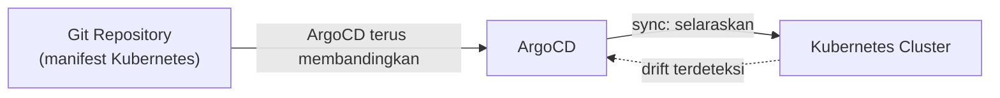

## What It Is, In One Paragraph

ArgoCD adalah tool GitOps untuk Kubernetes — alih-alih pipeline CI yang secara aktif `kubectl apply` ke cluster, ArgoCD berjalan **di dalam** cluster dan terus-menerus membandingkan keadaan yang didefinisikan di repository Git dengan keadaan nyata cluster, secara otomatis menyelaraskan keduanya.

## The Concept It Implements

ArgoCD adalah implementasi utama gaya GitOps dari [[../70 Infrastructure and Delivery/Desired-State Reconciliation|Desired-State Reconciliation]] — loop reconciliation yang dibahas abstrak di note itu diwujudkan literal sebagai proses ArgoCD yang terus membandingkan Git dan cluster.

## Mental Model

Tiga bagian: **Application** (objek ArgoCD yang mendefinisikan repository Git mana dan path mana yang jadi sumber kebenaran untuk satu deployment); **sync** (proses menyelaraskan cluster dengan definisi Git — bisa manual atau otomatis); **drift detection** (ArgoCD terus memantau dan menandai kalau cluster menyimpang dari definisi Git, baik karena perubahan manual maupun kegagalan lain).



## The 20% You Actually Use

```yaml
# Application ArgoCD — mendefinisikan sumber kebenaran
apiVersion: argoproj.io/v1alpha1
kind: Application
metadata:
  name: kasus-service
spec:
  source:
    repoURL: https://github.com/org/k8s-manifests
    path: apps/kasus-service
  destination:
    server: https://kubernetes.default.svc
    namespace: production
  syncPolicy:
    automated:
      selfHeal: true  # otomatis perbaiki drift
```

## Configuration That Bites

`selfHeal: true` yang tidak diaktifkan berarti ArgoCD hanya **mendeteksi** drift tapi tidak otomatis memperbaikinya — perubahan manual ke cluster akan tetap ada sampai sync manual dijalankan, berbeda dari ekspektasi "self-healing penuh" yang sering diasumsikan orang baru memakai ArgoCD.

## Operating and Debugging It

UI ArgoCD menampilkan status sync tiap Application secara visual (Synced/OutOfSync, Healthy/Degraded) — titik pertama diperiksa saat deployment tidak sesuai harapan, menunjukkan persis resource mana yang menyimpang dari definisi Git.

## Choosing It

Dibanding pipeline CI yang menjalankan `kubectl apply` langsung: ArgoCD memberi visibilitas drift berkelanjutan dan self-healing otomatis, plus audit trail yang jelas (semua perubahan lewat Git, bisa di-review lewat pull request) — trade-off-nya kompleksitas operasional tambahan mengelola ArgoCD itu sendiri.

## Gotchas

> [!warning] Jebakan
> Mengasumsikan ArgoCD otomatis memperbaiki drift tanpa mengaktifkan `selfHeal` eksplisit — default tanpa opsi ini hanya mendeteksi dan menampilkan drift, tidak memperbaikinya otomatis.

## Version Caveat

Dokumentasi resmi argo-cd.readthedocs.io adalah sumber kebenaran untuk fitur dan sintaks Application CRD yang benar-benar dipakai untuk versi tertentu.

## Connected Notes

- [[../70 Infrastructure and Delivery/Desired-State Reconciliation|Desired-State Reconciliation]] — konsep loop reconciliation yang diimplementasikan literal oleh ArgoCD.
- [[Kubernetes]] — ArgoCD berjalan di dalam dan mengelola resource Kubernetes.
- [[../70 Infrastructure and Delivery/State Files and Drift|State Files and Drift]] — drift detection ArgoCD berbagi filosofi yang sama dengan deteksi drift Terraform, hanya diterapkan berkelanjutan dan otomatis.

## Catatan Saya

*Kosong — diisi pembaca.*
