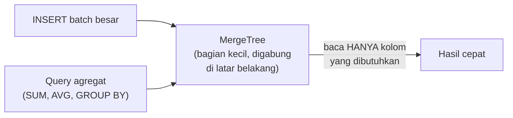

## What It Is, In One Paragraph

ClickHouse adalah database kolumnar yang dirancang khusus untuk query analitik (OLAP) skala besar — mampu memindai dan mengagregasi miliaran baris dalam hitungan detik untuk query yang akan membuat database transaksional biasa kewalahan, dengan trade-off eksplisit: tidak dirancang untuk transaksi, update baris individual, atau join kompleks seperti database relasional biasa.

## The Concept It Implements

ClickHouse adalah implementasi utama [[../40 Databases/OLTP vs OLAP vs HTAP|OLTP vs OLAP vs HTAP]] dan [[../40 Databases/Row-Oriented vs Columnar Storage|Row-Oriented vs Columnar Storage]] — penyimpanan kolumnar yang dibahas abstrak di kedua note itu adalah fondasi literal cara ClickHouse mencapai kecepatan agregasinya.

## Mental Model

Dua konsep inti: **MergeTree** (keluarga table engine utama ClickHouse — data ditulis sebagai bagian-bagian kecil yang digabung (merge) di latar belakang, dioptimalkan untuk insert massal, bukan update per-baris); **penyimpanan kolumnar** (data disimpan per kolom, bukan per baris — query yang hanya butuh beberapa kolom dari tabel lebar hanya membaca kolom itu, bukan seluruh baris, inilah sumber kecepatannya untuk agregasi).



## The 20% You Actually Use

```sql
CREATE TABLE kasus_events (
    tanggal Date,
    instansi_id UInt32,
    event_type String,
    jumlah UInt32
) ENGINE = MergeTree()
ORDER BY (tanggal, instansi_id);

-- Query agregat yang jadi kekuatan utama ClickHouse
SELECT instansi_id, event_type, SUM(jumlah)
FROM kasus_events
WHERE tanggal >= '2026-01-01'
GROUP BY instansi_id, event_type;
```

## Configuration That Bites

Menjalankan `UPDATE`/`DELETE` biasa di ClickHouse (tersedia sebagai `ALTER TABLE ... UPDATE`) adalah operasi asinkron dan mahal, sangat berbeda dari `UPDATE` di database transaksional — ClickHouse tidak dirancang untuk pola akses yang sering mengubah baris individual; mencoba memakainya seperti database OLTP biasa akan mengecewakan.

## Operating and Debugging It

`system.query_log` menyimpan riwayat query yang dijalankan beserta durasinya, berguna mendiagnosis query yang lambat. Jumlah bagian (parts) yang belum di-merge bisa dipantau lewat `system.parts` — terlalu banyak parts kecil yang belum digabung menandakan pola insert yang kurang optimal (insert satu-satu, bukan batch).

## Choosing It

Dibanding menjalankan query analitik berat langsung di database transaksional (MariaDB/PostgreSQL): ClickHouse jauh lebih cepat untuk agregasi skala besar dan tidak membebani database transaksional utama — lihat [[../40 Databases/OLTP vs OLAP vs HTAP|OLTP vs OLAP vs HTAP]] untuk kapan sinyal ini muncul. Dibanding data warehouse cloud terkelola (BigQuery, dsb): ClickHouse bisa self-hosted dengan kontrol penuh, tapi butuh effort operasional sendiri.

## Gotchas

> [!warning] Jebakan
> Melakukan insert satu baris pada satu waktu (bukan batch) — ClickHouse dioptimalkan untuk insert batch besar; insert satu-satu menghasilkan terlalu banyak parts kecil yang membebani proses merge di latar belakang.

> [!warning] Jebakan
> Mengharapkan `JOIN` di ClickHouse berperilaku seperti database relasional biasa untuk dataset sangat besar — ClickHouse mendukung join tapi tidak dioptimalkan seketat database OLTP untuk pola join kompleks, terutama pada tabel yang sangat besar di kedua sisi.

## Version Caveat

Dokumentasi resmi clickhouse.com adalah sumber kebenaran untuk detail table engine dan fitur SQL yang benar-benar dipakai, karena fitur baru ditambahkan cukup aktif antar rilis.

## Connected Notes

- [[../40 Databases/OLTP vs OLAP vs HTAP|OLTP vs OLAP vs HTAP]] — konsep yang diimplementasikan konkret oleh ClickHouse sebagai mesin OLAP.
- [[../40 Databases/Row-Oriented vs Columnar Storage|Row-Oriented vs Columnar Storage]] — penyimpanan kolumnar yang jadi fondasi kecepatan ClickHouse.
- [[../60 Distributed Systems/CQRS|CQRS]] — ClickHouse sering dipakai sebagai read model analitik terpisah dalam pola CQRS.

## Catatan Saya

*Kosong — diisi pembaca.*
