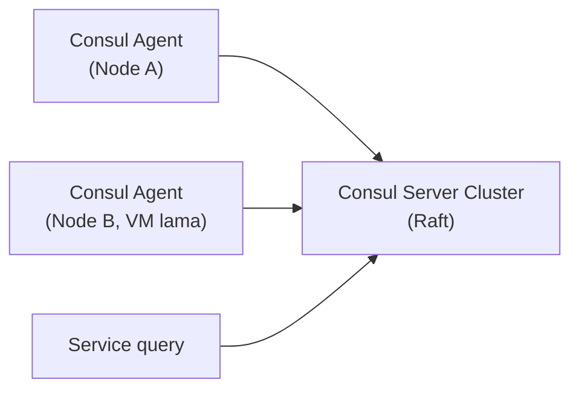

## What It Is, In One Paragraph

Consul adalah tool service discovery dan service mesh dari HashiCorp — menyediakan registry service yang bisa dicari (siapa yang menjalankan apa dan di mana), health checking, dan (lewat Consul Connect) mTLS otomatis antar service, semuanya dibangun di atas Raft untuk konsistensi cluster-nya sendiri.

## The Concept It Implements

Consul adalah implementasi utama [[../70 Infrastructure and Delivery/Service Discovery|Service Discovery]], dan secara internal memakai [[../60 Distributed Systems/Consensus - Raft|Consensus - Raft]] untuk menjaga konsistensi data registry-nya di antara node cluster Consul sendiri.

## Kapan Ini Dipakai

Consul paling relevan begitu topologi service melampaui apa yang bisa dijawab DNS internal Kubernetes saja — terutama situasi transisi di mana sebagian service berjalan di Kubernetes dan sebagian masih di VM lama, dan keduanya perlu saling menemukan. Untuk sistem yang seluruhnya sudah di satu cluster Kubernetes, Service dan DNS internal bawaan Kubernetes sering sudah cukup tanpa perlu Consul tambahan.

## Mental Model Singkat

Agent Consul berjalan di setiap node yang ingin didaftarkan, melakukan health check lokal, dan melaporkan status ke cluster server Consul (yang menjalankan Raft untuk konsistensi). Service yang ingin menemukan service lain melakukan query ke Consul (lewat DNS interface atau HTTP API), mendapat daftar instance sehat yang terdaftar.



## Contoh Konkret

```bash
# Registrasi service lewat file konfigurasi agent
consul services register -name=kasus-service -port=8080 -check-http=http://localhost:8080/health

# Query lewat DNS interface bawaan Consul
dig @127.0.0.1 -p 8600 kasus-service.service.consul
```

## Kapan Memilih Ini vs Alternatif

Pilih Consul untuk topologi hybrid (sebagian Kubernetes, sebagian VM lama) atau kebutuhan service mesh dengan mTLS otomatis lintas platform. Untuk sistem yang murni Kubernetes tanpa kebutuhan lintas platform, DNS internal Kubernetes bawaan biasanya cukup tanpa investasi Consul tambahan.

> [!warning] Jebakan
> Memasang Consul tanpa health check yang benar-benar mencerminkan kesehatan service — registry yang menawarkan instance yang sebenarnya tidak sehat kehilangan seluruh nilai service discovery-nya.

## Version Caveat

Consul Connect (fitur service mesh) dan fitur mTLS otomatis berkembang aktif — dokumentasi resmi consul.io adalah sumber kebenaran untuk kematangan fitur di versi yang benar-benar dipakai.

## Connected Notes

- [[../70 Infrastructure and Delivery/Service Discovery|Service Discovery]] — konsep yang diimplementasikan konkret oleh Consul.
- [[../60 Distributed Systems/Consensus - Raft|Consensus - Raft]] — algoritma consensus yang mendasari cluster server Consul.
- [[../80 Security/mTLS|mTLS]] — Consul Connect mengimplementasikan mTLS otomatis antar service.
- [[../80 Security/Zero Trust|Zero Trust]] — service mesh Consul adalah salah satu cara praktis menerapkan prinsip zero trust di level jaringan.

## Catatan Saya

*Kosong — diisi pembaca.*
