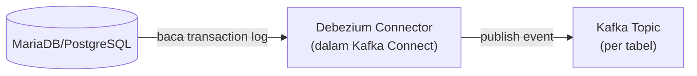

## What It Is, In One Paragraph

Debezium adalah platform CDC (Change Data Capture) open-source yang membaca transaction log berbagai database (MySQL/MariaDB binlog, PostgreSQL WAL, dan lainnya) dan mempublikasikan setiap perubahan sebagai event terstruktur ke Kafka — implementasi paling luas dipakai di ekosistem open-source untuk kebutuhan CDC.

## The Concept It Implements

Debezium adalah implementasi utama [[../60 Distributed Systems/Change Data Capture|Change Data Capture]] — seluruh mekanisme membaca transaction log dan mengubahnya jadi aliran event yang dibahas abstrak di note itu diwujudkan konkret oleh Debezium sebagai connector Kafka Connect.

## Mental Model

Tiga bagian: **connector** (satu instance yang terhubung ke satu database sumber, membaca transaction log-nya); **Kafka Connect** (framework tempat Debezium berjalan sebagai plugin, mengelola siklus hidup connector); **topic per tabel** (secara default, Debezium mempublikasikan perubahan tiap tabel ke topic Kafka terpisah, dengan skema event yang menyertakan nilai before/after).



## The 20% You Actually Use

```json
// Konfigurasi connector Debezium untuk MySQL/MariaDB (lewat Kafka Connect REST API)
{
  "name": "kasus-connector",
  "config": {
    "connector.class": "io.debezium.connector.mysql.MySqlConnector",
    "database.hostname": "mariadb-host",
    "database.server.id": "1",
    "table.include.list": "app_db.kasus",
    "topic.prefix": "kasus-cdc"
  }
}
```

## Configuration That Bites

Debezium butuh akses ke binlog MariaDB dalam format `ROW` (bukan `STATEMENT`) — konfigurasi `binlog_format` yang salah membuat Debezium tidak bisa menangkap nilai kolom individual yang berubah, hanya statement SQL mentah yang kurang berguna untuk kebutuhan event terstruktur.

## Operating and Debugging It

Snapshot awal (saat connector pertama kali dijalankan, menangkap keadaan tabel saat ini sebelum mulai membaca perubahan real-time) bisa memakan waktu signifikan untuk tabel besar — status snapshot dan lag connector bisa dipantau lewat metrik JMX yang diekspos Kafka Connect.

## Choosing It

Dibanding menulis kode aplikasi yang mengirim event manual setiap perubahan data: Debezium menangkap **semua** perubahan tanpa kecuali (termasuk dari proses batch atau query manual yang tidak terduga), lihat perbandingan lengkap di [[../60 Distributed Systems/Change Data Capture|Change Data Capture]] dan [[../60 Distributed Systems/Dual Writes and Their Dangers|Dual Writes and Their Dangers]].

## Gotchas

> [!warning] Jebakan
> Tidak mengaktifkan `binlog_format=ROW` di MariaDB sebelum memasang connector Debezium — connector tidak akan bisa menangkap perubahan data dengan benar tanpa format binlog yang tepat.

## Version Caveat

Dokumentasi resmi debezium.io adalah sumber kebenaran untuk konfigurasi connector spesifik database yang benar-benar dipakai, karena parameter konfigurasi bisa berbeda antar jenis database sumber.

## Connected Notes

- [[../60 Distributed Systems/Change Data Capture|Change Data Capture]] — konsep yang diimplementasikan konkret oleh Debezium.
- [[Kafka]] — Debezium mempublikasikan event CDC ke topic Kafka, keduanya sering dipasangkan.
- [[../60 Distributed Systems/Zero-Downtime Database Migration Using CDC|Zero-Downtime Database Migration Using CDC]] — kasus penggunaan Debezium untuk kebutuhan migrasi database skala besar.

## Catatan Saya

*Kosong — diisi pembaca.*
