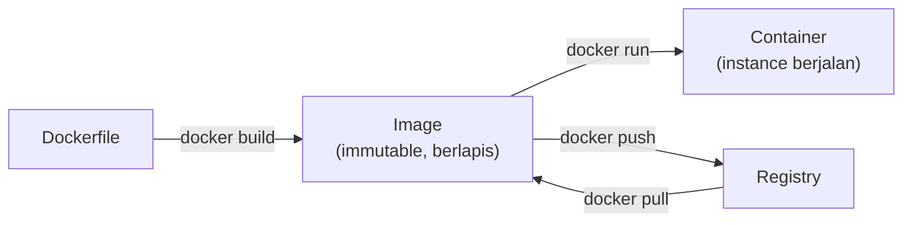

## What It Is, In One Paragraph

Docker adalah platform container yang mempopulerkan (bukan menciptakan — Linux container sudah ada sebelumnya) cara mengemas aplikasi beserta seluruh dependensinya jadi satu unit yang bisa berjalan konsisten di mana pun. Note ini melengkapi [[../70 Infrastructure and Delivery/Docker - Images, Layers, and Multi-Stage Builds for Go|Docker - Images, Layers, and Multi-Stage Builds for Go]] (yang sudah membahas konsep image dan build untuk Go) dengan sisi operasional sehari-hari: menjalankan, mendebug, dan mengelola container di luar konteks build.

## The Concept It Implements

Docker adalah implementasi praktis paling luas dipakai dari [[../70 Infrastructure and Delivery/Immutable Infrastructure vs Configuration Management|Immutable Infrastructure vs Configuration Management]] — image yang tidak pernah diubah setelah dibuat, hanya diganti, adalah wujud konkret dari filosofi immutable infrastructure.

## Mental Model

Tiga lapisan: **image** (blueprint immutable, dibangun dari Dockerfile, tersimpan sebagai layer bertumpuk); **container** (instance yang berjalan dari sebuah image, punya state sendiri selama hidup tapi state itu hilang saat container dihapus kecuali disimpan di volume terpisah); **registry** (tempat menyimpan dan mendistribusikan image, seperti Docker Hub atau registry privat).



## The 20% You Actually Use

```bash
docker build -t myapp:latest .
docker run -d -p 8080:8080 --name myapp-1 myapp:latest
docker logs -f myapp-1                    # ikuti log real-time
docker exec -it myapp-1 sh                # masuk ke dalam container yang berjalan
docker ps                                 # container yang sedang berjalan
docker system prune -a                    # bersihkan image/container tak terpakai
```

## Configuration That Bites

Container yang berjalan sebagai root (default kalau tidak dispesifikkan) adalah risiko keamanan yang tidak perlu — Dockerfile production yang baik menambahkan user non-root eksplisit (`USER appuser`) sebelum menjalankan aplikasi, mengurangi dampak kalau container itu kompromi. Menjalankan container tanpa batas resource (`--memory`, `--cpus`) berarti satu container yang bermasalah (memory leak, infinite loop) bisa menghabiskan seluruh resource host, mengganggu container lain di mesin yang sama.

## Operating and Debugging It

`docker logs` dan `docker exec -it <container> sh` adalah langkah pertama mendiagnosis container yang berperilaku aneh — masuk ke dalamnya (kalau image punya shell) untuk memeriksa file, environment variable, dan proses yang berjalan. `docker inspect` menunjukkan konfigurasi lengkap container termasuk network, volume mount, dan environment variable yang benar-benar diterapkan (berguna memastikan konfigurasi yang diharapkan benar-benar sampai ke container).

## Choosing It

Dibanding menjalankan aplikasi langsung di VM tanpa container: Docker memberi konsistensi lingkungan (mengurangi masalah "jalan di laptop saya tapi tidak di production") dan isolasi resource dasar. Untuk orkestrasi banyak container di skala production, Docker sendiri tidak cukup — lihat [[Kubernetes]] untuk kebutuhan itu.

## Gotchas

> [!warning] Jebakan
> Menyimpan data penting di dalam filesystem container tanpa volume terpisah — data itu hilang begitu container dihapus atau diganti, sesuatu yang wajar terjadi kapan saja (deploy baru, restart karena crash).

> [!warning] Jebakan
> Menjalankan container sebagai root secara default tanpa mempertimbangkan risiko keamanannya — praktik yang mudah diperbaiki (`USER` di Dockerfile) tapi sering terlewat karena "berhasil begitu saja" tanpa peringatan.

## Version Caveat

Docker Compose v2 (terintegrasi sebagai `docker compose`, bukan `docker-compose` terpisah) sudah jadi standar di instalasi modern — perbedaan sintaks minor antara versi lama dan baru layak diperiksa terhadap dokumentasi resmi docs.docker.com untuk versi yang benar-benar dipakai.

## Connected Notes

- [[../70 Infrastructure and Delivery/Docker - Images, Layers, and Multi-Stage Builds for Go|Docker - Images, Layers, and Multi-Stage Builds for Go]] — note konsep junior yang membahas mendalam sisi build image untuk Go, dilengkapi note ini dari sisi operasional.
- [[../70 Infrastructure and Delivery/Immutable Infrastructure vs Configuration Management|Immutable Infrastructure vs Configuration Management]] — filosofi yang diwujudkan Docker secara konkret.
- [[Kubernetes]] — kelanjutan langsung untuk kebutuhan orkestrasi container skala production.
- [[../70 Infrastructure and Delivery/Docker Compose for Local Development|Docker Compose for Local Development]] — alat bawaan Docker untuk menjalankan banyak container terkait di lingkungan lokal.

## Catatan Saya

*Kosong — diisi pembaca.*
