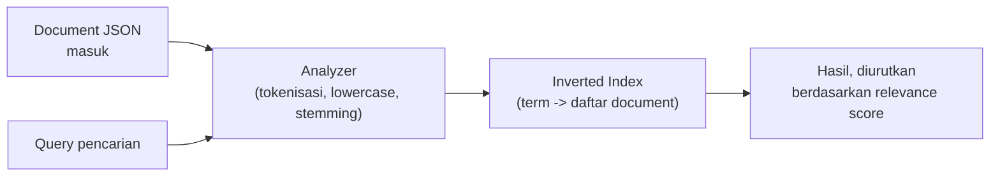

## What It Is, In One Paragraph

Elasticsearch adalah mesin pencari dan analitik terdistribusi berbasis inverted index — dipakai luas bukan hanya untuk pencarian teks bebas (full-text search), tapi juga untuk agregasi data dan log analytics skala besar, dengan API berbasis JSON lewat HTTP yang membuatnya relatif mudah diintegrasikan dari bahasa apa pun.

## The Concept It Implements

Elasticsearch adalah implementasi utama [[../40 Databases/Inverted Indexes and How Search Engines Work|Inverted Indexes and How Search Engines Work]] — struktur data inverted index yang dibahas abstrak di domain databases adalah fondasi literal cara Elasticsearch menyimpan dan mencari data.

## Mental Model

Empat konsep inti: **index** (mirip "database" atau "tabel" dalam analogi relasional, meski strukturnya sangat berbeda); **document** (satu unit data JSON, mirip "baris"); **mapping** (skema yang mendefinisikan tipe data tiap field, termasuk bagaimana field teks dianalisis untuk pencarian); **analyzer** (proses memecah teks jadi token yang dicari — tokenisasi, lowercase, stemming — menentukan apa yang "cocok" saat pengguna mencari sesuatu).



## The 20% You Actually Use

```json
// Membuat index dengan mapping eksplisit
PUT /kasus
{
  "mappings": {
    "properties": {
      "judul": {"type": "text"},
      "status": {"type": "keyword"},
      "created_at": {"type": "date"}
    }
  }
}

// Query pencarian dengan filter
GET /kasus/_search
{
  "query": {
    "bool": {
      "must": {"match": {"judul": "sengketa tanah"}},
      "filter": {"term": {"status": "aktif"}}
    }
  }
}
```

```go
import "github.com/elastic/go-elasticsearch/v8"

client, err := elasticsearch.NewDefaultClient()
if err != nil {
	return fmt.Errorf("membuat client elasticsearch: %w", err)
}

res, err := client.Search(
	client.Search.WithIndex("kasus"),
	client.Search.WithBody(strings.NewReader(queryJSON)),
)
if err != nil {
	return fmt.Errorf("search: %w", err)
}
defer res.Body.Close()
```

## Configuration That Bites

Field bertipe `text` (dianalisis untuk pencarian) dan `keyword` (disimpan utuh, untuk exact match dan agregasi) punya kegunaan yang sangat berbeda — memakai `text` untuk field yang butuh exact match (seperti status atau kode) menghasilkan pencocokan yang salah (kata yang di-tokenisasi, bukan nilai utuh), sementara memakai `keyword` untuk field yang butuh pencarian bebas (seperti judul dokumen) menghasilkan pencarian yang terlalu kaku (harus cocok persis). Mapping yang salah di awal sulit diperbaiki tanpa reindex penuh, karena mapping field yang sudah ada tidak bisa diubah begitu saja.

## Operating and Debugging It

`_explain` API menunjukkan kenapa sebuah document cocok (atau tidak cocok) dengan query tertentu, dan bagaimana relevance score dihitung — berguna saat hasil pencarian terasa tidak masuk akal. Cluster health (`GET /_cluster/health`) menunjukkan status keseluruhan cluster (green/yellow/red) — status selain green butuh investigasi segera, terutama red yang berarti sebagian data tidak tersedia.

## Choosing It

Dibanding pencarian `LIKE '%kata%'` di database relasional: Elasticsearch jauh lebih cepat dan relevan untuk pencarian teks bebas skala besar, tapi menambah kompleksitas menjaga sinkronisasi dengan sumber data utama (lihat [[../40 Databases/Keeping Search in Sync with the Source of Truth|Keeping Search in Sync with the Source of Truth]]). Dibanding PostgreSQL full-text search: PostgreSQL cukup untuk kebutuhan pencarian sederhana-menengah tanpa infrastruktur tambahan; Elasticsearch unggul untuk kebutuhan pencarian kompleks (relevance tuning, agregasi besar, fuzzy matching) dengan volume data besar.

## Gotchas

> [!warning] Jebakan
> Mengubah mapping field yang sudah ada data-nya (misalnya dari `text` ke `keyword`) tanpa reindex — Elasticsearch menolak perubahan mapping yang tidak kompatibel pada field yang sudah ada, memaksa membuat index baru dan memindahkan data.

> [!warning] Jebakan
> Membiarkan index Elasticsearch menyimpang dari database sumber tanpa mekanisme sinkronisasi yang andal (lihat [[../60 Distributed Systems/Change Data Capture|Change Data Capture]]) — drift yang tidak terdeteksi membuat hasil pencarian menampilkan data usang atau kehilangan dokumen yang seharusnya ada.

## Version Caveat

Elasticsearch mengubah lisensinya beberapa kali dalam beberapa tahun terakhir (termasuk munculnya fork OpenSearch) — implikasi lisensi untuk penggunaan production layak diverifikasi terhadap kebijakan terbaru di elastic.co, bukan diasumsikan dari memori.

## Connected Notes

- [[../40 Databases/Inverted Indexes and How Search Engines Work|Inverted Indexes and How Search Engines Work]] — konsep inti yang diimplementasikan langsung oleh Elasticsearch.
- [[../40 Databases/Keeping Search in Sync with the Source of Truth|Keeping Search in Sync with the Source of Truth]] — tantangan menjaga index Elasticsearch tetap sinkron dengan database utama.
- [[../60 Distributed Systems/Change Data Capture|Change Data Capture]] — mekanisme paling andal menyinkronkan Elasticsearch dengan sumber data.
- [[../60 Distributed Systems/CQRS|CQRS]] — Elasticsearch sering dipakai sebagai read model dalam pola CQRS untuk kebutuhan pencarian.

## Catatan Saya

*Kosong — diisi pembaca.*
