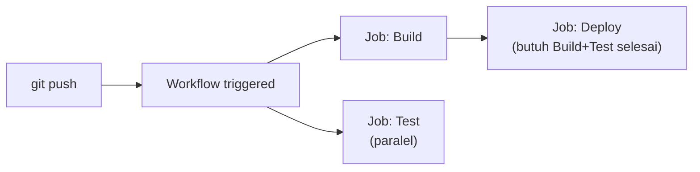

## What It Is, In One Paragraph

GitHub Actions adalah platform CI/CD terintegrasi langsung dengan repository GitHub — pipeline didefinisikan sebagai file YAML dalam repository itu sendiri (`.github/workflows/`), dijalankan otomatis berdasarkan event (push, pull request, jadwal) tanpa perlu server CI terpisah yang dikelola sendiri.

## The Concept It Implements

GitHub Actions adalah implementasi alternatif [[../70 Infrastructure and Delivery/CI-CD Pipelines|CI-CD Pipelines]] — pipeline-as-code yang dibahas abstrak di note itu diwujudkan lewat file workflow YAML, sebagai alternatif SaaS untuk Jenkins yang self-hosted.

## Mental Model

Tiga bagian: **workflow** (file YAML yang mendefinisikan satu atau lebih job, dipicu event tertentu); **job** (kumpulan step yang berjalan di satu runner, bisa paralel dengan job lain); **runner** (mesin yang menjalankan job — bisa runner terkelola GitHub, atau self-hosted runner untuk kebutuhan khusus).



## The 20% You Actually Use

```yaml
# .github/workflows/ci.yml
name: CI
on: [push, pull_request]

jobs:
  test:
    runs-on: ubuntu-latest
    steps:
      - uses: actions/checkout@v4
      - uses: actions/setup-go@v5
        with:
          go-version: '1.22'
      - run: go build ./...
      - run: go test ./...
```

## Configuration That Bites

Secret yang disimpan di GitHub Actions Secrets tetap bisa bocor kalau workflow mengizinkan pull request dari fork eksternal mengakses secret itu (tanpa pembatasan `pull_request_target` yang hati-hati) — konfigurasi default yang salah bisa mengekspos secret ke kode dari kontributor luar yang tidak tepercaya.

## Operating and Debugging It

Tab "Actions" di repository GitHub menunjukkan riwayat lengkap tiap run workflow, termasuk log per step — debugging biasanya dimulai dari melihat step mana yang gagal dan log lengkapnya di sana.

## Choosing It

Dibanding [[Jenkins]]: GitHub Actions tidak butuh infrastruktur server terpisah untuk dikelola, terintegrasi langsung dengan repository, tapi kurang fleksibel untuk kebutuhan sangat kustom dibanding ekosistem plugin Jenkins yang luas. Cocok default untuk proyek yang sudah di GitHub tanpa kebutuhan CI kompleks yang butuh kontrol infrastruktur penuh.

## Gotchas

> [!warning] Jebakan
> Mengizinkan workflow menjalankan kode dari pull request eksternal dengan akses ke secret repository tanpa pembatasan yang tepat — risiko kebocoran secret ke kontributor yang tidak tepercaya.

## Version Caveat

Marketplace Actions (aksi pihak ketiga yang dipakai lewat `uses:`) berubah dan diperbarui independen dari GitHub Actions itu sendiri — pin ke versi tag tertentu (bukan `@main` atau `@latest`) untuk stabilitas pipeline, dan verifikasi dokumentasi resmi docs.github.com untuk fitur terbaru.

## Connected Notes

- [[../70 Infrastructure and Delivery/CI-CD Pipelines|CI-CD Pipelines]] — konsep pipeline-as-code yang diimplementasikan konkret oleh GitHub Actions.
- [[Jenkins]] — alternatif self-hosted untuk kebutuhan yang sama.
- [[../80 Security/Secret Management|Secret Management]] — prinsip pengelolaan kredensial yang berlaku sama untuk GitHub Actions Secrets.

## Catatan Saya

*Kosong — diisi pembaca.*
