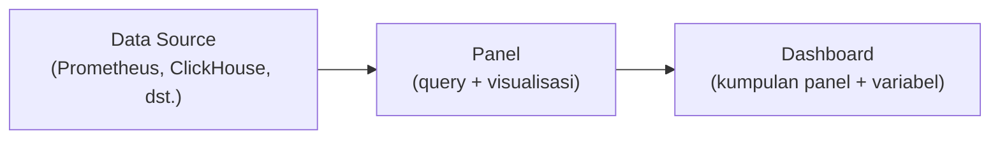

## What It Is, In One Paragraph

Grafana adalah tool visualisasi dashboard yang bisa menampilkan data dari berbagai sumber (Prometheus, ClickHouse, Loki, dan puluhan sumber data lain lewat plugin) dalam satu antarmuka terpadu — jadi standar de facto untuk membangun dashboard operasional di ekosistem observability modern.

## The Concept It Implements

Grafana adalah implementasi utama prinsip [[../70 Infrastructure and Delivery/Dashboard Design|Dashboard Design]] — hierarki, konteks pembanding, dan cakupan yang disengaja yang dibahas abstrak di note itu diwujudkan lewat panel dan layout Grafana.

## Mental Model

Tiga bagian: **data source** (koneksi ke sumber data seperti Prometheus atau ClickHouse, dikonfigurasi terpisah dari dashboard); **panel** (satu visualisasi — grafik, angka tunggal, tabel — masing-masing memakai query terhadap satu atau lebih data source); **dashboard** (kumpulan panel yang disusun dalam satu tampilan, bisa punya variabel yang membuatnya reusable untuk konteks berbeda, misalnya memilih environment atau service tertentu).

## The 20% You Actually Use

Membuat panel baru: pilih data source, tulis query (PromQL untuk Prometheus, SQL untuk ClickHouse), pilih tipe visualisasi (time series, stat, table), atur threshold warna untuk sinyal visual cepat. Variabel dashboard (`$environment`, `$service`) memungkinkan satu dashboard dipakai ulang untuk banyak konteks tanpa duplikasi.

## Configuration That Bites

Membuat terlalu banyak panel di satu dashboard tanpa hierarki jelas mengulang masalah yang dibahas di [[../70 Infrastructure and Delivery/Dashboard Design|Dashboard Design]] — Grafana memudahkan menambah panel tanpa batas, tapi kemudahan ini justru mendorong kebiasaan buruk kalau tidak disiplin memilih apa yang benar-benar perlu ditampilkan.

## Operating and Debugging It

Panel yang menampilkan "No data" biasanya berarti query salah atau data source tidak terhubung — gunakan mode "Explore" di Grafana untuk menguji query secara terpisah dari dashboard, mempercepat iterasi debugging query dibanding bolak-balik menyimpan dashboard.

## Choosing It

Dibanding dashboard bawaan tiap tool (misalnya Kibana untuk Elasticsearch): Grafana unggul karena bisa menggabungkan banyak sumber data dalam satu dashboard, sementara dashboard bawaan biasanya terbatas pada satu sumber data itu sendiri.

## Gotchas

> [!warning] Jebakan
> Membangun dashboard dengan puluhan panel tanpa hierarki prioritas — mengulang masalah dashboard yang tidak dipakai saat insiden sungguhan, dibahas mendalam di [[../70 Infrastructure and Delivery/Dashboard Design|Dashboard Design]].

## Version Caveat

Dokumentasi resmi grafana.com adalah sumber kebenaran untuk fitur dan integrasi data source versi yang benar-benar dipakai.

## Connected Notes

- [[../70 Infrastructure and Delivery/Dashboard Design|Dashboard Design]] — prinsip desain dashboard yang diimplementasikan konkret oleh Grafana.
- [[Prometheus]] — sumber data paling umum dipasangkan dengan Grafana.
- [[../70 Infrastructure and Delivery/Metrics - The RED and USE Methods|Metrics - The RED and USE Methods]] — kerangka memilih metrik yang jadi dasar panel-panel di dashboard Grafana.

## Catatan Saya

*Kosong — diisi pembaca.*
