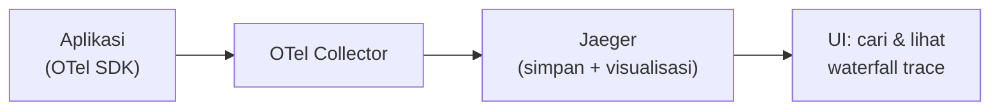

## What It Is, In One Paragraph

Jaeger adalah backend penyimpanan dan visualisasi distributed tracing open-source — menerima span dari aplikasi (biasanya lewat OpenTelemetry), menyimpannya, dan menyediakan UI untuk mencari dan memvisualisasikan trace sebagai flame graph/waterfall, membantu menemukan di mana waktu terbuang dalam perjalanan satu request lintas banyak service.

## The Concept It Implements

Jaeger adalah implementasi utama sisi backend dari [[../70 Infrastructure and Delivery/Distributed Tracing|Distributed Tracing]] — trace dan span yang dibahas abstrak di note itu disimpan dan divisualisasikan konkret oleh Jaeger.

## Kapan Ini Dipakai

Jaeger relevan begitu sistem sudah menginstrumentasi tracing (biasanya lewat [[OpenTelemetry]]) dan butuh tempat menyimpan serta memvisualisasikan hasilnya. Untuk sistem yang belum menginstrumentasi tracing sama sekali, langkah pertama bukan memilih backend seperti Jaeger, melainkan menambahkan instrumentasi di kode aplikasi terlebih dulu — backend penyimpanan trace tidak berguna tanpa data trace yang benar-benar dikirim ke sana.

## Mental Model Singkat

Jaeger menerima span (dikirim lewat OpenTelemetry Collector atau langsung dari SDK), menyimpannya (bisa di memori untuk kebutuhan sementara, atau backend persisten seperti Elasticsearch/Cassandra untuk production), dan UI-nya memungkinkan mencari trace berdasarkan service, operasi, atau durasi, menampilkan hasilnya sebagai waterfall span yang menunjukkan urutan dan durasi tiap operasi dalam satu trace.

## Contoh Konkret

Mencari trace yang lambat di UI Jaeger: filter berdasarkan service tertentu dan durasi minimum (misalnya di atas 2 detik), lalu periksa waterfall untuk trace yang muncul — span mana yang memakan porsi waktu terbesar biasanya langsung terlihat visual di waterfall, mengarahkan investigasi tanpa harus menyusun manual dari log terpisah.

## Kapan Memilih Ini vs Alternatif

Pilih Jaeger sebagai backend open-source self-hosted untuk trace, terintegrasi mulus dengan OpenTelemetry. Alternatif komersial (Datadog APM, dsb.) menawarkan fitur tambahan (analisis otomatis, alerting berbasis trace) dengan biaya lisensi — pilihan bergantung anggaran dan kebutuhan fitur lanjutan di luar visualisasi dasar.

> [!warning] Jebakan
> Memasang Jaeger tanpa strategi sampling yang jelas untuk sistem traffic tinggi — merekam setiap trace tanpa sampling bisa membebani storage secara signifikan, lihat pertimbangan sampling di [[../70 Infrastructure and Delivery/Distributed Tracing|Distributed Tracing]].

## Version Caveat

Dokumentasi resmi jaegertracing.io adalah sumber kebenaran untuk opsi backend storage dan fitur UI yang benar-benar dipakai untuk versi tertentu.

## Connected Notes

- [[../70 Infrastructure and Delivery/Distributed Tracing|Distributed Tracing]] — konsep yang divisualisasikan konkret oleh Jaeger.
- [[OpenTelemetry]] — sumber instrumentasi paling umum yang mengirim data ke Jaeger.
- [[../70 Infrastructure and Delivery/Correlation IDs|Correlation IDs]] — mekanisme lebih sederhana yang berbagi tujuan serupa untuk kebutuhan yang belum butuh Jaeger penuh.

## Catatan Saya

*Kosong — diisi pembaca.*
