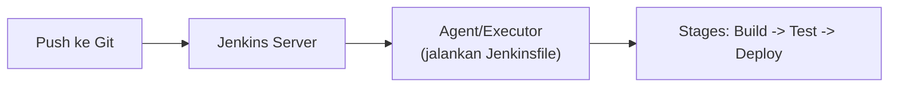

## What It Is, In One Paragraph

Jenkins adalah server automation CI/CD open-source yang sudah ada sejak lama (awalnya bernama Hudson) dan tetap luas dipakai di banyak organisasi karena fleksibilitasnya lewat ribuan plugin dan kemampuan self-hosted penuh — kontras dengan tool CI/CD modern berbasis SaaS yang lebih terintegrasi tapi kurang fleksibel dikustomisasi.

## The Concept It Implements

Jenkins adalah implementasi utama [[../70 Infrastructure and Delivery/CI-CD Pipelines|CI-CD Pipelines]] — konsep pipeline-as-code, build-test-deploy otomatis yang dibahas abstrak di note itu diwujudkan konkret lewat `Jenkinsfile`.

## Mental Model

Tiga bagian inti: **Jenkinsfile** (definisi pipeline sebagai kode, disimpan bersama repository, menegakkan prinsip pipeline-as-code); **agent/executor** (mesin yang benar-benar menjalankan langkah pipeline — bisa mesin Jenkins itu sendiri atau agent terpisah yang didaftarkan); **plugin** (ekosistem besar yang memperluas fungsionalitas — integrasi Git, Docker, Kubernetes, notifikasi Slack, dan ribuan lainnya).



## The 20% You Actually Use

```groovy
// Jenkinsfile — pipeline-as-code
pipeline {
    agent any
    stages {
        stage('Build') {
            steps { sh 'go build -o app ./cmd/server' }
        }
        stage('Test') {
            steps { sh 'go test ./...' }
        }
        stage('Deploy') {
            when { branch 'main' }
            steps { sh './deploy.sh' }
        }
    }
}
```

## Configuration That Bites

Kredensial yang dimasukkan langsung ke Jenkinsfile (bukan lewat Jenkins Credentials store) berisiko bocor lewat riwayat Git repository — selalu pakai `credentials()` binding bawaan Jenkins yang menyimpan secret terpisah dari kode. Jenkins server yang tidak diperbarui secara rutin (baik core maupun plugin) adalah risiko keamanan nyata — Jenkins historisnya jadi target serangan karena banyak instalasi yang dibiarkan usang bertahun-tahun.

## Operating and Debugging It

Console output tiap build adalah tempat pertama diperiksa saat pipeline gagal — Jenkins menampilkan log lengkap tiap stage. Untuk masalah yang lebih dalam (agent tidak terhubung, executor kehabisan kapasitas), halaman "Manage Jenkins" menunjukkan status node dan antrean build yang tertahan.

## Choosing It

Dibanding [[GitHub Actions]]: Jenkins lebih fleksibel untuk kebutuhan self-hosted dan integrasi kompleks lewat plugin, tapi butuh maintenance server sendiri; GitHub Actions terintegrasi langsung dengan repository GitHub tanpa infrastruktur terpisah untuk dikelola, tapi kurang fleksibel untuk kebutuhan sangat kustom. Pilih Jenkins kalau organisasi sudah punya investasi besar di dalamnya atau butuh kontrol penuh atas infrastruktur CI; pilih GitHub Actions untuk proyek baru yang sudah di GitHub tanpa kebutuhan kustomisasi ekstrem.

## Gotchas

> [!warning] Jebakan
> Menyimpan kredensial langsung di Jenkinsfile atau script pipeline, bukan lewat Credentials store bawaan — risiko kebocoran lewat riwayat Git yang sama seperti dibahas di [[../70 Infrastructure and Delivery/CI-CD Pipelines|CI-CD Pipelines]].

> [!warning] Jebakan
> Membiarkan Jenkins server dan plugin-nya tidak diperbarui dalam waktu lama — akumulasi kerentanan keamanan yang diketahui publik pada instalasi yang usang.

## Version Caveat

Jenkins Pipeline (declarative syntax seperti contoh di atas) adalah pendekatan modern yang direkomendasikan dibanding scripted pipeline lama atau job berbasis UI murni — dokumentasi resmi jenkins.io adalah sumber kebenaran untuk sintaks dan plugin yang benar-benar dipakai.

## Connected Notes

- [[../70 Infrastructure and Delivery/CI-CD Pipelines|CI-CD Pipelines]] — konsep pipeline-as-code yang diimplementasikan konkret oleh Jenkins.
- [[GitHub Actions]] — alternatif modern berbasis SaaS untuk kebutuhan yang sama.
- [[../80 Security/Secret Management|Secret Management]] — prinsip pengelolaan kredensial yang berlaku sama untuk Jenkins Credentials store.

## Catatan Saya

*Kosong — diisi pembaca.*
