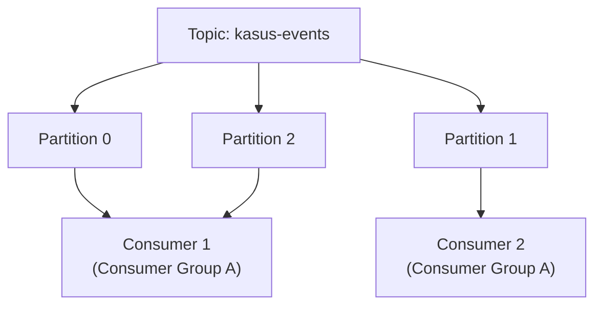

## What It Is, In One Paragraph

Kafka adalah platform log terdistribusi yang dipakai luas sebagai tulang punggung messaging skala besar — bukan message queue tradisional yang menghapus pesan setelah dikonsumsi, tapi log yang mempertahankan pesan untuk periode retensi tertentu, memungkinkan banyak consumer independen membaca aliran data yang sama dengan kecepatan masing-masing, dan consumer baru bisa "memutar ulang" riwayat dari titik mana pun dalam retensi itu.

## The Concept It Implements

Kafka adalah implementasi utama [[../30 APIs and Web/Queue vs Log Semantics|Queue vs Log Semantics]] — semantik log (bukan queue) adalah pilihan desain inti yang membedakan Kafka dari RabbitMQ, dan [[../30 APIs and Web/Consumer Groups and Rebalancing|Consumer Groups and Rebalancing]] adalah mekanisme yang memungkinkan banyak consumer membagi beban membaca partisi.

## Mental Model

Empat komponen inti: **topic** (kategori/nama aliran pesan, dibagi jadi **partition** untuk paralelisme); **partition** (unit paralelisme dan urutan — pesan dalam satu partition terjamin urut, lintas partition tidak); **offset** (posisi pembacaan tiap consumer dalam sebuah partition — consumer melacak sendiri sudah sampai mana ia membaca); **consumer group** (sekumpulan consumer yang membagi partition suatu topic di antara mereka, masing-masing partition hanya dibaca satu consumer dalam grup yang sama di satu waktu).



## The 20% You Actually Use

```go
import "github.com/segmentio/kafka-go"

// Producer
writer := &kafka.Writer{
	Addr:     kafka.TCP("localhost:9092"),
	Topic:    "kasus-events",
	Balancer: &kafka.Hash{}, // partisi berdasarkan key, menjaga urutan per-key
}
err := writer.WriteMessages(ctx, kafka.Message{
	Key:   []byte("kasus-123"),
	Value: []byte(`{"event":"diajukan"}`),
})

// Consumer
reader := kafka.NewReader(kafka.ReaderConfig{
	Brokers: []string{"localhost:9092"},
	Topic:   "kasus-events",
	GroupID: "notification-service", // consumer group
})
for {
	msg, err := reader.ReadMessage(ctx)
	if err != nil {
		break
	}
	process(msg.Value) // idempotent, karena at-least-once delivery
	// offset di-commit otomatis oleh library setelah ReadMessage berhasil,
	// atau manual lewat CommitMessages untuk kontrol lebih presisi
}
```

## Configuration That Bites

`acks` di sisi producer default sering tidak eksplisit di banyak client library — `acks=0` (tidak menunggu konfirmasi sama sekali) tercepat tapi paling rawan kehilangan pesan; `acks=all` (menunggu seluruh in-sync replica) paling aman tapi lebih lambat. Untuk data penting, `acks=all` eksplisit hampir selalu keputusan yang tepat, jangan mengandalkan default library yang mungkin mengoptimalkan kecepatan di atas keandalan.

Retention period (`retention.ms`) default biasanya 7 hari — cukup untuk kebanyakan use case operasional, tapi consumer yang down lebih lama dari periode ini akan kehilangan pesan yang sudah "hilang" dari log, bukan sekadar tertunda.

## Operating and Debugging It

Consumer lag (selisih antara offset terbaru topic dan offset yang sudah dibaca consumer) adalah metrik paling penting dipantau — lag yang terus bertambah menandakan consumer tidak bisa mengimbangi laju produksi pesan, sinyal awal masalah sebelum antrean membengkak tak terkendali. Tool `kafka-consumer-groups.sh` (bawaan Kafka) menampilkan lag per partition per consumer group.

## Choosing It

Dibanding RabbitMQ: Kafka unggul untuk throughput sangat tinggi dan kebutuhan replay/audit trail (log tetap ada setelah dikonsumsi); RabbitMQ unggul untuk routing pesan kompleks (exchange types) dan kasus di mana semantik queue tradisional (pesan hilang setelah dikonsumsi, prioritas pesan) lebih sesuai. Dibanding NATS: Kafka jauh lebih matang untuk kebutuhan persistence dan replay skala besar; NATS lebih ringan dan lebih mudah dioperasikan untuk kebutuhan messaging sederhana tanpa retensi panjang.

## Gotchas

> [!warning] Jebakan
> Mengasumsikan urutan pesan terjamin lintas seluruh topic — urutan hanya terjamin **dalam satu partition**; pesan dengan key yang sama (di-hash ke partition yang sama) urutannya terjamin, tapi pesan dengan key berbeda bisa diproses tidak berurutan satu sama lain.

> [!warning] Jebakan
> Menganggap consumer group otomatis menjamin exactly-once — Kafka secara default at-least-once; consumer harus idempoten (lihat [[../30 APIs and Web/Idempotent Consumers|Idempotent Consumers]]) untuk aman terhadap kemungkinan pesan diproses ulang setelah rebalancing atau restart.

## Version Caveat

Kafka telah menghilangkan ketergantungan wajib pada ZooKeeper di versi modern (mode KRaft) — arsitektur deployment berbeda cukup signifikan antara versi lama (dengan ZooKeeper) dan baru; verifikasi versi yang benar-benar dipakai lewat dokumentasi resmi kafka.apache.org.

## Connected Notes

- [[../30 APIs and Web/Queue vs Log Semantics|Queue vs Log Semantics]] — semantik log yang jadi fondasi desain Kafka, dibahas abstrak di note itu.
- [[../30 APIs and Web/Consumer Groups and Rebalancing|Consumer Groups and Rebalancing]] — mekanisme pembagian beban consumer yang diimplementasikan Kafka.
- [[../30 APIs and Web/Idempotent Consumers|Idempotent Consumers]] — kebutuhan wajib untuk consumer Kafka yang aman terhadap redelivery.
- [[Debezium]] — tool CDC yang mempublikasikan perubahan database sebagai pesan Kafka.
- [[RabbitMQ]] — kontras langsung sebagai message broker dengan semantik queue tradisional.

## Catatan Saya

*Kosong — diisi pembaca.*
