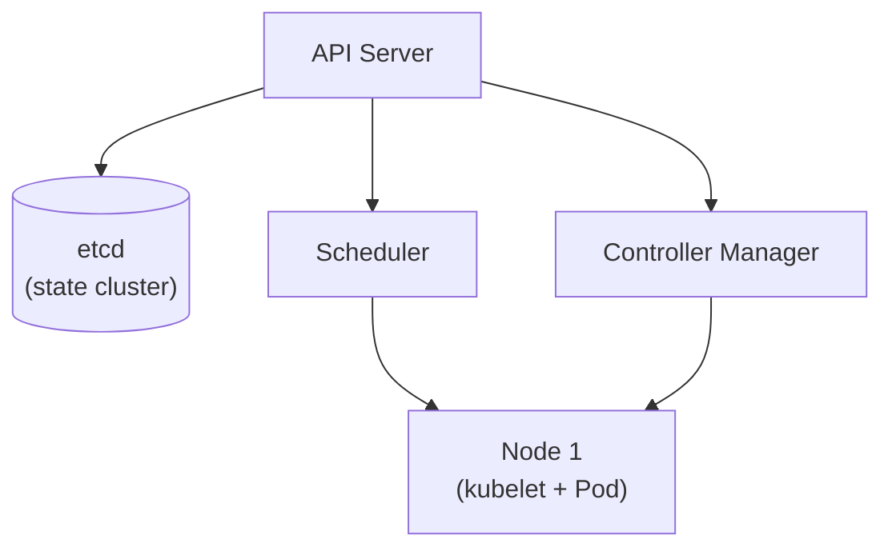

## What It Is, In One Paragraph

Kubernetes adalah sistem orkestrasi container yang dominan di industri, mengelola bagaimana container dijalankan, diskalakan, dan dipulihkan otomatis lintas banyak mesin. Note konsep [[../70 Infrastructure and Delivery/Kubernetes Core Concepts - Pods, Deployments, Services, Ingress|Kubernetes Core Concepts]] sudah membahas objek intinya (Pod, Deployment, Service, Ingress) — note ini melengkapi dengan sisi operasional: `kubectl` sehari-hari, konfigurasi yang sering salah, dan debugging.

## The Concept It Implements

Kubernetes mengimplementasikan objek inti yang dibahas di [[../70 Infrastructure and Delivery/Kubernetes Core Concepts - Pods, Deployments, Services, Ingress|Kubernetes Core Concepts]], dan secara internal mengandalkan [[../60 Distributed Systems/Consensus - Raft|Consensus - Raft]] (lewat etcd) untuk menjaga konsistensi state cluster-nya sendiri.

## Mental Model

Empat komponen arsitektur yang perlu dipegang: **control plane** (API server, etcd, scheduler, controller manager — "otak" cluster yang membuat keputusan); **node** (mesin yang benar-benar menjalankan Pod, masing-masing punya `kubelet` yang berkomunikasi dengan control plane); **etcd** (penyimpanan state cluster, satu-satunya sumber kebenaran tentang apa yang seharusnya berjalan); **reconciliation loop** (lihat [[../70 Infrastructure and Delivery/Desired-State Reconciliation|Desired-State Reconciliation]] — mekanisme inti yang membuat semuanya "bekerja sendiri").



## The 20% You Actually Use

```bash
kubectl get pods -n mynamespace
kubectl describe pod mypod-xyz          # detail lengkap, termasuk event terkini
kubectl logs -f mypod-xyz               # log real-time
kubectl exec -it mypod-xyz -- sh        # masuk ke dalam Pod
kubectl apply -f deployment.yaml        # declarative apply
kubectl rollout status deployment/myapp
kubectl rollout undo deployment/myapp   # rollback ke versi sebelumnya
```

## Configuration That Bites

Resource `requests` dan `limits` yang tidak diset (default tanpa batas) berarti satu Pod bisa menghabiskan resource node sampai mengganggu Pod lain — praktik production yang baik selalu menetapkan keduanya eksplisit berdasarkan pengukuran nyata kebutuhan aplikasi, bukan angka tebakan. `imagePullPolicy: Always` pada image dengan tag `latest` bisa menyebabkan Pod menarik versi berbeda tiap kali di-restart tanpa disadari — pakai tag versi eksplisit (bukan `latest`) untuk deployment production yang predictable.

## Operating and Debugging It

`kubectl describe pod` adalah langkah pertama saat Pod tidak berjalan seperti diharapkan — bagian `Events` di output-nya sering langsung menunjukkan penyebab (image gagal ditarik, resource tidak cukup, probe gagal). `kubectl get events --sort-by=.lastTimestamp` menunjukkan kejadian terkini di seluruh namespace, berguna melihat gambaran besar saat mendiagnosis insiden.

## Choosing It

Dibanding Docker Compose untuk production: Kubernetes memberi self-healing, scaling otomatis, dan rolling update yang tidak dimiliki Compose (yang dirancang untuk lingkungan lokal/development). Dibanding platform PaaS terkelola (yang menyembunyikan detail orkestrasi): Kubernetes memberi kontrol penuh dengan kompleksitas operasional yang jauh lebih besar — lihat pertimbangan trade-off ini lebih dalam di note konsepnya.

## Gotchas

> [!warning] Jebakan
> Tidak menetapkan resource `requests`/`limits`, membiarkan Pod "bebas" memakai resource node — satu Pod yang bermasalah bisa mengganggu seluruh Pod lain di node yang sama.

> [!warning] Jebakan
> Memakai tag image `latest` di manifest production — membuat deployment tidak dapat direproduksi persis dan sulit dilacak versi mana yang sebenarnya berjalan di suatu waktu.

## Version Caveat

Fitur dan API Kubernetes berubah cukup cepat antar versi minor — `apiVersion` di manifest yang dipakai perlu diverifikasi kompatibel dengan versi cluster yang benar-benar dijalankan; dokumentasi resmi kubernetes.io adalah sumber kebenaran.

## Connected Notes

- [[../70 Infrastructure and Delivery/Kubernetes Core Concepts - Pods, Deployments, Services, Ingress|Kubernetes Core Concepts - Pods, Deployments, Services, Ingress]] — note konsep yang dilengkapi note ini dari sisi operasional.
- [[../70 Infrastructure and Delivery/Kubernetes Config, Secrets, Probes, and Autoscaling|Kubernetes Config, Secrets, Probes, and Autoscaling]] — kelanjutan konsep untuk konfigurasi dan probe.
- [[../70 Infrastructure and Delivery/Desired-State Reconciliation|Desired-State Reconciliation]] — mekanisme inti yang mendasari cara kerja seluruh controller Kubernetes.
- [[../60 Distributed Systems/Consensus - Raft|Consensus - Raft]] — algoritma consensus yang mendasari etcd, penyimpanan state Kubernetes.
- [[Docker]] — Kubernetes mengorkestrasi container yang formatnya sama seperti yang dibangun dan dijalankan Docker.

## Catatan Saya

*Kosong — diisi pembaca.*
